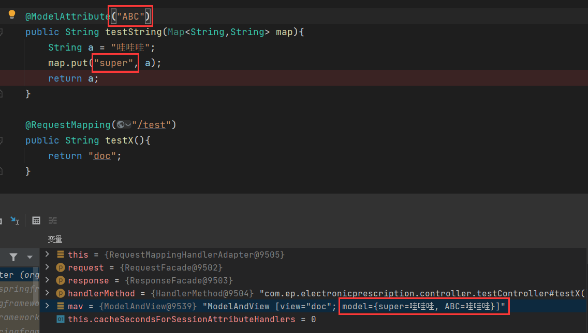
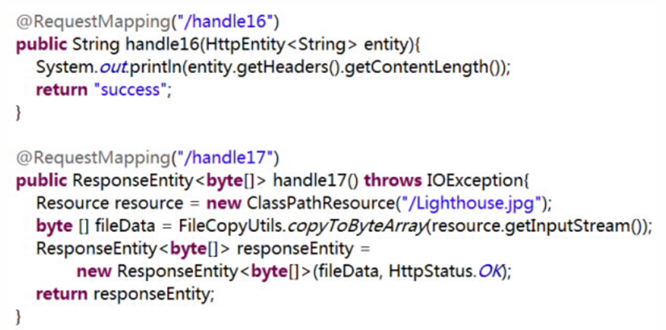
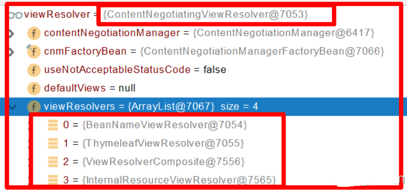

Spring-MVC.Version.2.0.0


------


# 1、Spring-MVC 入门

## 1、快速使用

通过配置文件 web.xml 配置 **DispatcherServlet**：**默认加载 /WEB-INF/servletName-servlet.xml** 的 Spring 配置文件，启动 WEB 层的 Spring 容器，可以通过属性 **contextConfigLocation** 初始化参数，自定义配置文件的位置和名称

```xml
<servlet>
    <!-- 设置 servlet 名字 -->
    <servlet-name>dispatcherServlet</servlet-name>
    <servlet-class>org.springframework.web.servlet.DispatcherServlet</servlet-class>
    <init-param>
        <!-- 设置 param -->
        <param-name>contextConfigLocation</param-name>
        <param-value>classpath:xxx.xml</param-value>
    </init-param>
    <load-on-startup>1</load-on-startup>
</servlet>

</servlet>
<servlet-mapping>
    <servlet-name>dispatcherServlet</servlet-name>
    <url-pattern></url-pattern>
</servlet-mapping>
```

创建 Spring-MVC 配置文件：配置自动扫描、视图解析器

```xml
<context:component-scan base-package="xxx"/>
<bean class="org.springframework.web.servlet.view.InternalResourceViewResolver">
    <!-- 前缀 -->
    <property name="prefix" value="/WEB-INF/views/"/>
    <!-- 后缀 -->
    <property name="suffix" value=".jsp"/>
</bean>
```

创建请求处理类：使用 @Controller 注解修饰类，@RequestMapping 注解修饰方法


## 2、常用组件

**DispatcherServlet**：**前端控制器**，由框架提供

- 作用：统一处理请求和响应，整个流程控制的中心，由它调用其它组件处理用户的请求


**HandlerMapping**：**处理器映射器**，由框架提供

- 作用：根据请求的url、method等信息查找Handler，即控制器方法


**Handler**：**处理器**，需要工程师开发

- 作用：在DispatcherServlet的控制下Handler对具体的用户请求进行处理


**HandlerAdapter**：**处理器适配器**，由框架提供

- 作用：通过HandlerAdapter对处理器（控制器方法）进行执行


**ViewResolver**：**视图解析器**，由框架提供

- 作用：进行视图解析，得到相应的视图，例如：ThymeleafView、InternalResourceView、RedirectView


**View**：**视图**

- 作用：将模型数据通过页面展示给用户


# 2、注解大全

## 1、@Controller

### 1、简介

@Controller 注解及其相关注解，主要分三个层面，请求前、处理中、返回

| **应用场景** | **注解**        | **注解说明**                         |
| ------------ | --------------- | ------------------------------------ |
| 处理请求     | @Controller     | 处理 Http 请求                       |
| 处理请求     | @RestController | @Controller 的衍生注解               |
| 路由请求     | @RequestMapping | 路由请求 可以设置各种操作方法        |
| 路由请求     | @GetMapping     | GET 方法的路由                       |
| 路由请求     | @PostMapping    | POST 方法的路由                      |
| 路由请求     | @PutMapping     | PUT 方法的路由                       |
| 路由请求     | @DeleteMapping  | DELETE 方法的路由                    |
| 请求参数     | @PathVariable   | 处理请求 url 路径中的参数 /user/{id} |
| 请求参数     | @RequestParam   | 处理问号后面的参数                   |
| 请求参数     | @RequestBody    | 请求参数以json格式提交               |
| 返回参数     | @ResponseBody   | 返回 json 格式                       |

@Controller 与 @RestController 应用场景：

- @Controller 一般应用在有返回界面的应用场景下
- @RestController 如果只是接口，那么就用 @RestController 来注解


### 2、注意

- **@RestController** 是 @Controller 的子集，该注解是 @Controller 和 @ResponseBody 的集合
- @GetMapping、@PostMapping、@PutMapping、@DeleteMapping 是 @RequestMapping 的子集


## 2、@RequestMapping

### 1、简介

@RequestMapping 注解为控制器 @Controller 指定可以处理哪些 URL 请求，DispatcherServlet 拦截请求后，通过控制器上的 @RequestMapping 提供的映射信息确定请求对应的处理方法

@RequestMapping 在控制器 @Controller 的**类**以及**方法**处都可以用

- 类：提供初步的请求映射信息，相对于 WEB 应用的根目录

- 方法：提供细分映射信息，相对于类定义处的 URL

@RequestMapping 还可以设定**请求方法**、**请求参数**、**请求头的映射**等让映射更加精确


**注意**：

- 若类定义处无该注解，则此 URL 相对于 WEB 应用的根目录


### 2、属性

- **Value**：请求 URL

- **Method**：请求方法

- **Params**：请求参数，支持简单的表达式

- **Heads**：请求头，支持简单表达式

```java
// 表明映射 URL 为 /helloThree
// 请求方法必须为 GET
// 必须要含有参数 userName 与 age 且 age 的值不能为 18
// 请求头必须为指定的
@RequestMapping(
    value = "/helloThree", 
    method = RequestMethod.GET,
    params = {"userName", "age!=18"}, 
    headers = {"Accept-Language=zh-CN,zh;q=0.9"}
)
```


### 3、支持 Ant 风格的 URL

支持三种匹配符
- **?** ：匹配文件名中的一个字符
- **\***：匹配文件名中的任意字符
- **\*\***：匹配多层路径

```text
1. 例子：/user/*/creatUser
	匹配：/user/aaa/creatUser

2. 例子：/user/**/creatUser
	匹配：/user/creatUser	/uer/xxx/yyy/creatUser

3. 例子：/user/creatUser??
	匹配：/user/creatUserxxx
```


##  3、@PathVariable

### 1、简介

@PathVariable 注解**映射 URL 绑定的占位符**，通过该注解可以将 URL 中**占位符参数绑定**到控制器 @Controller 的处理方法的**入参**中，即URL 中的 {xxx} 占位符可以通过 @PathVariable(“xxx“) 绑定到处理方法的入参中


**注意**：

- 参数类型一定要对应，否则报错 400，一般传入的都是 String 类型
- 只支持简单的数据类型，不支持复杂的数据类型以及自定义的数据类型
- 只支持 GET 请求


```java
@RequestMapping(value = "/helloFive/{name}/{age}")
public String testFive(@PathVariable("name") String name,@PathVariable("age") String age)
```


### 2、参数

@PathVariable **只有一个参数**，用于指定绑定到哪个入参中，不填写**默认绑定**到与 URL 占位符参数**同名的入参**


## 4、@RequestParam

### 1、简介

Spring-MVC 通过分析处理方法的签名，将 HTTP 的请求信息，绑定到处理方法的相应入参中

可以对方法以及方法的入参标注相应的注解例如：**@PathVariable**、**@RequestParam**、**@RequestHeader**

在处理方法**入参处使用** @RequestParam 可以**把请求参数传递给处理方法的入参**

支持 GET、POST、PUT、DELETE 请求方法


### 2、属性

**Value**：参数名

**Required**：该请求参数是否必须**?**，默认为 true，表示必须存在，不存在将抛出异常

**defaultValue**：默认参数值，如果设置了该值，required=true 将失效，自动为 false，如果没有传该参数，就使用默认值

```java
@RequestParam(value = "age", defaultValue = "0", required = false) int age
```

如果传入的数据是一个相同的 K，多个 V，则可以使用数组或者 List 接收

```java
@RequestParam(value = "age", defaultValue = "0", required = false) int[] age
```
也可以使用 Map 直接全部接收，但是无法接收一个 K 多个 V 的类型，其内只会保存首个 KV 组合，需要另外使用数组或者 List 接收
```java
// 此处 did 有多个值，但是 map 只保存了首个，需要 dids 数组全部接收
public ModelAndView addPrescription(@RequestParam Map<String, String> map, 
                                    @RequestParam("dId") String[] dIds)   
```


## 5、@RequestHeader

### 1、简介

@RequestHeader 注解绑定请求头的属性值

请求报头包含了若干个属性，服务器可据此获知客户端的信息，通过该注解即可**将请求头中的属性值绑定到处理方法的入参**中

```java
@RequestHeader(value = "Accept-Language") String val
```


## 6、@CookieValue

### 1、简介

让处理方法绑定请求中的某个 Cookie 值


### 2、属性

**value**：参数名称

**required**：是否必须

**defaultValue**：默认值

```java
@CookieValue(value = "JSESSIONID") String val
```


## <a name="@SessionAttributes注解">7、@SessionAttributes</a> 

### 1、简介

默认情况下 Spring MVC 将模型中的数据存储到 request 域中，当一个请求结束后，数据就失效了，如果要跨页面使用，那么需要使用到session，而 @SessionAttributes 注解就可以使得**模型中的数据**存储一份到 session 域中


**注意**：

- @SessionAttributes 只能使用在类定义上
- 在**控制器**上使用该注解修饰，即可在多个请求之间共用某个模型属性的数据


### 2、参数

**names**：这是一个字符串数组，里面应写需要存储到 session 中数据的名称

**types**：根据指定参数的类型，将模型中对应类型的参数存储到 session 中

**value**：其实和 names 是一样的，**value和type之间是并集关系**

@SessionAttributes 除了可以通过**属性名**指定需要放到会话中的属性，还可以通过模型属性的**对象类型**指定

~~~java
// 会将 model 中所有类型为 User 的属性添加到会话中
@SessionAttributes(types=User.class)

// 会将 model 中属性名为 user1 和 user2 的属性添加到会话中
@SessionAttributes(value={“user1”, “user2”}) 

// 会将 model 中所有类型为 User 和 Dept 的属性添加到会话中
@SessionAttributes(types={User.class, Dept.class}) 

// 会将 model 中属性名为 user1 和 user2 以及类型为 Dept 的属性添加到会话中
@SessionAttributes(value={“user1”,“user2”},types={Dept.class})
~~~

~~~java
@SessionAttributes(value={"user"})
@Controller
public class UserController {
    @RequestMapping("/testSessionAttributes")
    public String testSessionAttributes(Model model){
        User user = new User("jack","123456");
        model.addAttribute("user", user);
        return "success";
    }
}
~~~

清除数据：可以在入参处传入 SessionStatus，调用其 setComplete() 方法清楚，此举仅会清楚注解所传入的数据


##  @ResponseBody注解

### 简介

1、**作用于方法上**，表示该方法的返回值结果直接写入HTTPResponseBody中，一般在**异步获取数据**时使用。

2、在使用@RequestMapping后再使用此注解，返回值不会被解析为跳转路径，而是直接写入HTTP响应正文中。

### 使用时机

返回的数据不是页面


## @RequestBody注解

### 简介

1、将**HTTP请求正文插入方法**中，使用适合的HttpMessageConverter**将请求体写入某个对象**。

2、**作用于形参列表上**，用于将前台发送过来的固定格式的数据（xml或者json等）封装为对应的Bean，封装时使用到的一个对象是系统默认配置的HttpMessageConverter进行解析，然后封装到形参上。

### 使用时机

1、GET、POST，根据request header Content-Type的值判断：

- application/x-www-form-urlencoded， 可选（即非必须，因为这种情况的数据@RequestParam, @ModelAttribute也可以处理，当然@RequestBody也能处理）
- 其他格式， 必须（其他格式包括application/json, application/xml等。这些格式的数据，必须使用@RequestBody来处理）

2、PUT方式提交时，根据request header Content-Type的值来判断：

- application/x-www-form-urlencoded， 必须
- multipart/form-data, 不能处理
- 其他格式， 必须

~~~html
<form th:action="@{/testRequestBody}" method="post">
    用户名：<input type="text" name="username"><br>
    密码：<input type="password" name="password"><br>
    <input type="submit">
</form>
~~~

~~~java
@RequestMapping(value = "user/login")
@ResponseBody
// 将ajax（datas）发出的请求写入 User 对象中
// 注意：
// 此时会根据Json的key进行配对
// 如果json串中key对应的值为""，则String类型为”“，Double等为null
// 如果为null，则值就为null
// 如果没有值，切记不要写key，不然报错
public User login(@RequestBody User user) {   
// 这样就不会再被解析为跳转路径，而是直接将user对象写入 HTTP 响应正文中
    
    return user;    
}

@RequestMapping("/testRequestBody")
public String testRequestBody(@RequestBody String requestBody){
    System.out.println("requestBody:"+requestBody);
    // 输出结果：requestBody:username=admin&password=123456
    return "success";
}
~~~

### 说明

- request的body部分的数据编码格式由header部分的Content-Type指定
- 与@RequestParam可以同时使用，@RequestBody最多只能有一个，而@RequestParam可以有多个。
- 当@RequestBody 与 @RequestParam 同时使用时，原SpringMVC接收参数的机制不变，只不过 @RequestBody 接收的是请求体里面的数据，而@RequestParam接收的是key-value里面的参数，所以它会被切面进行处理从而可以用普通元素、数组、集合、对象等接收。
- 如果参数时放在请求体中，application/json传入后台的话，那么后台要用@RequestBody才能接收到，如果不是放在请求体中的话，那么后台接收前台传过来的参数时，要用@RequestParam来接收，或则形参前什么也不写也能接收。
- 


## <a name="@ExceptionHandler注解">@ExceptionHandler注解</a> 

### 简介

1、统一处理某一异常类。

2、属性**value**指定异常类。

3、被该注解修饰的方法的返回值可以为：

~~~text
ModleAndView
Modle
Map
View
String
void
@ResponseBody
HttpEntity<T>
ResponseEntity<T>
~~~

### 缺点

进行异常处理的方法必须与出错的方法在同一个Controller里面，这种方式最大的缺陷就是不能全局控制异常，每个类都要写一遍。

### 优先级问题

- 例如发生的是NullPointerException，但声明的异常有RuntimeException、Exception，此时会根据异常的继承关系找到**继承深度最浅**的那个@ExceptionHandler注解方法，即标记了RuntimeException的方法。
- ExceptionHandlerMethodResolver 内部若找不到 @ExceptionHandler 注解的话，会找 **@ControllerAdvice注解** 中的@ExceptionHandler注解方法，如果有@ControllerAdvice标记的类的话。

~~~java
@Controller
public class UserController {
    @RequestMapping("/show1")
    public String showInfo(){
        String str = null;
        str.length();
        return "index";
    }
    @RequestMapping("/show2")
    public String showInfo2(){
        int a = 10/0;
        return "index";
    }
 
    /**
     * java.lang.ArithmeticException
     * 该方法需要返回一个 ModelAndView：目的是可以让我们封装异常信息以及视图的指定
     * 参数 Exception e:会将产生异常对象注入到方法中
     */
    @ExceptionHandler(value={java.lang.ArithmeticException.class})
    public ModelAndView arithmeticExceptionHandler(Exception e){
        ModelAndView mv = new ModelAndView();
        mv.addObject("error", e.toString());
        mv.setViewName("error1");
        return mv;
    }
 
    /**
     * java.lang.NullPointerException
     * 该方法需要返回一个 ModelAndView：目的是可以让我们封装异常信息以及视图的指定
     * 参数 Exception e:会将产生异常对象注入到方法中
     */
    @ExceptionHandler(value={java.lang.NullPointerException.class})
    @ResponseBody
    public String nullPointerExceptionHandler(Exception e){
        ModelAndView mv = new ModelAndView();
        return e.toString();
    }
}
~~~

## @ResponseStatus注解

### 简介

1、两种用法：修饰**自定义异常类**，修饰**目标处理方法**。

- 修饰自定义异常类，先声明一个自定义异常类，再加上该注解。

2、属性**value**设置异常状态，属性**reason**设置异常描述。

- 如果设置了reason，且修饰在方法上，则目标方法返回值都不处理，直接返回reason

### 例子

定义一个@ResponseStatus 注解修饰的异常类

```java
@ResponseStatus(value = HttpStatus.FORBIDDEN, reason = "用户名错误")
public class UserNameNOT extends RuntimeException
```

当处理器抛出上述自定义异常，若**ExceptionHandlerExceptionResolver**不解析异常，由于触发的异常UserNameNOT带有@ResponseStatus注解。

因此会被**ResponseStatusExceptionResolver**解析到。最后响应预先设置的HTTP状态码与错误信息给客户端。


~~~java
@RestControllerAdvice
public class ExceptionController {
    // 捕捉其他所有异常
    @ExceptionHandler(Exception.class)
    @ResponseStatus(HttpStatus.BAD_REQUEST)
    public Response globalException(HttpServletRequest request, Throwable ex) {
        return new Response(400,"1 / 0",null);
    }
}
// 
~~~


修饰在Contorller方法上，修改状态码，HttpStatus.CREATED 状态码为201，将原来请求状态码200改为201

~~~java
@RequestMapping(path = "/401")
@ResponseStatus(value = HttpStatus.CREATED)
public Response unauthorized() {
    return new Response(401, "Unauthorized", null);
}
~~~


**推荐用法**：

先定义一个异常类，使用该注解

~~~java
@ResponseStatus(code = HttpStatus.PAYMENT_REQUIRED,reason = "this is MyException")
public class MyException extends RuntimeException {
    public MyException() {}
}
~~~

在运行时抛出异常

~~~java
@GetMapping("/err2")
public Response errorTest2(){
    throw new MyException();
}
~~~


## <a name="@ControllerAdvice注解">@ControllerAdvice注解</a> 

### 简介

这是一个增强的 Controller，用于封装Controller的全部切面属性，包括切入点和切入属性，具体的切入依靠其他注解。

使用这个 Controller ，可以实现三个方面的功能：

1. 全局异常处理
2. 全局数据绑定
3. 全局数据预处理

### 全局异常处理

只需要定义类，添加该注解即可定义方式如下：

```java
@ControllerAdvice
public class MyGlobalExceptionHandler {
    
    @ExceptionHandler(Exception.class)
    public ModelAndView customException(Exception e) {
        ModelAndView mv = new ModelAndView();
        mv.addObject("message", e.getMessage());
        mv.setViewName("myerror");
        return mv;
    }
    
}
```

### 全局数据绑定

用来做一些初始化的数据操作，我们可以将一些公共的数据定义在添加了 @ControllerAdvice 注解的类中，这样，在每一个 Controller 的接口中，就都能够访问导致这些数据。

使用 @ModelAttribute 注解标记该方法的返回数据是一个全局数据，默认情况下，这个全局数据的 key 就是返回的变量名，value 就是方法返回值，当然开发者可以通过 @ModelAttribute 注解的 name 属性去重新指定 key。

```java
@ControllerAdvice
public class MyGlobalExceptionHandler {
    @ModelAttribute(name = "md")
    public Map<String,Object> mydata() {
        HashMap<String, Object> map = new HashMap<>();
        map.put("age", 99);
        map.put("gender", "男");
        return map;
    }
}
```

### 全局数据预处理

两个类具有同名属性，mvc无法分辨时，先用@ModelAttribute取别名

```java
@PostMapping("/book")
public void addBook(@ModelAttribute("b") Book book, @ModelAttribute("a") Author author) {
    System.out.println(book);
    System.out.println(author);
}
```

@InitBinder("b") 注解表示该方法用来处理和Book和相关的参数,在方法中，给参数添加一个 b 前缀，即请求参数要有b前缀。

```java
@InitBinder("b")
public void b(WebDataBinder binder) {
    binder.setFieldDefaultPrefix("b.");
}
@InitBinder("a")
public void a(WebDataBinder binder) {
    binder.setFieldDefaultPrefix("a.");
}
```

发送请求时


## <a name="@ModelAttribute注解">@ModelAttribute注解</a> 

### 简介

- 在**方法的定义**上使用该注解
  1. Spring-MVC在调用目标处理方法前，会先逐个调用在方法级上标注了该注解的方法。

- 在**方法入参中**使用该注解
  1. Spring-MVC先从**模型数据**中获取对象，之后将**请求参数绑定到对象中**，再传入形参。
  2. 如果不存在这个对象，则会自动实例化一个新的对象，并且模型数据中的对象的属性会被请求参数覆盖。（对象是同一个，只不过数据被覆盖）。
  3. 模型属性还会被来自 HTTP Servlet 请求参数的名称与字段名称匹配的覆盖，也就是请求参数如果和模型类中的域变量一致，则会自动将这些请求参数绑定到这个模型对象，这被称为数据绑定，从而避免了解析和转换每个请求参数和表单字段这样的代码。


### 用法

- 写入模型数据有俩种方式：**存入implicitModel** 

  1. 通过入参处使用**Model类型或者Map类型**（不推荐，会产生一个key = void 值为null的数据）在调用最终的目标处理方法前，“student”会被放入到Model或Map中，Map放入数据时，key由map决定，如果注解没有使用value或者name。

    **注意**：无返回值的情况下，无论注解用不用属性，都只有一个对象产生，k为map指定

    也就是说，**在没有返回值时，注解的属性无用**。

    ```java
    @ModelAttribute
    public void getStudent(@RequestParam(value = "id", required = false) String idStr, Map<String, Object> map) {
        .........
        // key由map决定
        map.put("student", student);
    }
    ```
    

    **注意**：如果用了map，且方法有返回值的情况下，无论用不用注解的属性，都会产生俩个对象，验证如下：

    ~~~java
    // 在Model数据中，会存在俩个对象，一个k为返回值类型首字母小写，一个k为super，v均为”哇哇哇“
    @ModelAttribute
    public String testString(Map<String,String> map){
        String a = "哇哇哇";
        map.put("super", a);
        return a;
    }
    ~~~

    

    

    ```java
    // 在Model数据中，会存在俩个对象，一个k为ABC，一个k为super，v均为”哇哇哇“
    @ModelAttribute("ABC")
    public String testString(Map<String,String> map){
        String a = "哇哇哇";
        map.put("super", a);
        return a;
    }
    ```

    

  2. 通过**@ModelAttribute**的value或name属性 或者 **方法返回值**，如果不用value或name属性，默认为**返回值类型首字母小写**。

    **注意**：在有返回值时，指定注解的属性，则模型中只会有一个对象。

    ```java
    @ModelAttribute("student")
    public Student getStudent(@RequestParam(value = "id", required = false) String idStr)
        
    等同于 ---》 model.addAttribute("student", student);
    
    
    @ModelAttribute(value = "attributeName")
    public String myModel(@RequestParam(required = false) String abc) {
        return abc;
        // 如果不指定，则k为string，v为abc
    }
    
    @ModelAttribute
    public void myModel(Model model) {
        model.addAttribute("name", "zong");
        model.addAttribute("age", 20);
    }
    
    
    // 从模型中获取数据
    @RequestMapping(value = "/param")
    public String param(@ModelAttribute("attributeName") String str1,
                        @ModelAttribute("name") String str2,
                        @ModelAttribute("age") int str3) {
        return "param";
    }
    ```

- 读取由该注解写入Model的数据：

  - 在**方法入参前**使用该注解，并写明value或name值，Spring-MVC会自动从模型数据中获取。且只获取一个，否则似乎按照类型全部获取。
  - 在方法入参前无该注解，key默认为POJO类名第一个字母小写。
  - 最终目标处理方法处的实体**形参名**与注解标注**的value或name无关**，只与**类型有关**。
  - 在implicitModel中查找key对应的对象，若存在，作为入参传入，在@ModelAttribute注解修饰过的方法中的Map存入过该key相同对象，则可以获取到

# 3、处理模型属性

## 1、简介

Spring-MVC提供了四种途径输出模型数据

- **ModelAndView**
  - 处理方法返回值类型为ModelAndView时，方法体既可通过该对象添加模型数据。
- **Map以及Model**
  - 入参为**org.springframework.ui.Model**、**org.springframework.ui.ModelMap** 或 **java.uti.Map** 时，处理方法返回时，Map中的数据会自动添加到模型中。
- **@SessionAttributes**注解
  - 将模型中的某个属性暂存到HttpSession中，以便多个请求之间可以共享这个属性，<a href="#@SessionAttributes注解">详见</a> 
- **@ModelAttribute**注解
  - 方法入参标注该注解后，入参的对象就会放到数据模型中，<a href="#@ModelAttribute注解">详见</a> 


## 2、ModelAndView

**控制器处理方法**的**返回值**如果为ModelAndView，则既包含视图信息，也包含模型数据信息。

ModelAndView有**Model**和**View**的功能

- **Model**：主要用于向请求域共享数据
- **View**：主要用于设置视图，实现页面跳转

- 添加模型数据
  - **addObject**(String attributeName, Object attributeValue)
  - **addAllObject**(Map<String, ?> modelMap)

- 设置视图
  - **setView**(View view)
  - **setViewName**(String viewName)


## 3、Map以及Model

Spring-MVC在内部使用了一个**org.springframework.ui.Model** 接口存储模型数据。

- 具体步骤
  - Spring-MVC在调用方法前会创建一个**隐含的模型对象**作为模型数据的存储容器。
  - 如果**方法入参**为**Map**或**Model**类型，Spring-MVC会将隐含模型的引用传递给这些入参，在方法体内，开发者可以通过这个入参对象访问到模型中的所有数据，也可以添加新的属性数据。


## 4、Model、Map、ModelMap的关系

Model、Map、ModelMap类型的参数其实本质上都是 **BindingAwareModelMap** 类型的。

```java
public interface Model{}

public class ModelMap extends LinkedHashMap<String, Object> {}

public class ExtendedModelMap extends ModelMap implements Model {}

public class BindingAwareModelMap extends ExtendedModelMap {}
```


## 5、域对象共享数据

### Request域

以下方法会直接将数据存入request域中

#### 直接传入ServletAPI

```java
@RequestMapping("/testServletAPI")
public String testServletAPI(HttpServletRequest request){
    request.setAttribute("testScope", "hello,servletAPI");
    return "success";
}
```

#### 使用ModelAndView

```java
@RequestMapping("/testModelAndView")
public ModelAndView testModelAndView(){
    ModelAndView mav = new ModelAndView();
    // 向请求域共享数据
    mav.addObject("testScope", "hello,ModelAndView");
    // 设置视图，实现页面跳转
    mav.setViewName("success");
    return mav;
}
```

#### 使用Model

```java
@RequestMapping("/testModel")
// 在入参处使用
public String testModel(Model model){
    model.addAttribute("testScope", "hello,Model");
    return "success";
}
```

#### 使用map

在Controller上使用Map来共享数据，其实就是存放在Model

```java
@RequestMapping("/testMap")
// 在入参处使用
public String testMap(Map<String, Object> map){
    map.put("testScope", "hello,Map");
    return "success";
}
```

#### 使用ModelMap

```java
@RequestMapping("/testModelMap")
// 在入参处使用
public String testModelMap(ModelMap modelMap){
    modelMap.addAttribute("testScope", "hello,ModelMap");
    return "success";
}
```

### Session域

#### 直接传入ServletAPI

```java
@RequestMapping("/testSession")
public String testSession(HttpSession session){
    session.setAttribute("testSessionScope", "hello,session");
    return "success";
}
```

### Application域

#### 直接传入ServletAPI

```java
@RequestMapping("/testApplication")
public String testApplication(HttpSession session){
	ServletContext application = session.getServletContext();
    application.setAttribute("testApplicationScope", "hello,application");
    return "success";
}
```


# 4、视图和视图解析器

## 1、简介

1. Spring-MVC根据返回值类型String、ModelAndView、View =》**ModelAndView** =》ViewResolver =》视图对象JSP/JSTL/PDF
2. 请求处理方法执行完毕，**最终会返回一个ModelAndView对象**，返回其他类型的Spring-MVC会在内部装配成一个ModelAndView对象。

3. **视图**：渲染模型数据，为了实现视图模型和具体实现技术的解耦，Spring 在 org.springframework.web.servlet 包中定义了一个高度抽象的 **View 接口**。视图对象由视图解析器负责实例化，视图无状态，所以不会有线程安全问题。
4. **视图解析器**：在SpringWEB上下文中配置一种或多种解析策略，并指定他们之间的先后顺序。每一种映射策略对应一个具体的视图解析器实现类，将逻辑视图解析为一个具体的视图对象。所有的视图解析器都必须实现**ViewResolver接口**。
5. 每个视图解析器都实现了**Ordered接口**并开放出一个**order属性**，可以通过order属性指定解析器的优先顺序，order越小优先级越高。Spring-MVC会按视图解析器顺序对逻辑视图名进行解析，直到成功，否则抛出ServletException异常。


## 2、常用的视图实现类

- URL资源视图：
  - **InternalResourceView**：将JSP或其他资源封装成一个视图，是InternalResourceViewResolver默认使用的视图实现类
  - JstlView：如果JSP文件中使用了JSTL国际化标签功能，则需要使用

- 文档视图：
  - **AbstractExcelView：Excel**文档视图的抽象类，该类基于POI构造Excel文档

- JSON视图：
  - **MappingJacksonJsonView**：将模型数据通过Jackson开源框架的ObjectMapper以JSON方式输出


## 3、常用的视图解析器实现类

- 解析为Bean的名字：
  - **BeanNameViewResolver**：将逻辑视图名解析为一个Bean，Bean的id等于逻辑视图名
- 解析为URL文件：
  - **InternalResourceViewResolver**：将视图名解析为一个URL文件，一般使用该解析器将视图名映射为一个保存在WEN-INF目录下的程序文件


## 4、InternalResourceViewResolver解析器

用于解析JSP

```xml
<!-- 解析 /WEB-INF/views/xxxx.jsp -->
<bean class="org.springframework.web.servlet.view.InternalResourceViewResolver">
    <property name="prefix" value="/WEB-INF/views/"/>
    <property name="suffix" value=".jsp"/>
</bean>
```

可以通过\<property name="viewNames" value="html*"/>指定处理规则，此规则表示，只处理html开头的视图名，如html/aa。


## 5、转发向视图

如果返回的视图名中带**forward：** 前缀

SpringMVC中默认的转发视图是**InternalResourceView**

SpringMVC中创建转发视图的情况：

- 当控制器方法中所设置的视图名称以"forward:"为前缀时，创建InternalResourceView视图，此时的视图名称不会被SpringMVC配置文件中所配置的视图解析器解析，而是会将前缀"forward:"去掉，剩余部分作为最终路径通过转发的方式实现跳转。


例如"forward:/"，"forward:/employee"

```java
@RequestMapping("/testForward")
public String testForward(){
    return "forward:/testHello";
}
```


## 6、重定向视图

SpringMVC中默认的重定向视图是**RedirectView**

当控制器方法中所设置的视图名称以"redirect:"为前缀时，创建RedirectView视图，此时的视图名称不会被SpringMVC配置文件中所配置的视图解析器解析，而是会将前缀"redirect:"去掉，剩余部分作为最终路径通过重定向的方式实现跳转

例如"redirect:/"，"redirect:/employee"

```java
@RequestMapping("/testRedirect")
public String testRedirect(){
    return "redirect:/testHello";
}
```

重定向视图在解析时，会先将redirect:前缀去掉，然后会判断剩余部分是否以/开头，若是则会自动拼接上下文路径


## 8、补充

1、如果要使用JSTL的fmt标签需要在Spring-MVC的配置文件中配置国际化资源文件

```xml
<bean id="messageSource" class="org.springframework.context.support.ResourceBundleMessageSource">
    <property name="basename" value="i18n"/>
</bean>
```

2、若希望直接响应通过Spring-MVC渲染的页面，可以使用mvc：view-controller标签实现

当控制器方法中，仅仅用来实现页面跳转，即只需要设置视图名称时，可以将处理器方法使用view-controller标签进行表示。

```xml
<!--
	path：设置处理的请求地址
	view-name：设置请求地址所对应的视图名称
-->
<mvc:view-controller path="/success" view-name="success"/>
```

**注意**：当SpringMVC中设置任何一个view-controller时，其他控制器中的请求映射将全部失效，此时需要在SpringMVC的核心配置文件中设置开启mvc注解驱动的标签：<mvc:annotation-driven />

3、视图对象需要配置IOC容器中的一个Bean，使用**BeanNameViewResolver**作为视图解析器即可

```xml
<bean class="org.springframework.web.servlet.view.BeanNameViewResolver">
    <property name="order" value="10"/>
</bean>
```

```java
@Component(value = "helloView")
public class HelloView implements View
```


# 5、数据处理

## 1、处理静态资源

1、若将 **DispatcherServlet** 请求映射配置为 **/**，则 Spring MVC 将捕获 WEB 容器的**所有请求**，包括静态资源的请求， SpringMVC 会将他们当成一个普通请求处理，因找不到对应处理器将导致错误。

2、可以在 SpringMVC 的配置文件中配置 **\<mvc:default-servlet-handler/>**的方式解决静态资源的问题：

- 将在 SpringMVC 上下文中定义一个 **DefaultServletHttpRequestHandler**，它会对进入 DispatcherServlet 的请求进行筛查，如果发现是没有经过映射的请求，就将该请求交由 WEB 应用服务器默认的 Servlet 处理，如果不是静态资源的请求，才由 DispatcherServlet 继续处理。

- 一般 WEB 应用服务器默认的 Servlet 的名称都是 default。若所使用的 WEB 服务器的默认 Servlet 名称不是 default，则需要通过 default-servlet-name 属性显式指定


## 2、数据绑定流程

1. Spring-MVC框架将**ServletRequest对象及目标方法的入参实例**传递给**WebDataBinderFactory**实例，创建**DataBinder**对象。
   - **WebDataBinder binder = binderFactory.createBinder(webRequest, attribute, name);**
   - WebDataBinder：web数据绑定器，将请求参数的值绑定到指定的JavaBean里面。
2. DataBinder调用装配在Spring-MVC上下文中的**ConversionService**组件进行数据类型转换、数据格式化。将Servlet中的**请求信息填充到入参对象**中。
3. 调用**Validator**组件对已经绑定了请求消息的入参对象进行**数据合法性校验**，最终生成数据绑定结果**BindingData**对象。
4. Spring-MVC抽取BindingResult中的**入参对象和校验错误对象**，将他们赋给**处理方法的响应入参**。
5. 由 **@InitBinder** 标识的方法，可以对 WebDataBinder 对象进行初始化。WebDataBinder 是 DataBinder 的子类，用于完成由表单字段到 JavaBean 属性的绑定。

- @InitBinder方法不能有返回值，它必须声明为void。

- @InitBinder方法的参数通常是是 WebDataBinder。

```java
@InitBinder
public void initBinder(WebDataBinder dataBinder){
    dataBinder.setDisallowedFields("roleset");
}
```


## 3、数据转换

### 3.1、上下文中内建的转换器


### 3.2、自定义类型转换器

1. **ConversionService** 是 Spring 类型转换体系的核心接口。
2. 可以利用**ConversionServiceFactoryBean**在Spring 的 IOC 容器中定义一个ConversionService，Spring将自动识别出IOC容器中的ConversionService，并在Bean属性配置及Spring-MVC处理方法入参绑定等场合使用它进行数据的转换。
3. 可通过 ConversionServiceFactoryBean 的 **converters** 属性注册自定义的类型转换器。

```xml
<mvc:annotation-driven conversion-service="conversionService" />
<bean id="conversionService" class="org.springframework.format.support.ConversionServiceFactoryBean">
    <property name="converters">
        <list>
            <bean class="xxx.xxxx.xxx.employeeC"/>
        </list>
    </property>
</bean>
需要实现Converter接口
```

~~~java
// 在WebMvcConfigurer中配置
@Override
public void addFormatters(FormatterRegistry registry) {
    registry.addConverter(new Converter<String, Pet>() {
        @Override
        public Pet convert(String source) {
            if(!StringUtils.isEmpty(source)){
                Pet pet = new Pet();
                String[] split = source.split(",");
                pet.setName(split[0]);
                pet.setAge(Integer.parseInt(split[1]));
                return pet;
            }
            return null;
        }
    });
}
~~~


### 3.3、Spring-MVC支持的转换器

**Spring-MVC定义了三种类型的转换器接口，实现任意一个转换器接口**都可以作为自定义的转换器注册到ConversionServiceFactroyBean。

1. **Converter**：将 S 类型对象转为 T 类型对象。
2. **ConverterFactory**：将相同系列多个“同质”Converter 封装在一起。如果希望将一种类型的对象转换为另一种类型及其子类的对象（例如将 String 转换为 Number 及 Number 子类 （Integer、Long、Double 等）对象）可使用该转换器工厂类。
3. **GenericConverter**：会根据源类对象及目标类对象所在的宿主类中的上下文信息进行类型转换。

```xml
<!-- <mvc:annotation-driven conversion-service="conversionService" />会将自定义的 ConversionService 注册到 Spring MVC 的上下文中 -->
<bean id="conversionService" class="org.springframework.format.support.ConversionServiceFactoryBean">
    <property name="converters">
        <list>
            <bean class="xxx.xxxx.xxx.employeeC"/>
        </list>
    </property>
</bean>
```

### 3.4、HttpMessageConverter

#### 3.4.1、简介

报文信息转换器，将请求报文转换为Java对象，或将Java对象转换为响应报文。

提供了两个注解和两个类型：@RequestBody、@ResponseBody，RequestEntity、ResponseEntity

**HttpMessageConverter\<T>**是Spring 3.0 新添加的一个接口，负责将请求信息转为一个对象（类型T），将对象输出为响应信息。

##### 1、RequestEntity

RequestEntity封装请求报文的一种类型，需要在控制器方法的形参中设置该类型的形参，当前请求的请求报文就会赋值给该形参，可以通过getHeaders()获取请求头信息，通过getBody()获取请求体信息。

~~~java
@RequestMapping("/testRequestEntity")
public String testRequestEntity(RequestEntity<String> requestEntity){
    System.out.println("requestHeader:"+requestEntity.getHeaders());
    System.out.println("requestBody:"+requestEntity.getBody());
    return "success";
}
~~~

##### 2、ResponseEntity

ResponseEntity用于控制器方法的返回值类型，该控制器方法的返回值就是响应到浏览器的响应报文

#### 3.4.2、接口定义的方法

- **Boolean canRead(Class clazz,MediaType mediaType)**：指定转换器可以读取的对象类型，即转换器是否可将请求信息转换为 clazz 类型的对象，同时指定支持 MIME 类型(text/html,applaiction/json等) 
- **Boolean canWrite(Class clazz,MediaType mediaType)**：指定转换器是否可将 clazz 类型的对象写到响应流中，响应流支持的媒体类型在MediaType 中定义。 
- **List getSupportMediaTypes()**：该转换器支持的媒体类型。
- **T read(Class clazz,HttpInputMessage inputMessage)**： 将请求信息流转换为 T 类型的对象。
- **void write(T t,MediaType contnetType,HttpOutputMessgae outputMessage)**：将T类型的对象写到响应流中，同时指定相应的媒体类 型为 contentType。


#### 3.4.3、接口实现类

| 实现类                               | 功能说明                                                     |
| ------------------------------------ | ------------------------------------------------------------ |
| StringHtpMessageConverter            | 将请求信息转换为字符串                                       |
| FormHttpMessageConverter             | 将表单数据读取到 MultiValueMap中                             |
| XmIAwareFormHittpMessageConverter    | 扩展于FormHitpMessageConverter,如果部分表单属性是XML数据，可用该转换器进行读取 |
| ResourceHittpMessageConverter        | 读写org.springframework.core.io.Resource对象                 |
| BufferedlmageHttpMessageConverter    | 读写 Bufferedllmage对象                                      |
| ByteArrayHttpMessageConverter        | 读写二进制数据                                               |
| SourcelittpMessageConverter          | 读写javax.xml.transform.Source类型的数据                     |
| MarshallingHittpMessageConverter     | 通过 Spring 的org.springframework..xmL.Marshaller和Unmarshaller 读写XML消息 |
| Jaxb2RootElemengHttpMessageConverter | 通过JAXB2读写XML消息,将请求消息转换到标注XmIRootElement和 XxmlTy直接的类中 |
| MappingJacksonHttpMessageConverter   | 利用Jackson开源包的ObjectMapper读写JSON数据                  |
| RssChannellHittpMessageConverter     | 能够读写RSS种子消息                                          |
| AtomFeedHttpMessageConverter         | 和RssChannellHittpMessageConverter能够读写RSS种子消息        |

#### 3.4.4、默认装配

DispatcherServlet 默认装配 **RequestMappingHandlerAdapter** ，而RequestMappingHandlerAdapter 默认装配如下 **HttpMessageConverter**的实现。


加入 jackson.jar 包后


#### 3.4.5、数据转化并绑定

使用HttpMessageConverter\<T>将请求信息转化并绑定到处理方法的入参中、或将响应结果转为对应类型的响应信息。

Spring提供了两种途径：

- 使用 **@RequestBody / @ResponseBody** 对处理方法进行标注。

- 使用 **HttpEntity\<T> / ResponseEntity\<T>** 作为处理方法的入参或返回值。

当控制器处理方法使用到 @RequestBody/@ResponseBody 或 HttpEntity\<T>/ResponseEntity\<T> 时，Spring首先根据请求头或响应头的 Accept 属性选择匹配的 HttpMessageConverter，进而根据参数类型或泛型类型的过滤得到匹配的 HttpMessageConverter，若找不到可用的HttpMessageConverter 将报错。

- **注意**：@RequestBody 和 @ResponseBody 不需要成对出现

```java
@ResponBody
@RequestMapping("/handle15")
//由ByteArrayHttpMessageConverter处理
public byte[] handle15() throws IOException {
    Resource resource = new ClassPathResource("/lighthouse.jpg");
    byte[] fileData = FileCopyUtils.copyToByteArray(resource.getIputStream());
    return fileData;
}

@RequestMapping(value="handle14", method=RequestMethod.POST)
// 由StringHtpMessageConverter处理
public String handle14(@RequestBody String requestBody) {
    System.out.println(requestBody);
    return "success";
}
```




#### 3.4.6、自定义MessageConverter

实现多协议数据兼容json、xml、x-xx

- @ResponseBody 响应数据出去，调用 **RequestResponseBodyMethodProcessor** 处理
- Processor 处理方法返回值，通过 **MessageConverter** 处理
- 所有 **MessageConverter** 合起来可以支持各种媒体类型数据的操作（读、写）
- 内容协商找到最终的 **messageConverter**

~~~java
// 方法一
@Override
public void configureContentNegotiation(ContentNegotiationConfigurer configurer) {
    configurer.mediaType("xio", MediaType.parseMediaType("application/finally"));
}

@Override
public void extendMessageConverters(List<HttpMessageConverter<?>> converters) {
    converters.add(new CustomConverter());
}
~~~

~~~yml
# 方法
spring.mvc.contentnegotiation.media-types.markdown=text/markdown
~~~

**注意**：后缀模式匹配已弃用，并将在未来版本中删除。

### 3.5、内容协商

#### 1、基本概念

首先返回值会被服务器端影响，也会被客户端 Accept 头的影响。

因此服务器端和客户端协商决定最终返回什么格式的内容，双方列出支持/接受格式列表，找出都能支持的格式类型返回，找不到则报错

例子：

~~~java
@RequestMapping(value = "/cn/test1")
@ResponseBody
public List<String> test1() {
    List<String> result = Arrays.asList(
        "刘德华",
        "张学友",
        "郭富城",
        "黎明");
    return result;
}

// 不加入下方依赖时，返回json数据，加入后返回xml
// 如果在请求头中加入Accept: application/json则返回json
~~~

~~~xml
<!-- 引入依赖 -->
<dependency>
    <groupId>com.fasterxml.jackson.dataformat</groupId>
    <artifactId>jackson-dataformat-xml</artifactId>
</dependency>
~~~

只需要改变请求头中Accept字段，因为Http协议中规定的，Accept字段告诉服务器该客户端可以接收的数据类型。

Spring5.2.4之后不推荐使用后缀获取MediaType，默认只开启HeaderContentNegotiationStrategy

~~~yml
# 开启基于请求参数的内容协商功能 （不推荐）
spring:
	mvc:
      contentnegotiation:
        favor-parameter: true
~~~

#### 2、客户端告诉服务器

- http 请求头中使用 Accept 来指定客户端能够接收的类型（又叫：媒体类型）
- 通过后缀来指定类容类型比如请求中可以添加一个参数，如 format 来指定能够接收的内容类型

#### 3、服务器可响应的媒体类型

- @RequestMapping 注解的 produces 属性
- response.setHeader("Content-Type", "媒体类型");
- SpringMVC 内部机制自动确定能够响应的媒体类型列表


## 4、数据格式化

### 4.1、简介

1. Spring在格式化模块中定义了一个实现 **ConversionService接口** 的 **FormattiongConversionService** 实现类，该类扩展了**GenericConversionService**，因此它兼具类型转换的功能，又具有格式化的功能。

2. FormattiongConversionService拥有一个**FactroyBean**工厂类 **FormattiongConversionServiceFactroyBean**，后者用于在Spring上下文构造前者。

**FormattiongConversionServiceFactroyBean**内部已经注册了：

1. **NumberFormatAnnotationFormatterFactory**：支持对数字类型的属性使用**@NumberFormat注解**。
2. **JodaDateTimeFormatAnnotationFormatterFactory**：支持对日期类型的属性使用**@DateTimeFormat注解**。

装配了FormattiongConversionServiceFactroyBean后，就可以在Spring-MVC入参绑定及模型数据输出时使用注解驱动。

**注意**：\<mvc:annotation-driven/>默认创建的是ConversionService


### 4.2、日期格式化

**@DateTimeFormat注解**可对**java.util.Date**、**java.util.Calendar**、**java.long.Long** 时间类型进行标注。

- **属性pattern**：类型为字符串，指定解析/格式化字段数据的模式。
- **属性iso**：类型为DateTimeFormat.ISO，指定解析/格式化字段数据的ISO模式，包括四种：ISO.NONE（不使用，默认），ISO.DATE（yyyy-MM-dd），ISO.TIME（hh：mm：ss.SSSZ），ISO.DATE_TIME（yyyy-MM-dd hh：mm：ss：SSSZ）。
- **属性style**：字符串类型，通过样式指定日期时间的格式，由两位字符组成，第一位表示日期的格式，第二位表示时间的格式，S：短日 期/时间格式、M：中日期/时间格式、L：长日期/时间格式、F：完整 日期/时间格式、-：忽略日期或时间格式。


### 4.3、数值格式化

**@NumberFormat注解**可对类似数字类型的属性进行标注，包含俩个互斥的属性

- **属性Style**：类型为NumberFormat.Style。用于指定样式类型，包括三种：Style.NUMBER（正常数字类型），Style.CURRENCY（货币类型）、 Style.PERCENT（ 百分数类型）。
- **属性pattern**：类型为 String，自定义样式， 如patter="#,###"。


### 4.4、POJO对象绑定请求参数

1. Spring-MVC会按照**请求参数名**和**POJO的属性名**进行自动的匹配，自动为该对象填充属性值
1. **支持级联属性**，表单填写name时需要如xxx.a，xxx.b
2. 其实是调用了POJO的**无参构造**，然后使用**set方法**填充属性
3. 使用该方法POJO无**需使用注解修饰**，POJO的级联POJO也是

主要依靠**ServletModelAttributeMethodProcessor**类

~~~html
<form th:action="@{/testpojo}" method="post">
    用户名：<input type="text" name="username"><br>
    密码：<input type="password" name="password"><br>
    性别：<input type="radio" name="sex" value="男">男<input type="radio" name="sex" value="女">女<br>
    年龄：<input type="text" name="age"><br>
    邮箱：<input type="text" name="email"><br>
    <input type="submit">
</form>
~~~

~~~java
@RequestMapping("/testpojo")
public String testPOJO(User user){
    System.out.println(user);
    return "success";
}
//最终结果-->User{id=null, username='张三', password='123', age=23, sex='男', email='123@qq.com'}
~~~

ServletModelAttributeMethodProcessor  这个参数处理器支持是否为简单类型。

~~~java
public static boolean isSimpleValueType(Class<?> type) {
		return (Void.class != type && void.class != type &&
				(ClassUtils.isPrimitiveOrWrapper(type) ||
				Enum.class.isAssignableFrom(type) ||
				CharSequence.class.isAssignableFrom(type) ||
				Number.class.isAssignableFrom(type) ||
				Date.class.isAssignableFrom(type) ||
				Temporal.class.isAssignableFrom(type) ||
				URI.class == type ||
				URL.class == type ||
				Locale.class == type ||
				Class.class == type));
	}
~~~


## 5、数据校验

### 简介

1、**JSR 303** 是 Java 为 Bean 数据合法性校验提供的标准框架，通过在Bean属性上标注注解，并通过标准的验证接口对Bean进行校验。


2、**Hibernate Validator** 是 JSR 303 的一个参考实现，除支持所有标准的校验注解外，它还支持以下的扩展注解。


3、Spring 在进行数据绑定时，可同时调用校验框架完成数据校验工作。在 Spring MVC 中，可直接通过注解驱动的方式进行数据校验。

### LocalValidatorFactroyBean 

1、Spring 的 **LocalValidatorFactroyBean** 既实现了 Spring 的 Validator 接口，也实现了 JSR 303 的 Validator 接口。只要在 Spring 容器中定义一个 LocalValidatorFactoryBean，即可将其注入到需要数据校验的 Bean 中。

- Spring 本身并没有提供 JSR 303 的实现，所以必须将 JSR 303 的实现者的 jar 包放到类路径下
- \<mvc:annotation-driven/>会**默认**装配好一个 LocalValidatorFactoryBean，通过在处理方法的入参上标注 @valid 注解即可让 Spring-MVC 在**完成数据绑定后执行数据校验**的工作。

#### 注意

Spring-MVC 是通过对**处理方法签名的规约来保存校验结果的**：前一个表单/命令对象的校验结果保存到随后的入参中，这个保存校验结果的入参必须是 **BindingResult 或 Errors** 类型，这两个类都位于 **org.springframework.validation** 包中。

- 需校验的 Bean 对象和其绑定结果对象或错误对象时成对出现的，它**们之间不允许声明其他的入参**。
- **Errors 接口**提供了获取错误信息的方法，如 getErrorCount() 或 getFieldErrors(String field)。
- **BindingResult** 扩展了 Errors 接口

#### 在目标方法中获取校验结果

常用方法：

- FieldError getFieldError(String field) 
- List getFieldErrors() 
- Object getFieldValue(String field) 
- Int getErrorCount()

#### 在页面上显示错误

- Spring-MVC除了将校验结果保存在BindingResult 或 Errors还会将所有校验结果保存到 “隐含模型”。
- 即使处理方法的签名中没有用于保存校验结果的入参，校验结果依旧会保存到隐含模型中。
- 隐含模型的所有数据最终都将通过HttpServletRequest的属性列表暴露给JSP视图对象，因此可以在页面获取到错误信息。**<form:errors path=“userName”>**


## 6、入参绑定流程

SpringMVC的Controller内的handler方法可接收的入参：

~~~java
// 各种注解
@RestController
public class ParameterTestController {

    @GetMapping("/car/{id}/owner/{username}")
    public Map<String,Object> getCar(@PathVariable("id") Integer id,
                                     @PathVariable("username") String name,
                                     @PathVariable Map<String,String> pv,
                                     @RequestHeader("User-Agent") String userAgent,
                                     @RequestHeader Map<String,String> header,
                                     @RequestParam("age") Integer age,
                                     @RequestParam("inters") List<String> inters,
                                     @RequestParam Map<String,String> params,
                                     @CookieValue("_ga") String _ga,
                                     @CookieValue("_ga") Cookie cookie) {


        Map<String,Object> map = new HashMap<>();
        map.put("age",age);
        map.put("inters",inters);
        map.put("params",params);
        map.put("_ga",_ga);
        System.out.println(cookie.getName()+"===>"+cookie.getValue());
        return map;
    }


    @PostMapping("/save")
    public Map postMethod(@RequestBody String content){
        Map<String,Object> map = new HashMap<>();
        map.put("content",content);
        return map;
    }


    // 1、语法： 请求路径：/cars/sell;low=34;brand=byd,audi,yd
    // 2、SpringBoot默认是禁用了矩阵变量的功能，需要手动开启。
    //  原理：对于路径的处理，UrlPathHelper进行解析，removeSemicolonContent（移除分号内容）支持矩阵变量的。
    // 3、矩阵变量必须有url路径变量才能被解析
    @GetMapping("/cars/{path}")
    public Map carsSell(@MatrixVariable("low") Integer low,
                        @MatrixVariable("brand") List<String> brand,
                        @PathVariable("path") String path){
        Map<String,Object> map = new HashMap<>();
        map.put("low",low);
        map.put("brand",brand);
        map.put("path",path);
        return map;
    }

    @GetMapping("/boss/{bossId}/{empId}")
    public Map boss(@MatrixVariable(value = "age",pathVar = "bossId") Integer bossAge,
                    @MatrixVariable(value = "age",pathVar = "empId") Integer empAge){
        Map<String,Object> map = new HashMap<>();
        map.put("bossAge",bossAge);
        map.put("empAge",empAge);
        return map;
    }

}
	// Servlet原生API
    @Override
        public boolean supportsParameter(MethodParameter parameter) {
            Class<?> paramType = parameter.getParameterType();
            return (WebRequest.class.isAssignableFrom(paramType) ||
                    ServletRequest.class.isAssignableFrom(paramType) ||
                    MultipartRequest.class.isAssignableFrom(paramType) ||
                    HttpSession.class.isAssignableFrom(paramType) ||
                    (pushBuilder != null && pushBuilder.isAssignableFrom(paramType)) ||
                    Principal.class.isAssignableFrom(paramType) ||
                    InputStream.class.isAssignableFrom(paramType) ||
                    Reader.class.isAssignableFrom(paramType) ||
                    HttpMethod.class == paramType ||
                    Locale.class == paramType ||
                    TimeZone.class == paramType ||
                    ZoneId.class == paramType);
        }

// Map、Model类
Map<String,Object> map,  Model model, HttpServletRequest request 都是可以给request域中放数据request.getAttribute();
Map、Model类型的参数，会返回 mavContainer.getModel() ----> BindingAwareModelMap 是Model 也是Map
mavContainer.getModel(); 获取到值的

// 自定义对象参数POJO
ServletModelAttributeMethodProcessor;


~~~

- 首先HandlerMapping中找到能处理请求的Handler（Controller.method()）
- 为当前Handler 找一个适配器 HandlerAdapter，RequestMappingHandlerAdapter
- 适配器执行目标方法并确定方法参数的每一个值

参数解析器--------**HandlerMethodArgumentResolver**

确定将要执行的目标方法的每一个参数的值是什么，并且SpringMVC目标方法能写多少种参数类型，取决于参数解析器。

- 当前解析器是否支持解析这种参数
- 支持就调用 resolveArgument

~~~JAVA
// 确定目标方法每一个参数的值
============InvocableHandlerMethod==========================
protected Object[] getMethodArgumentValues(NativeWebRequest request, 
                                           @Nullable ModelAndViewContainer mavContainer,
                                           Object... providedArgs) throws Exception {

    MethodParameter[] parameters = getMethodParameters();
    if (ObjectUtils.isEmpty(parameters)) {
        return EMPTY_ARGS;
    }

    Object[] args = new Object[parameters.length];
    for (int i = 0; i < parameters.length; i++) {
        MethodParameter parameter = parameters[i];
        parameter.initParameterNameDiscovery(this.parameterNameDiscoverer);
        args[i] = findProvidedArgument(parameter, providedArgs);
        if (args[i] != null) {
            continue;
        }
        if (!this.resolvers.supportsParameter(parameter)) {
            throw new IllegalStateException(formatArgumentError(parameter, "No suitable resolver"));
        }
        try {
            args[i] = this.resolvers.resolveArgument(parameter, 
                                                     mavContainer, 
                                                     request, 
                                                     this.dataBinderFactory);
        }
        catch (Exception ex) {
            // Leave stack trace for later, exception may actually be resolved and handled...
            if (logger.isDebugEnabled()) {
                String exMsg = ex.getMessage();
                if (exMsg != null && !exMsg.contains(parameter.getExecutable().toGenericString())) {
                    logger.debug(formatArgumentError(parameter, exMsg));
                }
            }
            throw ex;
        }
    }
    return args;
}
~~~

~~~java
// 判断所有参数解析器哪个支持解析这个参数
@Nullable
private HandlerMethodArgumentResolver getArgumentResolver(MethodParameter parameter) {
    HandlerMethodArgumentResolver result = this.argumentResolverCache.get(parameter);
    if (result == null) {
        for (HandlerMethodArgumentResolver resolver : this.argumentResolvers) {
            if (resolver.supportsParameter(parameter)) {
                result = resolver;
                this.argumentResolverCache.put(parameter, result);
                break;
            }
        }
    }
    return result;
}
~~~

调用各自 HandlerMethodArgumentResolver 的 resolveArgument 方法即可解析这个参数

~~~java
@Override
@Nullable
public final Object resolveArgument(MethodParameter parameter, 
                                    @Nullable ModelAndViewContainer mavContainer,
                                    NativeWebRequest webRequest, 
                                    @Nullable WebDataBinderFactory binderFactory) throws Exception {

    Assert.state(mavContainer != null, "ModelAttributeMethodProcessor requires ModelAndViewContainer");
    Assert.state(binderFactory != null, "ModelAttributeMethodProcessor requires WebDataBinderFactory");

    String name = ModelFactory.getNameForParameter(parameter);
    ModelAttribute ann = parameter.getParameterAnnotation(ModelAttribute.class);
    if (ann != null) {
        mavContainer.setBinding(name, ann.binding());
    }

    Object attribute = null;
    BindingResult bindingResult = null;

    if (mavContainer.containsAttribute(name)) {
        attribute = mavContainer.getModel().get(name);
    }
    else {
        // Create attribute instance
        try {
            attribute = createAttribute(name, parameter, binderFactory, webRequest);
        }
        catch (BindException ex) {
            if (isBindExceptionRequired(parameter)) {
                // No BindingResult parameter -> fail with BindException
                throw ex;
            }
            // Otherwise, expose null/empty value and associated BindingResult
            if (parameter.getParameterType() == Optional.class) {
                attribute = Optional.empty();
            }
            bindingResult = ex.getBindingResult();
        }
    }

    if (bindingResult == null) {
        // Bean property binding and validation;
        // skipped in case of binding failure on construction.
        // 入参解析完毕后，进行数据绑定，详情看上文
        WebDataBinder binder = binderFactory.createBinder(webRequest, attribute, name);
        if (binder.getTarget() != null) {
            if (!mavContainer.isBindingDisabled(name)) {
                bindRequestParameters(binder, webRequest);
            }
            validateIfApplicable(binder, parameter);
            if (binder.getBindingResult().hasErrors() && isBindExceptionRequired(binder, parameter)) {
                throw new BindException(binder.getBindingResult());
            }
        }
        // Value type adaptation, also covering java.util.Optional
        if (!parameter.getParameterType().isInstance(attribute)) {
            attribute = binder.convertIfNecessary(binder.getTarget(), 
                                                  parameter.getParameterType(), 
                                                  parameter);
        }
        bindingResult = binder.getBindingResult();
    }

    // Add resolved attribute and BindingResult at the end of the model
    Map<String, Object> bindingResultModel = bindingResult.getModel();
    mavContainer.removeAttributes(bindingResultModel);
    mavContainer.addAllAttributes(bindingResultModel);

    return attribute;
}
~~~

当目标方法执行完成，就将所有的数据都放在 **ModelAndViewContainer**，包含要去的页面地址View，还包含Model数据。


## 7、文件处理

### 1、文件上传

**注意**：文件上传要求form表单的请求方式必须为**post**，并且添加属性**enctype="multipart/form-data"**

1. Spring-MVC为文件上传提供了直接支持，使用 **MultipartResolver** 实现，通过此对象可以获取文件相关信息。
1. Spring用 **Jakarta Commons FileUpload** 技术实现了一个MultipartResolver的实现类：**CommonsMultipartResovler**。
2. Spring-MVC上下文**默认没有装配MultipartResovler**，因此默认情况下不能处理文件的上传工作，若需使用要在上下文中配置MultipartResolver。（SpringBoot自动注入）

```xml
<bean id="multipartResolver" class="org.springframework.web.multipart.commons.CommonsMultipartResolver">
    <property name="defaultEncoding" value="UTF-8"/>
    <property name="maxUploadSize" value="-1"/>
</bean>
```

~~~java
// 例子一
@RequestMapping("/testUp")
public String testUp(MultipartFile photo, HttpSession session) throws IOException {
    // 获取上传的文件的文件名
    String fileName = photo.getOriginalFilename();
    // 处理文件重名问题
    String hzName = fileName.substring(fileName.lastIndexOf("."));
    fileName = UUID.randomUUID().toString() + hzName;
    // 获取服务器中photo目录的路径
    ServletContext servletContext = session.getServletContext();
    String photoPath = servletContext.getRealPath("photo");
    File file = new File(photoPath);
    if(!file.exists()){
        file.mkdir();
    }
    String finalPath = photoPath + File.separator + fileName;
    // 实现上传功能
    photo.transferTo(new File(finalPath));
    return "success";
}
// 多文件上传
List<MultipartFile> files = ((MultipartHttpServletRequest) request).getFiles("file");
~~~

~~~java
// 例子二
/**
* MultipartFile 自动封装上传过来的文件
*/
@PostMapping("/upload")
public String upload(@RequestParam("email") String email,
                     @RequestParam("username") String username,
                     @RequestPart("headerImg") MultipartFile headerImg,
                     @RequestPart("photos") MultipartFile[] photos) throws IOException {

    log.info("上传的信息：email={}，username={}，headerImg={}，photos={}",
             email,username,headerImg.getSize(),photos.length);

    if(!headerImg.isEmpty()){
        // 保存到文件服务器，OSS服务器
        String originalFilename = headerImg.getOriginalFilename();
        headerImg.transferTo(new File("H:\\cache\\"+originalFilename));
    }

    if(photos.length > 0){
        for (MultipartFile photo : photos) {
            if(!photo.isEmpty()){
                String originalFilename = photo.getOriginalFilename();
                photo.transferTo(new File("H:\\cache\\"+originalFilename));
            }
        }
    }

    return "main";
}

~~~

**注意**：

- Bean的ID必须为multipartResolver否则Spring找不到。

- 属性 defaultEncoding：必须和用户JSP的pageEncoding相同。

- 需要添加Jakarta Commons FileUpload 及 Jakarta Commons io 的类包添加到类路径下。

- 文件如果过大，需要在yml文件中设置大小

  ~~~yml
    servlet:
      multipart:
        max-file-size: 1000MB
        max-request-size: 1000MB

**注意**：

- SpringBoot中自动开启文件上传自动配置类------>**MultipartAutoConfiguration**------>**MultipartProperties**，无需手动注入Bean
  - 自动配置好了 **StandardServletMultipartResolver**【文件上传解析器】
  - 原理步骤
    - 请求进来使用文件上传解析器判断（isMultipart）并封装（resolveMultipart，返回MultipartHttpServletRequest）文件上传请求
    - 参数解析器来解析请求中的文件内容封装成MultipartFile
    - 将request中文件信息封装为一个Map；MultiValueMap<String, MultipartFile> FileCopyUtils，实现文件流的拷贝


### 2、文件下载

使用ResponseEntity实现下载文件的功能

文件下载一个重要的点是，获取要下载的文件路径，有四种方式获取：

- 直接使用项目内路径

~~~java
// 不推荐，部署后无法使用
File file = new File("src/main/resources/resource.properties");
~~~

- 使用org.springframework.util.ResourceUtils

~~~java
// 不推荐，Linux环境无法使用
// getFile()不能嵌套在jar文件
ResourceUtils.getFile("classpath:resource.properties");
ResourceUtils.getURL(ResourceUtils.CLASSPATH_URL_PREFIX).getPath()+"/file/img/1.jpg";
~~~

- 使用org.springframework.core.io.ClassPathResource

~~~java
ClassPathResource classPathResource = new ClassPathResource("static/resource.properties");
~~~

- 使用org.springframework.core.io.ResourceLoader

~~~java
@Autowired
ResourceLoader resourceLoader;
Resource resource = resourceLoader.getResource("classpath:resource.properties");
// 获取 static 路径
resourceLoader.getResource("classpath:static/").getFile().getAbsolutePath();
~~~

- 或者通过Request获取文件的真实路径

~~~java
String realPath = request.getSession().getServletContext().getRealPath("/file/img/1.jpg");
~~~

~~~java
@RequestMapping("/testDown")
public ResponseEntity<byte[]> testResponseEntity(HttpSession session) throws IOException {
    //获取ServletContext对象
    ServletContext servletContext = session.getServletContext();
    //获取服务器中文件的真实路径
    String realPath = servletContext.getRealPath("/static/img/1.jpg");
    //创建输入流
    InputStream is = new FileInputStream(realPath);
    //创建字节数组
    byte[] bytes = new byte[is.available()];
    //将流读到字节数组中
    is.read(bytes);
    //创建HttpHeaders对象设置响应头信息
    MultiValueMap<String, String> headers = new HttpHeaders();
    //设置要下载方式以及下载文件的名字
    headers.add("Content-Disposition", "attachment;filename=1.jpg");
    //设置响应状态码
    HttpStatus statusCode = HttpStatus.OK;
    //创建ResponseEntity对象
    ResponseEntity<byte[]> responseEntity = new ResponseEntity<>(bytes, headers, statusCode);
    //关闭输入流
    is.close();
    return responseEntity;
}
~~~

### 3、自定义Banner

首先在Github仓库上传一个banner.txt文件

然后在启动类处设置自定义的Banner类，通过加载仓库里的banner.txt文件

~~~java
public class BannerConfig implements Banner {

    public BannerConfig() {}

    @Override
    public void printBanner(Environment environment, Class<?> sourceClass, PrintStream out) {
        try {
            // 格式https://cdn.jsdelivr.net/gh/用户名/仓库名/banner文件路径
            URL url = new URL("https://cdn.jsdelivr.net/gh/Prodigalgal/MyNotes/banner.txt");
            HttpURLConnection conn = (HttpURLConnection) url.openConnection();
            conn.setConnectTimeout(5 * 1000);

            try (InputStream is = conn.getInputStream()) {
                byte[] bytes = is.readAllBytes();
                String s = new String(bytes);
                out.println(s);
            }

        } catch (IOException e) {
            throw new RuntimeException(e);
        }
    }
}

public static void main(String[] args) {
    SpringApplication springApplication = new SpringApplication(SecurityTsetApplication.class);
    springApplication.setBanner(new BannerConfig());
    springApplication.run(args);
}
~~~


# 6、拦截器

## 1、简介

Spring-MVC可以使用拦截器对请求进行拦截处理，开发者可以自定义拦截器来实现特定的功能。

自定义拦截器必须实现 **HandlerInterceptor接口**，并注册到SpringMVC中，其内含三个抽象方法：

- **preHandle()**：这个方法在**业务处理器处理请求之前**被调用，在该方法中对用户请求 request 进行处理。	
  - 如果程序员决定该拦截器对请求进行拦截处理后还要调用其他的拦截器，或者是业务处理器去进行处理，则返回true。
  - 如果程序员决定不需要再调用其他的组件去处理请求，则返回false。
- **postHandle()**：这个方法在**业务处理器处理完请求后**，但是DispatcherServlet 向客户端**返回响应前**被调用，在该方法中对用户请求request进行处理。 
- **afterCompletion()**：这个方法在 DispatcherServlet 完全处理完请求后被调用，可以在该方法中进行一些资源清理的操作。


**注意**：

- 放行静态资源
- JSP不会被拦截
- 通只针对Controller拦截


## 2、拦截器方法执行顺序

1. 根据当前请求，找到**HandlerExecutionChain【**可以处理请求的handler以及handler的所有拦截器】
2. 先来**顺序执行**所有拦截器的preHandle方法
3. - 如果当前拦截器prehandler方法返回为true，则执行下一个拦截器的preHandle方法
   - 如果当前拦截器返回为false，直接倒序执行所有已经执行了的拦截器的afterCompletion方法
4. 倒序执行所有拦截器的postHandle方法
5. 页面成功渲染完成以后，倒序触发afterCompletion方法

**注意**：

- 如果任何一个拦截器返回false，直接跳出不执行目标方法
- 所有拦截器都返回True，才执行目标方法
- 前面的步骤有任何异常都会直接倒序触发afterCompletion方法
- 如果在**preHandle**阶段任意一个拦截器返回false直接跳到最后。

单个拦截器：

First#preHandle --> HandlerAdapter#handle --> First#postHandle --> DispatcherServlet#render --> First#afterCompletion

多个拦截器：

First#preHandle --> Second#preHandle --> HandlerAdapter#handle --> Second#postHandle --> First#postHandle --> DispatcherServlet#render --> Second# afterCompletion --> First#afterCompletion


## 3、配置自定义拦截器

```xml
<mvc:interceptors>
    <mvc:interceptor>
        <mvc:mapping path="/拦截路径"/>
        <bean class="拦截器类路径"/>
    </mvc:interceptor>
</mvc:interceptors>
```

~~~java
@Override
public void addInterceptors(InterceptorRegistry registry) {
    // 路径不需要带上application.name
    registry.addInterceptor(loginInterceptor).excludePathPatterns("/index", "/");
}
~~~


# 7、过滤器

## 1、请求转换

1、配置**HiddenHttpMethodFilter**拦截器，支持将POST转为PUT、DELETE

```xml
<filter>
    <filter-name>hiddenHttpMethodFilter</filter-name>
    <filter-class>org.springframework.web.filter.HiddenHttpMethodFilter</filter-class>
</filter>
<filter-mapping>
    <filter-name>hiddenHttpMethodFilter</filter-name>
    <url-pattern>/*</url-pattern>
</filter-mapping>
```

SpringMVC 提供了 **HiddenHttpMethodFilter** 帮助我们**将 POST 请求转换为 DELETE 或 PUT 请求**。

**HiddenHttpMethodFilter** 处理put和delete请求的条件：

- 当前请求的请求方式必须为**post**


- 当前请求必须传输请求参数**_method**

满足以上条件，**HiddenHttpMethodFilter** 过滤器就会将当前请求的请求方式转换为请求参数_method的值，因此请求参数\_method的值才是最终的请求方式。

    原生request（post）被包装模式requesWrapper重写了getMethod方法，返回的是传入的值。
    过滤器链放行的时候用wrapper。
    以后的方法调用getMethod是调用requesWrapper的。

```text
目前为止，SpringMVC中提供了两个过滤器：CharacterEncodingFilter 和 HiddenHttpMethodFilter

在web.xml中注册时，必须先注册 CharacterEncodingFilter，再注册 HiddenHttpMethodFilter

原因：

- 在 CharacterEncodingFilter 中通过 request.setCharacterEncoding(encoding) 方法设置字符集的

- request.setCharacterEncoding(encoding) 方法要求前面不能有任何获取请求参数的操作

- 而 HiddenHttpMethodFilter 恰恰有一个获取请求方式的操作：
		String paramValue = request.getParameter(this.methodParam);
```

## 2、请求参数乱码

解决获取请求参数的乱码问题，可以使用SpringMVC提供的编码过滤器CharacterEncodingFilter，但是必须在web.xml中进行注册

```xml
<!--配置springMVC的编码过滤器-->
<filter>
    <filter-name>CharacterEncodingFilter</filter-name>
    <filter-class>org.springframework.web.filter.CharacterEncodingFilter</filter-class>
    <init-param>
        <param-name>encoding</param-name>
        <param-value>UTF-8</param-value>
    </init-param>
    <init-param>
        <param-name>forceResponseEncoding</param-name>
        <param-value>true</param-value>
    </init-param>
</filter>
<filter-mapping>
    <filter-name>CharacterEncodingFilter</filter-name>
    <url-pattern>/*</url-pattern>
</filter-mapping>
```

> 注：SpringMVC中处理编码的过滤器一定要配置到其他过滤器之前，否则无效
>

# 8、异常处理

## 1、简介

1. 使用 **HandlerExceptionResolver** 处理程序的异常，包括Handler映射、数据绑定、目标处理方法执行异常。
2. 使用 @ExceptionHandler注解，<a href="#@ExceptionHandler注解">详见</a>。
3. 使用 @controlleradvice注解，<a href="#@controlleradvice注解">详见</a>。

## 2、HandlerExceptionResolver

默认装配的异常处理器：

DispatcherServlet默认装配的**HandlerExceptionResolver**。

- 没有使用\<mvc:annotation-driven>配置


- 使用了\<mvc:annotation-driven>配置


自定义实现 HandlerExceptionResolver 处理异常，可以作为默认的全局异常处理规则。


### 1、ExceptionHandlerExceptionResolver

**作用**：主要处理Handler中使用**@ExceptionHandler注解**定义的方法。

为@ControllerAdvice+@ExceptionHandler处理全局异常做支持


### 2、ResponseStatusExceptionResolver

**作用**：在异常及异常父类中找到**@ResponseStatus注解**，然后使用这个注解的属性进行处理。

为@ResponseStatus+自定义异常做支持

@ResponseStatus注解的信息底层调用 response.sendError(statusCode, resolvedReason)，相当于给tomcat再次发送请求，并且请求为/error，ResponseStatusExceptionResolver在调用完response.sendError()后会返回一个空view和空model的ModelAndView对象实例，以便结束本次请求的后续流程，直接进入/error请求处理逻辑。


### 3、DefaultHandlerExceptionResolver

**作用**：对一些特殊的异常进行处理：**NoSuchRequestHandlingMethodException**、**HttpReques** **tMethodNotSupportedException**、**HttpMediaTypeNotSuppo** **rtedException**、**HttpMediaTypeNotAcceptableException** 等

为Spring底层的异常做支持，如参数类型转换异常，处理框架底层的异常


### 4、SimpleMappingExceptionResolver

**作用**：如果希望对所有异常进行统一处理，可以使用**SimpleMappingExceptionResolver**，它将异常类名映射为视图名，即发生异常时使用对应的视图报告异常。

**配置**：

```xml
<bean class = "org.springframework.web.servlet.handler.SimpleMappingExceptionResolver">
    <property name="exceptionMappings">
        <props>
            <prop key="异常全类名">视图名</prop>
        </props>
    </property>
</bean>
```

使用注解方式注册，<a href="#完全注解Spring-MVC">详见</a>。

**属性**：

- **defaultErrorView**：为所有异常定义默认的异常处理页面exceptionMappings未定义的使用此配置。
- **exceptionAttribute**：定义存入的异常名默认为exception，将出现的异常信息在请求域中进行共享
- **exceptionMappings**：定义需要处理的特殊异常，用类名全路径作为key，异常视图为值。


### 5、自定义ExceptionResolver

可以作为默认的全局异常处理规则

~~~java
@Component //注意该类需要交给Spring容器管理
public class MyExceptionResolver implements HandlerExceptionResolver {

    @Override
    public ModelAndView resolveException(HttpServletRequest req, 
                                         HttpServletResponse resp, 
                                         Object obj,
                                         Exception ex) {
        
        System.out.println(ex.getMessage());
        ModelAndView mv = new ModelAndView();
        mv.setViewName("/error.jsp");
        return mv;
    }
}
~~~

# 9、表单标签

## 简介

Spring-MVC表单标签可以将模型数据中的属性和HTML表单的元素相绑定，实现快速表单回显和编辑。

## 标签

1、**form标签**：可以通过 @modelAttribute 属性指定绑定的模型属性，若没有指定该属性，则默认从 request 域对象中读取 command 的表单 Bean，如果该属性值也不存在，则会发生错误。

```html
<form:form action="${pageContext.request.contextPath}/emp" method="post" modelAttribute="employee">
```

2、**form:radiobutton标签**：单选框组件标签，当表单 bean 对应的属性值和 value 值相等时，单选框被选中。

3、**form:radiobuttons标签**：单选框组标签，用于构造多个单选框

- **items**：可以是一个 List、String[] 或 Map

- **itemValue**：指定 radio 的 value 值。可以是集合中 bean 的一个属性值 

- **itemLabel**：指定 radio 的 label 值 

- **delimiter**：多个单选框可以通过 delimiter 指定分隔符

4、**form:checkbox标签**：复选框组件。用于构造单个复选框

5、**form:checkboxs标签**：用于构造多个复选框。使用方式同 form:radiobuttons 标签

6、**form:select标签**：用于构造下拉框组件。使用方式同 form:radiobuttons 标签

7、**form:option标签**：下拉框选项组件标签。使用方式同 form:radiobuttons 标签

8、**form:errors标签**：显示表单组件或数据校验所对应的错误 

- <form:errors path =”* ”/> ：显示表单所有的错误 
- <form:errors path = “user*”/> ：显示所有以 user 为前缀的属性对应 的错误 
- <form:errors path =”username”/> ：显示特定表单对象属性的错误

9、form:input、form:password、form:hidden、form:textarea ：对应 HTML 表单的 text、password、hidden、textarea 标签

Spring-MVC 提供了多个表单组件标签，如\<form:input>\<form:select>等，用以绑定表单字段的属性值，它们的共有属性如下：

- **Path**：表单字段，对应html元素的name属性，支持级联属性

- **HtmlEscape**：是否对表单值的html特殊字符进行转换，默认为true

- **cssClass**：表单组件对应的CSS样式类名

- **cssErrorClass**：表单组件的数据存在错误时，采取的CSS样式


# 10、<a name="完全注解Spring-MVC">完全注解Spring-MVC</a> 

## 1、原理

1. WEB容器在启动的时候，会扫描每个jar包下的**META-INF/services/javax.servlet.ServletContainerInitializer**。

2. 加载这个文件指定的类**SpringServletContainerInitializer**。

3. pring的应用一启动会加载感兴趣的**WebApplicationInitializer**接口的下的所有组件

4. 并且为WebApplicationInitializer组件创建对象（组件不是接口，不是抽象类）

   1. **AbstractContextLoaderInitializer**：创建根容器，**createRootApplicationContext()；** **实现了WebApplicationInitializer接口**

   2. **AbstractDispatcherServletInitializer**：**继承了了AbstractContextLoaderInitializer**

      1. 创建一个web的IOC容器：**createServletApplicationContext();**
      2. 创建了**DispatcherServlet**：**createDispatcherServlet()；** 
      3. 将创建的DispatcherServlet添加到ServletContext中：**getServletMappings();**

   3. **AbstractAnnotationConfigDispatcherServletInitializer**：注解方式配置的**DispatcherServlet初始化器** 

      **继承了AbstractDispatcherServletInitializer** 

      1. 创建根容器：**createRootApplicationContext()；** 调用下面方法
      2. 传入一个配置类：**getRootConfigClasses()；** 
      3. 创建WEB的IOC容器： **createServletApplicationContext()；** 调用下面的方法 
      4. 获取配置类：**getServletConfigClasses()；** 

也就是说，在Servlet3.0环境中，容器会在类路径中查找实现 **javax.servlet.ServletContainerInitializer** 接口的类，如果找到的话就用它来配置Servlet容器。

Spring提供了这个接口的实现，名为 **SpringServletContainerInitializer**，这个类反过来又会查找实现 **WebApplicationInitializer** 的类并将配置的任务交给它们来完成。

Spring3.2引入了一个便利的WebApplicationInitializer基础实现，名为AbstractAnnotationConfigDispatcherServletInitializer，当我们的类扩展了AbstractAnnotationConfigDispatcherServletInitializer并将其部署到Servlet3.0容器的时候，容器会自动发现它，并用它来配置Servlet上下文。

```java
public abstract class AbstractAnnotationConfigDispatcherServletInitializer extends AbstractDispatcherServletInitializer{.......}
```

## 2、步骤

### 1、创建初始化类

代替Web.xml

```java
// web容器启动的时候创建对象；调用方法来初始化容器以前前端控制器
public class WebInit extends AbstractAnnotationConfigDispatcherServletInitializer {
    
	// 获取根容器的配置类，（Spring的配置文件）父容器，下文中的RootConfig
	@Override
	protected Class<?>[] getRootConfigClasses() {
		return new Class<?>[]{RootConfig.class};
	}
    
	// 获取web容器的配置类（SpringMVC配置文件）子容器，下文中的AppConfig
	@Override
	protected Class<?>[] getServletConfigClasses() {
		return new Class<?>[]{AppConfig.class};
	}
    
	//获取DispatcherServlet的映射信息
	//  /：拦截所有请求（包括静态资源（xx.js,xx.png）），但是不包括*.jsp；
	//  /*：拦截所有请求；连*.jsp页面都拦截；jsp页面是tomcat的jsp引擎解析的；
	@Override
	protected String[] getServletMappings() {
		return new String[]{"/"};
	}
    
    // 添加过滤器
    @Override
    protected Filter[] getServletFilters() {
        CharacterEncodingFilter encodingFilter = new CharacterEncodingFilter();
        encodingFilter.setEncoding("UTF-8");
        encodingFilter.setForceRequestEncoding(true);
        HiddenHttpMethodFilter hiddenHttpMethodFilter = new HiddenHttpMethodFilter();
        return new Filter[]{encodingFilter, hiddenHttpMethodFilter};
    }
}
```

### 2、Spring配置类

代替Spring配置文件

~~~java
// Spring的容器不扫描controller，父容器
@ComponentScan(value="com.atguigu",excludeFilters={
		@Filter(type=FilterType.ANNOTATION,classes={Controller.class})
})
@Configuration
public class RootConfig {
	// ssm整合之后，spring的配置信息写在此类中
}
~~~

### 3、SpringMVC配置类

代替SpringMVC的配置文件

通过继承**WebMvcConfigurerAdapter**，并添加注解**@EnableWebMvc** + **@Configuration**实现方法来定制MVC

```java
// SpringMVC只扫描Controller，子容器
// useDefaultFilters=false 禁用默认的过滤规则
@ComponentScan(value="com.atguigu",
               includeFilters={@Filter(type=FilterType.ANNOTATION,classes={Controller.class})},
               useDefaultFilters=false)
// 开启MVC定制配置功能
@EnableWebMvc
@Configuration
public class AppConfig  extends WebMvcConfigurerAdapter  {
    
    // 使用默认的servlet处理静态资源
    @Override
    public void configureDefaultServletHandling(DefaultServletHandlerConfigurer configurer) {
        configurer.enable();
    }
    
    // 配置文件上传解析器
    @Bean
    public CommonsMultipartResolver multipartResolver(){
        return new CommonsMultipartResolver();
    }
    
	// 定制
	// 视图解析器
	@Override
	public void configureViewResolvers(ViewResolverRegistry registry) {
		//默认所有的页面都从 /WEB-INF/ xxx .jsp
		//registry.jsp();
		registry.jsp("/WEB-INF/views/", ".jsp");
	}
    
    // 配置异常映射
    @Override
    public void configureHandlerExceptionResolvers(List<HandlerExceptionResolver> resolvers) {
        SimpleMappingExceptionResolver exceptionResolver = new SimpleMappingExceptionResolver();
        Properties prop = new Properties();
        prop.setProperty("java.lang.ArithmeticException", "error");
        // 设置异常映射
        exceptionResolver.setExceptionMappings(prop);
        // 设置共享异常信息的键
        exceptionResolver.setExceptionAttribute("ex");
        resolvers.add(exceptionResolver);
    }
    
    //配置视图控制
    @Override
    public void addViewControllers(ViewControllerRegistry registry) {
        registry.addViewController("/").setViewName("index");
    }
    
	// 静态资源访问
	@Override
	public void configureDefaultServletHandling(DefaultServletHandlerConfigurer configurer) {
		configurer.enable();
	}
    
	// 配置拦截器
	@Override
	public void addInterceptors(InterceptorRegistry registry) {
		registry.addInterceptor(new MyFirstInterceptor()).addPathPatterns("/**");
	}
    
    // 配置生成模板解析器
    @Bean
    public ITemplateResolver templateResolver() {
        WebApplicationContext webApplicationContext = ContextLoader.getCurrentWebApplicationContext();
        // ServletContextTemplateResolver需要一个ServletContext作为构造参数，可通过WebApplicationContext 的方法获得
        ServletContextTemplateResolver templateResolver = new ServletContextTemplateResolver(
                webApplicationContext.getServletContext());
        templateResolver.setPrefix("/WEB-INF/templates/");
        templateResolver.setSuffix(".html");
        templateResolver.setCharacterEncoding("UTF-8");
        templateResolver.setTemplateMode(TemplateMode.HTML);
        return templateResolver;
    }
    
    // 生成模板引擎并为模板引擎注入模板解析器
    @Bean
    public SpringTemplateEngine templateEngine(ITemplateResolver templateResolver) {
        SpringTemplateEngine templateEngine = new SpringTemplateEngine();
        templateEngine.setTemplateResolver(templateResolver);
        return templateEngine;
    }
    
    // 生成视图解析器并为解析器注入模板引擎
    @Bean
    public ViewResolver viewResolver(SpringTemplateEngine templateEngine) {
        ThymeleafViewResolver viewResolver = new ThymeleafViewResolver();
        viewResolver.setCharacterEncoding("UTF-8");
        viewResolver.setTemplateEngine(templateEngine);
        return viewResolver;
    }
    
    // 放行静态资源
    @Override
    public void addResourceHandlers(@NotNull ResourceHandlerRegistry registry) {
        WebMvcConfigurer.super.addResourceHandlers(registry);
        registry.addResourceHandler("/br/js/**", "/br/css/**").addResourceLocations("classpath:/static/");
    }
    
}
```

**总结**：
以注解方式来启动SpringMVC，首先要继承**AbstractAnnotationConfigDispatcherServletInitializer**，实现抽象方法指定DispatcherServlet的配置信息。

**定制Spring-MVC**：
1、**@EnableWebMvc**：开启SpringMVC定制配置功能相当于**\<mvc:annotation-driven/>**

2、配置组件（视图解析器、视图映射、静态资源映射、拦截器。。。）通过继承实现方法**extends WebMvcConfigurerAdapter** 

# 11、异步Spring-MVC

## 1、Callable

1、首先方法需要返回的是**Callable**

2、Spring异步处理，将Callable 提交到 **TaskExecutor** 使用一个隔离的线程进行执行

3、**DispatcherServlet**和所有的**Filter**退出WEB容器的线程，但是**response** 保持打开状态

4、Callable返回结果，SpringMVC将请求**重新派发给容器**，恢复之前的处理

5、根据Callable返回的结果，SpringMVC继续进行视图渲染流程等（从收请求--->视图渲染）

6、流程：

```text
preHandle... url=》/springmvc-annotation/async01
主线程开始...Thread[http-bio-8081-exec-3,5,main]==>1513932494700
主线程结束...Thread[http-bio-8081-exec-3,5,main]==>1513932494700
=========DispatcherServlet及所有的Filter退出线程============================

================等待Callable执行==========
副线程开始...Thread[MvcAsync1,5,main]==>1513932494707
副线程开始...Thread[MvcAsync1,5,main]==>1513932496708
================Callable执行完成==========

================再次收到之前重发过来的请求========
preHandle...url=》/springmvc-annotation/async01
postHandle...（Callable的之前的返回值就是目标方法的返回值）
afterCompletion...
```

```java
@ResponseBody
@RequestMapping("/async01")
public Callable<String> async01(){
    System.out.println("主线程开始..."+Thread.currentThread()+"==>"+System.currentTimeMillis());
	// 创建一个Callable，执行异步处理
    Callable<String> callable = new Callable<String>() {
        @Override
        // 异步处理
        public String call() throws Exception {
            System.out.println("副线程开始..."+Thread.currentThread()+"==>"+System.currentTimeMillis());
            Thread.sleep(2000);
            System.out.println("副线程开始..."+Thread.currentThread()+"==>"+System.currentTimeMillis());
            return "Callable<String> async01()";
        }
    };
    System.out.println("主线程结束..."+Thread.currentThread()+"==>"+System.currentTimeMillis());
    // 返回该Callable
    return callable;
}
```

## 2、DeferredResult

**需求**：

- API接口需要在指定时间内将**异步操作的结果**同步返回给前端时

- Controller处理耗时任务，并且需要耗时任务的返回结果时

**过程**：当一个请求到达API接口，如果该API接口的return返回值是DeferredResult，在没有超时或者DeferredResult对象调用setResult()方法时，接口不会返回，但是Servlet容器线程会结束，DeferredResult另起线程来进行结果处理(即这种操作提升了**服务短时间的吞吐能力**)，并setResult，如此以来这个请求不会占用服务连接池太久，如果超时或设置setResult，接口会立即返回。

**流程**：

1. 定义一个DeferredResult
2. 然后在主线程中直接返回deferredResult结果，**此时servlet容器线程被释放，继续服务其他请求，以此提高吞吐量，后台任务线程执行耗时长的任务** 
3. 将任务放入队列中，后台定义一个专门执行任务的线程，循环执行队列中的任务
4. 执行完的任务，直接调用deferredResult.setResult()方法，即可将结果返回给客户端，和Callable、Future性质一样

异步的拦截器:

1. 原生API的**AsyncListener** 
2. SpringMVC：实现**AsyncHandlerInterceptor** 

# 12、原生Servlet

## 1、Servlet API作为入参

```java
public String testServletAPI(HttpServletResponse response, HttpServletRequest request)
```

- 可以接受这些参数

```java
1、HttpServletRequest
2、HttpServletResponse
3、HttpSession
4、java.security.Principal
5、Locale
6、InputStream
7、OutputStream
8、Reader
9、Writer
```

## 2、Servlet3.0

### 1、新规

框架必须提供**ServletContainerInitializer**的实现，在jar文件的**META-INF/services**目录中绑定一个名为**javax.servlet.ServletContainerInitializer.根据jar服务API**，它指向ServletContainerInitializer的实现类。

```java
//容器启动的时候会将@HandlesTypes指定的这个类型下面的子类（实现类，子接口等）传递过来
//@HandlesTypes传入感兴趣的类型
@HandlesTypes(value={HelloService.class})
public class MyServletContainerInitializer implements ServletContainerInitializer {
    @Override
	public void onStartup(Set<Class<?>> arg0, ServletContext sc) throws ServletException {
		System.out.println("感兴趣的类型：");
		for (Class<?> claz : arg0) {
			System.out.println(claz);
		}
		//注册组件ServletRegistration  
		ServletRegistration.Dynamic servlet = sc.addServlet("userServlet", new UserServlet());
		//配置servlet的映射信息
		servlet.addMapping("/user");
		//注册Listener
		sc.addListener(UserListener.class);
		//注册Filter  FilterRegistration
		FilterRegistration.Dynamic filter = sc.addFilter("userFilter", UserFilter.class);
		//配置Filter的映射信息
		filter.addMappingForUrlPatterns(EnumSet.of(DispatcherType.REQUEST), true, "/*");
	}
}
```

实现了ServletContainerInitializer接口的应用启动的时候，会运行**onStartup(Set<Class<?>> arg0, ServletContext sc)**方法。

- 参数**Set<Class<?>> arg0**：感兴趣的类型的所有子类型

- 参数**ServletContext sc**：代表当前Web应用的ServletContext，一个Web应用一个ServletContext

使用**ServletContext**注册三大组件（Servlet，Filter，Listener）

### 2、异步

使用Servlet3.0的异步模式

- @WebServlet注解需要开启支持异步**asyncSupported=true**
- 方法内开启异步模式**AsyncContext startAsync = req.startAsync();**
- 创建一个副线程执行异步处理**startAsync.start(new Runnable() {..........})；**

```java
@WebServlet(value="/async",asyncSupported=true)
public class HelloAsyncServlet extends HttpServlet {
   
   @Override
   protected void doGet(HttpServletRequest req, HttpServletResponse resp) throws ServletException, IOException {
      //1、支持异步处理asyncSupported=true
      //2、开启异步模式
      System.out.println("主线程开始。。。"+Thread.currentThread()+"==>"+System.currentTimeMillis());
      AsyncContext startAsync = req.startAsync();
      
      //3、业务逻辑进行异步处理;开始异步处理
      startAsync.start(new Runnable() {
         @Override
         public void run() {
            try {
               System.out.println("副线程开始。。。"+Thread.currentThread()+"==>"+System.currentTimeMillis());
               sayHello();
                //异步任务完成
               startAsync.complete();
               //获取到异步上下文
               AsyncContext asyncContext = req.getAsyncContext();
               //获取响应
               ServletResponse response = asyncContext.getResponse();
               response.getWriter().write("hello async...");
               System.out.println("副线程结束。。。"+Thread.currentThread()+"==>"+System.currentTimeMillis());
            } catch (Exception e) {
            }
         }
      });       
      System.out.println("主线程结束。。。"+Thread.currentThread()+"==>"+System.currentTimeMillis());
   }

   public void sayHello() throws Exception{
      System.out.println(Thread.currentThread()+" processing...");
      Thread.sleep(3000);
   }
}
```

# 扩展

## 1、Spring-MVC运行流程


### 1、DispatcherServlet初始化过程

DispatcherServlet 本质上是一个 Servlet，所以天然的遵循 Servlet 的生命周期。所以宏观上是 Servlet 生命周期来进行调度。


##### 1、初始化WebApplicationContext

所在类：org.springframework.web.servlet.FrameworkServlet

```java
protected WebApplicationContext initWebApplicationContext() {
    WebApplicationContext rootContext =
        WebApplicationContextUtils.getWebApplicationContext(getServletContext());
    WebApplicationContext wac = null;

    if (this.webApplicationContext != null) {
        // A context instance was injected at construction time -> use it
        wac = this.webApplicationContext;
        if (wac instanceof ConfigurableWebApplicationContext) {
            ConfigurableWebApplicationContext cwac = (ConfigurableWebApplicationContext) wac;
            if (!cwac.isActive()) {
                // The context has not yet been refreshed -> provide services such as
                // setting the parent context, setting the application context id, etc
                if (cwac.getParent() == null) {
                    // The context instance was injected without an explicit parent -> set
                    // the root application context (if any; may be null) as the parent
                    cwac.setParent(rootContext);
                }
                configureAndRefreshWebApplicationContext(cwac);
            }
        }
    }
    if (wac == null) {
        // No context instance was injected at construction time -> see if one
        // has been registered in the servlet context. If one exists, it is assumed
        // that the parent context (if any) has already been set and that the
        // user has performed any initialization such as setting the context id
        wac = findWebApplicationContext();
    }
    if (wac == null) {
        // No context instance is defined for this servlet -> create a local one
        // 创建WebApplicationContext
        wac = createWebApplicationContext(rootContext);
    }

    if (!this.refreshEventReceived) {
        // Either the context is not a ConfigurableApplicationContext with refresh
        // support or the context injected at construction time had already been
        // refreshed -> trigger initial onRefresh manually here.
        synchronized (this.onRefreshMonitor) {
            // 刷新WebApplicationContext
            onRefresh(wac);
        }
    }

    if (this.publishContext) {
        // Publish the context as a servlet context attribute.
        // 将IOC容器在应用域共享
        String attrName = getServletContextAttributeName();
        getServletContext().setAttribute(attrName, wac);
    }

    return wac;
}
```

##### 2、创建WebApplicationContext

所在类：org.springframework.web.servlet.FrameworkServlet

```java
protected WebApplicationContext createWebApplicationContext(@Nullable ApplicationContext parent) {
    Class<?> contextClass = getContextClass();
    if (!ConfigurableWebApplicationContext.class.isAssignableFrom(contextClass)) {
        throw new ApplicationContextException(
            "Fatal initialization error in servlet with name '" + getServletName() +
            "': custom WebApplicationContext class [" + contextClass.getName() +
            "] is not of type ConfigurableWebApplicationContext");
    }
    // 通过反射创建 IOC 容器对象
    ConfigurableWebApplicationContext wac =
        (ConfigurableWebApplicationContext) BeanUtils.instantiateClass(contextClass);

    wac.setEnvironment(getEnvironment());
    // 设置父容器
    wac.setParent(parent);
    String configLocation = getContextConfigLocation();
    if (configLocation != null) {
        wac.setConfigLocation(configLocation);
    }
    configureAndRefreshWebApplicationContext(wac);

    return wac;
}
```

##### 3、DispatcherServlet初始化策略

FrameworkServlet创建WebApplicationContext后，刷新容器，调用onRefresh(wac)，此方法在DispatcherServlet中进行了重写，调用了initStrategies(context)方法，初始化策略，即初始化DispatcherServlet的各个组件

所在类：org.springframework.web.servlet.DispatcherServlet

```java
protected void initStrategies(ApplicationContext context) {
   initMultipartResolver(context);
   initLocaleResolver(context);
   initThemeResolver(context);
   initHandlerMappings(context);
   initHandlerAdapters(context);
   initHandlerExceptionResolvers(context);
   initRequestToViewNameTranslator(context);
   initViewResolvers(context);
   initFlashMapManager(context);
}
```

### 2、DispatcherServlet调用组件处理请求

##### 1、processRequest()

FrameworkServlet重写HttpServlet中的service()和doXxx()，这些方法中调用了processRequest(request, response)

所在类：org.springframework.web.servlet.FrameworkServlet

```java
protected final void processRequest(HttpServletRequest request, HttpServletResponse response)
    throws ServletException, IOException {

    long startTime = System.currentTimeMillis();
    Throwable failureCause = null;

    LocaleContext previousLocaleContext = LocaleContextHolder.getLocaleContext();
    LocaleContext localeContext = buildLocaleContext(request);

    RequestAttributes previousAttributes = RequestContextHolder.getRequestAttributes();
    ServletRequestAttributes requestAttributes = buildRequestAttributes(request, response, previousAttributes);

    WebAsyncManager asyncManager = WebAsyncUtils.getAsyncManager(request);
    asyncManager.registerCallableInterceptor(FrameworkServlet.class.getName(), new RequestBindingInterceptor());

    initContextHolders(request, localeContext, requestAttributes);

    try {
		// 执行服务，doService()是一个抽象方法，在DispatcherServlet中进行了重写
        doService(request, response);
    }
    catch (ServletException | IOException ex) {
        failureCause = ex;
        throw ex;
    }
    catch (Throwable ex) {
        failureCause = ex;
        throw new NestedServletException("Request processing failed", ex);
    }

    finally {
        resetContextHolders(request, previousLocaleContext, previousAttributes);
        if (requestAttributes != null) {
            requestAttributes.requestCompleted();
        }
        logResult(request, response, failureCause, asyncManager);
        publishRequestHandledEvent(request, response, startTime, failureCause);
    }
}
```

##### 2、doService()

所在类：org.springframework.web.servlet.DispatcherServlet

```java
@Override
protected void doService(HttpServletRequest request, HttpServletResponse response) throws Exception {
    logRequest(request);

    // Keep a snapshot of the request attributes in case of an include,
    // to be able to restore the original attributes after the include.
    Map<String, Object> attributesSnapshot = null;
    if (WebUtils.isIncludeRequest(request)) {
        attributesSnapshot = new HashMap<>();
        Enumeration<?> attrNames = request.getAttributeNames();
        while (attrNames.hasMoreElements()) {
            String attrName = (String) attrNames.nextElement();
            if (this.cleanupAfterInclude || attrName.startsWith(DEFAULT_STRATEGIES_PREFIX)) {
                attributesSnapshot.put(attrName, request.getAttribute(attrName));
            }
        }
    }

    // Make framework objects available to handlers and view objects.
    request.setAttribute(WEB_APPLICATION_CONTEXT_ATTRIBUTE, getWebApplicationContext());
    request.setAttribute(LOCALE_RESOLVER_ATTRIBUTE, this.localeResolver);
    request.setAttribute(THEME_RESOLVER_ATTRIBUTE, this.themeResolver);
    request.setAttribute(THEME_SOURCE_ATTRIBUTE, getThemeSource());

    if (this.flashMapManager != null) {
        FlashMap inputFlashMap = this.flashMapManager.retrieveAndUpdate(request, response);
        if (inputFlashMap != null) {
            request.setAttribute(INPUT_FLASH_MAP_ATTRIBUTE, Collections.unmodifiableMap(inputFlashMap));
        }
        request.setAttribute(OUTPUT_FLASH_MAP_ATTRIBUTE, new FlashMap());
        request.setAttribute(FLASH_MAP_MANAGER_ATTRIBUTE, this.flashMapManager);
    }

    RequestPath requestPath = null;
    if (this.parseRequestPath && !ServletRequestPathUtils.hasParsedRequestPath(request)) {
        requestPath = ServletRequestPathUtils.parseAndCache(request);
    }

    try {
        // 处理请求和响应
        doDispatch(request, response);
    }
    finally {
        if (!WebAsyncUtils.getAsyncManager(request).isConcurrentHandlingStarted()) {
            // Restore the original attribute snapshot, in case of an include.
            if (attributesSnapshot != null) {
                restoreAttributesAfterInclude(request, attributesSnapshot);
            }
        }
        if (requestPath != null) {
            ServletRequestPathUtils.clearParsedRequestPath(request);
        }
    }
}
```

##### 3、doDispatch()

所在类：org.springframework.web.servlet.DispatcherServlet

```java
protected void doDispatch(HttpServletRequest request, HttpServletResponse response) throws Exception {
    HttpServletRequest processedRequest = request;
    HandlerExecutionChain mappedHandler = null;
    boolean multipartRequestParsed = false;

    WebAsyncManager asyncManager = WebAsyncUtils.getAsyncManager(request);

    try {
        ModelAndView mv = null;
        Exception dispatchException = null;

        try {
            processedRequest = checkMultipart(request);
            multipartRequestParsed = (processedRequest != request);

            // Determine handler for the current request.
            /*
            	mappedHandler：调用链
                包含handler、interceptorList、interceptorIndex
            	handler：浏览器发送的请求所匹配的控制器方法
            	interceptorList：处理控制器方法的所有拦截器集合
            	interceptorIndex：拦截器索引，控制拦截器afterCompletion()的执行
            	RequestMappingHandlerMapping：保存了所有@RequestMapping 和 handler的映射规则。
            */
            // 找到当前请求使用哪个Handler（Controller的方法）处理
            mappedHandler = getHandler(processedRequest);
            if (mappedHandler == null) {
                noHandlerFound(processedRequest, response);
                return;
            }

            // Determine handler adapter for the current request.
           	// 通过控制器方法创建相应的处理器适配器，调用所对应的控制器方法
            HandlerAdapter ha = getHandlerAdapter(mappedHandler.getHandler());

            // Process last-modified header, if supported by the handler.
            String method = request.getMethod();
            boolean isGet = "GET".equals(method);
            if (isGet || "HEAD".equals(method)) {
                long lastModified = ha.getLastModified(request, mappedHandler.getHandler());
                if (new ServletWebRequest(request, response).checkNotModified(lastModified) && isGet) {
                    return;
                }
            }
			
            // 调用拦截器的preHandle()
            if (!mappedHandler.applyPreHandle(processedRequest, response)) {
                return;
            }

            // Actually invoke the handler.
            // 由处理器适配器调用具体的控制器方法，最终获得ModelAndView对象
            mv = ha.handle(processedRequest, response, mappedHandler.getHandler());

            if (asyncManager.isConcurrentHandlingStarted()) {
                return;
            }

            applyDefaultViewName(processedRequest, mv);
            // 调用拦截器的postHandle()
            mappedHandler.applyPostHandle(processedRequest, response, mv);
        }
        catch (Exception ex) {
            dispatchException = ex;
        }
        catch (Throwable err) {
            // As of 4.3, we're processing Errors thrown from handler methods as well,
            // making them available for @ExceptionHandler methods and other scenarios.
            dispatchException = new NestedServletException("Handler dispatch failed", err);
        }
        // 后续处理：处理模型数据和渲染视图
        processDispatchResult(processedRequest, response, mappedHandler, mv, dispatchException);
    }
    catch (Exception ex) {
        triggerAfterCompletion(processedRequest, response, mappedHandler, ex);
    }
    catch (Throwable err) {
        triggerAfterCompletion(processedRequest, response, mappedHandler,
                               new NestedServletException("Handler processing failed", err));
    }
    finally {
        if (asyncManager.isConcurrentHandlingStarted()) {
            // Instead of postHandle and afterCompletion
            if (mappedHandler != null) {
                mappedHandler.applyAfterConcurrentHandlingStarted(processedRequest, response);
            }
        }
        else {
            // Clean up any resources used by a multipart request.
            if (multipartRequestParsed) {
                cleanupMultipart(processedRequest);
            }
        }
    }
}
```

##### 4、processDispatchResult()

处理派发结果

```java
private void processDispatchResult(HttpServletRequest request, HttpServletResponse response,
                                   @Nullable HandlerExecutionChain mappedHandler, @Nullable ModelAndView mv,
                                   @Nullable Exception exception) throws Exception {

    boolean errorView = false;

    if (exception != null) {
        if (exception instanceof ModelAndViewDefiningException) {
            logger.debug("ModelAndViewDefiningException encountered", exception);
            mv = ((ModelAndViewDefiningException) exception).getModelAndView();
        }
        else {
            Object handler = (mappedHandler != null ? mappedHandler.getHandler() : null);
            // 如果请求发生异常，则由该方法处理
            mv = processHandlerException(request, response, handler, exception);
            errorView = (mv != null);
        }
    }

    // Did the handler return a view to render?
    if (mv != null && !mv.wasCleared()) {
        // 处理模型数据和渲染视图
        // 会继续调用renderMergedOutputModel，该方法由具体子类实现
        render(mv, request, response);
        if (errorView) {
            WebUtils.clearErrorRequestAttributes(request);
        }
    }
    else {
        if (logger.isTraceEnabled()) {
            logger.trace("No view rendering, null ModelAndView returned.");
        }
    }

    if (WebAsyncUtils.getAsyncManager(request).isConcurrentHandlingStarted()) {
        // Concurrent handling started during a forward
        return;
    }

    if (mappedHandler != null) {
        // Exception (if any) is already handled..
        // 调用拦截器的afterCompletion()
        mappedHandler.triggerAfterCompletion(request, response, null);
    }
}
```

~~~java
@Override
protected void renderMergedOutputModel(
    Map<String, Object> model, HttpServletRequest request, HttpServletResponse response) throws Exception {

    // 暴露模型作为请求域属性
    exposeModelAsRequestAttributes(model, request);

    // Expose helpers as request attributes, if any.
    exposeHelpers(request);

    // Determine the path for the request dispatcher.
    String dispatcherPath = prepareForRendering(request, response);

    // Obtain a RequestDispatcher for the target resource (typically a JSP).
    RequestDispatcher rd = getRequestDispatcher(request, dispatcherPath);
    if (rd == null) {
        throw new ServletException("Could not get RequestDispatcher for [" + getUrl() +
                                   "]: Check that the corresponding file exists within your web application archive!");
    }

    // If already included or response already committed, perform include, else forward.
    if (useInclude(request, response)) {
        response.setContentType(getContentType());
        if (logger.isDebugEnabled()) {
            logger.debug("Including [" + getUrl() + "]");
        }
        rd.include(request, response);
    }

    else {
        // Note: The forwarded resource is supposed to determine the content type itself.
        if (logger.isDebugEnabled()) {
            logger.debug("Forwarding to [" + getUrl() + "]");
        }
        rd.forward(request, response);
    }
}
~~~

~~~JAVA
protected void exposeModelAsRequestAttributes(Map<String, Object> model,
                                              HttpServletRequest request) throws Exception {

    // model中的所有数据遍历挨个放在请求域中
    model.forEach((name, value) -> {
        if (value != null) {
            request.setAttribute(name, value);
        }
        else {
            request.removeAttribute(name);
        }
    });
}
~~~


### 3、SpringMVC的执行流程

1. 用户向服务器发送请求，请求被SpringMVC 前端控制器 DispatcherServlet捕获。

2) DispatcherServlet对请求URL进行解析，得到请求资源标识符（URI），判断请求URI对应的映射：
   - 不存在：
     1. 再判断是否配置了mvc:default-servlet-handler
   
     2. 如果没配置，则控制台报映射查找不到，客户端展示404错误
   
        
   
        
   
     3. 如果有配置，则访问目标资源（一般为静态资源，如：JS,CSS,HTML)，找不到客户端也会展示404错误
   
     
   
     
   
   - 存在则执行下面的流程：
   
     1. 根据该URI，调用HandlerMapping获得该Handler配置的所有相关的对象（包括Handler对象以及Handler对象对应的拦截器），最后以HandlerExecutionChain执行链对象的形式返回。
     2. DispatcherServlet 根据获得的Handler，选择一个合适的HandlerAdapter。
     3. 如果成功获得HandlerAdapter，此时将开始执行拦截器的preHandler(…)方法【正向】
     4. 提取Request中的模型数据，填充Handler入参，开始执行Handler（Controller)方法，处理请求。在填充Handler的入参过程中，根据你的配置，Spring将帮你做一些额外的工作：也即入参解析
        - HttpMessageConveter： 将请求消息（如Json、xml等数据）转换成一个对象，将对象转换为指定的响应信息
        - 数据转换：对请求消息进行数据转换。如String转换成Integer、Double等
        - 数据格式化：对请求消息进行数据格式化。 如将字符串转换成格式化数字或格式化日期等
        - 数据验证： 验证数据的有效性（长度、格式等），验证结果存储到BindingResult或Error中
     5. Handler执行完成后，向DispatcherServlet 返回一个ModelAndView对象。
     6. 此时将开始执行拦截器的postHandle(...)方法【逆向】。
     7. 根据返回的ModelAndView（此时会判断是否存在异常：如果存在异常，则执行HandlerExceptionResolver进行异常处理）选择一个适合的ViewResolver进行视图解析，根据Model和View，来渲染视图。
     8. 渲染视图完毕执行拦截器的afterCompletion(…)方法【逆向】。
     9. 将渲染结果返回给客户端。


## 2、@ModelAttribute源码流程分析

1. 首先调用@ModelAttribute注解修饰的方法，若采用通过入参处使用**Model类型或者Map类型**写入数据，会把Map中的数据放入implicitModel中。
2. 解析请求处理器的目标参数，该目标参数来自于**WebDataBinder**对象的target属性。
   1. 创建WebDataBinder对象：
      1. 确定objectName属性值：若传入的attrName属性值为“ ”，则该值为类名第一个字母小写，若目标方法的POJO属性使用了@ModelAttribute修饰，则attrName值为@ModelAttribute的value属性值
      2. 确定target属性：在implicitModel中查找attrName对应的属性值。若存在，取出。若不存在，检查当前处理类Handler是否使用了@SessionAttributes注解修饰。若使用了，尝试从Session中取出attrName对应的属性值。若没有对应属性值，抛出异常。若没有使用@SessionAttributes注解修饰，或@SessionAttributes中没有value值的key和attrName匹配，通过反射创建一个新的POJO对象
   2. Spring-MVC把表单的请求参数赋给WebDataBinder的target对应的属性。
   3. Spring-MVC把WebDataBinder的attrName和target给到implicitModel，进而传到request域对象中。
   4. 把WebDataBinder的target作为参数传递给目标方法的入参。


## 3、\<mvc:annotation-driven/>

- 会自动注册**RequestMappingHandlerMapping**、**RequestMappingHandlerAdapter**、**ExceptionHandlerExceptionResolver**三个bean

- 还将提供一下支持：
  - 支持使用 ConversionService 实例对表单参数进行类型转换
  - 支持使用 @NumberFormat annotation、@DateTimeFormat注解完成数据类型的格式化
  - 支持使用 @Valid 注解对 JavaBean 实例进行 JSR 303 验证
  - 支持使用 @RequestBody 和 @ResponseBody 注解


## 4、隐含模型

1、首先解释**Model**、**ModelMap**、**Map**、**ModelAndView**的关系

- Model是一个**接口**。


- ModelMap是一个**LinkedHashMap**实现类。


- ModelAndView：**有一个属性为Model**，在本身初始化后，该属性为空，当调用它增加数据模型的方法时，会自动创建一个ModelMap实例，用于保存数据。

2、隐含模型对象作为模型数据的存储容器：在控制器方法中，可以将**ModelAndView**、**Model**、**ModelMap**、**Map**作为参数，在Spring-MVC运行时，会自动初始化，新建一个**BindAwareModelMap**实例。


3、Spring-MVC在内部使用了一个**org.springframework.ui.Model**接口存储模型


- 如果方法入参为**Map**或者**Model**类型，Sping-MVC会将隐含模型的引用传递给入参，之后在方法体内开发者可以通过这个入参对象访问/修改到模型中的数据。


## 5、HandlerExceptionResolver使用详解

### 1、古老的异常处理方式

在web.xml中配置

```xml
<!-- 根据状态码 -->
<error-page>
    <error-code>500</error-code>
    <location>/500.jsp</location>
</error-page>

<!-- 根据异常类型 -->
<error-page>
	<exception-type>java.lang.RuntimeException</exception-type>
	<location>/500.jsp</location>
</error-page>

```

### 2、SpringMVC处理异常

Spring MVC提供处理异常的方式主要分为两种：

- 实现HandlerExceptionResolver方式（不推荐使用它）
- @ExceptionHandler注解方式。注解方式也有两种用法：

1. 使用在Controller内部
2. 配置@ControllerAdvice一起使用实现全局处理（推荐）

本次仅讲解HandlerExceptionResolver

```java
// @since 22.11.2003
public interface HandlerExceptionResolver {
	// 注意：handler是有可能为null的，比如404
	@Nullable
	ModelAndView resolveException(HttpServletRequest request, 
                                  HttpServletResponse response, 
                                  @Nullable Object handler, 
                                  Exception ex);
}

```

处理方法返回一个`ModelAndView`视图：既可以是json，也可以是页面。从接口参数上可以发现的是：它只能处理`Exception`，因为`Error`是程序处理不了的（**注意：`Error`也是可以捕获的**），因此入参类型若写成`Throwable`是不合适的。


#### AbstractHandlerExceptionResolver

所有其它子类的实现都是此抽象类的子类，所以若我们自定义异常处理器，推荐从此处去继承，它是`Spring3.0`后才有的。它主要是提供了对异常更细粒度的控制：此`Resolver`可只处理指定类型的异常。

```java
// @since 3.0
public abstract class AbstractHandlerExceptionResolver implements HandlerExceptionResolver, Ordered {
	...
	private int order = Ordered.LOWEST_PRECEDENCE;
	
	// 可以设置任何的handler，表示只作用于这些Handler们
	@Nullable
	private Set<?> mappedHandlers;
	// 表示只作用域这些Class类型的Handler们~~~
	@Nullable
	private Class<?>[] mappedHandlerClasses;
	// 以上两者若都为null，那就是匹配素有。但凡有一个有值，那就需要精确匹配（并集的关系）
	
	... // 省略所有的get/set方法

	@Override
	@Nullable
	public ModelAndView resolveException(HttpServletRequest request, HttpServletResponse response, @Nullable Object handler, Exception ex) {

		// 这个作用匹配逻辑很简答
		// 若mappedHandlers和mappedHandlerClasses都为null永远返回true
		// 但凡配置了一个就需要精确匹配（并集关系）
		// 需要注意的是：shouldApplyTo方法，子类AbstractHandlerMethodExceptionResolver是有复写的
		if (shouldApplyTo(request, handler)) {
			// 是否执行；response.addHeader(HEADER_CACHE_CONTROL, "no-store")  默认是不执行的
			prepareResponse(ex, response);
			// 此抽象方法留给子类去完成~~~~~
			ModelAndView result = doResolveException(request, response, handler, ex);
			return result;
		} else { // 若此处理器不处理，就返回null呗
			return null;
		}
	}
}

```

此抽象类主要是提供setMappedHandlers和setMappedHandlerClasses让此处理器可以作用在指定类型/处理器上，因此子类只要继承了它都将会有这种能力，这也是为何推荐自定义实现也继承于它的原因。它提供了shouldApplyTo()方法用于匹配逻辑，子类若想定制化匹配规则，亦可复写此方法。

#### SimpleMappingExceptionResolver

顾名思义就是通过简单映射关系来决定由哪个错误视图来处理当前的异常信息。它提供了多种映射关系可以使用：

- 通过异常类型Properties exceptionMappings;映射。它的key可以是全类名、短名称。
  - 同时还有继承效果：比如key是Exception那将匹配所有的异常。value是view name视图名称
  - 若有需要，可以配合Class<?>[] excludedExceptions来一起使用
- 通过状态码Map<String, Integer> statusCodes匹配。key是view name，value是http状态码

部分源码

```java
SimpleMappingExceptionResolver：
	@Override
	@Nullable
	protected ModelAndView doResolveException(
			HttpServletRequest request, HttpServletResponse response, @Nullable Object handler, Exception ex) {

		// 根据异常类型去exceptionMappings匹配到一个viewName
		// 实在木有匹配到，就用的defaultErrorView（当然defaultErrorView也可能为null没配置，不过建议配置）
		String viewName = determineViewName(ex, request);
		if (viewName != null) {
			// 如果匹配上了一个视图后，再去使用视图匹配出一个statusCode
			// 若没匹配上就用defaultStatusCode（当然它也有可能为null）
			Integer statusCode = determineStatusCode(request, viewName);
			if (statusCode != null) {
				//	执行response.setStatus(statusCode)
				applyStatusCodeIfPossible(request, response, statusCode);
			}
			// new ModelAndView(viewName) 设置好viewName
			// 并且，并且，并且：mv.addObject(this.exceptionAttribute, ex)把异常信息放进去。exceptionAttribute的值默认为：exception
			return getModelAndView(viewName, ex, request);
		} else {
			return null;
		}
	}

```

#### ResponseStatusExceptionResolver

若抛出的**异常类型**上有`@ResponseStatus`注解，那么此处理器就会处理，并且状态码会返给response。`Spring5.0`还能处理`ResponseStatusException`这个异常（此异常是5.0新增）。

```java
// 实现了接口MessageSourceAware，方便拿到国际化资源，方便错误消息的国际化
// @since 3.0
public class ResponseStatusExceptionResolver extends AbstractHandlerExceptionResolver implements MessageSourceAware {

	@Nullable
	private MessageSource messageSource;
	@Override
	public void setMessageSource(MessageSource messageSource) {
		this.messageSource = messageSource;
	}


	@Override
	@Nullable
	protected ModelAndView doResolveException(HttpServletRequest request, HttpServletResponse response, @Nullable Object handler, Exception ex) {
		try {
			// 若异常类型是，那就处理这个异常
			// 处理很简单：response.sendError(statusCode, resolvedReason)
			// 当然会有国际化消息的处理。最终new一个空的new ModelAndView()供以返回
			if (ex instanceof ResponseStatusException) {
				return resolveResponseStatusException((ResponseStatusException) ex, request, response, handler);
			}

			// 若异常类型所在的类上标注了ResponseStatus注解，就处理这个状态码
			//（可见：异常类型优先于ResponseStatus）
			// 处理方式同上~~~~
			ResponseStatus status = AnnotatedElementUtils.findMergedAnnotation(ex.getClass(), ResponseStatus.class);
			if (status != null) {
				return resolveResponseStatus(status, request, response, handler, ex);
			}

			// 这里有个递归：如果异常类型是Course里面的，也会继续处理，所以需要注意这里的递归处理
			if (ex.getCause() instanceof Exception) {
				return doResolveException(request, response, handler, (Exception) ex.getCause());
			}
		} catch (Exception resolveEx) { // 处理失败，就记录warn日志（非info哦~）
			if (logger.isWarnEnabled()) {
				logger.warn("Failure while trying to resolve exception [" + ex.getClass().getName() + "]", resolveEx);
			}
		}
		return null;
	}
}

```

这里有个处理的小细节：递归调用了doResolveException()方法，也就是说若有coouse原因也是异常，那就继续会尝试处理的。
另外请注意：@ResponseStatus标注在异常类上此处理器才会处理，而不是标注在处理方法上，或者所在类上哦，所以一般用于自定义异常时使用。

#### DefaultHandlerExceptionResolver

默认的异常处理器。它能够处理标准的`Spring MVC`异常们，**并且把它转换为对应的HTTP status codes**，一般作为兜底处理，`Spring MVC`默认也注册了此处理器。它能处理的异常非常之多，简单列出来如下：


```java
// @since 3.0
public class DefaultHandlerExceptionResolver extends AbstractHandlerExceptionResolver {
	public DefaultHandlerExceptionResolver() {
		setOrder(Ordered.LOWEST_PRECEDENCE);
		setWarnLogCategory(getClass().getName()); // 不同的日志采用不同的记录器是个很好的习惯
	}

	@Override
	@Nullable
	protected ModelAndView doResolveException(HttpServletRequest request, HttpServletResponse response, @Nullable Object handler, Exception ex) {
		try {
			if (ex instanceof HttpRequestMethodNotSupportedException) {
				return handleHttpRequestMethodNotSupported(
						(HttpRequestMethodNotSupportedException) ex, request, response, handler);
			} else if (ex instanceof HttpMediaTypeNotSupportedException) {
				return handleHttpMediaTypeNotSupported(
						(HttpMediaTypeNotSupportedException) ex, request, response, handler);
			} ... // 省略其它的else if
			// 多有的handle方法几乎一样的，都是response.sendError（）
			// 有的还会response.setHeader("Accept", MediaType.toString(mediaTypes));等等
	}
}

```

它对这些异常的处理，亦可参考内置的`ResponseEntityExceptionHandler`实现，它提供了基于`@ExceptionHandler`的很多异常类型的处理。

#### 自定义异常处理器

```java
@Configuration
@EnableWebMvc
public class WebMvcConfig extends WebMvcConfigurerAdapter {

    @Override
    public void extendHandlerExceptionResolvers(List<HandlerExceptionResolver> exceptionResolvers) {
        // 自定义异常处理器一般请放在首位
        exceptionResolvers.add(0, new AbstractHandlerExceptionResolver() {
            @Override
            protected ModelAndView doResolveException(HttpServletRequest request, HttpServletResponse response, Object handler, Exception ex) {
                // 若是自定义的业务异常，那就返回到单页面异常页面
                if (ex instanceof BusinessException) {
                    return new ModelAndView("/business.jsp");
                } else { // 否则统一到统一的错误页面
                    return new ModelAndView("/error.jsp");
                }
            }
        });
    }
}
```


## 6、返回值解析器原理

**HandlerMethodReturnValueHandler**：

- 返回值处理器判断是否支持这种类型返回值 supportsReturnType
- 返回值处理器调用 handleReturnValue 进行处理
- RequestResponseBodyMethodProcessor 可以处理返回值标了@ResponseBody 注解的。
  - 利用 MessageConverters 进行处理将数据写为json
    - 内容协商（浏览器默认会以请求头的方式告诉服务器他能接受什么样的内容类型）
    - 服务器最终根据自己自身的能力，决定服务器能生产出什么样内容类型的数据，
    - SpringMVC会挨个遍历所有容器底层的 HttpMessageConverter ，看谁能处理？
      - 得到MappingJackson2HttpMessageConverter可以将对象写为json
      - 利用MappingJackson2HttpMessageConverter将对象转为json再写出去。


~~~java
try {
    this.returnValueHandlers.handleReturnValue(
        returnValue, getReturnValueType(returnValue), mavContainer, webRequest);
}

@Override
public void handleReturnValue(@Nullable Object returnValue, 
                              MethodParameter returnType,
                              ModelAndViewContainer mavContainer, 
                              NativeWebRequest webRequest) throws Exception {

    HandlerMethodReturnValueHandler handler = selectHandler(returnValue, returnType);
    if (handler == null) {
        throw new IllegalArgumentException("Unknown return value type: " 
                                           + returnType.getParameterType().getName());
    }
    handler.handleReturnValue(returnValue, returnType, mavContainer, webRequest);
}

=======RequestResponseBodyMethodProcessor========
@Override
public void handleReturnValue(@Nullable Object returnValue, 
                              MethodParameter returnType,
                              ModelAndViewContainer mavContainer, 
                              NativeWebRequest webRequest)
    throws IOException, HttpMediaTypeNotAcceptableException, HttpMessageNotWritableException {

    mavContainer.setRequestHandled(true);
    ServletServerHttpRequest inputMessage = createInputMessage(webRequest);
    ServletServerHttpResponse outputMessage = createOutputMessage(webRequest);

    // Try even with null return value. ResponseBodyAdvice could get involved.
    // 使用消息转换器进行写出操作
    writeWithMessageConverters(returnValue, returnType, inputMessage, outputMessage);
}
~~~

Spring支持的返回值列表

~~~java
ModelAndView
Model
View
ResponseEntity 
ResponseBodyEmitter
StreamingResponseBody
HttpEntity
HttpHeaders
Callable
DeferredResult
ListenableFuture
CompletionStage
WebAsyncTask
有 @ModelAttribute 且为对象类型的
@ResponseBody 注解 ---> RequestResponseBodyMethodProcessor
~~~


## 7、内容协商原理

~~~java
org.springframework.web.servlet.mvc.method.annotation.AbstractMessageConverterMethodProcessor
    # writeWithMessageConverters(T, org.springframework.core.MethodParameter,
                                 org.springframework.http.server.ServletServerHttpRequest,
                                 org.springframework.http.server.ServletServerHttpResponse)
~~~

1. 获取客户端能够接收的媒体类型列表：由请求头 Accpet 解析得到

   - - **contentNegotiationManager** 内容协商管理器，默认使用基于请求头的策略
     - **HeaderContentNegotiationStrategy**  确定客户端可以接收的内容类型

   

   ~~~java
   private List<MediaType> getAcceptableMediaTypes(HttpServletRequest request)
       throws HttpMediaTypeNotAcceptableException {
       return this.contentNegotiationManager.resolveMediaTypes(new ServletWebRequest(request));
   }
   ~~~

2. 获取服务器端能够响应的媒体类型列表：遍历所有 HttpMessageConverter 的getSupportedMediaTypes方法得到一个媒体类型列表

   ~~~java
   List<MediaType> producibleTypes = getProducibleMediaTypes(request, valueType, targetType);
   ~~~

   ~~~java
   protected List<MediaType> getProducibleMediaTypes(HttpServletRequest request, 
                                                     Class<?> valueClass, 
                                                     @Nullable Type targetType) {
    	// 这个是从@RquestMapping的produces属性中取值，如果有就直接取这个的值
       Set<MediaType> mediaTypes = (Set<MediaType>) request
           											.getAttribute(HandlerMapping
                                                     					.PRODUCIBLE_MEDIA_TYPES_ATTRIBUTE);
       if (!CollectionUtils.isEmpty(mediaTypes)) {
           return new ArrayList<>(mediaTypes);
       }
       // 遍历HttpMessageConverter,调用其canWrite方法判断是否能够处理当前接口方法的返回值，比如当前接口是List<String>
       // 若可以处理，则调用其getSupportedMediaTypes方法，得到媒体类型列表
       List<MediaType> result = new ArrayList<>();
       for (HttpMessageConverter<?> converter : this.messageConverters) {
           if (converter instanceof GenericHttpMessageConverter && targetType != null) {
               if (((GenericHttpMessageConverter<?>) converter).canWrite(targetType, valueClass, null)) {
                   result.addAll(converter.getSupportedMediaTypes(valueClass));
               }
           }
           else if (converter.canWrite(valueClass, null)) {
               result.addAll(converter.getSupportedMediaTypes(valueClass));
           }
       }
       // 如果上面的媒体类型为空，则返回*/*媒体类型，否则返回找到的媒体类型列表
       return (result.isEmpty() ? Collections.singletonList(MediaType.ALL) : result);
   }
   ~~~

3. 根据双方支持的媒体类型列表，得到双方都认可媒体类型列表

   ~~~java
   // getProducibleMediaTypes 方法执行完毕之后，得到了服务器端能够响应的媒体类型列表
   ~~~

   

4. 对双方都支持的媒体类型列表进行排序

   

5. 取一个合适的作为响应的媒体类型

   

6. 根据接口的返回值和得到的 MediaType，匹配到合适 HttpMessageConverter，然后调用 HttpMessageConverter 的 write 方法，其内部将内容转换为指定的格式输出


## 8、视图解析原理

1. 目标方法处理的过程中，所有数据都会被放在 ModelAndViewContainer 里面，包括数据和视图地址
2. 方法的参数是一个自定义类型对象（从请求参数中确定的），重新放在 ModelAndViewContainer 
3. 任何目标方法执行完成以后都会返回 ModelAndView（数据和视图地址）
4. processDispatchResult  处理派发结果（页面做何响应）
   - render(mv, request, response); 进行页面渲染逻辑
     1. 根据方法的String返回值得到 View 对象【定义了页面的渲染逻辑】
     2. 所有的视图解析器尝试是否能根据当前返回值得到View对象
     3. 得到 redirect:/main.html --> Thymeleaf new RedirectView()
     4. ContentNegotiationViewResolver 里面包含了下面所有的视图解析器，内部还是利用下面所有视图解析器得到视图对象。
     5. view.render(mv.getModelInternal(), request, response);   视图对象调用自定义的render进行页面渲染工作
        - RedirectView 渲染【重定向到一个页面】
        - 获取目标url地址
        - response.sendRedirect(encodedURL);



视图解析：

- 返回值以 forward: 开始

  new InternalResourceView(forwardUrl); -->  转发request.getRequestDispatcher(path).forward(request, response); 

- 返回值以 redirect: 开始

  new RedirectView() --->  render就是重定向 

- 返回值是普通字符串

  new ThymeleafView（）---> 自定义视图解析器+自定义视图；


# 问题

## 1、Spring环境下使用Spring-MVC

1、 Bean被创建两次？

- Spring的IOC容器不应该扫描Spring-MVC中的Bean，对应的Spring-MVC的IOC容器不应该扫描Spring中的Bean

2、 Spring-MVC 配置文件中引用业务层的 Bean？

- 多个Spring IOC容器之间可以设置为父子关系，实现良好的解耦
- Spring-MVC WEB层容器可作为业务层，Spring容器的子容器：即 WEB 层容器可以引用业务层容器的Bean，而业务层容器却访问不到 WEB 层容器的 Bean。

## 2、由@SessionAttributes引发的异常

如果在处理类定义处标注了@SessionAttributes(“xxx”)，则尝试从会话中获取该属性，并将其赋给该入参，然后再用请求消息填充该入参对象。如果在会话中找不到对应的属性，则抛出 HttpSessionRequiredException 异常。

**解决办法**：

```java
@ModelAttribute("user") 
public User getUser( ) {
    User user = new User( ); 
    return user; 
}
```

```java
//参数 
@ModelAttribute("xxx") User user
```


## 3、@ModelAttribute为什么放在返回值是空的方法上要以Map作为参数

@ModelAttribute主要作用是将数据存入模型对象中，等价于model.addAttribute（“xx”，“yy”），所以如果被该注解修饰的方法的入参含有map或者model，可以void返回，因为map已经put了，如果没有map或者model，则需要返回。


## 4、addViewControllers不支持POST请求

该方法就是判断是否满足条件，然后决定是否抛出异常

~~~java
protected final void checkRequest(HttpServletRequest request) throws ServletException {
    String method = request.getMethod();
    if (this.supportedMethods != null && !this.supportedMethods.contains(method)) {
        throw new HttpRequestMethodNotSupportedException(method, this.supportedMethods);
    } else if (this.requireSession && request.getSession(false) == null) {
        throw new HttpSessionRequiredException("Pre-existing session required but none found");
    }
}
~~~


通过断点调试可得，仅支持GET、HEAD


## 5、解决跨域问题

跨域请求就是指：当前发起请求的域与该请求指向的资源所在的域不同时的请求，即“协议 + 域名 + 端口号” 有不相同。

- 前端的解决方法——使用[正向代理](https://so.csdn.net/so/search?q=正向代理&spm=1001.2101.3001.7020)，隐藏请求者真实地址

- 创建一个适配器ConfigurerAdapter实现WebMvcConfigurer接口的addCorsMappings方法，对所有跨域请求进行放行。

  ~~~java
  @Configuration
  public class ConfigurerAdapter implements WebMvcConfigurer {
      @Override
      public void addCorsMappings(CorsRegistry registry) {
          registry.addMapping("/**")
              .allowCredentials(false)
              .allowedMethods("POST","GET","DELETE","PUT","OPTIONS")
              .allowedOrigins("*");
      }
  }
  ~~~

- 直接在对应Controller上添加@CrossOrigin注解


