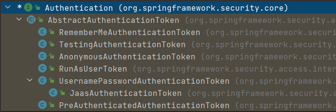

# 1、Spring Security

## 1、框架简介

Spring Security 基于 Spring 框架，提供了一套 Web 应用安全性的完整解决方案。

一般来说，Web 应用的安全性包括**用户认证（Authentication）**和**用户授权 （Authorization）**两个部分，这两点也是 Spring Security 重要核心功能：

- 用户认证：**验证某个用户是否为系统中的合法主体**，也就是说用户**能否访问该系统**。用户认证一般要求用户提供用户名和密码。系统通过校验用户名和密码来完成认证过程。**通俗点说就是系统认为用户是否能登录**。
- 用户授权：**验证某个用户是否有权限执行某个操作**。在一个系统中，**不同用户所具有的权限是不同的**。一般来说，系统会**为不同的用户分配不同的角色**，而**每个角色则对应一系列的权限**。**通俗点讲就是系统判断用户是否有权限去做某些事情**。


## 2、权限管理相关概念

**主体**：

- 英文单词：principal 

- 使用系统的用户或设备或从其他系统远程登录的用户等等。简单说就是**谁使用系统谁就是主体**。

**认证**：

- 英文单词：authentication 
- 权限管理系统确认一个主体的身份，允许主体进入系统。简单说就是**“主体”证明自己是谁**。 
- 笼统的认为就是以前所做的**登录操作**。

**授权**：

- 英文单词：authorization 
- 将操作系统的“权力”“授予”“主体”，这样主体就具备了操作系统中特定功 能的能力。 所以简单来说，**授权就是给用户分配权限**。

## 3、权限管理数据模型

权限表 -------多对多------- 角色表 -------多对多------- 用户表

权限--角色关系表、角色--用户关系表

# 2、入门案例

1、导入SpringWEB以及SpringSecurity依赖

2、编写一个配置类

```java
@Configuration
public class SecurityConfig extends WebSecurityConfigurerAdapter {
    @Override
    protected void configure(HttpSecurity http) throws Exception {
        http.formLogin() // 表单登录
            .and()
            .authorizeRequests() // 认证配置
            .anyRequest() // 任何请求
            .authenticated(); // 都需要身份验证
    }
}
```

**注意**：默认账号：user，默认密码由项目启动时自动生成。

3、添加一个控制器进行访问

```java
@Controller
public class TestController {

    @RequestMapping("/index")
    public ModelAndView indexH(){
        ModelAndView mav = new ModelAndView();
        mav.setViewName("index");
        return mav;
    }

}
```


# 3、常用注解

使用Spring Security注解之前要先在配置类上开启

~~~java
// 在主配置类上开启注解
@EnableGlobalMethodSecurity(securedEnabled=true)
~~~

## 1、@Secured

**判断是否具有角色**，另外需要注意的是这里匹配的字符串**需要添加前缀“ROLE_“**。 

在控制器的方法上添加注解

```java
// 测试注解：
@RequestMapping("testSecured")
@ResponseBody
@Secured({"ROLE_normal", "ROLE_admin"})
public String helloUser() {
    return "hello,user";
}
```

## 2、@PreAuthorize

**进入方法前的权限验证**， @PreAuthorize 可以将登录用户的 roles/permissions 参数传到方法中。

```java
@RequestMapping("/preAuthorize")
@ResponseBody
// @PreAuthorize("hasRole('ROLE_管理员')")
@PreAuthorize("hasAnyAuthority('menu:system')")
public String preAuthorize(){
    System.out.println("preAuthorize");
    return "preAuthorize";
}
```

## 3、@PostAuthorize

该注解使用并不多，在**方法执行后再进行权限验证**，适合验证带有返回值的权限。

```java
@RequestMapping("/testPostAuthorize")
@ResponseBody
@PostAuthorize("hasAnyAuthority('menu:system')")
public String preAuthorize(){
    System.out.println("test--PostAuthorize");
    return "PostAuthorize";
}
```

## 4、@PostFilter

**权限验证之后对数据进行过滤**。

表达式中的 **filterObject** 引用的是方法返回值 List 中的某一个元素

```java
@RequestMapping("getAll")
@PreAuthorize("hasRole('ROLE_管理员')")
@PostFilter("filterObject.username == 'admin1'")
@ResponseBody
public List<UserInfo> getAllUser(){
    ArrayList<UserInfo> list = new ArrayList<>();
    list.add(new UserInfo(1l,"admin1","6666"));
    list.add(new UserInfo(2l,"admin2","888"));
    return list;
}
```

## 5、@PreFilter

进入控制器之前对数据进行过滤

```java
@RequestMapping("getTestPreFilter")
@PreAuthorize("hasRole('ROLE_管理员')")
@PreFilter(value = "filterObject.id%2==0")
@ResponseBody
public List<UserInfo> getTestPreFilter(@RequestBody List<UserInfo> list){
    list.forEach(t-> { System.out.println(t.getId()+"\t"+t.getUsername()); });
    return list;
}
```

# 4、基本原理

## 1、本质

SpringSecurity 本质是一个使用责任链的**过滤器链**，在启动时打断点可以获取到过滤器链

```text
org.springframework.security.web.context.request.async.WebAsyncManagerIntegrationFilter
org.springframework.security.web.context.SecurityContextPersistenceFilter 
org.springframework.security.web.header.HeaderWriterFilter
org.springframework.security.web.csrf.CsrfFilter
org.springframework.security.web.authentication.logout.LogoutFilter 
org.springframework.security.web.authentication.UsernamePasswordAuthenticationFilter 
org.springframework.security.web.authentication.ui.DefaultLoginPageGeneratingFilter 
org.springframework.security.web.authentication.ui.DefaultLogoutPageGeneratingFilter
org.springframework.security.web.savedrequest.RequestCacheAwareFilter
org.springframework.security.web.servletapi.SecurityContextHolderAwareRequestFilter
org.springframework.security.web.authentication.AnonymousAuthenticationFilter 
org.springframework.security.web.session.SessionManagementFilter 
org.springframework.security.web.access.ExceptionTranslationFilter 
org.springframework.security.web.access.intercept.FilterSecurityInterceptor
```

## 2、主要的三个过滤器

### 1、FilterSecurityInterceptor

**方法级的权限过滤器**，位于过滤器链的**最底部**。

```java
public void invoke(FilterInvocation fi) throws IOException, ServletException {
    if ((fi.getRequest() != null)
        && (fi.getRequest().getAttribute(FILTER_APPLIED) != null)
        && observeOncePerRequest) {
        // filter already applied to this request and user wants us to observe
        // once-per-request handling, so don't re-do security checking
        fi.getChain().doFilter(fi.getRequest(), fi.getResponse());
    }
    else {
        // first time this request being called, so perform security checking
        if (fi.getRequest() != null && observeOncePerRequest) {
            fi.getRequest().setAttribute(FILTER_APPLIED, Boolean.TRUE);
        }

        // 查看之前的 filter 是否通过
        InterceptorStatusToken token = super.beforeInvocation(fi);

        try {
            // 真正的调用后台的服务
            fi.getChain().doFilter(fi.getRequest(), fi.getResponse());
        }
        finally {
            super.finallyInvocation(token);
        }

        super.afterInvocation(token, null);
    }
}
```


### 2、ExceptionTranslationFilter

**异常过滤器**，用来处理在认证授权过程中抛出的异常。

允许将`AccessDeniedException`和`AuthenticationException`转换为`HTTP`响应


```java
public void doFilter(ServletRequest req, ServletResponse res, FilterChain chain)
    throws IOException, ServletException {
    HttpServletRequest request = (HttpServletRequest) req;
    HttpServletResponse response = (HttpServletResponse) res;

    try {
        // 直接进入下一个过滤器，除非出现异常才执行自己的代码
        // 如果出现异常，判断异常类型
        // 如果是AuthenticationException，则开始身份验证
        // 		清除SecurityContextHolder的身份验证
        //		（SEC-112：清除SecurityContextHolder的身份验证，因为现有身份验证不再有效）。
        //		将HttpServletRequest保存在RequestCache中。
        //		当用户成功进行身份验证时，RequestCache用于重现原始请求。
        //		AuthenticationEntryPoint用于从客户端请求凭据。
        //		例如，它可能会重定向到登录页面或发送WWW-Authenticate标头。
        // 如果是AccessDeniedException
        // 		拒绝访问，调用AccessDeniedHandler来处理拒绝的访问。
        chain.doFilter(request, response);

        logger.debug("Chain processed normally");
    }
    catch (IOException ex) {
        throw ex;
    }
    catch (Exception ex) {
        // Try to extract a SpringSecurityException from the stacktrace
        Throwable[] causeChain = throwableAnalyzer.determineCauseChain(ex);
        RuntimeException ase = (AuthenticationException) throwableAnalyzer
            .getFirstThrowableOfType(AuthenticationException.class, causeChain);

        if (ase == null) {
            ase = (AccessDeniedException) throwableAnalyzer.getFirstThrowableOfType(
                AccessDeniedException.class, causeChain);
        }

        if (ase != null) {
            if (response.isCommitted()) {
                throw new ServletException("Unable to handle the Spring Security Exception because the response is already committed.", ex);
            }
            handleSpringSecurityException(request, response, chain, ase);
        }
        else {
            // Rethrow ServletExceptions and RuntimeExceptions as-is
            if (ex instanceof ServletException) {
                throw (ServletException) ex;
            }
            else if (ex instanceof RuntimeException) {
                throw (RuntimeException) ex;
            }

            // Wrap other Exceptions. This shouldn't actually happen
            // as we've already covered all the possibilities for doFilter
            throw new RuntimeException(ex);
        }
    }
}
```


### 3、UsernamePasswordAuthenticationFilter

对**/login** 的 **POST** 请求做拦截，校验表单中用户名，密码。

```java
public Authentication attemptAuthentication(HttpServletRequest request,
                                            HttpServletResponse response) 
    										throws AuthenticationException {
    if (postOnly && !request.getMethod().equals("POST")) {
        throw new AuthenticationServiceException(
            "Authentication method not supported: " + request.getMethod());
    }

    String username = obtainUsername(request);
    String password = obtainPassword(request);

    if (username == null) {
        username = "";
    }

    if (password == null) {
        password = "";
    }

    username = username.trim();

    UsernamePasswordAuthenticationToken authRequest = 
        new UsernamePasswordAuthenticationToken(username, password);

    // Allow subclasses to set the "details" property
    setDetails(request, authRequest);

    return this.getAuthenticationManager().authenticate(authRequest);
}
```

# 5、重要的俩个接口

## 1、UserDetailsService接口 

### 1、接口简介

当Security什么也没有配置的时候，账号和密码是由 Spring Security 定义随机生成的。

而在实际项目中账号和密码都是从数据库中查询出来的，所以要通过**自定义逻辑控制认证逻辑**。

如果需要自定义逻辑时，需要**实现 UserDetailsService 接口**即可，接口定义如下：

```java
/**
* 加载用户特定数据的核心接口。
* 它在整个框架中用作用户DAO，并且是DaoAuthenticationProvider使用的策略。
* 该接口只需要一种只读方法，这简化了对新数据访问策略的支持。
*/
public interface UserDetailsService {
    /**
    * 根据用户名定位用户。 
    * 在实际实现中，搜索可能区分大小写，也可能不区分大小写，具体取决于实现实例的配置方式。 
    * 在这种情况下，返回的UserDetails对象的用户名。
    * 注意：可能与实际请求的用户名不同。
    * 参数：username – 标识需要其数据的用户的用户名。
    * 返回值：完全填充的用户记录（从不为null）
    * 异常：UsernameNotFoundException – 如果找不到用户或用户没有 //GrantedAuthority
    */
    UserDetails loadUserByUsername(String username) throws UsernameNotFoundException;
}
```

**注意**：

- 在项目启动时，会被注入进DaoAuthenticationProvider，在**InitializeUserDetailsBeanManagerConfigurer**类中进行，由getBeanOrNull(Class\<T> type)方法根据Bean的类型获取。

**扩展**：

- 多用户类型登陆时，可以多实现该接口，并提供support方法判断是否适用于此用户

### 2、返回值UserDetails

**返回值 UserDetails**，这个类是系统默认的用户“**主体**”

```java
public interface UserDetails extends Serializable {
    // 表示获取登录用户所有权限
    Collection<? extends GrantedAuthority> getAuthorities();
    // 表示获取密码
    String getPassword();
    // 表示获取用户名
    String getUsername();
    // 表示判断账户是否过期
    boolean isAccountNonExpired();
    // 表示判断账户是否被锁定
    boolean isAccountNonLocked();
    // 表示凭证{密码}是否过期
    boolean isCredentialsNonExpired();
    // 表示当前用户是否可用
    boolean isEnabled();
}
```

### 3、实现类User


SpringSecurity内具有一个UserDetails的实现类**User**，之后只需要使用这个实体类即可。

简单的构造函数：

```java
// 调用更复杂的构造函数，并将所有布尔参数设置为true
public User(String username, 
            String password,
            Collection<? extends GrantedAuthority> authorities) {
    this(username, password, true, true, true, true, authorities);
}
```

方法参数 **username**：表示用户名，此值是客户端表单传递过来的数据，**默认情况下必须叫 username**，否则无法接收，密码同理。

## 2、PasswordEncoder接口

### 1、接口简介

```java
public interface PasswordEncoder {
    // 用于把参数按照特定的解析规则进行解析
    String encode(CharSequence rawPassword);
    
    // 用于验证从存储中获取的已编码密码与编码后提交的原始密码是否匹配。
    // 如果密码匹配，则返回 true，如果不匹配，则返回 false。
    // 第一个参数：需要被解析的密码。		 
    // 第二个参数：存储的密码。
    boolean matches(CharSequence rawPassword, String encodedPassword);
    
    // 用于如果解析的密码能够再次进行解析且达到更安全的结果则返回 true，否则返回false。
    // 默认返回 false。
    default boolean upgradeEncoding(String encodedPassword) {
        return false;
    }
}
```


PasswordEncoder接口实现类非常多，**BCryptPasswordEncoder** 是 Spring Security 官方**推荐**的密码解析器，大多使用这个解析器。

BCryptPasswordEncoder 是对 **bcrypt** 强散列方法的具体实现，是基于 **Hash** 算法实现的单向加密，可以通过 **strength** 控制加密强度，默认 **10**.

演示：

```java
@Test
public void test01(){
    // 创建密码解析器
    BCryptPasswordEncoder bCryptPasswordEncoder = new BCryptPasswordEncoder();
    // 对密码进行加密
    String xxxx = bCryptPasswordEncoder.encode("xxxx");
    // 打印加密之后的数据
    System.out.println("加密之后数据：\t"+xxxx);
    // 判断原字符加密后和加密之前是否匹配
    boolean result = bCryptPasswordEncoder.matches("xxxx", xxxx);
    // 打印比较结果
    System.out.println("比较结果：\t"+result);
}

// 注入 PasswordEncoder 类到 spring 容器中
@Bean
public PasswordEncoder passwordEncoder() {
    return new BCryptPasswordEncoder();
}
```

### 2、DelegatingPasswordEncoder

#### 1、简介

默认加载的**委派密码编码器**，内部其实是一个**Map集合**，根据传递的**Key**（Key为加密方式）获取Map集合的Value，而Value则是具体的PasswordEncoder实现类。

也就是说它将具体编码的实现根据要求委派给不同的算法，以此来实现不同编码算法之间的兼容和变化协调。

- 默认加载进DaoAuthenticationProvider。

#### 2、构造方法

**定制构造**：

```java
// idForEncode、passwordEncoderForEncode、idToPasswordEncoder都是在构造方法中传入
private final String idForEncode;
private final PasswordEncoder passwordEncoderForEncode;
private final Map<String, PasswordEncoder> idToPasswordEncoder;

public DelegatingPasswordEncoder(String idForEncode, Map<String, PasswordEncoder> idToPasswordEncoder) {
    // idForEncode决定密码编码器的类型
    if(idForEncode == null) {
        throw new IllegalArgumentException("idForEncode cannot be null");
    }
    // idToPasswordEncoder决定判断匹配时兼容的类型，必须包含idForEncode(不然加密后就无法匹配了)
    if(!idToPasswordEncoder.containsKey(idForEncode)) {
        throw new IllegalArgumentException("idForEncode " 
                                           + idForEncode + "is not found in idToPasswordEncoder " 
                                           + idToPasswordEncoder);
    for(String id : idToPasswordEncoder.keySet()) {
        if(id == null) {
            continue;
        }
        if(id.contains(PREFIX)) {
            throw new IllegalArgumentException("id " + id + " cannot contain " + PREFIX);
        }
        if(id.contains(SUFFIX)) {
            throw new IllegalArgumentException("id " + id + " cannot contain " + SUFFIX);
        }
    }
    this.idForEncode = idForEncode;
    this.passwordEncoderForEncode = idToPasswordEncoder.get(idForEncode);
    this.idToPasswordEncoder = new HashMap<>(idToPasswordEncoder);
}
```

**使用工厂构造**：（推荐）

```java
PasswordEncoder passwordEncoder = PasswordEncoderFactories.createDelegatingPasswordEncoder();
```

```java
// 具体实现
public static PasswordEncoder createDelegatingPasswordEncoder() {
    // 默认使用BCryptPasswordEncoder编码
    String encodingId = "bcrypt";
    Map<String, PasswordEncoder> encoders = new HashMap<>();
    encoders.put(encodingId, new BCryptPasswordEncoder());
    encoders.put("ldap", new LdapShaPasswordEncoder());
    encoders.put("MD4", new Md4PasswordEncoder());
    encoders.put("MD5", new MessageDigestPasswordEncoder("MD5"));
    encoders.put("noop", NoOpPasswordEncoder.getInstance());
    encoders.put("pbkdf2", new Pbkdf2PasswordEncoder());
    encoders.put("scrypt", new SCryptPasswordEncoder());
    encoders.put("SHA-1", new MessageDigestPasswordEncoder("SHA-1"));
    encoders.put("SHA-256", new MessageDigestPasswordEncoder("SHA-256"));
    encoders.put("sha256", new StandardPasswordEncoder());

    return new DelegatingPasswordEncoder(encodingId, encoders);
}
```

遇到新密码，**DelegatingPasswordEncoder**会委托给**BCryptPasswordEncoder**（encodingId为bcryp）进行加密。

同时，对历史上使用ldap、MD4、MD5等等加密算法的密码认证保持兼容（如果数据库里的密码使用的是MD5算法，那使用matches方法认证仍可以通过，但新密码会使用bcrypt进行储存）。

#### 3、密码存储格式

{encodingId}encodedPassword

encodingId标识**PaswordEncoder**的种类，**encodedPassword**是原密码被编码后的密码。

```java
// {bcrypt}格式会委托给BCryptPasswordEncoder加密类
{bcrypt}$2a$10$iMz8sMVMiOgRgXRuREF/f.ChT/rpu2ZtitfkT5CkDbZpZlFhLxO3y
// {pbkdf2}格式会委托给Pbkdf2PasswordEncoder加密类
{pbkdf2}cc409867e39f011f6332bbb6634f58e98d07be7fceefb4cc27e62501594d6ed0b271a25fd9f7fc2e
// {MD5}格式会委托给MessageDigestPasswordEncoder加密类
{MD5}e10adc3949ba59abbe56e057f20f883e
// {noop}明文方式，委托给NoOpPasswordEncoder
{noop}123456
// ...
```

**注意**：

- **rawPassword**：相当于密码字符原序列 ”123456”
- **encodedPassword**：是使用encodingId对应的密码编码器，将密码字符原序列编码后的加密字符串，假设为 ”xxxxx” 存储的密码 
- **prefixEncodedPassword**：是在数据库中，我们所能见到的形式如 ”{bcrypt}$2a$10$iMz8sMVMiOgRgXRuREF/f.ChT/rpu2ZtitfkT5CkDbZpZlFhLxO3y”

**注意**：

- 若没有在DelegatingPasswordEncoder中设置defaultPasswordEncoderForMatches，数据库中的密码必须按照存储格式储存。
- 若设置了defaultPasswordEncoderForMatches，则不一定需要按照密码格式储存。

#### 4、密码编码与匹配

```java
// 编码
// 通过前缀，获取对应编码器编码
private static final String PREFIX = "{";
private static final String SUFFIX = "}";

@Override
public String encode(CharSequence rawPassword) {
    return PREFIX + this.idForEncode + SUFFIX + this.passwordEncoderForEncode.encode(rawPassword);
}
```

```java
// 匹配
@Override
public boolean matches(CharSequence rawPassword, String prefixEncodedPassword) {
    if(rawPassword == null && prefixEncodedPassword == null) {
        return true;
    }
    // 取出编码算法的encodingId
    String id = extractId(prefixEncodedPassword);
    // 根据编码算法的encodingId从支持的密码编码器Map(构造时传入)中取出对应编码器
    PasswordEncoder delegate = this.idToPasswordEncoder.get(id);
    if(delegate == null) {
    	// 如果找不到对应的密码编码器则使用默认密码编码器进行匹配判断，此时比较的密码字符串是 prefixEncodedPassword
        return this.defaultPasswordEncoderForMatches.matches(rawPassword, prefixEncodedPassword);
    }
    // 从 prefixEncodedPassword 中提取获得 encodedPassword 
    String encodedPassword = extractEncodedPassword(prefixEncodedPassword);
    // 使用对应编码器进行匹配判断，此时比较的密码字符串是 encodedPassword ,不携带编码算法encodingId头
    return delegate.matches(rawPassword, encodedPassword);
}
```

#### 5、defaultPasswordEncoderForMatches

```java
// defaultPasswordEncoderForMatches有一个set方法可以修改
private PasswordEncoder defaultPasswordEncoderForMatches = new UnmappedIdPasswordEncoder();
public void setDefaultPasswordEncoderForMatches(
    PasswordEncoder defaultPasswordEncoderForMatches) {
    if(defaultPasswordEncoderForMatches == null) {
        throw new IllegalArgumentException("defaultPasswordEncoderForMatches cannot be null");
    }
    this.defaultPasswordEncoderForMatches = defaultPasswordEncoderForMatches;
}

// 私有的默认实现
// 唯一作用就是抛出异常提醒你要自己选择一个默认密码编码器来取代它
private class UnmappedIdPasswordEncoder implements PasswordEncoder {
    @Override
    public String encode(CharSequence rawPassword) {
        throw new UnsupportedOperationException("encode is not supported");
    }

    @Override
    public boolean matches(CharSequence rawPassword, String prefixEncodedPassword) {
        String id = extractId(prefixEncodedPassword);
        throw new IllegalArgumentException("There is no PasswordEncoder mapped for the id \"" + id + "\"");
    }
}
```

如果不设置会报错，There is no PasswordEncoder mapped for the id "null"

~~~~java
@Bean
public  static PasswordEncoder passwordEncoder( ){
    DelegatingPasswordEncoder delegatingPasswordEncoder =
        (DelegatingPasswordEncoder) PasswordEncoderFactories.createDelegatingPasswordEncoder();
    // 设置defaultPasswordEncoderForMatches为NoOpPasswordEncoder
    delegatingPasswordEncoder.setDefaultPasswordEncoderForMatches(NoOpPasswordEncoder.getInstance());
    return  delegatingPasswordEncoder;
}
~~~~


## 3、多用户类型案例

### 1、UserDetailsService

自定义实现一个CustomUserDetailsService接口，编写一个接口support，用于后续判断

~~~java
public interface CustomUserDetailsService extends UserDetailsService {
    boolean support(String type);
}
~~~

继承CustomUserDetailsService，实现loadUserByUsername与support方法

~~~java
@Service(value="vistorUserDetailsService")
@Slf4j
public class VistorUserDetailsServiceImpl implements CustomUserDetailsService {
    @Resource
    VistorService vistorService;
    @Resource
    RoleService roleService;

    @Override
    public UserDetails loadUserByUsername(String username) throws UsernameNotFoundException {
        log.info("开始登陆");
        Vistor vistor = vistorService.getOne(new QueryWrapper<Vistor>().eq("username", username));
        SecurityUser user;

        if(vistor == null) {
            throw new UsernameNotFoundException("用户不存在");
        } else {
            user = new SecurityUser();
            user.setUsername(vistor.getUsername());
            user.setPassword(vistor.getPassword());
        }

        List<GrantedAuthority> authorities = new ArrayList<>();
        roleService.getRolesByVistorId(vistor.getId())
            .forEach(r -> authorities.add(new SimpleGrantedAuthority(r.getName())));

        log.info("用户角色 {}", authorities);
        user.setAuthorities(authorities);
        return user;
    }

    @Override
    public boolean support(String type) {
        return type.equals(UserType.VISITOR.getType());
    }
}
~~~

### 2、AuthenticationDetails

通过继承WebAuthenticationDetails，保存用户登陆发送过来的数据额外数据，例如验证码、类型等

原始的WebAuthenticationDetails只能保存账号密码，sessionid、ip

~~~java
public class CustomWebAuthenticationDetails extends WebAuthenticationDetails {
    private static final long serialVersionUID = 6975601077714123878L;
    private final String type;


    public CustomWebAuthenticationDetails(HttpServletRequest request) {
        super(request);
        type = request.getParameter("type");
    }

    public String getType() {
        return type;
    }

}
~~~

通过继承WebAuthenticationDetailsSource将CustomWebAuthenticationDetails置入容器中

~~~java
@Component
public class CustomWebAuthenticationDetailsSource extends WebAuthenticationDetailsSource {

    @Override
    public CustomWebAuthenticationDetails buildDetails(HttpServletRequest context) {
        return new CustomWebAuthenticationDetails(context);
    }
}
~~~

### 3、AuthenticationProvider

由于账户密码登陆是由DaoAuthenticationProvider进行校验的，且其中需要自定义的方法retrieveUser被设为final无法重写，所以我们继承其父类AbstractUserDetailsAuthenticationProvider，并实现retrieveUser方法

~~~java
@Component
@Slf4j
public class CustomDaoAuthenticationProvider extends AbstractUserDetailsAuthenticationProvider {

    
  	// 由于使用supprot判断支不支持所以将原来的单个userDetailsService修改为list
    private final List<CustomUserDetailsService> userDetailsServices = new ArrayList<>();

    public CustomDaoAuthenticationProvider() {
        setPasswordEncoder(PasswordEncoderFactories.createDelegatingPasswordEncoder());
    }


    @Override
    protected final UserDetails retrieveUser(String username, 
                                             UsernamePasswordAuthenticationToken authentication)
            throws AuthenticationException {
        prepareTimingAttackProtection();
        try {
            UserDetails loadedUser = null;
            
            // 从details中获取用户发送过来的登录信息
            CustomWebAuthenticationDetails details = 
                (CustomWebAuthenticationDetails) authentication.getDetails();
            
            String type = details.getType();
            // 遍历是否支持
            for (CustomUserDetailsService userDetailsService : userDetailsServices) {
                if(userDetailsService.support(type)) {
                    log.info("用户登陆类型 ----》 {}", type);
                    loadedUser = userDetailsService.loadUserByUsername(username);
                }
            }
            if (loadedUser == null) {
                throw new InternalAuthenticationServiceException("UserDetailsService returned null, which is an interface contract violation");
            }
            return loadedUser;
        } catch (UsernameNotFoundException ex) {
            mitigateAgainstTimingAttack(authentication);
            throw ex;
        } catch (InternalAuthenticationServiceException ex) {
            throw ex;
        } catch (Exception ex) {
            throw new InternalAuthenticationServiceException(ex.getMessage(), ex);
        }
    }

   
    public void setUserDetailsService(List<CustomUserDetailsService> userDetailsServices) {
        this.userDetailsServices.addAll(userDetailsServices);
    }

    public void setUserDetailsService(CustomUserDetailsService userDetailsService) {
        this.userDetailsServices.add(userDetailsService);
    }


    public void setUserDetailsPasswordService(UserDetailsPasswordService userDetailsPasswordService) {
        this.userDetailsPasswordService = userDetailsPasswordService;
    }

}
~~~

### 4、config

最后在config中将所配置的自定义类注入

~~~java
@Resource
private CustomDaoAuthenticationProvider customDaoAuthenticationProvider;

@Autowired
@Qualifier("vistorUserDetailsService")
private CustomUserDetailsService vistorUserDetailsService;

@Bean
public SecurityFilterChain filterChain(@NotNull HttpSecurity http) throws Exception {
    return http
        .formLogin()
        .loginProcessingUrl("/api/auth/login")
        .permitAll()
        .authenticationDetailsSource(customWebAuthenticationDetailsSource)
        .build();
}

@Bean
public AuthenticationManagerBuilder authenticationManagerBuilder(
    ObjectPostProcessor<Object> objectPostProcessor,
    PasswordEncoder passwordEncoder) {
    
    customDaoAuthenticationProvider.setUserDetailsService(vistorUserDetailsService);
    customDaoAuthenticationProvider.setPasswordEncoder(passwordEncoder);
    AuthenticationManagerBuilder managerBuilder = new AuthenticationManagerBuilder(objectPostProcessor);
    managerBuilder.authenticationProvider(customDaoAuthenticationProvider);
    return managerBuilder;
}
~~~


# 6、WEB案例

## 1、固定账号密码

1、编写配置文件

```properties
spring.security.user.name=xxxx
spring.security.user.password=xxxx
```

2、编写配置类

```java
@Configuration
public class SecurityConfig {
    // 注入 PasswordEncoder 类到 spring 容器中
    @Bean
    public PasswordEncoder passwordEncoder(){
        return new BCryptPasswordEncoder();
    }
}
```

3、实现UserDetailsService接口

```java
// 将用户名密码验证写死，实际上这些东西应该从数据库中取出对比
@Service
public class LoginService implements UserDetailsService {
    @Override
    public UserDetails loadUserByUsername(String username) throws 
        UsernameNotFoundException {
        // 判断用户名是否存在
        if (!"admin".equals(username)){
            throw new UsernameNotFoundException("用户名不存在！");
        }
        // 从数据库中获取的密码 atguigu 的密文
        String pwd = "$2a$10$2R/M6iU3mCZt3ByG7kwYTeeW0w7/UqdeXrb27zkBIizBvAven0/na";
        // 第三个参数表示权限
        return new User(username, pwd, AuthorityUtils.commaSeparatedStringToAuthorityList("admin,ROLE_p1"));
        // 1. 放入的是角色：需要加前缀ROLE_，而在controller使用时不需要加ROLE_前缀，详见注解
    	// 2. 放入的是权限：不能加ROLE_前缀，hasAuthority与放入的权限名称对应即可，详见注解
    }
}
```

## 2、实现数据库认证用户

1、创建数据库表

创建权限、角色、用户、权限---角色、角色---用户。五张表。

2、编写用户实体类

```java
@Data
public class Users {
    private Integer id;
    private String username;
    private String password;
}
```

4、编写配置文件

与之前不同，没有设置spring.security.user.name等。

```properties
#mysql 数据库连接
spring.datasource.driver-class-name=com.mysql.cj.jdbc.Driver 
spring.datasource.url=数据库地址
spring.datasource.username=账号
spring.datasource.password=密码
```

5、编写配置类

主要做四件事：

- 注册密码编码类
- 放行登录页面以及静态资源
- 配置认证权限，以及设置未授权的请求跳转登录页
- 自定义403页面

~~~java
@Configuration
public class SecurityConfig extends WebSecurityConfigurerAdapter {
    
    // 注入 PasswordEncoder 类到 spring 容器中
    @Bean
    public PasswordEncoder passwordEncoder(){
        return new BCryptPasswordEncoder();
    }

    @Override
    public void configure(WebSecurity web) throws Exception {
        // 解决静态资源被拦截的问题
        web.ignoring().antMatchers("/css/**", "/vendors/**");
    }

    @Override
    protected void configure(HttpSecurity http) throws Exception {
        // 配置认证
        http.formLogin()
            .loginPage("/index") // 配置哪个url为登录页面 GET .loginPage("/testpage.html")，写法有两种，详见问题
            .loginProcessingUrl("/login") // 设置哪个是提交登录的url。 POST
            .successForwardUrl("/success") // 登录成功之后跳转到哪个url POST
            .failureForwardUrl("/fail"); // 登录失败之后跳转到哪个url POST
        http.authorizeRequests()
            .antMatchers("/layui/**","/index") // 表示配置请求路径
            .permitAll() // 指定 URL 无需保护。
            .anyRequest() // 其他请求
            .authenticated(); // 需要认证
        http.csrf().disable(); // 关闭 csrf
        http.exceptionHandling().accessDeniedPage("/unauth"); // 403页面
    }

    // 简单版
    // @Override
    // protected void configure(HttpSecurity http) throws Exception {
    //     http.authorizeRequests()
    //             .antMatchers("/layui/**","/index") //表示配置请求路径
    //             .permitAll() // 指定 URL 无需保护。
    //             .anyRequest() // 其他请求
    //             .authenticated(); //需要认证
    // }
}
~~~

**注意**：

- anyRequest不能放在antMatchers之后，且不能写俩次。

- 页面的提交方式必须为post，且用户名和密码的字段必须为username和password

5、实现UserDetailsService接口

```java
@Service("userDetailsService")
public class MyUserDetailsService implements UserDetailsService {
    @Autowired
    private UsersMapper usersMapper;
    @Override
    public UserDetails loadUserByUsername(String username) throws UsernameNotFoundException {
        // mybatisplus查询
        QueryWrapper<Users> wrapper = new QueryWrapper();
        wrapper.eq("username", username);
        Users users = usersMapper.selectOne(wrapper);
        if(users == null) {
            throw new UsernameNotFoundException("用户名不存在！");
        }
        System.out.println(users);
        // 添加角色与权限
        List<GrantedAuthority> auths = AuthorityUtils.commaSeparatedStringToAuthorityList("role");
        return new User(users.getUsername(), users.getPassword(), auths);
    }
}
```


## 3、基于数据库的记住我

1、创建记住我的数据表

```sql
CREATE TABLE `persistent_logins` (
    `username` varchar(64) NOT NULL,
    `series` varchar(64) NOT NULL,
    `token` varchar(64) NOT NULL,
    `last_used` timestamp NOT NULL DEFAULT CURRENT_TIMESTAMP ON UPDATE 
    CURRENT_TIMESTAMP,
    PRIMARY KEY (`series`)
) ENGINE=InnoDB DEFAULT CHARSET=utf8;
```

2、编写配置类

```java
@Configuration
public class BrowserSecurityConfig {
    @Autowired
    private DataSource dataSource;

    /**
	* 持久化token
    *
	* Security中，默认是使用PersistentTokenRepository的子类InMemoryTokenRepositoryImpl，将token放在内存中
	* 如果使用JdbcTokenRepositoryImpl，会创建表persistent_logins，将token持久化到数据库
	*/
    @Bean
    public PersistentTokenRepository persistentTokenRepository(){
        JdbcTokenRepositoryImpl jdbcTokenRepository = new JdbcTokenRepositoryImpl();
        // 赋值数据源
        jdbcTokenRepository.setDataSource(dataSource);
        // 自动创建表,第一次执行会创建，以后要执行就要删除掉！
        jdbcTokenRepository.setCreateTableOnStartup(true);
        return jdbcTokenRepository;
    }
}
```

3、修改安全配置类

主要任务：

- 开启记住我的功能
- 设置过期时间，默认 2 周时间，可以通过设置状态有效时间，即使项目重新启动下次也可以正常登录。
- 开启用户注销功能

```java
@Autowired
private UsersServiceImpl usersService;
@Autowired
private PersistentTokenRepository tokenRepository;

@Override
protected void configure(HttpSecurity http) throws Exception {
    // 开启记住我功能
    http.rememberMe()
        .tokenRepository(tokenRepository)
        .userDetailsService(usersService)
        // 设置过期时间
        .tokenValiditySeconds(10) // 单位是秒
        .tokenRepository(tokenRepository)
        .userDetailsService(usersService)
   	// 开启用户登出
    http.logout()
        .logoutUrl("/logout")
        .logoutSuccessUrl("/index")
        .permitAll();
}

```

4、修改页面

- 页面添加记住我复选框

```html
<input type="checkbox"name="remember-me" title="记住密码"/><br/>
```

**注意**：name 属性值必须位 **remember-me** 不能改为其他值

- 页面添加登出url


```html
<a href="/logout">退出</a>
```


## 4、Session控制

~~~java
@Bean
public SecurityFilterChain filterChain(@NotNull HttpSecurity http) throws Exception {
    return http
        .sessionManagement()
        // session失效跳转的URL，需要一个Controller
        .invalidSessionUrl("/session/invalid")
        // session最大登陆数量，超出报错maxim 1
        .maximumSessions(1)
        // 是否保留已经登录的用户，如果为false，则不保留旧用户，保留新用户
        .maxSessionsPreventsLogin(false)
        // 当session过期的行为
        .expiredSessionStrategy(customizeSessionInformationExpiredStrategy)
        .and()
        .and()
        .build();
}

@Component
public class CustomizeSessionInformationExpiredStrategy 
    implements SessionInformationExpiredStrategy {
    
    @Override
    public void onExpiredSessionDetected(SessionInformationExpiredEvent sessionInformationExpiredEvent) 
        throws IOException, ServletException {
        
        // 旧用户被踢出后处理方法
        R r = R.error().encryptionData("您的账号在异地登录", "您的账号在异地登录");
        HttpServletResponse httpServletResponse = sessionInformationExpiredEvent.getResponse();
        httpServletResponse.setContentType("text/json;charset=utf-8");
        httpServletResponse.getWriter().write(r.toJson());
    }
}
~~~


# 7、访问控制

## 1、hasAuthority()方法

如果当前的主体具有指定的权限，则返回 true，否则返回 false

```java
 http.authorizeRequests()			
     .antMatchers("/layui/**","/index").hasAuthority("admin") // 表示主体需要带有admin权限
```

## 2、hasAnyAuthority()方法

如果当前的主体有任何提供的权限（给定的作为一个逗号分隔的字符串列表）的话，返回 true。

## 3、hasRole()方法

如果用户具备给定角色就允许访问，否则出现 403，如果当前主体具有指定的角色，则返回 true。

```java
private static String hasRole(String role) {
    Assert.notNull(role, "role cannot be null");
    if (role.startsWith("ROLE_")) {
        throw new IllegalArgumentException(
            "role should not start with 'ROLE_' since it is automatically inserted. Got '"
            + role + "'");
    }
    return "hasRole('ROLE_" + role + "')";
}
```

**注意**：给主体**添加角色**时，得添加前缀”**ROLE_**“，而在设置hasRole()方法时，不需要添加该前缀，方法会自动添加。

## 4、hasAnyRole()方法

表示用户具备任何一个角色都可以访问。 

给用户添加角色：

```java
List<GrantedAuthority> auths = AuthorityUtils
    .commaSeparatedStringToAuthorityList("role，admin，ROLE_admin,ROLE_role");

return new User(users.getUsername(), new BCryptPasswordEncoder().encode(users.getPassword()), auths);
```

设置角色：

```java
 http.authorizeRequests()			
     .antMatchers("/layui/**","/index").hasAnyRole("admin"，"role”);
```

# 8、CSRF/CORS

## 1、CSRF

### 1、基本概念

**跨站请求伪造**（英语：Cross-site request forgery），也被称为 **one-click  attack** 或者 **session riding**，通常缩写为 CSRF 或者 XSRF， 是一种挟制用户在当前已登录的 Web 应用程序上执行非本意的操作的攻击方法。

跟跨网站脚本（XSS）相比，XSS 利用的是用户对指定网站的信任，CSRF 利用的是网站对用户网页浏览器的信任。

跨站请求攻击是攻击者通过一些技术手段欺骗用户的浏览器去访问一个自己曾经认证过的网站并运行一些操作（如发邮件，发消息，甚至财产操作如转账和购买商品），由于浏览器曾经认证过，所以被访问的网站会认为是真正的用户操作而去运行， 这利用了 web 中用户身份验证的一个漏洞：**简单的身份验证只能保证请求发自某个用户的浏览器，却不能保证请求本身是用户自愿发出的**。

从 Spring Security 4.0 开始，**默认情况下会启用 CSRF 保护**，以防止 CSRF 攻击应用程序，Spring Security CSRF 会针对 **PATCH**，**POST**，**PUT** 和 **DELETE** 方法进行防护。

### 2、案例

在不关闭Security的CSRF情况下，在登陆页面添加一个隐藏域

```html
<input  type="hidden"th:if="${_csrf}!=null"th:value="${_csrf.token}"name="_csrf"/>
```

前后端分离的情况下，需要把csrfToken存入Cookie，前端发请求时携带即可

~~~java
.csrf()
.csrfTokenRepository(CookieCsrfTokenRepository.withHttpOnlyFalse());
~~~

~~~js
{
  "_csrf":"xxxx"
}
~~~

**注意**：

- 如果不关闭CSRF，则必须在form表单中添加这个，否则请求会被拒绝


### 3、实现 CSRF 的原理

1、生成 **csrfToken** 保存到 **HttpSession** 或者 **Cookie** 中。


```java
public interface CsrfToken extends Serializable {
    String getHeaderName();

    String getParameterName();

    String getToken();
}
```

**SaveOnAccessCsrfToken** 类内有个 **CsrfTokenRepository** 接口。

```java
private static final class SaveOnAccessCsrfToken implements CsrfToken {
    private transient CsrfTokenRepository tokenRepository;
    private transient HttpServletRequest request;
    private transient HttpServletResponse response;
    private final CsrfToken delegate;
}
```


CsrfTokenRepository 接口实现类主要：**HttpSessionCsrfTokenRepository**，**CookieCsrfTokenRepository**。


2、请求到来时，从请求中提取 **csrfToken**，和保存的 **csrfToken** 做比较，进而判断当前请求是否合法，主要通过 **CsrfFilter** 过滤器来完成。

```java
static final String DEFAULT_CSRF_PARAMETER_NAME = "_csrf";
```

```java
@Override
public CsrfToken generateToken(HttpServletRequest request) {
    return new DefaultCsrfToken(this.headerName, this.parameterName,
                                createNewToken());
}
```

```java
private String createNewToken() {
    return UUID.randomUUID().toString();
}
```

CsrFilter部份源码

```java
private final CsrfTokenRepository tokenRepository;
```

```java
@Override
protected void doFilterInternal(HttpServletRequest request,
                                HttpServletResponse response, FilterChain filterChain)
    throws ServletException, IOException {
    request.setAttribute(HttpServletResponse.class.getName(), response);
	//CsrfToken有关内容
    CsrfToken csrfToken = this.tokenRepository.loadToken(request);
    final boolean missingToken = csrfToken == null;
    if (missingToken) {
        csrfToken = this.tokenRepository.generateToken(request);
        this.tokenRepository.saveToken(csrfToken, request, response);
    }
    request.setAttribute(CsrfToken.class.getName(), csrfToken);
    //此处key就是_csrf value就是token
    request.setAttribute(csrfToken.getParameterName(), csrfToken);
	//此处验证token是否正确
    if (!this.requireCsrfProtectionMatcher.matches(request)) {
        filterChain.doFilter(request, response);
        return;
    }

    String actualToken = request.getHeader(csrfToken.getHeaderName());
    if (actualToken == null) {
        actualToken = request.getParameter(csrfToken.getParameterName());
    }
    if (!csrfToken.getToken().equals(actualToken)) {
        if (this.logger.isDebugEnabled()) {
            this.logger.debug("Invalid CSRF token found for "
                              + UrlUtils.buildFullRequestUrl(request));
        }
        if (missingToken) {
            this.accessDeniedHandler.handle(request, response,
                                            new MissingCsrfTokenException(actualToken));
        }
        else {
            this.accessDeniedHandler.handle(request, response,
                                            new InvalidCsrfTokenException(csrfToken, actualToken));
        }
        return;
    }

    filterChain.doFilter(request, response);
}
```


## 2、CORS

### 1、基本概念

跨域请求就是指：当前发起请求的域与该请求指向的资源所在的域不同时的请求

- 协议 + 域名 + 端口号，任一不相同，就是跨域

**注意**：

- 设置跨域的是不建议使用 ***** 通配符，能写具体写具体

### 2、解决跨域

~~~java
// SpringSecurity解决同源策源
public CorsConfigurationSource corsConfigurationSource(){
    CorsConfiguration corsConfiguration = new CorsConfiguration();

    // 设置为True,不建议使用setAllowedOrigis,也不能在其内使用*
    corsConfiguration.setAllowCredentials(true);
    corsConfiguration.setAllowedMethods(List.of("POST", "GET", "DELETE", "PUT", "OPTIONS"));
    // corsConfiguration.setAllowedOrigins(Collections.singletonList("*"));
    corsConfiguration.setAllowedOriginPatterns(Collections.singletonList("*"));
    corsConfiguration.setMaxAge(3600L);

    List<String> head = List.of("Content-Type", 
                                "Cookie", 
                                "X-PINGOTHER", 
                                "Origin", 
                                "Accept", 
                                "X-Requested-With");
    corsConfiguration.setExposedHeaders(head);
    corsConfiguration.setAllowedHeaders(head);

    UrlBasedCorsConfigurationSource source = new UrlBasedCorsConfigurationSource();
    source.registerCorsConfiguration("/**", corsConfiguration);
    return source;
}

@Bean
public SecurityFilterChain filterChain(@NotNull HttpSecurity http) throws Exception {
    return http
        .cors()
        .configurationSource(corsConfigurationSource())
        .build();
}

前端ajax请求也需要添加字段，如此才可以获取cooike
~~~


# 9、JWT方案（不推荐）

## 1、认证授权过程分析

- 如果是基于 Session，那么 Spring-security 会对 cookie 里的 sessionid 进行解析，找到服务器存储的 session 信息，然后判断当前用户是否符合请求的要求。


- 如果是 token，则是解析出 token，然后将当前请求加入到 Spring-security 管理的权限信息中去。


用户根据用户名密码认证成功，然后获取当前用户角色的一系列权限值，并以用户名为 key，权限列表为 value 的形式存入 redis 缓存中，根据用户名相关信息生成 token 返回，浏览器将 token 记录到 cookie 中，每次调用 api 接口都默认将 token 携带到 header 请求头中，Spring-security 解析 header 头获取 token 信息，解析 token 获取当前用户名，根据用户名就可以从 redis 中获取权限列表，这样 Spring-security 就能够判断当前请求是否有权限访问


## 2、JWT

### 1、访问令牌的类型

1. **By reference token**

   - 随机生成的字符串标识符，无法简单猜测授权服务器如何颁发和存储。

   - 资源服务器必须通过后端渠道发送回OAuth2授权服务器的令牌检查端点，才能校验令牌是否有效，并获取claims/scopes等额外信息。

2. **By value token**

   - 授权服务器颁发的令牌，包含关于用户或者客户的元数据和声明(claims)。

   - 通过检查签名，期望的颁发者(issuer)，期望的接收人aud(audience)，或者scope，资源服务器可以在本地校验令牌通常实现为签名的JSON Web Tokens(JWT)


### 2、JWT 组成


该对象为一个很长的字符串，字符之间通过"**.**"分隔符分为三个子串。

每一个子串表示了一个功能块，总共有以下三个部分：**JWT 头**、**有效载荷**和**签名**。

#### 1、JWT 头

JWT 头部分是一个描述 JWT 元数据的 JSON 对象，通常如下所示。

```json
{
    "alg": "HS256",
    "typ": "JWT"
}
```

- **alg** 属性表示签名使用的算法，默认为 HMAC SHA256（写为 HS256）
- **typ** 属性表示令牌的类型，JWT 令牌统一写为 JWT。

使用 Base64 URL 算法将上述 JSON 对象转换为字符串保存。

#### 2、有效载荷

载荷部分存在两个属性：**payload**和**claims**，两个属性均可作为载荷，jjwt中二者只能设置其一，如果同时设置，在终端方法**compact()** 中将抛出异常。

有效载荷部分，是 JWT 的主体内容部分，也是一个 JSON 对象，包含需要传递的数据， JWT 指定七个默认字段供选择。

- iss：发行人 
- exp：到期时间 
- sub：主题 
- aud：用户 
- nbf：在此之前不可用 
- iat：发布时间 
- jti：JWT ID 用于标识该 JWT 

除以上默认字段外，我们还可以自定义私有字段，如下例：

```json
{
    "sub": "1234567890",
    "name": "Helen",
    "admin": true
}
```

JSON 对象也使用 Base64 URL 算法转换为字符串保存。

**注意**：默认情况下 JWT 是未加密的，任何人都可以解读其内容，因此不要构建隐私信息字段，存放保密信息，以防止信息泄露。

#### 3、签名哈希

签名哈希部分是对上面两部分数据签名，通过指定的算法生成哈希，以确保数据不会被篡改。

首先，需要指定一个密码（secret）。该密码仅仅为保存在服务器中，并且不能向用户公开，使用标头中指定的签名算法（默认情况下为 HMAC SHA256）根据以下公式生成签名。

```java
HMACSHA256(base64UrlEncode(header) + "." + base64UrlEncode(claims), secret)
```

在计算出签名哈希后，JWT 头、有效载荷、签名哈希三个部分组合成一个字符串，每个部分用"."分隔，就构成整个 JWT 对象。

### 3、常用方法

#### 1、Jwts.builder**()** 

返回了一个 **DefaultJwtBuilder()**

DefaultJwtBuilder包含了一些Header和Payload的一些常用设置方法

DefaultJwtBuilder属性

```java
private static final ObjectMapper OBJECT_MAPPER = new ObjectMapper();
private Header header; //头部
private Claims claims; //声明
private String payload; //载荷
private SignatureAlgorithm algorithm; //签名算法
private Key key; //签名key
private byte[] keyBytes; //签名key的字节数组
private CompressionCodec compressionCodec; //压缩算法
```

#### 2、setHeader() 

有两种参数形式

- 一种是Header接口的实现。
- 一种是Map。

其中Header接口也继承自Map。如果以第二种形式（即Map）作为参数，在setHeader()的时候会生成默认的Header接口实现**DefaultHeader**对象。两种参数形式调用setHeader()，都会令Header重新赋值。即：

```java
this.header = header;
或者
this.header = new DefaultHeader(header);
```

#### 3、setHeaderParam()

向Header追加参数，同类方法setHeaderParams() 

两个方法都使用**ensureHeader()** 方法（返回当前header 如果不存在则创建DefaultHeader）

在生成jwt的时候，如果不设置签名，那么header中的alg应该为none。jjwt中compact()方法实现如下：

```java
if (key != null) {
    jwsHeader.setAlgorithm(algorithm.getValue());
} else {
    //no signature - plaintext JWT:
    jwsHeader.setAlgorithm(SignatureAlgorithm.NONE.getValue());
}
```

```json
{"alg":"none"}
```

#### 4、setPayload() 

- 设置payload，直接赋值

#### 5、setClaims() 

- 设置claims，以参数创建一个新Claims对象，直接赋值

#### 6、claim() 

- 如果builder中Claims属性为空，则创建DefaultClaims对象，并把键值放入；如果Claims属性不为空，获取之后判断键值，存在则更新，不存在则直接放入。

#### 7、compressWith()

- 压缩方法。当载荷过长时可对其进行压缩。可采用jjwt实现的两种压缩方法**CompressionCodecs.GZIP**和**CompressionCodecs.DEFLATE**

#### 8、signWith()

- 签名方法。两个参数分别是签名算法和自定义的签名Key（盐）。签名key可以byte[] 、String及Key的形式传入。前两种形式均存入builder的keyBytes属性，后一种形式存入builder的key属性。如果是第二种（及String类型）的key，则将其进行base64解码获得byte[] 。

#### 9、compact()

- 生成JWT

### 4、7个保留声明(可选)

- setIssuer()
- setSubject()
- setAudience()
- setExpiration()
- setNotBefore()
- setIssuedAt()
- setId()

```java
iss: 签发者
sub: 面向用户
aud: 接收者
iat(issued at): 签发时间
exp(expires): 过期时间
nbf(not before)：不能被接收处理时间，在此之前不能被接收处理
jti：JWT ID为web token提供唯一标识
```

可以在Payload中添加一些自定义的属性claims键值对


## 3、具体代码实现


### 1、编写配置类

```java
// 标注配置类
@Configuration
// 启用Web安全的注解，在SpringBoot项目中无需使用
@EnableWebSecurity
// 启用注解
@EnableGlobalMethodSecurity(prePostEnabled = true)
public class TokenWebSecurityConfig extends WebSecurityConfigurerAdapter {
    
    // 自定义查询数据库用户名密码和权限信息
    // 自定义实现UserDetailsServer接口，重写loadUserByUsername方法，从数据库获取用户名，密码，角色
    private UserDetailsService userDetailsService;
    // token 管理工具类（生成 token）
    private TokenManager tokenManager;
    // 密码管理工具类
    private DefaultPasswordEncoder defaultPasswordEncoder;
    // redis 操作工具类
    private RedisTemplate redisTemplate;
    
    // 在唯一有参构造器上自动注入
    @Autowired
    public TokenWebSecurityConfig(UserDetailsService userDetailsService, 
                                  DefaultPasswordEncoder defaultPasswordEncoder,
                                  TokenManager tokenManager, RedisTemplate 
                                  redisTemplate) {
        
        this.userDetailsService = userDetailsService;
        this.defaultPasswordEncoder = defaultPasswordEncoder;
        this.tokenManager = tokenManager;
        this.redisTemplate = redisTemplate;
        
    }
    
    /**
 	* 配置设置
 	*三个configure的配置
 	*/
    
    //设置退出的地址、token、redis 操作地址
    @Override
    protected void configure(HttpSecurity http) throws Exception {
        http.exceptionHandling()
            .authenticationEntryPoint(new UnauthorizedEntryPoint())
            .and()
            .csrf().disable()
            .authorizeRequests()
            .anyRequest()
            .authenticated()
            .and()
            .logout()
            .logoutUrl("/admin/acl/index/logout")
            .addLogoutHandler(new TokenLogoutHandler(tokenManager,redisTemplate))
            .and()
            .addFilter(new TokenLoginFilter(authenticationManager(), tokenManager, redisTemplate))
            .addFilter(new TokenAuthenticationFilter(authenticationManager(), tokenManager, redisTemplate))
            .httpBasic();
    }
    
    /**
 	* 密码处理
 	*/
    @Override
    public void configure(AuthenticationManagerBuilder auth) throws Exception {
        auth.userDetailsService(userDetailsService)
            .passwordEncoder(defaultPasswordEncoder);
    }
    
    /**
 	* 配置哪些请求不拦截
 	*/
    @Override
    public void configure(WebSecurity web) throws Exception {
        web.ignoring()
            .antMatchers("/api/**", "/swagger-ui.html/**");
    }
}
```

### 2、创建认证授权工具类

#### **DefaultPasswordEncoder**

密码处理的方法

```java
@Component
public class DefaultPasswordEncoder implements PasswordEncoder {
    public DefaultPasswordEncoder() {
        this(-1);
    }
    /**
 	* @param strength 
 	* the log rounds to use, between 4 and 31
 	*/
    public DefaultPasswordEncoder(int strength) {
    }
    
    public String encode(CharSequence rawPassword) {
        return MD5.encrypt(rawPassword.toString());
    }
    
    public boolean matches(CharSequence rawPassword, String encodedPassword) {
        return encodedPassword.equals(MD5.encrypt(rawPassword.toString()));
    }
}
```

#### **TokenManager**

token 操作的工具类

```java
@Component
public class TokenManager {
    
    private long tokenExpiration = 24*60*60*1000;
    private String tokenSignKey = "123456";
    
    public String createToken(String username) {
        String token = Jwts.builder()
            			    .setSubject(username)
            				.setExpiration(new Date(System.currentTimeMillis() + tokenExpiration))
            				.signWith(SignatureAlgorithm.HS512, tokenSignKey)
            				.compressWith(CompressionCodecs.GZIP)
            				.compact();
        return token;
    }
    
    public String getUserFromToken(String token) {
        String user = Jwts.parser()
            			  .setSigningKey(tokenSignKey)
            			  .parseClaimsJws(token)
           	 			  .getBody()
            			  .getSubject();
        return user;
    }
    
    public void removeToken(String token) {
        // jwttoken 无需删除，客户端扔掉即可。
    }
}
```

#### **TokenLogoutHandler**

退出实现

```java
public class TokenLogoutHandler implements LogoutHandler {
    private TokenManager tokenManager;
    private RedisTemplate redisTemplate;
    
    public TokenLogoutHandler(TokenManager tokenManager, RedisTemplate redisTemplate) {
        this.tokenManager = tokenManager;
        this.redisTemplate = redisTemplate;
    }
    
    @Override
    public void logout(HttpServletRequest request, 
                       HttpServletResponse response, 
                       Authentication authentication) {
        
        String token = request.getHeader("token");
        if (token != null) {
            tokenManager.removeToken(token);
            // 清空当前用户缓存中的权限数据
            String userName = tokenManager.getUserFromToken(token);
            redisTemplate.delete(userName);
        }
        ResponseUtil.out(response, R.ok());
    }
}
```

#### **UnauthorizedEntryPoint**

未授权统一处理

```java
public class UnauthorizedEntryPoint implements AuthenticationEntryPoint {
    @Override
    public void commence(HttpServletRequest request, 
                         HttpServletResponse  response, 
                         AuthenticationException authException) 
        throws IOException, ServletException {
        
        ResponseUtil.out(response, R.error());
        
    }
}
```

### 3、创建认证授权实体类

#### **SecutityUser**

```java
@Data
@Slf4j
public class SecurityUser implements UserDetails {
    // 当前登录用户
    private transient User currentUserInfo;
    // 当前权限
    private List<String> permissionValueList;
    
    public SecurityUser() {
    }
    public SecurityUser(User user) {
        if (user != null) {
            this.currentUserInfo = user;
        }
    }
    
    @Override
    public Collection<? extends GrantedAuthority> getAuthorities() {
        Collection<GrantedAuthority> authorities = new ArrayList<>();
        for(String permissionValue : permissionValueList) {
            if(StringUtils.isEmpty(permissionValue)) {
                  continue;
            }
            SimpleGrantedAuthority authority = new SimpleGrantedAuthority(permissionValue);
            authorities.add(authority);
        }
        return authorities;
    }
    
    @Override
    public String getPassword() {
        return currentUserInfo.getPassword();
    }
    @Override
    public String getUsername() {
        return currentUserInfo.getUsername();
    }
    @Override
    public boolean isAccountNonExpired() {
        return true;
    }
    @Override
    public boolean isAccountNonLocked() {
        return true;
    }
    @Override
    public boolean isCredentialsNonExpired() {
        return true;
    }
    @Override
    public boolean isEnabled() {
        return true;
    }
    
}
```

#### **User**

```java
@Data
@ApiModel(description = "用户实体类")
public class User implements Serializable {
    private String username;
    private String password;
    private String nickName;
    private String salt;
    private String token;
}
```

### 4、创建认证授权过滤器

#### **TokenLoginFilter**

认证的 filter 

```java
public class TokenLoginFilter extends UsernamePasswordAuthenticationFilter {
    
    private AuthenticationManager authenticationManager;
    private TokenManager tokenManager;
    private RedisTemplate redisTemplate;
    
    public TokenLoginFilter(AuthenticationManager authenticationManager, 
                            TokenManager tokenManager, 
                            RedisTemplate redisTemplate) {
        
        this.authenticationManager = authenticationManager;
        this.tokenManager = tokenManager;
        this.redisTemplate = redisTemplate;
        this.setPostOnly(false);
        this.setRequiresAuthenticationRequestMatcher(new AntPathRequestMatcher("/admin/acl/login","POST"));
    }
    
    @Override
    public Authentication attemptAuthentication(HttpServletRequest req, HttpServletResponse res)
        throws AuthenticationException {
        try {
            // 将表单中的账户、密码存入User类中
            User user = new ObjectMapper().readValue(req.getInputStream(), User.class);
            return authenticationManager.authenticate( new UsernamePasswordAuthenticationToken(
                user.getUsername(), user.getPassword(), new ArrayList<>()));
        } catch (IOException e) {
            throw new RuntimeException(e);
        }
    }
    
    /**
 	* 登录成功
 	*/
    @Override
    protected void successfulAuthentication(HttpServletRequest req, 
                                            HttpServletResponse res, 
                                            FilterChain chain,
                                            Authentication auth) throws IOException, ServletException {
        
        // 获取安全主体
        SecurityUser user = (SecurityUser) auth.getPrincipal();
        // 使用token管理类生成token
        String token = tokenManager.createToken(user.getCurrentUserInfo().getUsername());
        // 将token存入redis
        redisTemplate.opsForValue().set(user.getCurrentUserInfo().getUsername(), 
                                        user.getPermissionValueList());
        ResponseUtil.out(res, R.ok().data("token", token));
    }
    
    /**
 	* 登录失败
 	*/
    @Override
    protected void unsuccessfulAuthentication(HttpServletRequest request, 
                                              HttpServletResponse response,
                                              AuthenticationException e) throws 
        IOException, ServletException {
        ResponseUtil.out(response, R.error());
    }
}
```

#### TokenAuthenticationFilter

授权 filter 

```java
public class TokenAuthenticationFilter extends BasicAuthenticationFilter {
    private TokenManager tokenManager;
    private RedisTemplate redisTemplate;
    
    public TokenAuthenticationFilter(AuthenticationManager authManager, 
                                     TokenManager tokenManager,
                                     RedisTemplate redisTemplate) {
        super(authManager);
        this.tokenManager = tokenManager;
        this.redisTemplate = redisTemplate;
    }
    
    @Override
    protected void doFilterInternal(HttpServletRequest req,
                                    HttpServletResponse res, 
                                    FilterChain chain) throws IOException, ServletException {
        
        logger.info("================="+req.getRequestURI());
        if(req.getRequestURI().indexOf("admin") == -1) {
            chain.doFilter(req, res);
            return;
        }
        UsernamePasswordAuthenticationToken authentication = null;
        try {
            authentication = getAuthentication(req);
        } catch (Exception e) {
            ResponseUtil.out(res, R.error());
        }
        if (authentication != null) {
            SecurityContextHolder.getContext().setAuthentication(authentication);
        } else {
            ResponseUtil.out(res, R.error());
        }
        chain.doFilter(req, res);
    }
    
    private UsernamePasswordAuthenticationToken getAuthentication(HttpServletRequest request) {
        // token 置于 header 里
        String token = request.getHeader("token");
        if (token != null && "".equals(token.trim())) {
            String userName = tokenManager.getUserFromToken(token);
            List<String> permissionValueList = (List<String>) redisTemplate.opsForValue().get(userName);
            Collection<GrantedAuthority> authorities = new ArrayList<>();
            for(String permissionValue : permissionValueList) {
                if(StringUtils.isEmpty(permissionValue)) {
                    continue;
                }
                SimpleGrantedAuthority authority = new SimpleGrantedAuthority(permissionValue);
                authorities.add(authority);
            }
            if (!StringUtils.isEmpty(userName)) {
                return new UsernamePasswordAuthenticationToken(userName, token, authorities);
            }
            return null;
        }
        return null;
    }
}
```


# 10、动态权限方案

## 1、基本概念

原本的权限授予是在SpringSecurity的配置中写死，不能动态的根据需求修改权限

```java
.antMatchers("/", "/index", "/user/register", "/user/login", "/user/authentication/register").permitAll()
.antMatchers("/msgg").hasRole("p2")
.antMatchers("/eat").hasAnyRole("p1")
.antMatchers("/happytime").hasAnyRole("p2")
.antMatchers("/admin/**").hasAnyRole("root")
```

而动态权限就是将url与角色写入数据库中，使用自定义的**FilterInvocationSecurityMetadataSource**从数据库或者缓存中读取所需信息，再自定义**AccessDecisionVoter**进行投票实现

如果不自定义投票器也可以通过自定义AccessDecisionManager实现，不过我认为AccessDecisionManager不应该改变其原本的唱票者身份，所以选择自定义AccessDecisionVoter

**流程**：当用户登录后，获取用户访问路径并对其进行解析，查看数据库中访问该路径所需要的用户角色，并对比当前用户所拥有的角色，如果相匹配则可以访问，还有一些路径，只需要用户登录即可访问，无关用户角色，则可以在解析路径时返回默认标识或者空值以表示该路径无需用户角色


## 2、实现流程

### 1、FilterInvocationSecurityMetadataSource

首先是自定义的**FilterInvocationSecurityMetadataSource** 

```java
@Component
public class CustomizeSecurityMetadataSource implements FilterInvocationSecurityMetadataSource {

    // 用于获取url以及所需的角色
    @Autowired
    MenuService menuService;
	// 匹配请求的url与数据库中的url
    AntPathMatcher pathMatcher = new AntPathMatcher();

    @Override
    public Collection<ConfigAttribute> getAttributes(Object object) throws IllegalArgumentException {
        /* 根据请求地址，分析请求该地址需要什么角色 */

        // 获取请求地址
        String url = ((FilterInvocation) object).getRequestUrl();
        // 获取所有地址
        List<Menu> menuList = menuService.getAllMenus();
        // 对请求地址进行匹配
        for (Menu m: menuList) {
            String pattern = m.getUrl();
            if(pathMatcher.match(pattern, url)) {
                // 获取该地址所需的角色
                MenuRoleVo rolesByMenuUrl = menuService.getRolesByMenuUrl(pattern);
                List<String> roleList = rolesByMenuUrl.getRoleList()
                    								  .stream()
                    								  .map(Role::getRoleName)
                    								  .collect(Collectors.toList());
                if (roleList.size() != 0) {
                    String[] roles = roleList.toArray(new String[0]);
                    // 返回所需的角色
                    return SecurityConfig.createList(roles);
                } else {
                    return null;
                }
            }
        }
        // 如果该地址无需授权，返回null
        return null;
    }

    @Override
    public Collection<ConfigAttribute> getAllConfigAttributes() {
        return null;
    }

    @Override
    public boolean supports(Class<?> clazz) {
        // 为了支持所有的类型，直接返回true
        return true;
    }
}
```


### 2、AccessDecisionVoter

接着自定义**AccessDecisionVoter** 

```java
@Component
public class DynamicAccessDecisionVoter implements AccessDecisionVoter<Object> {
    @Override
    public boolean supports(ConfigAttribute attribute) {
        // 同样为了支持所有类型，直接返回true
        return true;
    }

    @Override
    public boolean supports(Class<?> clazz) {
        // 同样为了支持所有类型，直接返回true
        return true;
    }

    @Override
    public int vote(Authentication authentication, Object object, Collection<ConfigAttribute> attributes) {
        // 默认弃权票
        int result = ACCESS_ABSTAIN;
        Object principal = authentication.getPrincipal();
        
        if ("anonymousUser".equals(principal)) {
            // 当前用户未登录，如果不要求权限->允许访问，否则拒绝访问
            // 如果当前地址在之前是返回null，则判断
            return CollectionUtils.isEmpty(attributes) ? ACCESS_GRANTED : ACCESS_DENIED;
        } else {
            // 用户所具有的权限
            Collection<? extends GrantedAuthority> authorities = authentication.getAuthorities();
            // 对比用户权限与所需权限
            // 只要具有一个角色即可通过
            for (ConfigAttribute attribute : attributes) {
                for (GrantedAuthority authority : authorities) {
                    if (attribute.getAttribute().equals(authority.getAuthority())) {
                        result = ACCESS_GRANTED;
                        log.info("自定义投票器投了 {}", result);
                        return result;
                    }
                }
            }
            log.info("自定义投票器投了 {}", result);
            return result;
        }
    }
}
```


### 3、注册

最后注册到配置中，与之前相比无需配置众多的antMatchers和hasRole等

```java
.authorizeRequests()
// .antMatchers("/", "/index", "/user/register", "/user/login", "/user/authentication/register").permitAll()
// .antMatchers("/msgg").hasRole("p2")
// .antMatchers("/eat").hasAnyRole("p1")
// .antMatchers("/happytime").hasAnyRole("p2")
// .antMatchers("/admin/**").hasAnyRole("root")
// 任何请求,都需要身份验证
.anyRequest().authenticated()
.withObjectPostProcessor(new ObjectPostProcessor<FilterSecurityInterceptor>() {
    @Override
    public <O extends FilterSecurityInterceptor> O postProcess(O fsi) {
        fsi.setSecurityMetadataSource(customizeSecurityMetadataSource);
        fsi.setAccessDecisionManager(new AffirmativeBased(getDecisionVoters()));
        return fsi;
    }
})
    
    
@NotNull
private List<AccessDecisionVoter<?>> getDecisionVoters() {
    return List.of(new CustomizeDynamicAccessDecisionVoter());
}
```


### 4、前端发送请求

~~~javascript
function login() {
    $.ajax({
        url:"http://localhost:8190/api/auth/login",
        type:'post',
        data:{
            username: document.getElementById('username').value,
            password: document.getElementById('password').value,
            type: document.getElementById('type').value
        },
        // 携带cookie以及接收cookie
        xhrFields:{
            withCredentials:true
        },
        success:function (data, status) {
            alert("数据: \n" + data + "\n状态: " + status);
        }
    });
}
~~~


# 扩展

## 1、SpringSecurity 过滤器介绍

SpringSecurity 采用的是**责任链**的设计模式，它有一条很长的过滤器链，现在对这条过滤器链的 **15** 个过滤器进行说明:

1、 **WebAsyncManagerIntegrationFilter**：将 Security 上下文与 Spring Web 中用于处理异步请求映射的 **WebAsyncManager** 进行集成。 

2、 **SecurityContextPersistenceFilter**：在**每次请求处理之前**将该请求相关的安全上下文信息加载到 **SecurityContextHolder** 中，然后在该次请求处理完成之后，将 SecurityContextHolder 中关于这次请求的信息存储到一个“仓储”中，然后将 SecurityContextHolder 中的信息清除，例如在 Session 中维护一个用户的安全信息就是这个过滤器处理的。 

3、 **HeaderWriterFilter**：用于将头信息加入响应中。 

4、 **CsrfFilter**：用于处理跨站请求伪造。 

5、**LogoutFilter**：用于处理退出登录。 

6、**UsernamePasswordAuthenticationFilter**：用于处理基于表单的登录请求，从表单中获取用户名和密码。默认情况下处理来自 /login 的请求。从表单中获取用户名和密码时，默认使用的表单 name 值为 username 和 password，这两个值可以通过设置这个过滤器的 **usernameParameter** 和 **passwordParameter** 两个参数的值进行修改。 

7、**DefaultLoginPageGeneratingFilter**：如果没有配置登录页面，那系统初始化时就会配置这个过滤器，并且用于在需要进行登录时生成一个登录表单页面。 

8、**BasicAuthenticationFilter**：检测和处理 http basic 认证。 

9、**RequestCacheAwareFilter**：用来处理请求的缓存。 

10、**SecurityContextHolderAwareRequestFilter**：主要是包装请求对象 request。 

11、**AnonymousAuthenticationFilter**：检测 SecurityContextHolder 中是否存在 Authentication 对象，如果不存在为其提供一个匿名 Authentication。 

12、**SessionManagementFilter**：管理 session 的过滤器 

13、**ExceptionTranslationFilter**：处理 AccessDeniedException 和 AuthenticationException 异常。 

14、**FilterSecurityInterceptor**：可以看做过滤器链的出口。

 15、**RememberMeAuthenticationFilter**：当用户没有登录而直接访问资源时，从 cookie  里找出用户的信息，如果 Spring Security 能够识别出用户提供的 remember me cookie，用户将不必填写用户名和密码，而是直接登录进入，该过滤器默认不开启。

## 2、SpringSecurity 基本流程

Spring Security 采取过滤链实现认证与授权，只有当前过滤器通过，才能进入下一个 过滤器


绿色部分是**认证过滤器**，需要我们自己配置，可以配置**多个**认证过滤器。

认证过滤器可以使用 Spring Security 提供的认证过滤器，也可以自定义过滤器（例如：短信验证）。

认证过滤器要在 **configure(HttpSecurity http)**方法中配置，没有配置不生效。

例如：

- UsernamePasswordAuthenticationFilter 过滤器：该过滤器会拦截前端提交的 **POST** 方式的登录表单请求，并进行身份认证。 

- ExceptionTranslationFilter 过滤器：该过滤器不需要我们配置，对于前端提交的请求会直接放行，捕获后续抛出的异常并进行处理（例如：权限访问限制）。 

- FilterSecurityInterceptor 过滤器：该过滤器是过滤器链的最后一个过滤器，根据资源权限配置来判断当前请求是否有权限访问对应的资源，如果访问受限会抛出相关异常，并由 ExceptionTranslationFilter 过滤器进行捕获和处理。

## 3、SpringSecurity 认证流程

认证流程是在 **UsernamePasswordAuthenticationFilter** 过滤器中处理的，具体流程如下所示： 


当前端提交的是一个 **POST** 方式的登录表单请求，就会被 **UsernamePasswordAuthenticationFilter** 过滤器拦截，通过该过滤器的 **doFilter()** 方法进行身份认证。

而 UsernamePasswordAuthenticationFilter 的 doFilter() 方法的实现在其抽象父类**AbstractAuthenticationProcessingFilter** 中。

在 AbstractAuthenticationProcessingFilter 的 doFilter() 方法中会对该请求进行判断，是否需要验证，如果需要则调用子类实现的**attemptAuthentication()** 方法进行验证（也就是UsernamePasswordAuthenticationFilter）。

在 attemptAuthentication() 方法中会判断该请求是否符合要求，然后生成 **Authentication**对象再交给**AuthenticationManager**接口的实现类进行验证。

AuthenticationManager接口的实现类会判断 Authentication对象属于哪一个类型，使用对应的验证 **AuthenticationProvider**对象进行验证。

验证完毕后除去Authentication对象的敏感信息，需要实现 **credentialsContainer**接口。

最后判断验证成功还是失败，如果成功调用 **successfulAuthentication**()方法，如果失败调用 **unsuccessfulAuthentication**()方法。

如果成功了，将认证成功的 Authentication对象 封装入 SecurityContext对象中并存入SecurityContextHolder，还要发布认证成功事件等。

如果失败了，清除该线程在 SecurityContextHolder 中对应的 SecurityContext对象。


## 4、SpringSecurity 授权流程

授权的方式包括web授权和方法授权：

- web授权是通过**url拦截**进行授权。
- 方法授权是通过**方法拦截**进行授权。

二者都会调用**accessDecisionManager**进行授权决策：

- 若为web授权则拦截器为FilterSecurityInterceptor
- 若为方法授权则拦截器为MethodSecurityInterceptor。

如果同时通过web授权和方法授权则先执行web授权，再执行方法授权，最后决策通过，则允许访问资源，否则将禁止访问。

首先会拦截请求，已认证用户访问受保护的web资源将被SecurityFilterChain中的 **FilterSecurityInterceptor** 拦截，在该过滤器中会从**SecurityContextHolder** 获取其中的 **Authentication**，然后获取当前用户的权限信息，用于后续判断是否拥有访问当前资源所需的权限。

然后获取资源访问允许列表，FilterSecurityInterceptor 会从 **SecurityMetadataSource** 获取要访问当前资源所需要的权限 Collection，SecurityMetadataSource 其实就是读取访问策略的抽象，而读取的内容，其实就是配置的访问规则。

最后，FilterSecurityInterceptor 会调用 **AccessDecisionManager** 进行授权决策，若决策通过，则允许访问资源，否则将禁止访问。


## 5、SpringSecurity 过滤器类

### 1、ExceptionTranslationFilter 类

该过滤器是用于处理异常的，不需要配置，对于前端提交的请求会直接放行，捕获后续抛出的异常并进行处理（例如：权限访问限制）。

具体源码如下：

```java
public void doFilter(ServletRequest req, ServletResponse res, FilterChain chain) throws IOException, ServletException {
    HttpServletRequest request = (HttpServletRequest) req;
    HttpServletResponse response = (HttpServletResponse) res;
	// 对前端的请求不拦截直接放行
    try {
        chain.doFilter(request, response);
        logger.debug("Chain processed normally");
    }
    catch (IOException ex) {
        throw ex;
    }
    catch (Exception ex) {
        // 捕获后续的异常进行处理
        Throwable[] causeChain = throwableAnalyzer.determineCauseChain(ex);
        // 访问需要认证的资源，但当前请求未认证所抛出的异常
        RuntimeException ase = (AuthenticationException) throwableAnalyzer 		
            				   .getFirstThrowableOfType(AuthenticationException.class, causeChain);
        if (ase == null) {
            // 访问权限受限抛出的异常
            ase = (AccessDeniedException) throwableAnalyzer.getFirstThrowableOfType(
                AccessDeniedException.class, causeChain);
        }
        if (ase != null) {
            if (response.isCommitted()) {
                throw new ServletException("Unable to handle the Spring Security Exception because the response is already committed.", ex);
            }
            handleSpringSecurityException(request, response, chain, ase);
        }
        else {
            // Rethrow ServletExceptions and RuntimeExceptions as-is
            if (ex instanceof ServletException) {
                throw (ServletException) ex;
            }
            else if (ex instanceof RuntimeException) {
                throw (RuntimeException) ex;
            }
            // Wrap other Exceptions. This shouldn't actually happen
            // as we've already covered all the possibilities for doFilter
            throw new RuntimeException(ex);
        }
    }
}
```

###  2、AbstractSecurityInterceptor 类

**AbstractSecurityInterceptor** 的授权过滤器主要方法**beforeInvocation()**，**afterInvocation()**，**authenticateIfRequired()**

其最主要的方法**beforeInvocation()** 分析如下：

```java
protected InterceptorStatusToken beforeInvocation(Object object) {
       ....
    // 从SecurityMetadataSource读取权限属性
    Collection<ConfigAttribute> attributes = this.obtainSecurityMetadataSource().getAttributes(object);
    if (attributes == null || attributes.isEmpty()) {
             .....
        publishEvent(new PublicInvocationEvent(object));
        return null; // no further work post-invocation
    }

    //调用认证环节获取authenticated（包含用户的详细信息）
    Authentication authenticated = authenticateIfRequired();

    // Attempt authorization
    try {
        //进行关键的一步：授权的最终决策  
        this.accessDecisionManager.decide(authenticated, object, attributes);
    }
    catch (AccessDeniedException accessDeniedException) {
        publishEvent(new AuthorizationFailureEvent(object, attributes, authenticated,
                accessDeniedException));

        throw accessDeniedException;
    }

    // Attempt to run as a different user
    Authentication runAs = this.runAsManager.buildRunAs(authenticated, object,
            attributes);

    if (runAs == null) {
        if (debug) {
            logger.debug("RunAsManager did not change Authentication object");
        }

        // no further work post-invocation
        return new InterceptorStatusToken(SecurityContextHolder.getContext(), false,
                attributes, object);
    }
    else {
        if (debug) {
            logger.debug("Switching to RunAs Authentication: " + runAs);
        }

        SecurityContext origCtx = SecurityContextHolder.getContext();
        SecurityContextHolder.setContext(SecurityContextHolder.createEmptyContext());
        SecurityContextHolder.getContext().setAuthentication(runAs);

        // need to revert to token.Authenticated post-invocation 
        return new InterceptorStatusToken(origCtx, true, attributes, object);
    }
}
```

####  1、FilterSecurityInterceptor 类

##### 1、基础概念

FilterSecurityInterceptor 是过滤器链的最后一个过滤器，该过滤器是过滤器链的最后一个过滤器，根据资源权限配置来判断当前请求是否有权限访问对应的资源。

如果访问受限会抛出相关异常，最终所抛出的异常会由前一个过滤器 ExceptionTranslationFilter 进行捕获和处理。

在**FilterSecurityInterceptor**中有一个封装了**过滤链**、**request**以及**response**的**FilterInvocation**对象进行操作，主要由**invoke()**方法调用其父类**AbstractSecurityInterceptor**的方法。

具体源码如下：

```java
public void doFilter(ServletRequest request, 
                     ServletResponse response,
                     FilterChain chain) 
    				 throws IOException, ServletException {
    FilterInvocation fi = new FilterInvocation(request, response, chain);
    invoke(fi);
}
```

```java
public void invoke(FilterInvocation fi) throws IOException, ServletException {
    if ((fi.getRequest() != null)
        && (fi.getRequest().getAttribute(FILTER_APPLIED) != null)
        && observeOncePerRequest) {
        // filter already applied to this request and user wants us to observe
        // once-per-request handling, so don't re-do security checking
        fi.getChain().doFilter(fi.getRequest(), fi.getResponse());
    }
    else {
        // first time this request being called, so perform security checking
        if (fi.getRequest() != null && observeOncePerRequest) {
            fi.getRequest().setAttribute(FILTER_APPLIED, Boolean.TRUE);
        }
         // 获取accessDecisionManager权限决策后结果状态、以及权限属性
		// 根据资源权限的配置来判断当前请求是否权限访问，如果不能访问，则抛出相应异常
        InterceptorStatusToken token = super.beforeInvocation(fi);

        try {
            // 访问资源，通过SpringMVC的核心组件 DispatcherServlet进行访问
            fi.getChain().doFilter(fi.getRequest(), fi.getResponse());
        }
        finally {
            super.finallyInvocation(token);
        }

        super.afterInvocation(token, null);
    }
}
```

##### 2、默认的初始化

- 首先初始化SecurityMetadataSource

在 **AbstractInterceptUrlConfigurer** 类的 configure 方法中定义实例。

```java
@Override
public void configure(H http) throws Exception {
    FilterInvocationSecurityMetadataSource metadataSource = createMetadataSource(http);
    if (metadataSource == null) {
        return;
    }
    FilterSecurityInterceptor securityInterceptor = createFilterSecurityInterceptor(
        http, metadataSource, http.getSharedObject(AuthenticationManager.class));
    if (filterSecurityInterceptorOncePerRequest != null) {
        securityInterceptor.setObserveOncePerRequest(filterSecurityInterceptorOncePerRequest);
    }
    securityInterceptor = postProcess(securityInterceptor);
    http.addFilter(securityInterceptor);
    http.setSharedObject(FilterSecurityInterceptor.class, securityInterceptor);
}
```

**该实例也会放到 sharedObject 中**。

**FilterSecurityInterceptor** 实例的创建是调用的 **AbstractInterceptUrlConfigurer** 类的 **createFilterSecurityInterceptor** 方法，创建逻辑如下：

```java
private FilterSecurityInterceptor createFilterSecurityInterceptor(H http,
			FilterInvocationSecurityMetadataSource metadataSource,
			AuthenticationManager authenticationManager) throws Exception {
    FilterSecurityInterceptor securityInterceptor = new FilterSecurityInterceptor();
    securityInterceptor.setSecurityMetadataSource(metadataSource);
    securityInterceptor.setAccessDecisionManager(getAccessDecisionManager(http));
    securityInterceptor.setAuthenticationManager(authenticationManager);
    securityInterceptor.afterPropertiesSet();
    return securityInterceptor;
}
```

而其中 **SecurityMetadataSource** 是通过 **AbstractInterceptUrlConfigurer** 类的抽象 **createMetadataSource** 方法来创建。

```java
abstract FilterInvocationSecurityMetadataSource createMetadataSource(H http);
```

其具体逻辑，是由 **AbstractInterceptUrlConfigurer** 类的子类 **ExpressionUrlAuthorizationConfigurer** 提供。

看看最前面的如何配置 **FilterSecurityInterceptor** 实例的 SecurityMetadataSource。

```java
@Override
final ExpressionBasedFilterInvocationSecurityMetadataSource createMetadataSource(H http) {
    // requestMap源码，见下文
    LinkedHashMap<RequestMatcher, Collection<ConfigAttribute>> requestMap = REGISTRY.createRequestMap();
    if (requestMap.isEmpty()) {
        throw new IllegalStateException(
            "At least one mapping is required (i.e. authorizeRequests().anyRequest().authenticated())");
    }
    return new ExpressionBasedFilterInvocationSecurityMetadataSource(requestMap,getExpressionHandler(http));
}
```

**REGISTRY** 正是 **ExpressionInterceptUrlRegistry**。可以看看 **http.authorizeRequests()** 返回值类型，正是 **ExpressionInterceptUrlRegistry**，而该类正是 **ExpressionUrlAuthorizationConfigurer** 类的子类。

```java
public class ExpressionInterceptUrlRegistry extends ExpressionUrlAuthorizationConfigurer<H>.
    AbstractInterceptUrlRegistry<ExpressionInterceptUrlRegistry, AuthorizedUrl>
```

看一下 **requestMap** 是如何创建的，requestMap 是由抽象类 **AbstractConfigAttributeRequestMatcherRegistry** 创建的，这个抽象类是 **AbstractInterceptUrlRegistry** 类的基类，而 **AbstractInterceptUrlRegistry** 类，正是 **ExpressionInterceptUrlRegistry** 类的基类。

```java
final LinkedHashMap<RequestMatcher, Collection<ConfigAttribute>> createRequestMap() {
    if (unmappedMatchers != null) {
        throw new IllegalStateException(
            "An incomplete mapping was found for "
            + unmappedMatchers
            + ". Try completing it with something like requestUrls().<something>.hasRole('USER')");
    }

    LinkedHashMap<RequestMatcher, Collection<ConfigAttribute>> requestMap = new LinkedHashMap<RequestMatcher, Collection<ConfigAttribute>>();
    for (UrlMapping mapping : getUrlMappings()) {
        RequestMatcher matcher = mapping.getRequestMatcher();
        Collection<ConfigAttribute> configAttrs = mapping.getConfigAttrs();
        requestMap.put(matcher, configAttrs);
    }
    return requestMap;
}
```

正是把前面 http 配置的 **authorizeRequests**，转化为 **UrlMappings** 

然后再转换为 **LinkedHashMap<RequestMatcher, Collection<ConfigAttribute\>>**。

而 **ExpressionUrlAuthorizationConfigurer** 类的 interceptUrl，正是向 UrlMappings 中添加内容。

到此 **SecurityMetadataSource** 的初始化基本完成。

- 第二个初始化AccessDecisionManager

默认的 AccessDecisionManager 初始化也是由 **AbstractInterceptUrlConfigurer** 类创建的。

```java
private AccessDecisionManager createDefaultAccessDecisionManager(H http) {
    AffirmativeBased result = new AffirmativeBased(getDecisionVoters(http));
    return postProcess(result);
}
private AccessDecisionManager getAccessDecisionManager(H http) {
    if (accessDecisionManager == null) {
        accessDecisionManager = createDefaultAccessDecisionManager(http);
    }
    return accessDecisionManager;
}
```

如果没有设置自定义的 accessDecisionManager，则会创建默认的 **AffirmativeBased** 实例。

- 第三个初始化AccessDecisionVoter

**AccessDecisionVoters** 也是由**AbstractInterceptUrlConfigurer** 类的抽象方法 **getDecisionVoters** 提供。

```java
abstract List<AccessDecisionVoter<? extends Object>> getDecisionVoters(H http);
```

真正的逻辑实现是由其子类 **ExpressionUrlAuthorizationConfigurer** 提供。

```java
@Override
@SuppressWarnings("rawtypes")
final List<AccessDecisionVoter<? extends Object>> getDecisionVoters(H http) {
    List<AccessDecisionVoter<? extends Object>> decisionVoters = new ArrayList<AccessDecisionVoter<? extends Object>>();
    WebExpressionVoter expressionVoter = new WebExpressionVoter();
    expressionVoter.setExpressionHandler(getExpressionHandler(http));
    decisionVoters.add(expressionVoter);
    return decisionVoters;
}
```

可以看到，decisionVoters 只有 WebExpressionVoter 实例。

- 最后初始化ExpressionHandler

**ExpressionHandler** 的初始化逻辑是由 **ExpressionUrlAuthorizationConfigurer** 类的 **getExpressionHandler** 方法实现。

```java
private SecurityExpressionHandler<FilterInvocation> getExpressionHandler(H http) {
    if (expressionHandler == null) {
        DefaultWebSecurityExpressionHandler defaultHandler = new DefaultWebSecurityExpressionHandler();
        AuthenticationTrustResolver trustResolver = http
            .getSharedObject(AuthenticationTrustResolver.class);
        if (trustResolver != null) {
            defaultHandler.setTrustResolver(trustResolver);
        }
        ApplicationContext context = http.getSharedObject(ApplicationContext.class);
        if (context != null) {
            String[] roleHiearchyBeanNames = context.getBeanNamesForType(RoleHierarchy.class);
            if (roleHiearchyBeanNames.length == 1) {
                defaultHandler.setRoleHierarchy(context.getBean(roleHiearchyBeanNames[0], RoleHierarchy.class));
            }
            String[] grantedAuthorityDefaultsBeanNames = context.getBeanNamesForType(GrantedAuthorityDefaults.class);
            if (grantedAuthorityDefaultsBeanNames.length == 1) {
                GrantedAuthorityDefaults grantedAuthorityDefaults = context.getBean(grantedAuthorityDefaultsBeanNames[0], GrantedAuthorityDefaults.class);
                defaultHandler.setDefaultRolePrefix(grantedAuthorityDefaults.getRolePrefix());
            }
            String[] permissionEvaluatorBeanNames = context.getBeanNamesForType(PermissionEvaluator.class);
            if (permissionEvaluatorBeanNames.length == 1) {
                PermissionEvaluator permissionEvaluator = context.getBean(permissionEvaluatorBeanNames[0], PermissionEvaluator.class);
                defaultHandler.setPermissionEvaluator(permissionEvaluator);
            }
        }

        expressionHandler = postProcess(defaultHandler);
    }

    return expressionHandler;
}
```

首先，**expressionHandler** 是 **DefaultWebSecurityExpressionHandler** 实例。

如果存在 **AuthenticationTrustResolver** 实例，则设置到 **DefaultWebSecurityExpressionHandler** 实例中。

如果存在 **RoleHierarchy** 实例（**隶属关系角色**），同样设置到 **DefaultWebSecurityExpressionHandler** 实例中。

如果存在 **GrantedAuthorityDefaults** 实例（**设置角色前缀的类**），则设置该实例中定义的角色前缀到 **DefaultWebSecurityExpressionHandler** 实例中。

如果存在 **PermissionEvaluator** 实例，同样设置到 **DefaultWebSecurityExpressionHandler** 实例中。

PermissionEvaluator 用于确定用户是否具有权限或给定域对象的权限。

### 3、AbstractAuthenticationProcessingFilter 类

doFilter() 相关源码

```java
public void doFilter(ServletRequest req, ServletResponse res, FilterChain chain)
    throws IOException, ServletException {

    HttpServletRequest request = (HttpServletRequest) req;
    HttpServletResponse response = (HttpServletResponse) res;
    // 判断是否为POST请求，如果是则继续，不是则过滤器链继续
    // 使用的是AntPathRequestMatcher，初始化在子类构造器
    // 判断是否需要验证
    if (!requiresAuthentication(request, response)) {
        chain.doFilter(request, response);
        return;
    }

    if (logger.isDebugEnabled()) {
        logger.debug("Request is to process authentication");
    }

    // 用于存储用户认证信息的类
    Authentication authResult;

    try {
        // 调用子类重写过的方法进行身份认证
        // 返回的authResult对象，封装用户认证信息
        // 源码见UsernamePasswordAuthenticationFilter
        authResult = attemptAuthentication(request, response);
        if (authResult == null) {
            // return immediately as subclass has indicated that it hasn't completed
            // authentication
            return;
        }
        // session处理策略，如果有设置用户session最大并发数量，则在此判断并处理
        sessionStrategy.onAuthentication(authResult, request, response);
    } catch (InternalAuthenticationServiceException failed) {
        logger.error(
            "An internal error occurred while trying to authenticate the user.",
            failed);
        // 认证失败
        unsuccessfulAuthentication(request, response, failed);
        return;
    }
    catch (AuthenticationException failed) {
        // 认证失败
        unsuccessfulAuthentication(request, response, failed);
        return;
    }

    // 认证成功
    if (continueChainBeforeSuccessfulAuthentication) {
        // 默认的continueChainBeforeSuccessfulAuthentication为false，所以认证成功后，不进入下一个过滤器
        chain.doFilter(request, response);
    }
			
    successfulAuthentication(request, response, chain, authResult);
}
```

#### 1、UsernamePasswordAuthenticationFilter 类

~~~java
// 默认用户名为username
public static final String SPRING_SECURITY_FORM_USERNAME_KEY = "username";
// 默认密码名为password
public static final String SPRING_SECURITY_FORM_PASSWORD_KEY = "password";
// 默认只能为POST请求
private boolean postOnly = true;

// 默认登陆表单的请求地址为/login，请求方式为POST
public UsernamePasswordAuthenticationFilter() {
    super(new AntPathRequestMatcher("/login", "POST"));
}
~~~


##### 1、attemptAuthentication() 方法

UsernamePasswordAuthenticationFilter 的 **attemptAuthentication()** 方法

源码如下：

```java
// doFilter()方法会调用此方法
@Override
public Authentication attemptAuthentication(HttpServletRequest request, HttpServletResponse response)
    throws AuthenticationException {
    // 默认情况下，如果请求方式不是POST则会抛出异常
    if (this.postOnly && !request.getMethod().equals("POST")) {
        throw new AuthenticationServiceException("Authentication method not supported: " 
                                                 + request.getMethod());
    }
    
    // 获取请求携带的信息
    String username = obtainUsername(request);
    username = (username != null) ? username : "";
    username = username.trim();
    String password = obtainPassword(request);
    password = (password != null) ? password : "";
    
    // 使用请求携带的用户信息构造Authentication对象，并标记为未认证
    UsernamePasswordAuthenticationToken authRequest = 
        new UsernamePasswordAuthenticationToken(username, password);
    // Allow subclasses to set the "details" property
    
    // 将请求中的其他信息设置到Authentication对象中，例如rememberme、sessionId
    setDetails(request, authRequest);
    
    // 调用ProviderManager类的authenticate()方法进行身份认证
    return this.getAuthenticationManager().authenticate(authRequest);
}
```

创建的 **UsernamePasswordAuthenticationToken** 是 **Authentication** 接口的实现类。

该类有**两个构造器**：

- 一个用于封装前端请求传入的未认证的用户信息
- 一个用于封装认证成功后的用户信息

```java
// 用于封装前端请求传入的未认证的用户信息，前面的authRequest对象，就是调用该构造器构造的
public UsernamePasswordAuthenticationToken(Object principal, Object credentials) {
    // 用户权限为null
    super(null);
    // 前端传入的用户名
    this.principal = principal;
    // 前端传入的密码
    this.credentials = credentials;
    // 标记为未认证
    setAuthenticated(false);
}
// 用于封装认证成功后的用户信息
public UsernamePasswordAuthenticationToken(Object principal, Object credentials,
                                           Collection<? extends GrantedAuthority> authorities) {
    // 用户权限集合
    super(authorities);
    // 封装认证用户信息的UserDetails对象，不再是用户名
    this.principal = principal;
    // 前端传入的面膜
    this.credentials = credentials;
    // 标记认证成功
    super.setAuthenticated(true); // must use super, as we override
}
```

##### 2、successfulAuthentication() 方法

验证完毕回到 UsernamePasswordAuthenticationFilter 过滤器的 doFilter() 方法，查看认证成功/失败的处理方法。

即查看查看**successfulAuthentication()**和**unsuccessfulAuthentication()**方法源码︰

```java
// 认证成功处理器
protected void successfulAuthentication(HttpServletRequest request,
                                        HttpServletResponse response, 
                                        FilterChain chain, 
                                        Authentication authResult)
    									throws IOException, ServletException {

    if (logger.isDebugEnabled()) {
        logger.debug("Authentication success. Updating SecurityContextHolder to contain: "
                     + authResult);
    }
	// 将认证成功的 Authentication对象 封装入 SecurityContext对象中
    // 并存入SecurityContextHolder，该类是对ThreadLocal的一个封装
    SecurityContextHolder.getContext().setAuthentication(authResult);
	// remember me处理
    rememberMeServices.loginSuccess(request, response, authResult);

    // Fire event
    if (this.eventPublisher != null) {
        // 发布认证成功事件
        eventPublisher.publishEvent(new InteractiveAuthenticationSuccessEvent(
            authResult, this.getClass()));
    }
	// 调用认证成功处理器
    successHandler.onAuthenticationSuccess(request, response, authResult);
}
```

##### 3、unsuccessfulAuthentication() 方法

~~~java
// 认证失败处理器
protected void unsuccessfulAuthentication(HttpServletRequest request,
                                          HttpServletResponse response, 
                                          AuthenticationException failed)
    									  throws IOException, ServletException {
    // 清除该线程在 SecurityContextHolder 中对应的 SecurityContext对象
    SecurityContextHolder.clearContext();
    
    if (logger.isDebugEnabled()) {
        logger.debug("Authentication request failed: " + failed.toString(), failed);
        logger.debug("Updated SecurityContextHolder to contain null Authentication");
        logger.debug("Delegating to authentication failure handler " + failureHandler);
    }
    // remember处理
    rememberMeServices.loginFail(request, response);
    // 调用认证失败处理器
    failureHandler.onAuthenticationFailure(request, response, failed);
}
~~~

### 4、SecurityContextPersistenceFilter 类

```java
public void doFilter(ServletRequest req, ServletResponse res, FilterChain chain) throws IOException, ServletException {
    HttpServletRequest request = (HttpServletRequest) req;
    HttpServletResponse response = (HttpServletResponse) res;

    if (request.getAttribute(FILTER_APPLIED) != null) {
        // ensure that filter is only applied once per request
        chain.doFilter(request, response);
        return;
    }

    final boolean debug = logger.isDebugEnabled();

    request.setAttribute(FILTER_APPLIED, Boolean.TRUE);

    if (forceEagerSessionCreation) {
        HttpSession session = request.getSession();

        if (debug && session.isNew()) {
            logger.debug("Eagerly created session: " + session.getId());
        }
    }

    HttpRequestResponseHolder holder = new HttpRequestResponseHolder(request, response);
   	// 当请求到来时， 检查当前Session是否存有SecurityContext对象
    // 如果有则取出，如果没有则创建一个空的
    SecurityContext contextBeforeChainExecution = repo.loadContext(holder);

    try {
        // 将获取到的SecurityContext对象存入SecurityContextHolder
        SecurityContextHolder.setContext(contextBeforeChainExecution);
		// 进入下一个过滤器中
        chain.doFilter(holder.getRequest(), holder.getResponse());

    }
    finally {
        // 响应返回时再次取出SecurityContext对象
        SecurityContext contextAfterChainExecution = SecurityContextHolder.getContext();
        // Crucial removal of SecurityContextHolder contents - do this before anything
        // else.
        // 将SecurityContextHolder中的SecurityContext对象移除
        SecurityContextHolder.clearContext();
        // 将取出的SecurityContext对象放入Session
        repo.saveContext(contextAfterChainExecution, holder.getRequest(), holder.getResponse());
        request.removeAttribute(FILTER_APPLIED);

        if (debug) {
            logger.debug("SecurityContextHolder now cleared, as request processing completed");
        }
    }
}
```


## 6、SpringSecurity 身份验证对象

### 1、Authentication 接口

 **Authentication** 接口的实现类用于**存储用户认证信息**。

该接口具体定义：

```java
// 用户权限集合
Collection<? extends GrantedAuthority> getAuthorities();

// 用户密码
Object getCredentials();

// 未认证时前端传入的用户名，认证成功后为封装认证用户信息的UserDetails对象
Object getPrincipal();

// 请求携带的一些属性信息，例如：remoteAddress、sessionId
Object getDetails();

// 判断是否被认证（T：认证成功，F：未认证）
boolean isAuthenticated();

// 设置是否被认证（T：认证成功，F：未认证）
void setAuthenticated(boolean isAuthenticated) throws IllegalArgumentException;
```



### 2、UsernamePasswordAuthenticationToken 类

认证成功之后会剔除敏感信息，调用 CredentialsContainer 接口定义的 eraseCredentials() 方法去除敏感信息。

查看 UsernamePasswordAuthenticationToken 实现的 eraseCredentials() 方法，该方法实现在其父类中：

```java
// 实现了 CredentialsContainer接口
public abstract class AbstractAuthenticationToken implements Authentication, CredentialsContainer {
	
    public void eraseCredentials() {
        // 前端传入的密码，会被置为null
        eraseSecret(getCredentials());
        // principal在已认证的Authentication中是 userDetails实现类。
        // 如果该实现类想要去除敏感信息，需要实现 credentialsContainer接口的 eraseCredentials()方法
        eraseSecret(getPrincipal());
        // 去除详细信息，默认由WebAuthenticationDetails存储
        eraseSecret(details);
    }

    private void eraseSecret(Object secret) {
        if (secret instanceof CredentialsContainer) {
            ((CredentialsContainer) secret).eraseCredentials();
        }
    }
}


// SpringSecurity提供的User类实现了该接口并重写了该方法
@Override
public void eraseCredentials() {
    this.password = null;
}
```


## 7、SpringSecurity 共享认证信息

查看 **SecurityContext** 接口及其实现类 **SecurityContextImpl** ， 该类其实就是对 **Authentication** 的封装

在 UsernamePasswordAuthenticationFilter 过滤器认证成功之后，会在认证成功的处理方法中将已认证的用户信息对象 Authentication 封装进 SecurityContext，并存入 SecurityContextHolder。 

之后，响应会通过 SecurityContextPersistenceFilter 过滤器，该过滤器的位置在所有过滤器的**最前面**，请求到来先进它，响应返回最后一个通过它，所以在该过滤器中处理已认证的用户信息对象 **Authentication 与 Session 绑定**。

**认证成功的响应**通过 SecurityContextPersistenceFilter 过滤器时，会从 SecurityContextHolder 中取出封装了已认证用户信息对象 Authentication 的 SecurityContext，**放进 Session 中**。

当请求再次到来时，请求首先经过该过滤器，该过滤器会判断当前请求的 **Session 是否存有 SecurityContext 对象**，如果有则将该对象取出再次放入 SecurityContextHolder 中，之后该请求所在的线程获得认证用户信息，后续的资源访问不需要进行身份认证。

当响应再次返回时，该过滤器同样从 SecurityContextHolder 取出 SecurityContext 对象，**放入 Session 中**。


## 8、SpringSecurity 认证提供与管理

### 1、AuthenticationProvider 接口

实现 **AuthenticationProvider** 接口的主要用于解析特定 **Authentication**。

有两个接口方法：

```java
Authentication authenticate(Authentication authentication) throws AuthenticationException;
```

- 与 **AuthenticationManager** 中的 **authenticate** 声明及功能完全一致。
- 返回包含凭据的完整身份验证对象 **authentication**。但是，如果 AuthenticationProvider 不支持给定的 Authentication 的话，该方法可能会返回 null，在此情况下，下一个支持 authentication 的 AuthenticationProvider 将会被尝试。

```java
boolean supports(Class<?> authentication);
```

- 如果 AuthenticationProvider 支持给定的 Authentication 的话，会返回 true。
- 并不保证 AuthenticationProvider 能够对给定的 Authentication 进行身份认证，它只是表明它可以支持对其进行更深入的评估，AuthenticationProvider 依然可以返回 null，以指示应尝试另一个 AuthenticationProvider。
- 此方法是用以选择一个能够匹配 Authentication 以胜任身份认证工作的 AuthenticationProvider，交给 **ProviderManager** 来执行。


### 2、AbstractUserDetailsAuthenticationProvider 类

用于解析 **UsernamePasswordAuthenticationToken** 以进行身份认证的基础 **AuthenticationProvider**。

该类实现了 AuthenticationProvider 接口的 **authenticate**(Authentication authentication) 方法

**源码如下**：

```java
public Authentication authenticate(Authentication authentication) throws AuthenticationException {
    
    // 判断 authentication对象 类型
    Assert.isInstanceOf(UsernamePasswordAuthenticationToken.class, 
                        authentication,
                        () -> messages.getMessage(
                            "AbstractUserDetailsAuthenticationProvider.onlySupports",
                            "Only UsernamePasswordAuthenticationToken is supported"));

    // 获取用户名
    String username = (authentication.getPrincipal() == null) ? "NONE_PROVIDED" : authentication.getName();
	// 从缓存中获取 UserDetails对象
    boolean cacheWasUsed = true;
    UserDetails user = this.userCache.getUserFromCache(username);
	// 如果缓存中获取的 UserDetails对象 为null，则从子类实现的retrieveUser()方法中获取
    if (user == null) {
        cacheWasUsed = false;

        try {
            user = retrieveUser(username, (UsernamePasswordAuthenticationToken) authentication);
        }
        // 如果找不到 UserDetails对象，会抛出错误，处理办法有两个
        catch (UsernameNotFoundException notFound) {
            logger.debug("User '" + username + "' not found");
            
 			// 1、如果 hideUserNotFoundExceptions 为 true（默认为 true），即隐藏用户未找到异常，
            if (hideUserNotFoundExceptions) {
                // 会重新抛出凭据/密码错误异常，异常信息为 Spring Security框架已定义好的提示信息。
                throw new BadCredentialsException(messages.getMessage(
                    "AbstractUserDetailsAuthenticationProvider.badCredentials",
                    "Bad credentials"));
            }
        	// 2、如果不是隐藏用户未找到异常，则直接抛出 UsernameNotFoundException 异常。
            else {
                throw notFound;
            }
        }

        Assert.notNull(user, "retrieveUser returned null - a violation of the interface contract");
    }

    try {
        // 前置身份检查，源码如下。
        preAuthenticationChecks.check(user);
        // 额外身份认证校验，对于 UsernamePasswordAuthenticationToken 来说就是凭据/密码校验。
        // 具体的校验逻辑在其子类 DaoAuthenticationProvider 中
        additionalAuthenticationChecks(user, (UsernamePasswordAuthenticationToken) authentication);
    }
    // 如果认证过程中发生异常，会有如下处理逻辑
    catch (AuthenticationException exception) {
        // 如果当前的用户是从用户缓存中取出的
        // 则使用原有的用户信息再进行一次身份认证，即获取用户信息、前置身份认证检查、额外身份认证检查。
        if (cacheWasUsed) {
            // There was a problem, so try again after checking
            // we're using latest data (i.e. not from the cache)
            cacheWasUsed = false;
            user = retrieveUser(username, (UsernamePasswordAuthenticationToken) authentication);
            preAuthenticationChecks.check(user);
            additionalAuthenticationChecks(user, (UsernamePasswordAuthenticationToken) authentication);
        }
        // 如果不是从用户缓存中取出的，则直接抛出异常。
        else {
            throw exception;
        }
    }
	// 后置身份认证检查。源码如下。
    postAuthenticationChecks.check(user);
	// 将当前用户放入用户缓存，如果当前用户还没有被用户缓存缓存的话。
    if (!cacheWasUsed) {
        this.userCache.putUserInCache(user);
    }
	// 转换 principal 为字符串类型。不过，需要 forcePrincipalAsString 参数为 true（默认为 false）。
    Object principalToReturn = user;

    if (forcePrincipalAsString) {
        principalToReturn = user.getUsername();
    }
	// 创建身份认证成功的 Authentication对象
    return createSuccessAuthentication(principalToReturn, authentication, user);
}
```

默认前置身份检查源码：

```java
private class DefaultPreAuthenticationChecks implements UserDetailsChecker {
    public void check(UserDetails user) {
        // 校验账户是否锁定
        if (!user.isAccountNonLocked()) {
            logger.debug("User account is locked");

            throw new LockedException(messages.getMessage(
                "AbstractUserDetailsAuthenticationProvider.locked",
                "User account is locked"));
        }
		// 校验账户是否可用
        if (!user.isEnabled()) {
            logger.debug("User account is disabled");

            throw new DisabledException(messages.getMessage(
                "AbstractUserDetailsAuthenticationProvider.disabled",
                "User is disabled"));
        }
		// 校验账户是否过期
        if (!user.isAccountNonExpired()) {
            logger.debug("User account is expired");

            throw new AccountExpiredException(messages.getMessage(
                "AbstractUserDetailsAuthenticationProvider.expired",
                "User account has expired"));
        }
    }
}
```

默认后置身份检查源码：

```java
// 默认的后置身份认证检查逻辑如下
private class DefaultPostAuthenticationChecks implements UserDetailsChecker {
    public void check(UserDetails user) {
        // 检查一下用户的凭据/密码是否过期。
        if (!user.isCredentialsNonExpired()) {
            logger.debug("User account credentials have expired");

            throw new CredentialsExpiredException(messages.getMessage(
                "AbstractUserDetailsAuthenticationProvider.credentialsExpired",
                "User credentials have expired"));
        }
    }
}
```

默认的创建身份认证成功的 Authentication对象 逻辑如下。

```java
// 创建了一个新的 UsernamePasswordAuthenticationToken
// 与未认证的区别就是 principal 变成了检索到的用户详细信息（或者用户名，强制字符串principal）。
protected Authentication createSuccessAuthentication(Object principal, Authentication authentication, UserDetails user) {
    UsernamePasswordAuthenticationToken result = 
        new UsernamePasswordAuthenticationToken(principal, 
                                                authentication.getCredentials(),
                                                authoritiesMapper.mapAuthorities(user.getAuthorities()));

    result.setDetails(authentication.getDetails());

    return result;
}
```

**注意**：此方法是 protected 类型的，子类可以重写。因为，子类通常在 Authentication对象 中存储用户提供的原始凭据/密码，而非加盐、加密过的。


### 3、DaoAuthenticationProvider 类

**DaoAuthenticationProvider** 是用于解析并认证 **UsernamePasswordAuthenticationToken** 的这样一个认证服务提供者。

**最终目的**：

就是根据 **UsernamePasswordAuthenticationToken**对象 获取到 **username**属性，然后调用 **UserDetailsService** 检索用户详细信息。

**构造方法**：

在 DaoAuthenticationProvider 创建之时，会制定一个默认的 PasswordEncoder，如果我们没有配置任何 PasswordEncoder，将使用这个默认的 PasswordEncoder，如果我们自定义了 PasswordEncoder 实例，那么会使用我们自定义的 PasswordEncoder 实例。

```java
private PasswordEncoder passwordEncoder;
private volatile String userNotFoundEncodedPassword;
public DaoAuthenticationProvider() {
    setPasswordEncoder(PasswordEncoderFactories.createDelegatingPasswordEncoder());
}
public void setPasswordEncoder(PasswordEncoder passwordEncoder) {
    Assert.notNull(passwordEncoder, "passwordEncoder cannot be null");
    this.passwordEncoder = passwordEncoder;
    this.userNotFoundEncodedPassword = null;
}
```

DaoAuthenticationProvider 的初始化是在 **InitializeUserDetailsManagerConfigurer**#**configure** 方法中完成的

源码如下：

```java
public void configure(AuthenticationManagerBuilder auth) throws Exception {
    if (auth.isConfigured()) {
        return;
    }
    UserDetailsService userDetailsService = getBeanOrNull(
        UserDetailsService.class);
    if (userDetailsService == null) {
        return;
    }
    // 首先去调用 getBeanOrNull()方法获取一个 PasswordEncoder 实例
    // getBeanOrNull() 方法实际上就是去 Spring 容器中查找对象。
    PasswordEncoder passwordEncoder = getBeanOrNull(PasswordEncoder.class);
    UserDetailsPasswordService passwordManager = getBeanOrNull(UserDetailsPasswordService.class);
    // 接下来直接 new 一个 DaoAuthenticationProvider 对象
    // 在 new 的过程中，DaoAuthenticationProvider 中默认的 PasswordEncoder 已经被创建出来了。
    DaoAuthenticationProvider provider = new DaoAuthenticationProvider();
    provider.setUserDetailsService(userDetailsService);
    // 如果一开始从 Spring 容器中获取到了 PasswordEncoder 实例，则将之赋值给 DaoAuthenticationProvider 实例
    // 否则就是用 DaoAuthenticationProvider 自己默认创建的 PasswordEncoder。
    if (passwordEncoder != null) {
        provider.setPasswordEncoder(passwordEncoder);
    }
    if (passwordManager != null) {
        provider.setUserDetailsPasswordService(passwordManager);
    }
    provider.afterPropertiesSet();
    auth.authenticationProvider(provider);
}
```

额外的身份认证检查方法，也即 **additionalAuthenticationChecks()，密码检查**。源码如下：

```java
protected void additionalAuthenticationChecks(UserDetails userDetails,
                                              UsernamePasswordAuthenticationToken authentication)
    										  throws AuthenticationException {
    // 校验密码是否为空
    if (authentication.getCredentials() == null) {
        logger.debug("Authentication failed: no credentials provided");

        throw new BadCredentialsException(messages.getMessage(
            "AbstractUserDetailsAuthenticationProvider.badCredentials",
            "Bad credentials"));
    }
	
    // 将密码转为字符串
    String presentedPassword = authentication.getCredentials().toString();
	
    // 将输入的密码与查询得到的密码进行比对
    if (!passwordEncoder.matches(presentedPassword, userDetails.getPassword())) {
        logger.debug("Authentication failed: password does not match stored value");

        throw new BadCredentialsException(messages.getMessage(
            "AbstractUserDetailsAuthenticationProvider.badCredentials",
            "Bad credentials"));
    }
}
```

用户检索，即 **retrieveUser()**。源码如下：

需要调用 **UserDetailsService** 检索用户详细信息，如权限列表、存储密码等

```java
protected final UserDetails retrieveUser(String username,
                                         UsernamePasswordAuthenticationToken authentication)
    									 throws AuthenticationException {
    // 定时攻击保护
    prepareTimingAttackProtection();
    try {
        UserDetails loadedUser = this.getUserDetailsService().loadUserByUsername(username);
        if (loadedUser == null) {
            throw new InternalAuthenticationServiceException(
                "UserDetailsService returned null, which is an interface contract violation");
        }
        return loadedUser;
    }
    catch (UsernameNotFoundException ex) {
        // 定时攻击保护
        mitigateAgainstTimingAttack(authentication);
        throw ex;
    }
    catch (InternalAuthenticationServiceException ex) {
        throw ex;
    }
    catch (Exception ex) {
        throw new InternalAuthenticationServiceException(ex.getMessage(), ex);
    }
}
```

DaoAuthenticationProvider 还重写了基类的 **createSuccessAuthentication()** 方法。

```java
protected Authentication createSuccessAuthentication(Object principal,
                                                     Authentication authentication, 
                                                     UserDetails user) {
    
    boolean upgradeEncoding = this.userDetailsPasswordService != null
        && this.passwordEncoder.upgradeEncoding(user.getPassword());
    // 更新一下 User 中的密码
    if (upgradeEncoding) {
        String presentedPassword = authentication.getCredentials().toString();
        // 默认会使用BCryptPasswordEncoder编码
        // 由PasswordEncoderFactories创建
        String newPassword = this.passwordEncoder.encode(presentedPassword);
        user = this.userDetailsPasswordService.updatePassword(user, newPassword);
    }
    return super.createSuccessAuthentication(principal, authentication, user);
}
```


### 4、AuthenticationManager 接口

AuthenticationManager这个接口方法，入参和返回值的类型都是**Authentication**。

该接口的作用是对用户的未授信凭据进行认证，认证通过则返回授信状态的凭据，否则将抛出认证异常AuthenticationException。

初始化流程：

**WebSecurityConfigurerAdapter**中的**void configure(AuthenticationManagerBuilder auth)**是配置 AuthenticationManager 的地方。

```java
@Override
protected void configure(AuthenticationManagerBuilder auth) throws Exception {
    DaoAuthenticationProvider daoAuthenticationProvider = new DaoAuthenticationProvider();
    daoAuthenticationProvider.setUserDetailsService(weChatSecurityConfigProperties.getUserDetailsService());
    daoAuthenticationProvider.setPasswordEncoder(multiPasswordEncoder());
    auth.authenticationProvider(daoAuthenticationProvider);
}
```


认证过程：


### 5、ProviderManager 类

**UsernamePasswordAuthenticationFilter** 过滤器的 **attemptAuthentication()** 方法的最后一步将未认证的 **Authentication** 对象传入 **ProviderManager** 类的 **authenticate()** 方法进行身份认证。

ProviderManager 是 **AuthenticationManager** 接口的实现类，该接口是认证相关的核心接口，也是**认证的入口**。

在实际开发中，我们可能有多种不同的认证方式，例如：用户名+ 密码、邮箱+密码、手机号+验证码等，而这些认证方式的入口始终只有一个，那就是 **AuthenticationManager接口**。

在该接口的常用实现类 ProviderManager 内部会维护一个 **List\<AuthenticationProvider>列表**，存放多种认证方式，实际上这是**委托者模式** （Delegate）的应用。

**每种认证方式对应着一个 AuthenticationProvider**， **AuthenticationManager 根据认证方式的不同（通过传入的 Authentication 类型判断）委托对应的 AuthenticationProvider 进行用户认证。** 

ProviderManager 的 authenticate 源码如下：

```java
// 传入未认证的Authentication对象
public Authentication authenticate(Authentication authentication)
    throws AuthenticationException {
    // 获取 Authentication对象 的类型，根据上文我们传入的是 UsernamePasswordAuthenticationToken类
    Class<? extends Authentication> toTest = authentication.getClass();
    
    AuthenticationException lastException = null;
    AuthenticationException parentException = null;
    Authentication result = null;
    Authentication parentResult = null;
    boolean debug = logger.isDebugEnabled();
	
    // 获取认证方式列表即为 List<AuthenticationProvider>列表
    for (AuthenticationProvider provider : getProviders()) {
        // 判断当前的 AuthenticationProvider 是否适用于于 Authentication对象
        if (!provider.supports(toTest)) {
            continue;
        }
        if (debug) {
            logger.debug("Authentication attempt using " + provider.getClass().getName());
        }
		// 找到适配的 AuthenticationProvider，此处应该为 DaoAuthenticationProvider
        try {
            // 调用 DaoAuthenticationProvider 的 authenticate()方法
            // 如果认证成功，会返回一个已认证的 Authentication对象
            result = provider.authenticate(authentication);

            if (result != null) {
                // 认证成功后，会将传入的 Authentication对象详细信息，复制到已认证的 Authentication对象
                copyDetails(authentication, result);
                break;
            }
        }
        catch (AccountStatusException | InternalAuthenticationServiceException e) {
            prepareException(e, authentication);
            // SEC-546: Avoid polling additional providers if auth failure is due to
            // invalid account status
            throw e;
        } catch (AuthenticationException e) {
            lastException = e;
        }
    }
	
    // 如果认证失败，调用 父类AuthenticationManager 进行验证
    if (result == null && parent != null) {
        // Allow the parent to try.
        try {
            result = parentResult = parent.authenticate(authentication);
        }
        catch (ProviderNotFoundException e) {
            // ignore as we will throw below if no other exception occurred prior to
            // calling parent and the parent
            // may throw ProviderNotFound even though a provider in the child already
            // handled the request
        }
        catch (AuthenticationException e) {
            lastException = parentException = e;
        }
    }

    // 认证成功后
    if (result != null) {
        // 认证成功后，去除result的敏感信息，要求相关类实现 CredentialsContainer接口
        if (eraseCredentialsAfterAuthentication && (result instanceof CredentialsContainer)) {
            // Authentication is complete. Remove credentials and other secret data
            // from authentication
            // 去除过程就是调用 CredentialsContainer 的 eraseCredentials()方法
            ((CredentialsContainer) result).eraseCredentials();
        }

        // If the parent AuthenticationManager was attempted and successful than it will publish an AuthenticationSuccessEvent
        // This check prevents a duplicate AuthenticationSuccessEvent if the parent AuthenticationManager already published it
        if (parentResult == null) {
            // 发布认证成功时间
            eventPublisher.publishAuthenticationSuccess(result);
        }
        // 返回结果
        return result;
    }

    // Parent was null, or didn't authenticate (or throw an exception).
	// 认证失败后，抛出异常信息
    if (lastException == null) {
        lastException = new ProviderNotFoundException(messages.getMessage(
            "ProviderManager.providerNotFound",
            new Object[] { toTest.getName() },
            "No AuthenticationProvider found for {0}"));
    }

    // If the parent AuthenticationManager was attempted and failed than it will publish an AbstractAuthenticationFailureEvent
    // This check prevents a duplicate AbstractAuthenticationFailureEvent if the parent AuthenticationManager already published it
    if (parentException == null) {
        prepareException(lastException, authentication);
    }

    throw lastException;
}
```


## 9、SpringSecurity 投票与管理

### 1、AccessDecisionManager 接口

AccessDecisionManager本身并不完成相关的逻辑，全部交由其管理的**AccessDecisionVoter**依次去判断与执行。

被 **AbstractSecurityInterceptor** 拦截器调用进行最终访问控制决策。

根据**decide()**方法的逻辑规则不同，Spring Security中分别存在三种不同decide决策规则。

- AffirmativeBased（在Spring Security默认使用）一票通过
- UnanimousBased 一票否决
- ConsensusBased 少数服从多数


接口源码：

```java
public interface AccessDecisionManager {
    void decide(Authentication authentication, 
                Object object,
				Collection<ConfigAttribute> configAttributes) 
        throws AccessDeniedException, InsufficientAuthenticationException;
    
    boolean supports(ConfigAttribute attribute);
    
    boolean supports(Class<?> clazz);
}
```

- **ConfigAttribute**负责表述规则
- **AccessDecisionVoter**负责为规则表决


**注意**：

- 最终的访问授权是否通过是由AccessDecisionManager进行决策的


在框架中AccessDecisionManager是AccessDecisionVoter的集合类，管理对于不同规则进行判断与表决的AccessDecisionVoter们

但是，AccessDecisionVoter分别都只会对自己支持的规则进行表决，如一个资源的访问规则存在多个并行时，便不能以某一个AccessDecisionVoter的表决作为最终的访问授权结果

AccessDecisionManager的职责便是在这种场景下，汇总所有AccessDecisionVoter的表决结果后给出一个最终的决策

从而导致框架中预设了三种不同决策规则的AccessDecisionManager的实现类


### 2、AccessDecisionVoter 接口

AccessDecisionVoter 是一个投票器，负责对授权决策进行表决，然后，最终由唱票者AccessDecisionManager 统计所有的投票器表决后，来做最终的授权决策。

**AccessDecisionManager.decide()**将使用**AccessDecisionVoter**进行投票决策。

**AccessDecisionVoter**进行投票访问控制决策，访问不通过就抛出**AccessDeniedException**。

**AccessDecisionVoter**的**核心方法vote()** 通常是获取**Authentication的GrantedAuthority**与**已定义好的ConfigAttributes**进行**match**，如果成功为投同意票，匹配不成功为拒绝票，当ConfigAttributes中无属性时，才投弃票。

**AccessDecisionVoter**用三个静态变量表示voter投票情况：

- **ACCESS_ABSTAIN：** 弃权
- **ACCESS_DENIED：** 拒绝访问
- **ACCESS_GRANTED：** 允许访问


**注意：**

- **当所有voter都弃权时使用变量allowIfEqualGrantedDeniedDecisions来判断，true为通过，false抛出AccessDeniedException**


#### 1、WebExpressionVoter 类

**Spring Security** 框架<u>默认</u> **FilterSecurityInterceptor** 实例中 **AccessDecisionManager** 默认的投票器 **WebExpressionVoter**

其实，就是对使用 **http.authorizeRequests()** 基于 Spring-EL进行控制权限的的授权决策类

```java
http
    .authorizeRequests()
    .anyRequest()
    .authenticated()
    .antMatchers().permitAll()
    .antMatchers().hasRole()
    .antMatchers().hasAuthority()
```


#### 2、AuthenticatedVoter 类

针对 **ConfigAttribute#getAttribute()** 中配置为 **IS_AUTHENTICATED_FULLY、IS_AUTHENTICATED_REMEMBERED、IS_AUTHENTICATED_ANONYMOUSLY** 权限标识时的授权决策。因此，其投票策略比较简单：

```java
public int vote(Authentication authentication, Object object,
			Collection<ConfigAttribute> attributes) {
		int result = ACCESS_ABSTAIN;

		for (ConfigAttribute attribute : attributes) {
			if (this.supports(attribute)) {
				result = ACCESS_DENIED;

				if (IS_AUTHENTICATED_FULLY.equals(attribute.getAttribute())) {
					if (isFullyAuthenticated(authentication)) {
						return ACCESS_GRANTED;
					}
				}

				if (IS_AUTHENTICATED_REMEMBERED.equals(attribute.getAttribute())) {
					if (authenticationTrustResolver.isRememberMe(authentication)
							|| isFullyAuthenticated(authentication)) {
						return ACCESS_GRANTED;
					}
				}

				if (IS_AUTHENTICATED_ANONYMOUSLY.equals(attribute.getAttribute())) {
					if (authenticationTrustResolver.isAnonymous(authentication)
							|| isFullyAuthenticated(authentication)
							|| authenticationTrustResolver.isRememberMe(authentication)) {
						return ACCESS_GRANTED;
					}
				}
			}
		}

		return result;
	}
}
```


#### 3、PreInvocationAuthorizationAdviceVoter 类

用于处理基于注解 **@PreFilter** 和 **@PreAuthorize** 生成的 **PreInvocationAuthorizationAdvice**，来处理授权决策的实现。

```java
public int vote(Authentication authentication, MethodInvocation method,
                Collection<ConfigAttribute> attributes) {

    // Find prefilter and preauth (or combined) attributes
    // if both null, abstain
    // else call advice with them

    PreInvocationAttribute preAttr = findPreInvocationAttribute(attributes);

    if (preAttr == null) {
        // No expression based metadata, so abstain
        return ACCESS_ABSTAIN;
    }

    boolean allowed = preAdvice.before(authentication, method, preAttr);

    return allowed ? ACCESS_GRANTED : ACCESS_DENIED;
}
```


#### 4、RoleVoter 类

角色投票器。用于 **ConfigAttribute#getAttribute()** 中配置为角色的授权决策

其默认前缀为 ROLE_，可以自定义，也可以设置为空，直接使用角色标识进行判断，这就意味着，任何属性都可以使用该投票器投票，也就偏离了该投票器的本意，是不可取的

```java
public int vote(Authentication authentication, Object object,
			Collection<ConfigAttribute> attributes) {
    if (authentication == null) {
        return ACCESS_DENIED;
    }
    int result = ACCESS_ABSTAIN;
    Collection<? extends GrantedAuthority> authorities = extractAuthorities(authentication);

    for (ConfigAttribute attribute : attributes) {
        if (this.supports(attribute)) {
            result = ACCESS_DENIED;

            // Attempt to find a matching granted authority
            for (GrantedAuthority authority : authorities) {
                if (attribute.getAttribute().equals(authority.getAuthority())) {
                    return ACCESS_GRANTED;
                }
            }
        }
    }

    return result;
}
```

**注意：决策策略比较简单，用户只需拥有任一当前请求需要的角色即可，不必全部拥有**


#### 5、RoleHierarchyVoter 类

基于 RoleVoter，唯一的不同就是该投票器中的角色是**附带上下级关系的**

也就是说，角色A包含角色B，角色B包含角色C，此时，如果用户拥有角色A，那么理论上可以同时拥有角色B、角色C的全部资源访问权限

**注意：同 RoleVoter 的决策策略，用户只需拥有任一当前请求需要的角色即可，不必全部拥有**


### 3、默认注入

位于AbstractInterceptUrlConfigurer

~~~java
private AccessDecisionManager createDefaultAccessDecisionManager(H http) {
    AffirmativeBased result = new AffirmativeBased(getDecisionVoters(http));
    return postProcess(result);
}

@Override
@SuppressWarnings("rawtypes")
List<AccessDecisionVoter<?>> getDecisionVoters(H http) {
    List<AccessDecisionVoter<?>> decisionVoters = new ArrayList<>();
    WebExpressionVoter expressionVoter = new WebExpressionVoter();
    expressionVoter.setExpressionHandler(getExpressionHandler(http));
    decisionVoters.add(expressionVoter);
    return decisionVoters;
}
~~~


## 10、SpringSecurity 三个configure方法

### 1、旧版本

```java
// 用于通过允许AuthenticationProvider容易地添加来建立认证机制。
// 也就是说用来记录账号，密码，角色信息。
void configure(AuthenticationManagerBuilder auth) throws Exception
    
// 允许基于选择匹配在资源级配置基于网络的安全性。
// 也就是对角色的权限——所能访问的路径做出限制。
void configure(HttpSecurity http) throws Exception
    
// 用于影响全局安全性(配置资源，设置调试模式，通过实现自定义防火墙定义拒绝请求)的配置设置。
// 一般用于配置全局的某些通用事物，例如静态资源等。
void configure(WebSecurity web) throws Exception
```

1、configure(AuthenticationManagerBuilder auth)实例

**注意**：

- 此代码不从数据库读取，直接手动赋予

- 记录在内存中

```java
AuthenticationManagerBuilder allows 
    public void configure(AuthenticationManagerBuilder auth) {
        auth
            .inMemoryAuthentication()
            .withUser("user")
            .password("password")
            .roles("USER")
        .and()
            .withUser("admin")
            .password("password")
            .roles("ADMIN","USER");
}
```

2、configure(HttpSecurity)实例

以下示例将/admin/ 开头的网址限制为，只有具有ADMIN角色的用户才能访问，并声明任何其他网址需要成功验证。

```java
protected void configure(HttpSecurity http) throws Exception {
    http.authorizeUrls()
        .antMatchers("/admin/**").hasRole("ADMIN")
        .anyRequest()
        .authenticated()
}
```

3、configure(WebSecurity web)实例

```java
public void configure(WebSecurity web) throws Exception {
    web.ignoring()
        .antMatchers("/resources/**");
}
```


### 2、新版本

新版本均使用@Bean方式注入

~~~java
// 使用WebSecurityCustomizer配置WebSecurity
@Bean
public WebSecurityCustomizer ignoringCustomizer() {
    return (web) -> web.ignoring().antMatchers("/ignore1", "/ignore2");
}

// 使用SecurityFilterChain配置HttpSecurity
@Bean
public SecurityFilterChain filterChain(@NotNull HttpSecurity http) throws Exception {
    return http.authorizeRequests()
                .anyRequest()
                .authenticated()
}

@Bean
public AuthenticationManagerBuilder authenticationManagerBuilder
    (ObjectPostProcessor<Object> objectPostProcessor, PasswordEncoder passwordEncoder) {
    customDaoAuthenticationProvider.setUserDetailsService(vistorUserDetailsService);
    customDaoAuthenticationProvider.setPasswordEncoder(passwordEncoder);
    AuthenticationManagerBuilder managerBuilder = new AuthenticationManagerBuilder(objectPostProcessor);
    managerBuilder.authenticationProvider(customDaoAuthenticationProvider);
    return managerBuilder;
}
~~~


## 11、SpringSecurity Handler

### 1、AuthenticationFailureHandler

**AuthenticationFailureHandler** 接口定义了Spring Security Web在遇到认证错误时所使用的处理策略。

典型做法一般是将用户**重定向到认证页面**(比如认证机制是用户名表单认证的情况)让用户再次认证。

当然具体实现类可以根据需求实现更复杂的逻辑，比如根据异常做不同的处理等等。

举个例子，如果遇到**CredentialsExpiredException**异常(**AuthenticationException**异常的一种，表示密码过期失效)，可以将用户重定向到修改密码页面而不是登录认证页面。

```java
public interface AuthenticationFailureHandler {

    /**
	 * 认证失败时会调用此方法
	 * @param request 出现认证失败时所处于的请求.
	 * @param response 对应上面请求的响应对象.
	 * @param exception 携带认证失败原因的认证失败异常对象
	 * request.
	 */
    void onAuthenticationFailure(HttpServletRequest request,
                                 HttpServletResponse response, AuthenticationException exception)
        throws IOException, ServletException;
}
```

#### 1、SimpleUrlAuthenticationFailureHandler

在Spring Security Web框架内部，默认使用的认证错误处理策略是

**AuthenticationFailureHandler**的实现类**SimpleUrlAuthenticationFailureHandler**。

它由**配置**指定一个**defaultFailureUrl**，表示认证失败时缺省使用的重定向地址，一旦认证失败，它的方法**onAuthenticationFailure**被调用时，它就会将用户重定向到该地址，如果该属性没有设置，它会向客户端返回一个`401`状态码。

另外SimpleUrlAuthenticationFailureHandler还有一个属性**useForward**，如果该属性设置为`true`，页面跳转将不再是重定向(`redirect`)机制，取而代之的是转发(`forward`)机制。

可以通过继承，重写onAuthenticationFailure方法实现，同一url路径不同错误提示。

```java
@Override
public void onAuthenticationFailure(HttpServletRequest request, HttpServletResponse response, AuthenticationException exception) throws IOException, ServletException {
    // 设置错误转发路径
    setDefaultFailureUrl(determineFailureUrl(exception));

    ......
}

    
private String determineFailureUrl(AuthenticationException exception) {
    // 默认设置登录错误页面为/login_fail
    defaultFailureUrl = StringUtils.hasLength(defaultFailureUrl) ? defaultFailureUrl : DEFAULT_FAILURE_URL;

    Integer failureType = determineFailureType(exception).getType();

    if (failureType != null) {
        defaultFailureUrl += defaultFailureUrl.lastIndexOf("?") > 0 ? "&" : "?" + "error=" + failureType;
    }

    return defaultFailureUrl;
}

// 自定义错误提示
private LoginError determineFailureType(AuthenticationException exception) {
    if (exception instanceof BadCredentialsException) {
        return LoginError.BADCREDENTIALS;
    } else if (exception instanceof LockedException) {
        return LoginError.LOCKED;
    } else if (exception instanceof AccountExpiredException) {
        return LoginError.ACCOUNTEXPIRED;
    } else if (exception instanceof UsernameNotFoundException) {
        return LoginError.USERNAMENOTFOUND;
    }

    return LoginError.FAILURE;
}
```

登录失败controller，根据登录失败类型，组装登录失败原因。

```java
@RequestMapping("/login_fail")
public String loginFail(HttpServletRequest request, Model model) {
    LoginError loginError = determineErrorType(request);

    model.addAttribute("errorMessage", loginError != null ? loginError.getMessage() : null);

    return "login_fail";
}

private LoginError determineErrorType(HttpServletRequest request) {
    String typeStr = request.getParameter("error");

    return typeStr == null ? null : LoginError.resolve(Integer.valueOf(typeStr));
}
```

SimpleUrlAuthenticationFailureHandler源码

```java
public class SimpleUrlAuthenticationFailureHandler implements
		AuthenticationFailureHandler {
	protected final Log logger = LogFactory.getLog(getClass());

	// 认证失败时缺省使用的重定向地址
	private String defaultFailureUrl;
	// 是否使用 forward, 缺省为 false, 表示使用 redirect
	private boolean forwardToDestination = false;
	// 是否在需要session的时候允许创建session
	private boolean allowSessionCreation = true;
	// 页面重定向策略
	private RedirectStrategy redirectStrategy = new DefaultRedirectStrategy();

	public SimpleUrlAuthenticationFailureHandler() {
	}

	public SimpleUrlAuthenticationFailureHandler(String defaultFailureUrl) {
		setDefaultFailureUrl(defaultFailureUrl);
	}

	/**
	 * Performs the redirect or forward to the defaultFailureUrl if set, otherwise
	 * returns a 401 error code.
	 * 
	 * If redirecting or forwarding, saveException will be called to cache the
	 * exception for use in the target view.
	 */
	public void onAuthenticationFailure(HttpServletRequest request,
			HttpServletResponse response, AuthenticationException exception)
			throws IOException, ServletException {

		if (defaultFailureUrl == null) {
			logger.debug("No failure URL set, sending 401 Unauthorized error");

			// 如果 defaultFailureUrl 没有设置，向客户端返回 401 错误 ： Unauthorized
			response.sendError(HttpStatus.UNAUTHORIZED.value(),
				HttpStatus.UNAUTHORIZED.getReasonPhrase());
		}
		else {
			saveException(request, exception);

			if (forwardToDestination) {
				// 指定了使用 forward 的情况
				logger.debug("Forwarding to " + defaultFailureUrl);

				request.getRequestDispatcher(defaultFailureUrl)
						.forward(request, response);
			}
			else {
				// 指定了使用  redirect 的情况 , 缺省情况
				logger.debug("Redirecting to " + defaultFailureUrl);
				redirectStrategy.sendRedirect(request, response, defaultFailureUrl);
			}
		}
	}

	/**
	 * Caches the AuthenticationException for use in view rendering.
	 * 
	 * If forwardToDestination is set to true, request scope will be used,
	 * otherwise it will attempt to store the exception in the session. If there is no
	 * session and allowSessionCreation is true a session will be created.
	 * Otherwise the exception will not be stored.
	 */
	protected final void saveException(HttpServletRequest request,
			AuthenticationException exception) {
		if (forwardToDestination) {
		// forward 的情况，保存异常到 request 属性 : SPRING_SECURITY_LAST_EXCEPTION
			request.setAttribute(WebAttributes.AUTHENTICATION_EXCEPTION, exception);
		}
		else {
		// redirect 的情况 , 保存异常到 session : SPRING_SECURITY_LAST_EXCEPTION
			HttpSession session = request.getSession(false);

			if (session != null || allowSessionCreation) {
				request.getSession().setAttribute(WebAttributes.AUTHENTICATION_EXCEPTION,
						exception);
			}
		}
	}

	/**
	 * The URL which will be used as the failure destination.
	 *
	 * @param defaultFailureUrl the failure URL, for example "/loginFailed.jsp".
	 */
	public void setDefaultFailureUrl(String defaultFailureUrl) {
		Assert.isTrue(UrlUtils.isValidRedirectUrl(defaultFailureUrl),
				() -> "'" + defaultFailureUrl + "' is not a valid redirect URL");
		this.defaultFailureUrl = defaultFailureUrl;
	}

	protected boolean isUseForward() {
		return forwardToDestination;
	}

	/**
	 * If set to true, performs a forward to the failure destination URL instead
	 * of a redirect. Defaults to false.
	 */
	public void setUseForward(boolean forwardToDestination) {
		this.forwardToDestination = forwardToDestination;
	}

	/**
	 * Allows overriding of the behaviour when redirecting to a target URL.
	 */
	public void setRedirectStrategy(RedirectStrategy redirectStrategy) {
		this.redirectStrategy = redirectStrategy;
	}

	protected RedirectStrategy getRedirectStrategy() {
		return redirectStrategy;
	}

	protected boolean isAllowSessionCreation() {
		return allowSessionCreation;
	}

	public void setAllowSessionCreation(boolean allowSessionCreation) {
		this.allowSessionCreation = allowSessionCreation;
	}
}
```


#### 2、CustomizeAuthenticationFailureHandler

~~~java
@Component
public class CustomizeAuthenticationFailureHandler implements AuthenticationFailureHandler {


    @Override
    public void onAuthenticationFailure(HttpServletRequest request,
                                        HttpServletResponse response,
                                        AuthenticationException exception)
        throws IOException, ServletException {

        R r;
        if (exception instanceof AccountExpiredException) {
            // 账号过期
            r = R.error().encryptionData("账号过期", "账号过期");
        } else if (exception instanceof BadCredentialsException) {
            // 密码错误
            r = R.error().encryptionData("密码错误", "密码错误");
        } else if (exception instanceof CredentialsExpiredException) {
            // 密码过期
            r = R.error().encryptionData("密码过期", "密码过期");
        } else if (exception instanceof DisabledException) {
            // 账号不可用
            r = R.error().encryptionData("账号不可用", "账号不可用");
        } else if (exception instanceof LockedException) {
            // 账号锁定
            r = R.error().encryptionData("账号锁定", "账号锁定");
        } else if (exception instanceof InternalAuthenticationServiceException) {
            // 用户不存在
            r = R.error().encryptionData("用户不存在", "用户不存在");
        } else {
            // 其他错误
            r = R.error().encryptionData("其他错误", "其他错误").data("错误信息", exception.getStackTrace());
            exception.printStackTrace();
        }
        // 处理编码方式，防止中文乱码的情况
        response.setContentType("text/json;charset=utf-8");
        // 塞到HttpServletResponse中返回给前台
        response.getWriter().write(r.toJson());
    }
}
~~~


### 2、AuthenticationSuccessHandler 

#### 1、SavedRequestAwareAuthenticationSuccessHandler 

身份验证成功策略，该策略**DefaultSavedRequest**可能已由会话存储在会话中**ExceptionTranslationFilter**。

当此类请求被拦截并需要进行身份验证时，将存储请求数据以记录身份验证过程开始之前的原始目的地，并允许在重定向到相同URL时重构请求，如果合适，此类负责执行重定向到原始URL的操作。

成功进行身份验证后，它将根据以下情况决定重定向目标：

- 如果该**alwaysUseDefaultTargetUrl属性**设置为true，**defaultTargetUrl** 则将用于目标，任何DefaultSavedRequest存储在会话将被删除。
- 如果**targetUrlParameter**已在请求中设置，则该值将用作目的地，任何DefaultSavedRequest都将再次被删除。
- 如果在**SavedRequest**中找到了**RequestCache**（由设置为在**ExceptionTranslationFilter**身份验证过程开始之前记录原始目标），则将重定向到该原始目标的Url。SavedRequest收到重定向的请求后，该对象将保持缓存并被拾取（请参阅参考资料SavedRequestAwareWrapper）。
- 如果**SavedRequest**找不到，它将委派给基类。


当在**ExceptionTranslationFilter**中拦截时，会调用**HttpSessionRequestCache**保存原始的请求信息。

在**UsernamePasswordAuthenticationFilter**过滤器登录成功后，会调用**SavedRequestAwareAuthenticationSuccessHandler**。


#### 2、CustomizeAuthenticationSuccessHandler

~~~java
@Component
public class CustomizeAuthenticationSuccessHandler implements AuthenticationSuccessHandler {


    @Resource
    VistorService vistorService;
    @Resource
    TenantService tenantService;

    @Resource
    AdminService adminService;
    @Resource
    PropertyService propertyService;

    @Override
    public void onAuthenticationSuccess(HttpServletRequest httpServletRequest,
                                        HttpServletResponse httpServletResponse,
                                        Authentication authentication)
        throws IOException, ServletException {

        Authentication auth = SecurityContextHolder.getContext().getAuthentication();
        CustomWebAuthenticationDetails details = (CustomWebAuthenticationDetails) auth.getDetails();
        SecurityUser userDetails = (SecurityUser) auth.getPrincipal();
        String type = details.getType();
        boolean updated = update(userDetails.getUsername(), type);

        R r = R.status(updated).encryptionData("status", updated);
        httpServletResponse.setContentType("text/json;charset=utf-8");
        httpServletResponse.getWriter().write(r.toJson());
    }

    public boolean update(String username, String type) {
        boolean result = false;
        if (VISITOR.getType().equals(type)) {
            result = vistorService.updateLoginTimeByName(username);
        } else if (TENANT.getType().equals(type)) {
            result = tenantService.updateLoginTimeByName(username);
        } else if (PROPERTY.getType().equals(type)) {
            result = propertyService.updateLoginTimeByName(username);
        }
        return result;
    }
}
~~~


## 12、SpringSecurity 身份验证入口

**AuthenticationEntryPoint**

### 1、BasicAuthenticationEntryPoint

由ExceptionTranslationFilter用于通过BasicAuthenticationFilter开始身份验证。

一旦使用BASIC对用户代理进行身份验证，可以发送未经授权的 (401) 标头，最简单的方法是调用BasicAuthenticationEntryPoint类的commence方法。 

这将向浏览器指示其凭据不再被授权，导致它提示用户再次登录。

~~~java
public class BasicAuthenticationEntryPoint implements AuthenticationEntryPoint,InitializingBean {
    // 领域名称
    private String realmName;

    // 检查属性
    public void afterPropertiesSet() {
        Assert.hasText(realmName, "realmName must be specified");
    }

    public void commence(HttpServletRequest request, HttpServletResponse response,
                         AuthenticationException authException) throws IOException {
        // 填充响应
        response.addHeader("WWW-Authenticate", "Basic realm=\"" + realmName + "\"");
        response.sendError(HttpStatus.UNAUTHORIZED.value(), HttpStatus.UNAUTHORIZED.getReasonPhrase());
    }
    ...
}

~~~


### 2、DelegatingAuthenticationEntryPoint

根据RequestMatcher匹配（委托）一个具体的AuthenticationEntryPoint

~~~java
public class DelegatingAuthenticationEntryPoint implements AuthenticationEntryPoint,
		InitializingBean {
	private final Log logger = LogFactory.getLog(getClass());

    // RequestMatcher与AuthenticationEntryPoint的映射
	private final LinkedHashMap<RequestMatcher, AuthenticationEntryPoint> entryPoints;
	// 默认AuthenticationEntryPoint
	private AuthenticationEntryPoint defaultEntryPoint;
    // 构造方法
	public DelegatingAuthenticationEntryPoint(
			LinkedHashMap<RequestMatcher, AuthenticationEntryPoint> entryPoints) {
		this.entryPoints = entryPoints;
	}

	public void commence(HttpServletRequest request, HttpServletResponse response,
			AuthenticationException authException) throws IOException, ServletException {
        // 遍历entryPoints
		for (RequestMatcher requestMatcher : entryPoints.keySet()) {
			if (logger.isDebugEnabled()) {
				logger.debug("Trying to match using " + requestMatcher);
			}
			// 如果RequestMatcher匹配请求
			if (requestMatcher.matches(request)) {
			    // 获取匹配请求的RequestMatcher对应的AuthenticationEntryPoint
				AuthenticationEntryPoint entryPoint = entryPoints.get(requestMatcher);
				if (logger.isDebugEnabled()) {
					logger.debug("Match found! Executing " + entryPoint);
				}
				// 委托给匹配请求的RequestMatcher对应的AuthenticationEntryPoint
				entryPoint.commence(request, response, authException);
				return;
			}
		}

		if (logger.isDebugEnabled()) {
			logger.debug("No match found. Using default entry point " + defaultEntryPoint);
		}

		// 没有匹配的身份验证入口，使用defaultEntryPoint
		defaultEntryPoint.commence(request, response, authException);
	}

	/**
	 * 没有RequestMatcher返回true时使用的EntryPoint（默认）
	 */
	public void setDefaultEntryPoint(AuthenticationEntryPoint defaultEntryPoint) {
		this.defaultEntryPoint = defaultEntryPoint;
	}
    // 检查属性
	public void afterPropertiesSet() {
		Assert.notEmpty(entryPoints, "entryPoints must be specified");
		Assert.notNull(defaultEntryPoint, "defaultEntryPoint must be specified");
	}
}

~~~


### 3、DigestAuthenticationEntryPoint

由SecurityEnforcementFilter用于通过DigestAuthenticationFilter开始身份验证。

发送回用户代理的随机数将在setNonceValiditySeconds(int)指示的时间段内有效，默认情况下为300秒。 

- 如果重放攻击是主要问题，则应使用更短的时间。
- 如果性能更受关注，则可以使用更大的值。

当nonce过期时，此类正确显示stale=true标头，因此正确实施的用户代理将自动与新的nonce值重新协商（即不向用户显示新的密码对话框）。

~~~java
public class DigestAuthenticationEntryPoint implements AuthenticationEntryPoint,
		InitializingBean, Ordered {
	private static final Log logger = LogFactory
			.getLog(DigestAuthenticationEntryPoint.class);

	// 用于验证用户身份的字符串键值
	private String key;
	// 领域名称
	private String realmName;
	// nonce有效时间
	private int nonceValiditySeconds = 300;
	private int order = Integer.MAX_VALUE; 

	...
	
    // 检查属性
	public void afterPropertiesSet() {
		if ((realmName == null) || "".equals(realmName)) {
			throw new IllegalArgumentException("realmName must be specified");
		}

		if ((key == null) || "".equals(key)) {
			throw new IllegalArgumentException("key must be specified");
		}
	}

	public void commence(HttpServletRequest request, HttpServletResponse response,
			AuthenticationException authException) throws IOException {
		HttpServletResponse httpResponse = response;

		// 计算随机数（由于代理，请勿使用远程IP地址）
		// 随机数格式为：base64(expirationTime + ":" + md5Hex(expirationTime + ":" + key))
		// 过期时间
		long expiryTime = System.currentTimeMillis() + (nonceValiditySeconds * 1000);
		// 由下面三个步骤计算随机数
		String signatureValue = DigestAuthUtils.md5Hex(expiryTime + ":" + key);
		String nonceValue = expiryTime + ":" + signatureValue;
		String nonceValueBase64 = new String(Base64.getEncoder().encode(nonceValue.getBytes()));

		// 用于填充响应的验证Header
		String authenticateHeader = "Digest realm=\"" + realmName + "\", "
				+ "qop=\"auth\", nonce=\"" + nonceValueBase64 + "\"";

		if (authException instanceof NonceExpiredException) {
			authenticateHeader = authenticateHeader + ", stale=\"true\"";
		}

		if (logger.isDebugEnabled()) {
			logger.debug("WWW-Authenticate header sent to user agent: "
					+ authenticateHeader);
		}
		
        // 填充响应
		httpResponse.addHeader("WWW-Authenticate", authenticateHeader);
		httpResponse.sendError(HttpStatus.UNAUTHORIZED.value(),
			HttpStatus.UNAUTHORIZED.getReasonPhrase());
	}
	
    // 设置key属性
    public void setKey(String key) {
		this.key = key;
	}
	
	...
}

~~~


### 4、Http403ForbiddenEntryPoint

在预验证的验证案例中，用户已经通过某种外部机制被识别，并且在调用SecurityEnforcement过滤器时建立了一个安全上下文。

因此，此类实际上并不负责身份验证的入口。 

如果用户被AbstractPreAuthenticatedProcessingFilter拒绝，它将被调用，从而导致null身份验证。

commence方法将始终返回HttpServletResponse.SC_FORBIDDEN （403 错误，除非拥有授权否则服务器拒绝提供所请求的资源）。

~~~java
public class Http403ForbiddenEntryPoint implements AuthenticationEntryPoint {
	private static final Log logger = LogFactory.getLog(Http403ForbiddenEntryPoint.class);

	/**
	 * 始终向客户端返回403错误代码
	 */
	public void commence(HttpServletRequest request, HttpServletResponse response,
			AuthenticationException arg2) throws IOException {
		if (logger.isDebugEnabled()) {
			logger.debug("Pre-authenticated entry point called. Rejecting access");
		}
		response.sendError(HttpServletResponse.SC_FORBIDDEN, "Access Denied");
	}
}

~~~


### 5、HttpStatusEntryPoint

发送通用HttpStatus作为响应的AuthenticationEntryPoint。

对于由浏览器拦截响应而无法使用Basic身份验证的JavaScript客户端很有用。

~~~java
public final class HttpStatusEntryPoint implements AuthenticationEntryPoint {
    // 用于设置响应的状态码
	private final HttpStatus httpStatus;

	/**
	 * 构造方法
	 */
	public HttpStatusEntryPoint(HttpStatus httpStatus) {
		Assert.notNull(httpStatus, "httpStatus cannot be null");
		this.httpStatus = httpStatus;
	}

	public void commence(HttpServletRequest request, HttpServletResponse response,
			AuthenticationException authException) {
		// 根据httpStatus属性的值，设置响应的状态码
		response.setStatus(httpStatus.value());
	}
}

~~~


### 6、LoginUrlAuthenticationEntryPoint

由ExceptionTranslationFilter用于通过UsernamePasswordAuthenticationFilter开始表单登录身份验证。

在loginFormUrl属性中保存登录表单的URL，并使用它来构建到登录页面的重定向URL，或者，可以在此属性中设置绝对URL。

使用相对URL时，可以将forceHttps属性设置为true，以强制用于登录表单的协议为HTTPS，即使原始截获的资源请求使用HTTP协议，发生这种情况时，在成功登录（通过 HTTPS）后，原始资源仍将通过原始请求URL以作为HTTP访问，如果使用绝对URL，则forceHttps属性的值将不起作用。

~~~java
public class LoginUrlAuthenticationEntryPoint implements AuthenticationEntryPoint,
		InitializingBean {

	private static final Log logger = LogFactory
			.getLog(LoginUrlAuthenticationEntryPoint.class);

    // 向调用者提供有关哪些HTTP端口与系统上的哪些HTTPS端口相关联的信息
	private PortMapper portMapper = new PortMapperImpl();
    // 端口解析器，基于请求解析出端口
	private PortResolver portResolver = new PortResolverImpl();
    // 登陆页面URL
	private String loginFormUrl;
    // 默认为false，即不强制Https转发或重定向
	private boolean forceHttps = false;
    // 默认为false，即不是转发到登陆页面，而是进行重定向
	private boolean useForward = false;
    // 重定向策略
	private final RedirectStrategy redirectStrategy = new DefaultRedirectStrategy();

	/**
	 * loginFormUrl – 可以找到登录页面的URL
	 * 应该是相对于web-app上下文路径（包括前导/）或绝对URL
	 */
	public LoginUrlAuthenticationEntryPoint(String loginFormUrl) {
		Assert.notNull(loginFormUrl, "loginFormUrl cannot be null");
		this.loginFormUrl = loginFormUrl;
	}

	// 检查属性
	public void afterPropertiesSet() {
		Assert.isTrue(
				StringUtils.hasText(loginFormUrl)
						&& UrlUtils.isValidRedirectUrl(loginFormUrl),
				"loginFormUrl must be specified and must be a valid redirect URL");
		if (useForward && UrlUtils.isAbsoluteUrl(loginFormUrl)) {
			throw new IllegalArgumentException(
					"useForward must be false if using an absolute loginFormURL");
		}
		Assert.notNull(portMapper, "portMapper must be specified");
		Assert.notNull(portResolver, "portResolver must be specified");
	}

	/**
	 * 允许子类修改成适用于给定请求的登录表单URL
	 */
	protected String determineUrlToUseForThisRequest(HttpServletRequest request,
			HttpServletResponse response, AuthenticationException exception) {

		return getLoginFormUrl();
	}

	/**
	 * 执行到登录表单URL的重定向（或转发）
	 */
	public void commence(HttpServletRequest request, HttpServletResponse response,
			AuthenticationException authException) throws IOException, ServletException {

		String redirectUrl = null;
        // 如果使用转发
		if (useForward) {
			if (forceHttps && "http".equals(request.getScheme())) {
				// 首先将当前请求重定向到HTTPS
				// 当收到该请求时，将使用到登录页面的转发
				redirectUrl = buildHttpsRedirectUrlForRequest(request);
			}
            // 如果重定向地址为null
			if (redirectUrl == null) {
			    // 获取登陆表单URL
				String loginForm = determineUrlToUseForThisRequest(request, response,
						authException);

				if (logger.isDebugEnabled()) {
					logger.debug("Server side forward to: " + loginForm);
				}
                // RequestDispatcher用于接收来自客户端的请求并将它们发送到服务器上的任何资源
				RequestDispatcher dispatcher = request.getRequestDispatcher(loginForm);
                // 进行转发
				dispatcher.forward(request, response);

				return;
			}
		}
		else {
			// 重定向到登录页面
			// 如果forceHttps为真，则使用https
			redirectUrl = buildRedirectUrlToLoginPage(request, response, authException);

		}
        // 进行重定向
		redirectStrategy.sendRedirect(request, response, redirectUrl);
	}

    // 构建重定向URL
	protected String buildRedirectUrlToLoginPage(HttpServletRequest request,
			HttpServletResponse response, AuthenticationException authException) {
        // 通过determineUrlToUseForThisRequest方法获取URL
		String loginForm = determineUrlToUseForThisRequest(request, response,
				authException);
        // 如果是绝对URL，直接返回
		if (UrlUtils.isAbsoluteUrl(loginForm)) {
			return loginForm;
		}
        // 如果是相对URL
        // 构造重定向URL
		int serverPort = portResolver.getServerPort(request);
		String scheme = request.getScheme();

		RedirectUrlBuilder urlBuilder = new RedirectUrlBuilder();

		urlBuilder.setScheme(scheme);
		urlBuilder.setServerName(request.getServerName());
		urlBuilder.setPort(serverPort);
		urlBuilder.setContextPath(request.getContextPath());
		urlBuilder.setPathInfo(loginForm);

		if (forceHttps && "http".equals(scheme)) {
			Integer httpsPort = portMapper.lookupHttpsPort(serverPort);

			if (httpsPort != null) {
				// 覆盖重定向URL中的scheme和port
				urlBuilder.setScheme("https");
				urlBuilder.setPort(httpsPort);
			}
			else {
				logger.warn("Unable to redirect to HTTPS as no port mapping found for HTTP port "
						+ serverPort);
			}
		}

		return urlBuilder.getUrl();
	}

	/**
	 * 构建一个URL以将提供的请求重定向到HTTPS
	 * 用于在转发到登录页面之前将当前请求重定向到HTTPS
	 */
	protected String buildHttpsRedirectUrlForRequest(HttpServletRequest request)
			throws IOException, ServletException {

		int serverPort = portResolver.getServerPort(request);
		Integer httpsPort = portMapper.lookupHttpsPort(serverPort);

		if (httpsPort != null) {
			RedirectUrlBuilder urlBuilder = new RedirectUrlBuilder();
			urlBuilder.setScheme("https");
			urlBuilder.setServerName(request.getServerName());
			urlBuilder.setPort(httpsPort);
			urlBuilder.setContextPath(request.getContextPath());
			urlBuilder.setServletPath(request.getServletPath());
			urlBuilder.setPathInfo(request.getPathInfo());
			urlBuilder.setQuery(request.getQueryString());

			return urlBuilder.getUrl();
		}

		// 通过警告消息进入服务器端转发
		logger.warn("Unable to redirect to HTTPS as no port mapping found for HTTP port "
				+ serverPort);

		return null;
	}

	/**
	 * 设置为true以强制通过https访问登录表单
	 * 如果此值为true（默认为false），并且触发拦截器的请求还不是https
	 * 则客户端将首先重定向到https URL，即使serverSideRedirect（服务器端转发）设置为true
	 */
	public void setForceHttps(boolean forceHttps) {
		this.forceHttps = forceHttps;
	}

    ...
    
	/**
	 * 是否要使用RequestDispatcher转发到loginFormUrl，而不是302重定向
	 */
	public void setUseForward(boolean useForward) {
		this.useForward = useForward;
	}
	
	...
}

~~~


### 7、CustomizeAuthenticationEntryPoint

~~~java
@Component
public class CustomizeAuthenticationEntryPoint implements AuthenticationEntryPoint {

    @Override
    public void commence(HttpServletRequest httpServletRequest,
                         HttpServletResponse httpServletResponse,
                         AuthenticationException e) throws IOException, ServletException {

        R r = R.error()
                .setMessage("权限/认证错误")
                .data("message", e.getMessage())
                .data("trace", e.getStackTrace());

        e.printStackTrace();

        httpServletResponse.setContentType("text/json;charset=utf-8");
        httpServletResponse.getWriter().write(r.toJson());
    }
}

@Bean
public SecurityFilterChain filterChain(@NotNull HttpSecurity http) throws Exception {
    return http
        .exceptionHandling()
        .authenticationEntryPoint(customizeAuthenticationEntryPoint)
}
~~~


## SecurityContextHolder 接口

**SecurityContextHolder** 类 ， 该类其实是对 **ThreadLocal** 的封装 ， 存储 **SecurityContext** 对象

```java
public class SecurityContextHolder {
    private static SecurityContextHolderStrategy strategy;
    private static int initializeCount = 0;

    private static void initialize() {
        if (!StringUtils.hasText(strategyName)) {
            // Set default
            // 默认使用 MODE_THREADLOCAL 模式
            strategyName = MODE_THREADLOCAL;
        }

        if (strategyName.equals(MODE_THREADLOCAL)) {
            // 默认使用 ThreadLocalSecurityContextHolderStrategy 创建 strategy
            // 其内部使用 ThreadLocal 管理 SecurityContext
            strategy = new ThreadLocalSecurityContextHolderStrategy();
        }
        else if (strategyName.equals(MODE_INHERITABLETHREADLOCAL)) {
            strategy = new InheritableThreadLocalSecurityContextHolderStrategy();
        }
        else if (strategyName.equals(MODE_GLOBAL)) {
            strategy = new GlobalSecurityContextHolderStrategy();
        }
        else {
            // Try to load a custom strategy
            try {
                Class<?> clazz = Class.forName(strategyName);
                Constructor<?> customStrategy = clazz.getConstructor();
                strategy = (SecurityContextHolderStrategy) customStrategy.newInstance();
            }
            catch (Exception ex) {
                ReflectionUtils.handleReflectionException(ex);
            }
        }

        initializeCount++;
    }
    
    public static SecurityContext getContext() {
        // 需要注意，如果当前线程对应的ThreadLocal<SecurityContext> 没有任何对象存储
        // strategy.getContext() 会创建并返回一个空的 SecurityContext对象
        // 并且该空的 SecurityContext对象 会存入 ThreadLocal<SecurityContext>
		return strategy.getContext();
	}
    
    public static void setContext(SecurityContext context) {
        // 设置当前线程对应的 ThreadLocal<SecurityContext> 的存储
		strategy.setContext(context);
	}
    
    public static void clearContext() {
        // 清除当前线程对应的 ThreadLocal<SecurityContext> 的存储
		strategy.clearContext();
	}
}
```

## **ThreadLocalSecurityContextHolderStrategy**源码

```java
final class ThreadLocalSecurityContextHolderStrategy implements SecurityContextHolderStrategy {
    // 使用 ThreadLocal 存储 SecurityContext
    private static final ThreadLocal<SecurityContext> contextHolder = new ThreadLocal<>();

    public SecurityContext getContext() {
        // 需要注意，如果当前线程对应的ThreadLocal<SecurityContext> 没有任何对象存储
        // strategy.getContext() 会创建并返回一个空的 SecurityContext对象
        // 并且该空的 SecurityContext对象 会存入 ThreadLocal<SecurityContext>
        SecurityContext ctx = contextHolder.get();

        if (ctx == null) {
            ctx = createEmptyContext();
            contextHolder.set(ctx);
        }

        return ctx;
    }
    
    public void setContext(SecurityContext context) {
        // 设置当前线程对应的 ThreadLocal<SecurityContext> 的存储
        Assert.notNull(context, "Only non-null SecurityContext instances are permitted");
        contextHolder.set(context);
    }

    public SecurityContext createEmptyContext() {
        // 创建一个空的 SecurityContext
        return new SecurityContextImpl();
    }

    public void clearContext() {
        // 清除当前线程对应的 ThreadLocal<SecurityContext> 的存储
        contextHolder.remove();
    }


}
```


## SecurityMetadataSource 接口

**SecurityMetadataSource** 是Spring Security的一个概念模型接口，用于表示对受权限保护的"安全对象"的权限设置信息。

一个该类对象可以被理解成一个映射表，映射表中的每一项包含如下信息 ：

- 安全对象
- 安全对象所需权限信息

**SecurityMetadataSource** 是从数据库或者其他数据源中加载**ConfigAttribute**，为了在**AccessDecisionManager.decide()** 最终决策中进行match。其有三个方法：

- 获取某个受保护的安全对象object的所需要的权限信息，是一组**ConfigAttribute**对象的集合，如果该安全对象object不被当前SecurityMetadataSource对象支持，则抛出异常IllegalArgumentException。
  该方法通常配合boolean supports(Class<?> clazz)一起使用，先使用boolean supports(Class<?\> clazz)确保安全对象能被当前SecurityMetadataSource支持，然后再调用该方法。

```java
Collection<ConfigAttribute> getAttributes(Object var1) throws IllegalArgumentException;//加载权限资源
```

- 获取该SecurityMetadataSource对象中保存的针对所有安全对象的权限信息的集合。该方法的主要目的是被**AbstractSecurityInterceptor**用于启动时校验每个**ConfigAttribute**对象。

```java
Collection<ConfigAttribute> getAllConfigAttributes();//加载所有权限资源
```

- 这里clazz表示安全对象的类型，该方法用于告知调用者当前SecurityMetadataSource是否支持此类安全对象，只有支持的时候，才能对这类安全对象调用getAttributes方法。

```java
boolean supports(Class<?> var1);
```

Spring Security对SecurityMetadataSource提供了两个子接口 ：

**MethodSecurityMetadataSource** 由Spring Security Core定义，用于**表示安全对象是方法**调用(**MethodInvocation**)的安全元数据源。

**FilterInvocationSecurityMetadataSource** 由Spring Security Web定义，用于**表示安全对象是Web请求**调用(**FilterInvocation**)的安全元数据源。


## AuthorityUtils 工具类

此类一般用于UserDetailsService的实现类中的loadUserByUsername方法

此工具类一共有三个方法：

- **commaSeparatedStringToAuthorityList** 作用为给user账户添加一个或多个权限，用逗号分隔，底层调用的是**createAuthorityList**方法，唯一区别在于此方法把所有的权限包含进一个字符串参数中，只不过用逗号分隔。

```java
commaSeparatedStringToAuthorityList()
// 例子
return new User(username,pass,AuthorityUtils.commaSeparatedStringToAuthorityList("admin,normal"));

```

- **createAuthorityList** 将权限转换为List

```java
List<GrantedAuthority> list=AuthorityUtils.createAuthorityList("admin","normal");//一个权限一个参数
return new User(username,pass,list);
```

- **authorityListToSet** 将GrantedAuthority对象的数组转换为Set

```java
List<GrantedAuthority> list=AuthorityUtils.createAuthorityList("admin","normal");
Set<String> set=AuthorityUtils.authorityListToSet(list);
```


## @EnableWebSecurity注解

**@EnableWebSecurity**是Spring Security用于**启用Web安全的注解**。

**典型的用法**：该注解用在某个Web安全配置类上(实现了**接口WebSecurityConfigurer**或者**继承**自**WebSecurityConfigurerAdapter**)。

首先**@EnableWebSecurity注解**是个组合注解，他的注解中，又使用了**@EnableGlobalAuthentication**注解。

```java
@Retention(value = java.lang.annotation.RetentionPolicy.RUNTIME)
@Target(value = { java.lang.annotation.ElementType.TYPE })
@Documented
// 导入 WebSecurityConfiguration Web安全配置,Spring Web Mvc 有关安全的配置，OAuth2 有关安全的配置
@Import({ WebSecurityConfiguration.class,
		SpringWebMvcImportSelector.class,
		OAuth2ImportSelector.class })
// 启用全局安全认证机制	
@EnableGlobalAuthentication
@Configuration
public @interface EnableWebSecurity {

	/**
	 * Controls debugging support for Spring Security. Default is false.
	 * @return if true, enables debug support with Spring Security
	 */
	boolean debug() default false;
}
```

该注解其实起到了如下效果 :

1. 控制Spring Security是否使用调试模式(通过注解属性debug指定)，缺省为false，表示缺省不使用调试模式

2. 导入 **WebSecurityConfiguration**，用于配置Web安全过滤器**FilterChainProxy**。其注入了一个非常重要的Bean，Bean的name为**springSecurityFilterChain**，这是Spring Secuity的核心过滤器，就是请求的认证入口。

   - 若干个WebSecurityConfigurerAdapter作用于一个WebSecurity**生成一个最终使用的**web安全过滤器FilterChainProxy
     - 也就是配置覆盖

3. 如果是Servlet 环境，导入**WebMvcSecurityConfiguration。**

4. 如果是OAuth2环境，导入**OAuth2ClientConfiguration**。

5. 使用注解@EnableGlobalAuthentication启用**全局认证机制**。

   - Spring Security依赖于全局认证机制，所以这里启用全局认证机制。
     注解@EnableGlobalAuthentication又导入了**AuthenticationConfiguration**用于全局认证机制配置。
     AuthenticationConfiguration主要目的用于配置**认证管理器组件** **AuthenticationManager**。
     AuthenticationManager会在运行时用于认证请求者身份。

   - ```java
     @Retention(value = java.lang.annotation.RetentionPolicy.RUNTIME)
     @Target(value = { java.lang.annotation.ElementType.TYPE })
     @Documented
     @Import(AuthenticationConfiguration.class)
     @Configuration
     public @interface EnableGlobalAuthentication {}
     ```

     - 激活了**AuthenticationConfiguration**配置类，此类是来配置认证相关的核心类，用于向Spring容器中注入**AuthenticationManagerBuilder**。
     - AuthenticationManagerBuilder使用了建造者模式，该类能建造**AuthenticationManager**，AuthenticationManager是身份认证的入口。

**注意**：

在非Springboot的Spring Web MVC应用中，该注解@EnableWebSecurity需要自己引入以启用Web安全。

而在基于Springboot的Spring Web MVC应用中，没有必要再次引用该注解，Springboot的自动配置机制**WebSecurityEnablerConfiguration**已经引入了该注解，如下所示：

```java
package org.springframework.boot.autoconfigure.security.servlet;
import ........
    
@Configuration
// 仅在存在 WebSecurityConfigurerAdapter bean 时该注解才有可能生效
// (最终生效与否要结合其他条件综合考虑)
@ConditionalOnBean(WebSecurityConfigurerAdapter.class)
// 仅在不存在 springSecurityFilterChain 时该注解才有可能生效
// (最终生效与否要结合其他条件综合考虑)
@ConditionalOnMissingBean(name = BeanIds.SPRING_SECURITY_FILTER_CHAIN)
// 仅在 Servlet 环境下该注解才有可能生效
// (最终生效与否要结合其他条件综合考虑)
@ConditionalOnWebApplication(type = ConditionalOnWebApplication.Type.SERVLET)
// 这里启用了 Web 安全
@EnableWebSecurity 
public class WebSecurityEnablerConfiguration {}
```


## HttpSecurity 方法列表

### 1、formLogin()

- **说明**：指定支持 **基于表单** 的身份验证。如果没有指定{@link FormLoginConfigurer#**loginPage()**} ，将生成一个默认的登录页面。
- **示例** ：

```java
//第一个例子
http.authorizeRequests()
    .antMatchers("/**").hasRole("USER")
    .and()
    .formLogin()
    .usernameParameter("username")
    .passwordParameter("password")
    .loginPage("/authentication/login")
    .failureUrl("/authentication/login?failed") //和failureForwardUrl()f
    .loginProcessingUrl("/authentication/login/process");

//第二个例子
http.formLogin() // 表单登录
    .loginPage("/login") // 配置哪个url是登录页 GET
    .loginProcessingUrl("/login") // 配置哪个是提交登陆url POST
    .successForwardUrl("/succeed") // 登陆成功跳转的url POST
    .failureForwardUrl("/fail") // 登陆失败跳转的url PO
 
```

### 2、openidLogin()

- **说明**：配置基于 `OpenID` 的认证
- **示例**：启用 `OpenID` 认证

```java
http.authorizeRequests()
    .antMatchers("/**").hasRole("USER")
    .and()
    .openidLogin() //启用 OpenID 认证
    .permitAll();
```

### 3、headers()

- **说明**：向响应添加 **请求安全头** 。当使用 {@link WebSecurityConfigurerAdapter} 的默认构造函数时，它会被默认激活。
- **示例**：

```java
// 只调用 {@link HttpSecurity#headers()} ，其实相当于调用了以下的所有方法
http.headers()
    .contentTypeOptions()
    .and().xssProtection()
    .and().cacheControl()
    .and().httpStrictTransportSecurity()
    .and().frameOptions()
    .and()
    //...
    ;
 
//可以禁用 headers()
http.headers().disable();
 
//使用部分请求头，前提你需要调用 {@link HeadersConfigurer#defaultsDisabled()} 先关闭所有，然后打开你想要的请求头
http.headers().defaultsDisabled().cacheControl()
    .and().frameOptions()
    .and()
    //...
    ;
 
//可以选择默认值，而关闭某些特定的请求头
http.headers()
    .frameOptions().disable()
    .and()
    //...
    ;
 
```

### 4、cors()

- **说明**：添加要使用的 `{@link CorsFilter}` 。如果提供了一个名为 `corsFilter` 的bean，则使用 `{@link corsFilter}` 添加该Filter。

### 5、sessionManagement()

- 说明：允许配置 `Session` 会话管理

```java
http.authorizeRequests()
    .anyRequest().hasRole("USER")
    .and().formLogin().permitAll()
    .and().sessionManagement().maximumSessions(1).expiredUrl("/login?expired");
///强制一次只对用户的单个实例进行身份验证。如果用户使用用户名 user 进行身份验证而没有注销，并且尝试再次使用 user 进行身份验证，第一个会话将被强制终止并发送到 /login?expired URL。
//当使用 {@link SessionManagementConfigurer#maximumSessions()} 时，不要忘记为应用程序配置 {@link HttpSessionEventPublisher} ，以确保过期的会话被清除。
```

### 6、portMapper()

- **说明**：允许配置 `{@link HttpSecurity#getSharedObject()}` 中可用的 `{@link PortMapper}` 端口映射。
- 提供的 {@link SecurityConfigurer} 对象在从HTTP重定向到HTTPS，或从HTTPS重定向到HTTP时，使用这个配置作为默认的 {@link PortMapper}。默认情况下，Spring Security使用 {@link PortMapperImpl} 将HTTP端口8080映射到HTTPS端口8443，将HTTP端口80映射到HTTPS端口443。

```java
http.portMapper().http(9090).mapsTo(9443).http(80).mapsTo(443);
```

### 7、jee()

- **说明**：配置 `基于容器` 的预认证。在本例中，身份验证由Servlet容器管理。
- **示例**：这个示例将使用 `{@link HttpServletRequest}` 上找到的用户，如果用户是角色 `ROLE_USER` 或 `ROLE_ADMIN` ，则将其添加到生成的 `{@link Authentication}` 中。

```java
 http.authorizeRequests()
     .antMatchers("/**").hasRole("USER")
     .and()
     .jee().mappableRoles("ROLE_USER", "ROLE_ADMIN");
```

### 8、x509()

- **说明**：配置基于 `X509` 的预认证。
- **示例**：这个示例将尝试从 `X509` 证书中提取用户名。需要配置Servlet容器来请求客户端证书

```java
http.authorizeRequests()
    .antMatchers("/**").hasRole("USER")
    .and()
    .x509();
```

### 9、rememberMe()

- **说明**：配置 Remember Me 认证。
- **示例**：在进行身份验证时，如果名为 remember-me 的HTTP参数存在，那么即使在他们的 {@link javax.servlet.http.HttpSession} 过期失效之后，用户也会被记住。

### 10、authorizeRequests()

- **说明**：配置基于 `{@link HttpServletRequest}` 使用限制访问

### 11、requestCache()

- **说明**：允许配置 请求缓存 。例如，一个受保护的页面 /protected 可能会在身份验证之前被请求。应用程序将用户重定向到登录页面，身份验证之后，Spring Security将用户重定向到最初请求的受保护页面 /protected 。当使用 {@link WebSecurityConfigurerAdapter} 时，会被默认激活。

### 12、exceptionHandling()

- **说明**：允许配置 `异常处理` 。当使用 `{@link WebSecurityConfigurerAdapter}` 时，会被默认激活。

### 13、securityContext()

- **说明**：在 {@link HttpServletRequest} 之间的 {@link SecurityContext} 上建立 {@link SecurityContextHolder} 的管理。当使用 {@link WebSecurityConfigurerAdapter} 时，会被默认激活。

### 14、servletApi()

- **说明**：将 `{@link HttpServletRequest}` 方法与 `{@link SecurityContext}` 上的值集成起来。当使用 `{@link WebSecurityConfigurerAdapter}` 时，会被默认激活。

### 15、csrf()

- **说明**：添加 `CSRF` 支持
- 当使用 `{@link WebSecurityConfigurerAdapter}` 时，会被默认激活。你可以禁用(disable)它

### 16、logout()

- **说明**：提供 注销 的支持。当使用 {@link WebSecurityConfigurerAdapter} 时，会被默认激活。默认情况下，访问URL /logout 将使HTTP会话失效，清除配置的所有 {@link HttpSecurity#rememberMe()} 身份验证，清除 {@link SecurityContextHolder} ，然后重定向到 /login?success，从而使用户退出。

- **示**例：下面的配置，当 /custom-logout 接口被调用时，会走注销流程。注销将删除名为 remove 的cookie，清除 SecurityContexHolder，但是不会使 HttpSession 失效，在完成上面动作之后重定向到 /logout-success。

  ```
  http.authorizeRequests().antMatchers("/**").hasRole("USER")
                  .and().formLogin()
                  .and()
                  .logout().deleteCookies("remove").invalidateHttpSession(false)
                  .logoutUrl("/custom-logout")
                  .logoutSuccessUrl("/logout-success");
  ```

### 17、anonymous()

- **说明**：允许配置 匿名用户 的表示方式。当使用 {@link WebSecurityConfigurerAdapter} 时，会被默认激活。默认情况下，匿名用户将用 {@link org.springframework.security.authentication.AnonymousAuthenticationToken} ，包含角色 ROLE_ANONYMOUS。
- **示例**1：下面的配置演示了如何指定匿名用户应该包含角色 ROLE_ANON。

```java
http.authorizeRequests()
    .antMatchers("/**").hasRole("USER")
    .and().formLogin()
    .and()
    .anonymous().authorities("ROLE_ANON");
```

- **示例**2：下面演示了如何将匿名用户表示为空。注意，假设启用了匿名身份验证可能会导致代码中出现空指针异常。

```
http.authorizeRequests()
    .antMatchers("/**").hasRole("USER")
    .and().formLogin()
    .and()
    .anonymous().disable();
```

### 18、requiresChannel()

- **说明**：配置 `通道安全`（HTTPS访问）。为了使该配置有用，至少必须提供一个到所需通道的映射。
- **示例**：下面的例子演示了如何为每个请求要求HTTPS。不建议只支持某些请求需要HTTPS，因为允许HTTP的应用程序会引入许多安全漏洞。

```java
http.authorizeRequests()
                .antMatchers("/**").hasRole("USER")
                .and().formLogin()
                .and().requiresChannel().anyRequest().requiresSecure();
```

### 19、httpBasic()

- **说明**：配置 `HTTP基本认证` 。
- **示例**：下面的示例演示如何为应用程序配置HTTP基本身份验证。默认的领域是 `Spring Security Application` ，但是可以使用 `{@link HttpBasicConfigurer#realmName()}` 自定义。

```java
http.authorizeRequests()
    .antMatchers("/**").hasRole("USER")
    .and()
    .httpBasic();
```

### 20、requestMatchers()

- **说明**：如果只需要一个 {@link RequestMatcher}，可以考虑使用 {@link #mvcMatcher()} 、{@link #antMatcher()}、 {@link #regexMatcher()}、或{@link #requestMatcher()}。调用 {@link #requestMatchers()} 不会覆盖之前对 {@link #mvcMatcher()}、{@link #requestMatchers()}、{@link #antMatcher()}、{@link #regexMatcher()} 和 {@link #requestMatcher()} 的调用。

```java
//下面配置了以 /api/ 和 /oauth/ 开头的URL，无需认证
http
    .requestMatchers()
    .antMatchers("/api/**", "/oauth/**")
    .and()
    .authorizeRequests()
    .antMatchers("/**").hasRole("USER")
    .and()
    .httpBasic();
```

### 21、addFilterAt()

- 说明：在指定的过滤器位置添加过滤器。

### 22、requestMatcher()

- 说明：允许将 `{@link HttpSecurity}` 配置为只在匹配所提供的 `{@link RequestMatcher}` 时被调用。如果需要更高级的配置，可以考虑使用`{@link #requestMatchers()}`。

### 23、antMatcher()

- 说明：允许将 `{@link HttpSecurity}` 配置为只在匹配所提供的 `ant` 模式时被调用。如果需要更高级的配置，可以考虑使用 `{@link #requestMatchers()}` 或 `{@link #requestMatcher()}`。

### 24、mvcMatcher()

- 说明：允许将 {@link HttpSecurity} 配置为只在匹配所提供的 Spring MVC 模式时被调用。如果需要更高级的配置，可以考虑使用 {@link #requestMatchers()} 或 {@link #requestMatcher(requestMatcher)} 。

### 25、regexMatcher()

- 说明：允许将 `{@link HttpSecurity}` 配置为只在匹配所提供的 `正则表达式` 模式时被调用。如果需要更高级的配置，可以考虑使用 `{@link #requestMatchers()}` 或 `{@link #requestMatcher()}`。

### 26、getOrApply()

- 说明：如果 `{@link SecurityConfigurer}` 已经被指定获取原始的，否则应用新的 `{@link SecurityConfigurerAdapter}` 配置。

### 27、setSharedObject()

- 说明：设置分布式对象SharedObject
- SharedObject是Spring Security提供的一个非常好用的功能，如果你在不同的地方需要对一个对象重复使用就可以将它注册为SharedObject，甚至直接注入Spring IoC像开头那样获取就可以了。这个特性能够简化配置，提高代码的可读性，也为Spring Security的DSL特性打下了基础

### 28、beforeConfigure()

- 说明：本身是空方法，可以注入配置 在 doBuild 方法执行时调用

### 29、performBuild()

- 说明：实现的父类 `AbstractConfiguredSecurityBuilder` 的抽象接口，目的是创建SecurityFilterChain实例

### 30、authenticationProvider()

- 说明：可设置认证流程

### 31、userDetailsService()

- 说明：可设置用户 服务

### 32、getAuthenticationRegistry()

- 说明：获取身份验证注册表

### 33、addFilterAfter()

- 说明：在某个过滤器之后添加一个新的过滤器

### 34、addFilterBefore()

- 说明：在某个过滤器之前添加一个新的过滤器

### 35、addFilter()

- 说明：添加过滤器

# 问题

## 1、自定义UsernamePasswordAuthenticationFilter

- 可以通过实现**AuthenticationSuccessHandler**接口的方法
- 或者继承UsernamePasswordAuthenticationFilter默认的successHandler------>**SavedRequestAwareAuthenticationSuccessHandler**，重写其方法

若使用第一种，springsecurity不会自动跳转登陆前的页面

## 2、JWT过期后获取Claims报错

获取**Claims**是通过JWT的**parseClaimsJws()**方法，而jwt默认实现是**DefaultJwtParser**，该类调用自身的**parse()**方法，然后如果获取到的Claims不为空，会先判断该token是否过期，如果过期抛出**ExpiredJwtException**异常，导致获取Claims失败。

解决办法：通过源码发现抛出该异常之前已经获取了Claims，且会放入该异常中，只要在逻辑中捕获异常获取Claims即可

```java
throw new ExpiredJwtException(header, claims, msg);
```

## 3、为什么账号密码必须为username和password

**原因**：

在执行登陆时会经过一个过滤器**UsernamePasswordAuthenticationFilter**，其有以下两个属性，在响应时根据这两个属性获取值。

```java
public static final String SPRING_SECURITY_FORM_USERNAME_KEY = "username";
public static final String SPRING_SECURITY_FORM_PASSWORD_KEY = "password";
```

如果修改配置可以调用 **usernameParameter()**和 **passwordParameter()**方法。

```java
 http.usernameParameter("xxxxx") // 指定获取的登陆用户的字段名
     .passwordParameter("xxxx") // 指定获取的登陆密码的字段名
```

## 4、loginPage的两种写法

如果里面写URL，则需要一个对应的Controller去跳转，该Controller需要返回一个页面，可以重定到一个页面，也可以跳转。

如果写的是一个文件的URL，那么需要能够被访问到。

**注意**：如果采用第一种写法，记得给前往登陆界面的URL放行


## 6、当继承了默认User后UserDetailsService的loadUserByUsername修改

在继承了默认User后，loadUserByUsername因该返回自定义的SecurityUser，否则可能会报错

~~~java
public class SecurityUser extends User{

    public SecurityUser(String username, 
                        String password, 
                        Collection<? extends GrantedAuthority> authorities) {
        super(username, password, authorities);
    }

}
~~~

~~~java
class org.springframework.security.core.userdetails.User cannot be cast to class com.example.securitytest.pojo.SecurityUser (org.springframework.security.core.userdetails.User and com.example.securitytest.pojo.SecurityUser are in unnamed module of loader 
~~~


## 7、SuccessForwardUrl的405报错

```java
@Override
protected void configure(HttpSecurity http) throws Exception {
    http
    		....
            // 登录成功跳转
        	.successForwardUrl("/success") // 登录成功之后跳转到哪个url
			.failureForwardUrl("/fail"); // 登录失败之后跳转到哪个url
           ....
}

```

```java
// 错误方法 
@RequestMapping("/main")
 public String toMain(Authentication authentication){ 
     String name = SecurityContextHolder.getContext().getAuthentication().getName();  // 正确方式
	 System.out.println("登录用户：" + authentication.getName()); 
     return "main.html";
 }
```

**两个错误的地方**：

- 此时括号中的**authentication**无法获取，要用第一行的方式获取用户的认证信息
- 登录成功跳转出现**异常**：There was an unexpected error (type=Method Not Allowed, status=**405**).

由于登陆请求时POST请求，而successForwardUrl和failureForwardUrl均是请求转发，转发过后依旧时POST请求。

~~~java
@PostMapping("/success")
public ModelAndView successLogin(){
    return new ModelAndView("success");
}

@GetMapping("fail")
public ModelAndView failLogin(){
    return new ModelAndView("fail");
}
~~~

如果你在Controller中这样写，第一个success可以成功转发，第二个fail转发失败出现405


## 8、defaultSuccessUrl/SuccessForwardUrl区别

**defaultSuccessUrl** 有一个重载的方法，如果我们在 defaultSuccessUrl 中指定登录成功的跳转页面为 ”/index”，此时分两种情况

- 如果你是直接在浏览器中输入的登录地址，登录成功后，就直接跳转到 /index
- 如果你是在浏览器中输入了其他地址，例如 http://localhost:8080/xxxx，结果因为没有登录，又重定向到登录页面，此时登录成功后，就不会来到 “/index“ ，而是来到 ”/xxxx“ 页面。

总结：defaultSuccessUrl 就是说，它会**默认**跳转到 **Referer** 来源页面，如果 Referer 为空，没有来源页，则跳转到默认设置的页面。

```java
public final T defaultSuccessUrl(String defaultSuccessUrl) {
	return defaultSuccessUrl(defaultSuccessUrl, false);
}

public final T defaultSuccessUrl(String defaultSuccessUrl, boolean alwaysUse) {
	SavedRequestAwareAuthenticationSuccessHandler handler = new SavedRequestAwareAuthenticationSuccessHandler();
	handler.setDefaultTargetUrl(defaultSuccessUrl);
	handler.setAlwaysUseDefaultTargetUrl(alwaysUse);
	this.defaultSuccessHandler = handler;
	return successHandler(handler);
}
```

**successForwardUrl** 表示不管你是从哪里来的，登录后一律跳转到 successForwardUrl 指定的地址。

例如 successForwardUrl 指定的地址为 ”/index“ ，你在浏览器地址栏输入 http://localhost:8080/codedq，如果你还没有登录，将会重定向到登录页面，当你登录成功之后，就会服务端跳转到 /index 页面。

或者你直接就在浏览器输入了登录页面地址，登录成功后也是来到 /index。

**注意**：defaultSuccessUrl 另外一个重载方法，第二个参数如果输入为 true，则效果和 successForwardUrl 一致。

## 9、登陆成功页面跳转原理

首先，框架默认的 **AuthenticationSuccessHandler** 为 **SavedRequestAwareAuthenticationSuccessHandler。**

判断当前Request是否缓存（另外需要看 Spring Security 是否开启了 Request 缓存，默认是开启的）。

```java
SavedRequest savedRequest = requestCache.getRequest(request, response);

if (savedRequest == null) {
    super.onAuthenticationSuccess(request, response, authentication);

    return;
}
```

如果 Spring Security 关闭了 Request 缓存，或者当前 Request 并没有被缓存，那么就走**默认的认证成功逻辑**。

否则，继续根据 **alwaysUseDefaultTargetUrl** 判断是否永远重定向到 **defaultTargetUrl；**亦或是，如果配置了**targetUrlParameter 且当前 request 存在该参数值**，那么，**从缓存中移除当前request，并走默认的认证成功逻辑。**

```java
String targetUrlParameter = getTargetUrlParameter();
if (isAlwaysUseDefaultTargetUrl()
    || (targetUrlParameter != null && StringUtils.hasText(request.getParameter(targetUrlParameter)))) {
    requestCache.removeRequest(request, response);
    super.onAuthenticationSuccess(request, response, authentication);

    return;
}    
```

以上情况都不满足，**即 Spring Security 开启了 Request 缓存，且当前 request 被缓存了，框架即重定向到缓存 request 对应的地址**。

```java
String targetUrl = savedRequest.getRedirectUrl();
logger.debug("Redirecting to DefaultSavedRequest Url: " + targetUrl);
getRedirectStrategy().sendRedirect(request, response, targetUrl);
```

默认的认证成功逻辑，就是判断要重定向的地址这个逻辑。

```java
protected String determineTargetUrl(HttpServletRequest request,
                                    HttpServletResponse response) {
    if (isAlwaysUseDefaultTargetUrl()) {
        return defaultTargetUrl;
    }

    // Check for the parameter and use that if available
    String targetUrl = null;

    if (targetUrlParameter != null) {
        targetUrl = request.getParameter(targetUrlParameter);

        if (StringUtils.hasText(targetUrl)) {
            logger.debug("Found targetUrlParameter in request: " + targetUrl);

            return targetUrl;
        }
    }

    if (useReferer && !StringUtils.hasLength(targetUrl)) {
        targetUrl = request.getHeader("Referer");
        logger.debug("Using Referer header: " + targetUrl);
    }

    if (!StringUtils.hasText(targetUrl)) {
        targetUrl = defaultTargetUrl;
        logger.debug("Using default Url: " + targetUrl);
    }

    return targetUrl;
}
```

就是如果 **alwaysUseDefaultTargetUrl** 为true，则重定向 **defaultTargetUrl；**如果配置了 **targetUrlParameter** 且其对应的值不为空，则重定向到该地址；如果配置的 **useReferer** 为 **true 且其值不为空**，则重定向到该地址；否则，则重定向到 **defaultTargetUrl**。


~~~html
V2.0，2022-4-17
~~~