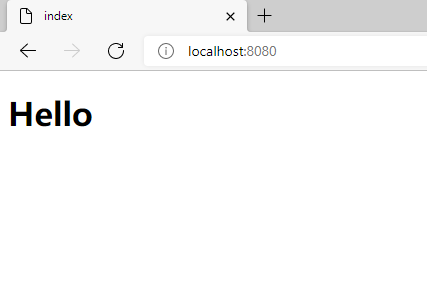
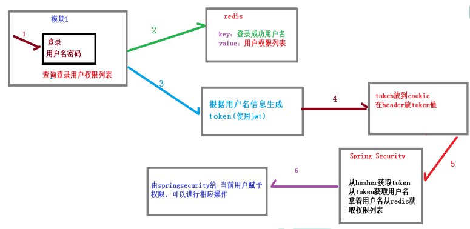
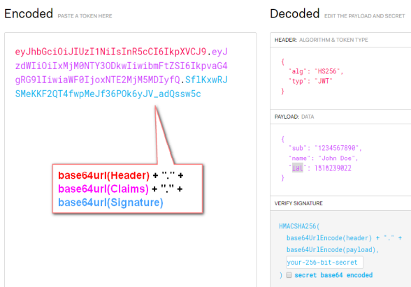

# 1、Spring Security

## 1、框架简介

Spring Security 基于 Spring 框架，提供了一套 Web 应用安全性的完整解决方案。

一般来说，Web 应用的安全性包括**用户认证（Authentication）**和**用户授权 （Authorization）**两个部分，这两点也是 Spring Security 重要核心功能：

- 用户认证：**验证某个用户是否为系统中的合法主体**，也就是说用户**能否访问该系统**。用户认证一般要求用户提供用户名和密码。系统通过校验用户名和密码来完成认证过程。**通俗点说就是系统认为用户是否能登录**。
- 用户授权：**验证某个用户是否有权限执行某个操作**。在一个系统中，**不同用户所具有的权限是不同的**。一般来说，系统会**为不同的用户分配不同的角色**，而**每个角色则对应一系列的权限**。**通俗点讲就是系统判断用户是否有权限去做某些事情**。

## 2、权限管理相关概念

**主体**：

- 英文单词：principal 

- 使用系统的用户或设备或从其他系统远程登录的用户等等。简单说就是**谁使用系统谁就是主体**。

**认证**：

- 英文单词：authentication 
- 权限管理系统确认一个主体的身份，允许主体进入系统。简单说就是**“主体”证明自己是谁**。 
- 笼统的认为就是以前所做的**登录操作**。

**授权**：

- 英文单词：authorization 
- 将操作系统的“权力”“授予”“主体”，这样主体就具备了操作系统中特定功 能的能力。 所以简单来说，**授权就是给用户分配权限**。

## 3、权限管理数据模型

权限表 -------多对多------- 角色表 -------多对多------- 用户表

权限--角色关系表、角色--用户关系表

# 2、入门案例

1、导入SpringWEB以及SpringSecurity依赖

2、编写一个配置类

```java
@Configuration
public class SecurityConfig extends WebSecurityConfigurerAdapter {
    @Override
    protected void configure(HttpSecurity http) throws Exception {
        http.formLogin() // 表单登录
            .and()
            .authorizeRequests() // 认证配置
            .anyRequest() // 任何请求
            .authenticated(); // 都需要身份验证
    }
}
```

**注意**：默认账号：user，默认密码由项目启动时自动生成。

3、添加一个控制器进行访问

```java
@Controller
public class TestController {

    @RequestMapping("/index")
    public ModelAndView indexH(){
        ModelAndView mav = new ModelAndView();
        mav.setViewName("index");
        return mav;
    }

}
```




# 3、常用注解

使用Spring Security注解之前要先在配置类上开启

~~~java
// 在主配置类上开启注解
@EnableGlobalMethodSecurity(securedEnabled=true)
~~~

## 1、@Secured

**判断是否具有角色**，另外需要注意的是这里匹配的字符串**需要添加前缀“ROLE_“**。 

在控制器的方法上添加注解

```java
// 测试注解：
@RequestMapping("testSecured")
@ResponseBody
@Secured({"ROLE_normal", "ROLE_admin"})
public String helloUser() {
    return "hello,user";
}
```

## 2、@PreAuthorize

**进入方法前的权限验证**， @PreAuthorize 可以将登录用户的 roles/permissions 参数传到方法中。

```java
@RequestMapping("/preAuthorize")
@ResponseBody
// @PreAuthorize("hasRole('ROLE_管理员')")
@PreAuthorize("hasAnyAuthority('menu:system')")
public String preAuthorize(){
    System.out.println("preAuthorize");
    return "preAuthorize";
}
```

## 3、@PostAuthorize

该注解使用并不多，在**方法执行后再进行权限验证**，适合验证带有返回值的权限。

```java
@RequestMapping("/testPostAuthorize")
@ResponseBody
@PostAuthorize("hasAnyAuthority('menu:system')")
public String preAuthorize(){
    System.out.println("test--PostAuthorize");
    return "PostAuthorize";
}
```

## 4、@PostFilter

**权限验证之后对数据进行过滤**。

表达式中的 **filterObject** 引用的是方法返回值 List 中的某一个元素

```java
@RequestMapping("getAll")
@PreAuthorize("hasRole('ROLE_管理员')")
@PostFilter("filterObject.username == 'admin1'")
@ResponseBody
public List<UserInfo> getAllUser(){
    ArrayList<UserInfo> list = new ArrayList<>();
    list.add(new UserInfo(1l,"admin1","6666"));
    list.add(new UserInfo(2l,"admin2","888"));
    return list;
}
```

## 5、@PreFilter

进入控制器之前对数据进行过滤

```java
@RequestMapping("getTestPreFilter")
@PreAuthorize("hasRole('ROLE_管理员')")
@PreFilter(value = "filterObject.id%2==0")
@ResponseBody
public List<UserInfo> getTestPreFilter(@RequestBody List<UserInfo> list){
    list.forEach(t-> { System.out.println(t.getId()+"\t"+t.getUsername()); });
    return list;
}
```

# 4、基本原理

## 1、本质

SpringSecurity 本质是一个使用责任链的**过滤器链**，在启动时打断点可以获取到过滤器链

```text
org.springframework.security.web.context.request.async.WebAsyncManagerIntegrationFilter
org.springframework.security.web.context.SecurityContextPersistenceFilter 
org.springframework.security.web.header.HeaderWriterFilter
org.springframework.security.web.csrf.CsrfFilter
org.springframework.security.web.authentication.logout.LogoutFilter 
org.springframework.security.web.authentication.UsernamePasswordAuthenticationFilter 
org.springframework.security.web.authentication.ui.DefaultLoginPageGeneratingFilter 
org.springframework.security.web.authentication.ui.DefaultLogoutPageGeneratingFilter
org.springframework.security.web.savedrequest.RequestCacheAwareFilter
org.springframework.security.web.servletapi.SecurityContextHolderAwareRequestFilter
org.springframework.security.web.authentication.AnonymousAuthenticationFilter 
org.springframework.security.web.session.SessionManagementFilter 
org.springframework.security.web.access.ExceptionTranslationFilter 
org.springframework.security.web.access.intercept.FilterSecurityInterceptor
```

## 2、主要的三个过滤器

### 1、FilterSecurityInterceptor

**方法级的权限过滤器**，位于过滤器链的**最底部**。

```java
public void invoke(FilterInvocation fi) throws IOException, ServletException {
    if ((fi.getRequest() != null)
        && (fi.getRequest().getAttribute(FILTER_APPLIED) != null)
        && observeOncePerRequest) {
        // filter already applied to this request and user wants us to observe
        // once-per-request handling, so don't re-do security checking
        fi.getChain().doFilter(fi.getRequest(), fi.getResponse());
    }
    else {
        // first time this request being called, so perform security checking
        if (fi.getRequest() != null && observeOncePerRequest) {
            fi.getRequest().setAttribute(FILTER_APPLIED, Boolean.TRUE);
        }

        // 查看之前的 filter 是否通过
        InterceptorStatusToken token = super.beforeInvocation(fi);

        try {
            // 真正的调用后台的服务
            fi.getChain().doFilter(fi.getRequest(), fi.getResponse());
        }
        finally {
            super.finallyInvocation(token);
        }

        super.afterInvocation(token, null);
    }
}
```

### 2、ExceptionTranslationFilter

**异常过滤器**，用来处理在认证授权过程中抛出的异常。

```java
public void doFilter(ServletRequest req, ServletResponse res, FilterChain chain)
    throws IOException, ServletException {
    HttpServletRequest request = (HttpServletRequest) req;
    HttpServletResponse response = (HttpServletResponse) res;

    try {
        chain.doFilter(request, response);

        logger.debug("Chain processed normally");
    }
    catch (IOException ex) {
        throw ex;
    }
    catch (Exception ex) {
        // Try to extract a SpringSecurityException from the stacktrace
        Throwable[] causeChain = throwableAnalyzer.determineCauseChain(ex);
        RuntimeException ase = (AuthenticationException) throwableAnalyzer
            .getFirstThrowableOfType(AuthenticationException.class, causeChain);

        if (ase == null) {
            ase = (AccessDeniedException) throwableAnalyzer.getFirstThrowableOfType(
                AccessDeniedException.class, causeChain);
        }

        if (ase != null) {
            if (response.isCommitted()) {
                throw new ServletException("Unable to handle the Spring Security Exception because the response is already committed.", ex);
            }
            handleSpringSecurityException(request, response, chain, ase);
        }
        else {
            // Rethrow ServletExceptions and RuntimeExceptions as-is
            if (ex instanceof ServletException) {
                throw (ServletException) ex;
            }
            else if (ex instanceof RuntimeException) {
                throw (RuntimeException) ex;
            }

            // Wrap other Exceptions. This shouldn't actually happen
            // as we've already covered all the possibilities for doFilter
            throw new RuntimeException(ex);
        }
    }
}
```

### 3、UsernamePasswordAuthenticationFilter

对**/login** 的 **POST** 请求做拦截，校验表单中用户名，密码。

```java
public Authentication attemptAuthentication(HttpServletRequest request,
                                            HttpServletResponse response) 
    										throws AuthenticationException {
    if (postOnly && !request.getMethod().equals("POST")) {
        throw new AuthenticationServiceException(
            "Authentication method not supported: " + request.getMethod());
    }

    String username = obtainUsername(request);
    String password = obtainPassword(request);

    if (username == null) {
        username = "";
    }

    if (password == null) {
        password = "";
    }

    username = username.trim();

    UsernamePasswordAuthenticationToken authRequest = 
        new UsernamePasswordAuthenticationToken(username, password);

    // Allow subclasses to set the "details" property
    setDetails(request, authRequest);

    return this.getAuthenticationManager().authenticate(authRequest);
}
```

# 5、重要的俩个接口

## 1、UserDetailsService接口 

### 1、接口简介

当Security什么也没有配置的时候，账号和密码是由 Spring Security 定义随机生成的。

而在实际项目中账号和密码都是从数据库中查询出来的，所以要通过**自定义逻辑控制认证逻辑**。

如果需要自定义逻辑时，需要**实现 UserDetailsService 接口**即可，接口定义如下：

```java
/**
* 加载用户特定数据的核心接口。
* 它在整个框架中用作用户DAO，并且是DaoAuthenticationProvider使用的策略。
* 该接口只需要一种只读方法，这简化了对新数据访问策略的支持。
*/
public interface UserDetailsService {
    /**
    * 根据用户名定位用户。 
    * 在实际实现中，搜索可能区分大小写，也可能不区分大小写，具体取决于实现实例的配置方式。 
    * 在这种情况下，返回的UserDetails对象的用户名。
    * 注意：可能与实际请求的用户名不同。
    * 参数：username – 标识需要其数据的用户的用户名。
    * 返回值：完全填充的用户记录（从不为null）
    * 异常：UsernameNotFoundException – 如果找不到用户或用户没有 //GrantedAuthority
    */
    UserDetails loadUserByUsername(String username) throws UsernameNotFoundException;
}
```

**注意**：

- 在项目启动时，会被注入进DaoAuthenticationProvider，在**InitializeUserDetailsBeanManagerConfigurer**类中进行，由getBeanOrNull(Class\<T> type)方法根据Bean的类型获取。

### 2、返回值UserDetails

**返回值 UserDetails**，这个类是系统默认的用户“**主体**”

```java
public interface UserDetails extends Serializable {
    // 表示获取登录用户所有权限
    Collection<? extends GrantedAuthority> getAuthorities();
    // 表示获取密码
    String getPassword();
    // 表示获取用户名
    String getUsername();
    // 表示判断账户是否过期
    boolean isAccountNonExpired();
    // 表示判断账户是否被锁定
    boolean isAccountNonLocked();
    // 表示凭证{密码}是否过期
    boolean isCredentialsNonExpired();
    // 表示当前用户是否可用
    boolean isEnabled();
}
```

### 3、实现类User


SpringSecurity内具有一个UserDetails的实现类**User**，之后只需要使用这个实体类即可。

简单的构造函数：

```java
// 调用更复杂的构造函数，并将所有布尔参数设置为true
public User(String username, 
            String password,
            Collection<? extends GrantedAuthority> authorities) {
    this(username, password, true, true, true, true, authorities);
}
```

方法参数 **username**：表示用户名，此值是客户端表单传递过来的数据，**默认情况下必须叫 username**，否则无法接收，密码同理。

## 2、PasswordEncoder接口

```java
public interface PasswordEncoder {
    // 用于把参数按照特定的解析规则进行解析
    String encode(CharSequence rawPassword);
    
    // 用于验证从存储中获取的已编码密码与编码后提交的原始密码是否匹配。
    // 如果密码匹配，则返回 true，如果不匹配，则返回 false。
    // 第一个参数：需要被解析的密码。		 
    // 第二个参数：存储的密码。
    boolean matches(CharSequence rawPassword, String encodedPassword);
    
    // 用于如果解析的密码能够再次进行解析且达到更安全的结果则返回 true，否则返回false。
    // 默认返回 false。
    default boolean upgradeEncoding(String encodedPassword) {
        return false;
    }
}
```


PasswordEncoder接口实现类非常多，**BCryptPasswordEncoder** 是 Spring Security 官方**推荐**的密码解析器，大多使用这个解析器。

BCryptPasswordEncoder 是对 **bcrypt** 强散列方法的具体实现，是基于 **Hash** 算法实现的单向加密，可以通过 **strength** 控制加密强度，默认 **10**.

演示：

```java
@Test
public void test01(){
    // 创建密码解析器
    BCryptPasswordEncoder bCryptPasswordEncoder = new BCryptPasswordEncoder();
    // 对密码进行加密
    String xxxx = bCryptPasswordEncoder.encode("xxxx");
    // 打印加密之后的数据
    System.out.println("加密之后数据：\t"+xxxx);
    // 判断原字符加密后和加密之前是否匹配
    boolean result = bCryptPasswordEncoder.matches("xxxx", xxxx);
    // 打印比较结果
    System.out.println("比较结果：\t"+result);
}
```


# 6、WEB案例

## 1、固定账号密码

1、编写配置文件

```properties
spring.security.user.name=xxxx
spring.security.user.password=xxxx
```

2、编写配置类

```java
@Configuration
public class SecurityConfig {
    // 注入 PasswordEncoder 类到 spring 容器中
    @Bean
    public PasswordEncoder passwordEncoder(){
        return new BCryptPasswordEncoder();
    }
}
```

3、实现UserDetailsService接口

```java
// 将用户名密码验证写死，实际上这些东西应该从数据库中取出对比
@Service
public class LoginService implements UserDetailsService {
    @Override
    public UserDetails loadUserByUsername(String username) throws 
        UsernameNotFoundException {
        // 判断用户名是否存在
        if (!"admin".equals(username)){
            throw new UsernameNotFoundException("用户名不存在！");
        }
        // 从数据库中获取的密码 atguigu 的密文
        String pwd = "$2a$10$2R/M6iU3mCZt3ByG7kwYTeeW0w7/UqdeXrb27zkBIizBvAven0/na";
        // 第三个参数表示权限
        return new User(username, pwd, AuthorityUtils.commaSeparatedStringToAuthorityList("admin,ROLE_p1"));
        // 1. 放入的是角色：需要加前缀ROLE_，而在controller使用时不需要加ROLE_前缀，详见注解
    	// 2. 放入的是权限：不能加ROLE_前缀，hasAuthority与放入的权限名称对应即可，详见注解
    }
}
```

## 2、实现数据库认证用户

1、创建数据库表

创建权限、角色、用户、权限---角色、角色---用户。五张表。

2、编写用户实体类

```java
@Data
public class Users {
    private Integer id;
    private String username;
    private String password;
}
```

4、编写配置文件

与之前不同，没有设置spring.security.user.name等。

```properties
#mysql 数据库连接
spring.datasource.driver-class-name=com.mysql.cj.jdbc.Driver 
spring.datasource.url=数据库地址
spring.datasource.username=账号
spring.datasource.password=密码
```

5、编写配置类

主要做四件事：

- 注册密码编码类
- 放行登录页面以及静态资源
- 配置认证权限，以及设置未授权的请求跳转登录页
- 自定义403页面

~~~java
@Configuration
public class SecurityConfig extends WebSecurityConfigurerAdapter {
    
    // 注入 PasswordEncoder 类到 spring 容器中
    @Bean
    public PasswordEncoder passwordEncoder(){
        return new BCryptPasswordEncoder();
    }

    @Override
    public void configure(WebSecurity web) throws Exception {
        // 解决静态资源被拦截的问题
        web.ignoring().antMatchers("/css/**", "/vendors/**");
    }

    @Override
    protected void configure(HttpSecurity http) throws Exception {
        // 配置认证
        http.formLogin()
            .loginPage("/index") // 配置哪个url为登录页面 .loginPage("/testpage.html")，写法有两种，详见问题
            .loginProcessingUrl("/login") // 设置哪个是提交登录的url。
            .successForwardUrl("/success") // 登录成功之后跳转到哪个url
            .failureForwardUrl("/fail"); // 登录失败之后跳转到哪个url
        http.authorizeRequests()
            .antMatchers("/layui/**","/index") // 表示配置请求路径
            .permitAll() // 指定 URL 无需保护。
            .anyRequest() // 其他请求
            .authenticated(); // 需要认证
        http.csrf().disable(); // 关闭 csrf
        http.exceptionHandling().accessDeniedPage("/unauth"); // 403页面
    }

    // 简单版
    // @Override
    // protected void configure(HttpSecurity http) throws Exception {
    //     http.authorizeRequests()
    //             .antMatchers("/layui/**","/index") //表示配置请求路径
    //             .permitAll() // 指定 URL 无需保护。
    //             .anyRequest() // 其他请求
    //             .authenticated(); //需要认证
    // }
}
~~~

**注意**：

- anyRequest不能放在antMatchers之后，且不能写俩次。

- 页面的提交方式必须为post，且用户名和密码的字段必须为username和password

5、实现UserDetailsService接口

```java
@Service("userDetailsService")
public class MyUserDetailsService implements UserDetailsService {
    @Autowired
    private UsersMapper usersMapper;
    @Override
    public UserDetails loadUserByUsername(String username) throws UsernameNotFoundException {
        // mybatisplus查询
        QueryWrapper<Users> wrapper = new QueryWrapper();
        wrapper.eq("username", username);
        Users users = usersMapper.selectOne(wrapper);
        if(users == null) {
            throw new UsernameNotFoundException("用户名不存在！");
        }
        System.out.println(users);
        // 添加角色与权限
        List<GrantedAuthority> auths = AuthorityUtils.commaSeparatedStringToAuthorityList("role");
        return new User(users.getUsername(), users.getPassword(), auths);
    }
}
```

## 3、基于数据库的记住我

1、创建记住我的数据表

```sql
CREATE TABLE `persistent_logins` (
    `username` varchar(64) NOT NULL,
    `series` varchar(64) NOT NULL,
    `token` varchar(64) NOT NULL,
    `last_used` timestamp NOT NULL DEFAULT CURRENT_TIMESTAMP ON UPDATE 
    CURRENT_TIMESTAMP,
    PRIMARY KEY (`series`)
) ENGINE=InnoDB DEFAULT CHARSET=utf8;
```

2、编写配置类

```java
@Configuration
public class BrowserSecurityConfig {
    @Autowired
    private DataSource dataSource;
    
    @Bean
    public PersistentTokenRepository persistentTokenRepository(){
        JdbcTokenRepositoryImpl jdbcTokenRepository = new JdbcTokenRepositoryImpl();
        // 赋值数据源
        jdbcTokenRepository.setDataSource(dataSource);
        // 自动创建表,第一次执行会创建，以后要执行就要删除掉！
        jdbcTokenRepository.setCreateTableOnStartup(true);
        return jdbcTokenRepository;
    }
}
```

3、修改安全配置类

主要任务：

- 开启记住我的功能
- 设置过期时间，默认 2 周时间，可以通过设置状态有效时间，即使项目重新启动下次也可以正常登录。
- 开启用户注销功能

```java
@Autowired
private UsersServiceImpl usersService;
@Autowired
private PersistentTokenRepository tokenRepository;

@Override
protected void configure(HttpSecurity http) throws Exception {
    // 开启记住我功能
    http.rememberMe()
        .tokenRepository(tokenRepository)
        .userDetailsService(usersService)
        // 设置过期时间
        .tokenValiditySeconds(10) // 单位是秒
        .tokenRepository(tokenRepository)
        .userDetailsService(usersService)
   	// 开启用户登出
    http.logout()
        .logoutUrl("/logout")
        .logoutSuccessUrl("/index")
        .permitAll();
}

```

4、修改页面

- 页面添加记住我复选框

```html
<input type="checkbox"name="remember-me" title="记住密码"/><br/>
```

**注意**：name 属性值必须位 **remember-me** 不能改为其他值

- 页面添加登出url


```html
<a href="/logout">退出</a>
```


# 7、访问控制

## 1、hasAuthority()方法

如果当前的主体具有指定的权限，则返回 true，否则返回 false

```java
 http.authorizeRequests()			
     .antMatchers("/layui/**","/index").hasAuthority("admin") // 表示主体需要带有admin权限
```

## 2、hasAnyAuthority()方法

如果当前的主体有任何提供的权限（给定的作为一个逗号分隔的字符串列表）的话，返回 true。

## 3、hasRole()方法

如果用户具备给定角色就允许访问，否则出现 403，如果当前主体具有指定的角色，则返回 true。

```java
private static String hasRole(String role) {
    Assert.notNull(role, "role cannot be null");
    if (role.startsWith("ROLE_")) {
        throw new IllegalArgumentException(
            "role should not start with 'ROLE_' since it is automatically inserted. Got '"
            + role + "'");
    }
    return "hasRole('ROLE_" + role + "')";
}
```

**注意**：给主体**添加角色**时，得添加前缀”**ROLE_**“，而在设置hasRole()方法时，不需要添加该前缀，方法会自动添加。

## 4、hasAnyRole()方法

表示用户具备任何一个角色都可以访问。 

给用户添加角色：

```java
List<GrantedAuthority> auths = AuthorityUtils
    .commaSeparatedStringToAuthorityList("role，admin，ROLE_admin,ROLE_role");

return new User(users.getUsername(), new BCryptPasswordEncoder().encode(users.getPassword()), auths);
```

设置角色：

```java
 http.authorizeRequests()			
     .antMatchers("/layui/**","/index").hasAnyRole("admin"，"role”);
```

# 8、CSRF

## 1、基本概念

**跨站请求伪造**（英语：Cross-site request forgery），也被称为 **one-click  attack** 或者 **session riding**，通常缩写为 CSRF 或者 XSRF， 是一种挟制用户在当前已登录的 Web 应用程序上执行非本意的操作的攻击方法。

跟跨网站脚本（XSS）相比，XSS 利用的是用户对指定网站的信任，CSRF 利用的是网站对用户网页浏览器的信任。

跨站请求攻击是攻击者通过一些技术手段欺骗用户的浏览器去访问一个自己曾经认证过的网站并运行一些操作（如发邮件，发消息，甚至财产操作如转账和购买商品），由于浏览器曾经认证过，所以被访问的网站会认为是真正的用户操作而去运行， 这利用了 web 中用户身份验证的一个漏洞：**简单的身份验证只能保证请求发自某个用户的浏览器，却不能保证请求本身是用户自愿发出的**。

从 Spring Security 4.0 开始，**默认情况下会启用 CSRF 保护**，以防止 CSRF 攻击应用程序，Spring Security CSRF 会针对 **PATCH**，**POST**，**PUT** 和 **DELETE** 方法进行防护。

## 2、案例

在不关闭Security的CSRF情况下，在登陆页面添加一个隐藏域。

```html
<input  type="hidden"th:if="${_csrf}!=null"th:value="${_csrf.token}"name="_csrf"/>
```

**注意**：如果不关闭CSRF，则必须在form表单中添加这个，否则请求会被拒绝。

## 3、实现 CSRF 的原理

1、生成 **csrfToken** 保存到 **HttpSession** 或者 **Cookie** 中。


```java
public interface CsrfToken extends Serializable {
    String getHeaderName();

    String getParameterName();

    String getToken();
}
```

**SaveOnAccessCsrfToken** 类内有个 **CsrfTokenRepository** 接口。

```java
private static final class SaveOnAccessCsrfToken implements CsrfToken {
    private transient CsrfTokenRepository tokenRepository;
    private transient HttpServletRequest request;
    private transient HttpServletResponse response;
    private final CsrfToken delegate;
}
```


CsrfTokenRepository 接口实现类主要：**HttpSessionCsrfTokenRepository**，**CookieCsrfTokenRepository**。

2、请求到来时，从请求中提取 **csrfToken**，和保存的 **csrfToken** 做比较，进而判断当前请求是否合法，主要通过 **CsrfFilter** 过滤器来完成。

```java
static final String DEFAULT_CSRF_PARAMETER_NAME = "_csrf";
```

```java
@Override
public CsrfToken generateToken(HttpServletRequest request) {
    return new DefaultCsrfToken(this.headerName, this.parameterName,
                                createNewToken());
}
```

```java
private String createNewToken() {
    return UUID.randomUUID().toString();
}
```

CsrFilter部份源码

```java
private final CsrfTokenRepository tokenRepository;
```

```java
@Override
protected void doFilterInternal(HttpServletRequest request,
                                HttpServletResponse response, FilterChain filterChain)
    throws ServletException, IOException {
    request.setAttribute(HttpServletResponse.class.getName(), response);
	//CsrfToken有关内容
    CsrfToken csrfToken = this.tokenRepository.loadToken(request);
    final boolean missingToken = csrfToken == null;
    if (missingToken) {
        csrfToken = this.tokenRepository.generateToken(request);
        this.tokenRepository.saveToken(csrfToken, request, response);
    }
    request.setAttribute(CsrfToken.class.getName(), csrfToken);
    //此处key就是_csrf value就是token
    request.setAttribute(csrfToken.getParameterName(), csrfToken);
	//此处验证token是否正确
    if (!this.requireCsrfProtectionMatcher.matches(request)) {
        filterChain.doFilter(request, response);
        return;
    }

    String actualToken = request.getHeader(csrfToken.getHeaderName());
    if (actualToken == null) {
        actualToken = request.getParameter(csrfToken.getParameterName());
    }
    if (!csrfToken.getToken().equals(actualToken)) {
        if (this.logger.isDebugEnabled()) {
            this.logger.debug("Invalid CSRF token found for "
                              + UrlUtils.buildFullRequestUrl(request));
        }
        if (missingToken) {
            this.accessDeniedHandler.handle(request, response,
                                            new MissingCsrfTokenException(actualToken));
        }
        else {
            this.accessDeniedHandler.handle(request, response,
                                            new InvalidCsrfTokenException(csrfToken, actualToken));
        }
        return;
    }

    filterChain.doFilter(request, response);
}
```

# 9、微服务方案

## 1、认证授权过程分析

- 如果是基于 Session，那么 Spring-security 会对 cookie 里的 sessionid 进行解析，找到服务器存储的 session 信息，然后判断当前用户是否符合请求的要求。


- 如果是 token，则是解析出 token，然后将当前请求加入到 Spring-security 管理的权限信息中去。



用户根据用户名密码认证成功，然后获取当前用户角色的一系列权限值，并以用户名为 key，权限列表为 value 的形式存入 redis 缓存中，根据用户名相关信息生成 token 返回，浏览器将 token 记录到 cookie 中，每次调用 api 接口都默认将 token 携带到 header 请求头中，Spring-security 解析 header 头获取 token 信息，解析 token 获取当前用户名，根据用户名就可以从 redis 中获取权限列表，这样 Spring-security 就能够判断当前请求是否有权限访问。


## 2、JWT

### 1、访问令牌的类型

1. **By reference token**

   - 随机生成的字符串标识符，无法简单猜测授权服务器如何颁发和存储。

   - 资源服务器必须通过后端渠道发送回OAuth2授权服务器的令牌检查端点，才能校验令牌是否有效，并获取claims/scopes等额外信息。

2. **By value token**

   - 授权服务器颁发的令牌，包含关于用户或者客户的元数据和声明(claims)。

   - 通过检查签名，期望的颁发者(issuer)，期望的接收人aud(audience)，或者scope，资源服务器可以在本地校验令牌通常实现为签名的JSON Web Tokens(JWT)


### 2、JWT 组成



该对象为一个很长的字符串，字符之间通过"**.**"分隔符分为三个子串。

每一个子串表示了一个功能块，总共有以下三个部分：**JWT 头**、**有效载荷**和**签名**。

#### 1、JWT 头

JWT 头部分是一个描述 JWT 元数据的 JSON 对象，通常如下所示。

```json
{
    "alg": "HS256",
    "typ": "JWT"
}
```

- **alg** 属性表示签名使用的算法，默认为 HMAC SHA256（写为 HS256）
- **typ** 属性表示令牌的类型，JWT 令牌统一写为 JWT。

使用 Base64 URL 算法将上述 JSON 对象转换为字符串保存。

#### 2、有效载荷

有效载荷部分，是 JWT 的主体内容部分，也是一个 JSON 对象，包含需要传递的数据。 JWT 指定七个默认字段供选择。

- iss：发行人 
- exp：到期时间 
- sub：主题 
- aud：用户 
- nbf：在此之前不可用 
- iat：发布时间 
- jti：JWT ID 用于标识该 JWT 

除以上默认字段外，我们还可以自定义私有字段，如下例：

```json
{
    "sub": "1234567890",
    "name": "Helen",
    "admin": true
}
```

JSON 对象也使用 Base64 URL 算法转换为字符串保存。

**注意**：默认情况下 JWT 是未加密的，任何人都可以解读其内容，因此不要构建隐私信息 字段，存放保密信息，以防止信息泄露。

#### 3、签名哈希

签名哈希部分是对上面两部分数据签名，通过指定的算法生成哈希，以确保数据不会被篡改。

首先，需要指定一个密码（secret）。该密码仅仅为保存在服务器中，并且不能向用户公开。然后，使用标头中指定的签名算法（默认情况下为 HMAC SHA256）根据以下公式生成签名。

```java
HMACSHA256(base64UrlEncode(header) + "." + base64UrlEncode(claims), secret)
```

在计算出签名哈希后，JWT 头，有效载荷和签名哈希的三个部分组合成一个字符串，每个 部分用"."分隔，就构成整个 JWT 对象。

## 3、具体代码实现


### 1、编写核心配置类

```java
//标注配置类
@Configuration
//启用Web安全的注解，在SpringBoot项目中无需使用
@EnableWebSecurity
//启用注解
@EnableGlobalMethodSecurity(prePostEnabled = true)
public class TokenWebSecurityConfig extends WebSecurityConfigurerAdapter {
    
    //自定义查询数据库用户名密码和权限信息
    //自定义实现UserDetailsServer接口，重写loadUserByUsername方法，从数据库获取用户名，密码，角色
    private UserDetailsService userDetailsService;
    //token 管理工具类（生成 token）
    private TokenManager tokenManager;
    //密码管理工具类
    private DefaultPasswordEncoder defaultPasswordEncoder;
    //redis 操作工具类
    private RedisTemplate redisTemplate;
    
    //在唯一有参构造器上自动注入
    @Autowired
    public TokenWebSecurityConfig(UserDetailsService userDetailsService, 
                                  DefaultPasswordEncoder defaultPasswordEncoder,
                                  TokenManager tokenManager, RedisTemplate 
                                  redisTemplate) {
        
        this.userDetailsService = userDetailsService;
        this.defaultPasswordEncoder = defaultPasswordEncoder;
        this.tokenManager = tokenManager;
        this.redisTemplate = redisTemplate;
        
    }
    
    /**
 	* 配置设置
 	*三个configure的配置
 	*/
    
    
    //设置退出的地址、token、redis 操作地址
    @Override
    protected void configure(HttpSecurity http) throws Exception {
        http.exceptionHandling()
            .authenticationEntryPoint(new UnauthorizedEntryPoint())
            .and()
            .csrf().disable()
            .authorizeRequests()
            .anyRequest()
            .authenticated()
            .and()
            .logout()
            .logoutUrl("/admin/acl/index/logout")
            .addLogoutHandler(new TokenLogoutHandler(tokenManager,redisTemplate))
            .and()
            .addFilter(new TokenLoginFilter(authenticationManager(), tokenManager, redisTemplate))
            .addFilter(new TokenAuthenticationFilter(authenticationManager(), tokenManager, redisTemplate))
            .httpBasic();
    }
    
    /**
 	* 密码处理
 	*/
    @Override
    public void configure(AuthenticationManagerBuilder auth) throws Exception {
        auth.userDetailsService(userDetailsService)
            .passwordEncoder(defaultPasswordEncoder);
    }
    
    /**
 	* 配置哪些请求不拦截
 	*/
    @Override
    public void configure(WebSecurity web) throws Exception {
        web.ignoring()
            .antMatchers("/api/**", "/swagger-ui.html/**");
    }
}
```

### 2、创建认证授权相关的工具类

#### **DefaultPasswordEncoder**

密码处理的方法

```java
@Component
public class DefaultPasswordEncoder implements PasswordEncoder {
    public DefaultPasswordEncoder() {
        this(-1);
    }
    /**
 	* @param strength 
 	* the log rounds to use, between 4 and 31
 	*/
    public DefaultPasswordEncoder(int strength) {
    }
    
    public String encode(CharSequence rawPassword) {
        return MD5.encrypt(rawPassword.toString());
    }
    
    public boolean matches(CharSequence rawPassword, String encodedPassword) {
        return encodedPassword.equals(MD5.encrypt(rawPassword.toString()));
    }
}
```

#### **TokenManager**

token 操作的工具类 

```java
@Component
public class TokenManager {
    
    private long tokenExpiration = 24*60*60*1000;
    private String tokenSignKey = "123456";
    
    public String createToken(String username) {
        String token = Jwts.builder()
            			    .setSubject(username)
            				.setExpiration(new Date(System.currentTimeMillis() + tokenExpiration))
            				.signWith(SignatureAlgorithm.HS512, tokenSignKey)
            				.compressWith(CompressionCodecs.GZIP)
            				.compact();
        return token;
    }
    
    public String getUserFromToken(String token) {
        String user = Jwts.parser()
            			  .setSigningKey(tokenSignKey)
            			  .parseClaimsJws(token)
           	 			  .getBody()
            			  .getSubject();
        return user;
    }
    
    public void removeToken(String token) {
        //jwttoken 无需删除，客户端扔掉即可。
    }
}
```

#### **TokenLogoutHandler**

退出实现

```java
public class TokenLogoutHandler implements LogoutHandler {
    private TokenManager tokenManager;
    private RedisTemplate redisTemplate;
    
    public TokenLogoutHandler(TokenManager tokenManager, RedisTemplate redisTemplate) {
        this.tokenManager = tokenManager;
        this.redisTemplate = redisTemplate;
    }
    
    @Override
    public void logout(HttpServletRequest request, HttpServletResponse response, Authentication authentication) {
        String token = request.getHeader("token");
        if (token != null) {
            tokenManager.removeToken(token);
            //清空当前用户缓存中的权限数据
            String userName = tokenManager.getUserFromToken(token);
            redisTemplate.delete(userName);
        }
        ResponseUtil.out(response, R.ok());
    }
}
```

#### **UnauthorizedEntryPoint**

未授权统一处理

```java
public class UnauthorizedEntryPoint implements AuthenticationEntryPoint {
    @Override
    public void commence(HttpServletRequest request, 
                         HttpServletResponse  response, 
                         AuthenticationException authException) 
        throws IOException, ServletException {
        
        ResponseUtil.out(response, R.error());
        
    }
}
```

### 3、创建认证授权实体类

#### **SecutityUser**

```java
@Data
@Slf4j
public class SecurityUser implements UserDetails {
    //当前登录用户
    private transient User currentUserInfo;
    //当前权限
    private List<String> permissionValueList;
    
    public SecurityUser() {
    }
    public SecurityUser(User user) {
        if (user != null) {
            this.currentUserInfo = user;
        }
    }
    
    @Override
    public Collection<? extends GrantedAuthority> getAuthorities() {
        Collection<GrantedAuthority> authorities = new ArrayList<>();
        for(String permissionValue : permissionValueList) {
            if(StringUtils.isEmpty(permissionValue)) {
                  continue;
            }
            SimpleGrantedAuthority authority = new SimpleGrantedAuthority(permissionValue);
            authorities.add(authority);
        }
        return authorities;
    }
    
    @Override
    public String getPassword() {
        return currentUserInfo.getPassword();
    }
    @Override
    public String getUsername() {
        return currentUserInfo.getUsername();
    }
    @Override
    public boolean isAccountNonExpired() {
        return true;
    }
    @Override
    public boolean isAccountNonLocked() {
        return true;
    }
    @Override
    public boolean isCredentialsNonExpired() {
        return true;
    }
    @Override
    public boolean isEnabled() {
        return true;
    }
    
}
```

#### **User**

```java
@Data
@ApiModel(description = "用户实体类")
public class User implements Serializable {
    private String username;
    private String password;
    private String nickName;
    private String salt;
    private String token;
}
```

### 4、创建认证和授权的 filter

#### **TokenLoginFilter**

认证的 filter 

```java
public class TokenLoginFilter extends UsernamePasswordAuthenticationFilter {
    
    private AuthenticationManager authenticationManager;
    private TokenManager tokenManager;
    private RedisTemplate redisTemplate;
    
    public TokenLoginFilter(AuthenticationManager authenticationManager, 
                            TokenManager tokenManager, 
                            RedisTemplate redisTemplate) {
        
        this.authenticationManager = authenticationManager;
        this.tokenManager = tokenManager;
        this.redisTemplate = redisTemplate;
        this.setPostOnly(false);
        this.setRequiresAuthenticationRequestMatcher(new AntPathRequestMatcher("/admin/acl/login","POST"));
    }
    
    @Override
    public Authentication attemptAuthentication(HttpServletRequest req, HttpServletResponse res)
        throws AuthenticationException {
        try {
            //将表单中的账户、密码存入User类中
            User user = new ObjectMapper().readValue(req.getInputStream(), User.class);
            return authenticationManager.authenticate(new UsernamePasswordAuthenticationToken(user.getUsername(),
                                                                                              user.getPassword(), 
                                                                                              new ArrayList<>()));
        } catch (IOException e) {
            throw new RuntimeException(e);
        }
    }
    
    /**
 	* 登录成功
 	*/
    @Override
    protected void successfulAuthentication(HttpServletRequest req, 
                                            HttpServletResponse res, 
                                            FilterChain chain,
                                            Authentication auth) throws IOException, ServletException {
        
        //获取安全主体
        SecurityUser user = (SecurityUser) auth.getPrincipal();
        //使用token管理类生成token
        String token = tokenManager.createToken(user.getCurrentUserInfo().getUsername());
        //将token存入redis
        redisTemplate.opsForValue().set(user.getCurrentUserInfo().getUsername(), 
                                        user.getPermissionValueList());
        ResponseUtil.out(res, R.ok().data("token", token));
    }
    
    /**
 	* 登录失败
 	*/
    @Override
    protected void unsuccessfulAuthentication(HttpServletRequest request, 
                                              HttpServletResponse response,
                                              AuthenticationException e) throws 
        IOException, ServletException {
        ResponseUtil.out(response, R.error());
    }
}
```

#### TokenAuthenticationFilter

授权 filter 

```java
public class TokenAuthenticationFilter extends BasicAuthenticationFilter {
    private TokenManager tokenManager;
    private RedisTemplate redisTemplate;
    
    public TokenAuthenticationFilter(AuthenticationManager authManager, 
                                     TokenManager tokenManager,
                                     RedisTemplate redisTemplate) {
        super(authManager);
        this.tokenManager = tokenManager;
        this.redisTemplate = redisTemplate;
    }
    
    @Override
    protected void doFilterInternal(HttpServletRequest req,
                                    HttpServletResponse res, 
                                    FilterChain chain) throws IOException, ServletException {
        
        logger.info("================="+req.getRequestURI());
        if(req.getRequestURI().indexOf("admin") == -1) {
            chain.doFilter(req, res);
            return;
        }
        UsernamePasswordAuthenticationToken authentication = null;
        try {
            authentication = getAuthentication(req);
        } catch (Exception e) {
            ResponseUtil.out(res, R.error());
        }
        if (authentication != null) {
            SecurityContextHolder.getContext().setAuthentication(authentication);
        } else {
            ResponseUtil.out(res, R.error());
        }
        chain.doFilter(req, res);
    }
    
    private UsernamePasswordAuthenticationToken getAuthentication(HttpServletRequest request) {
        // token 置于 header 里
        String token = request.getHeader("token");
        if (token != null && "".equals(token.trim())) {
            String userName = tokenManager.getUserFromToken(token);
            List<String> permissionValueList = (List<String>) redisTemplate.opsForValue().get(userName);
            Collection<GrantedAuthority> authorities = new ArrayList<>();
            for(String permissionValue : permissionValueList) {
                if(StringUtils.isEmpty(permissionValue)) {
                    continue;
                }
                SimpleGrantedAuthority authority = new SimpleGrantedAuthority(permissionValue);
                authorities.add(authority);
            }
            if (!StringUtils.isEmpty(userName)) {
                return new UsernamePasswordAuthenticationToken(userName, token, authorities);
            }
            return null;
        }
        return null;
    }
}
```


# 扩展

# 问题

## 1、自定义UsernamePasswordAuthenticationFilter

- 可以通过实现**AuthenticationSuccessHandler**接口的方法
- 或者继承UsernamePasswordAuthenticationFilter默认的successHandler------>**SavedRequestAwareAuthenticationSuccessHandler**，重写其方法

若使用第一种，springsecurity不会自动跳转登陆前的页面

## 2、JWT过期后获取Claims报错

获取**Claims**是通过JWT的**parseClaimsJws()**方法，而jwt默认实现是**DefaultJwtParser**，该类调用自身的**parse()**方法，然后如果获取到的Claims不为空，会先判断该token是否过期，如果过期抛出**ExpiredJwtException**异常，导致获取Claims失败。

解决办法：通过源码发现抛出该异常之前已经获取了Claims，且会放入该异常中，只要在逻辑中捕获异常获取Claims即可

```java
throw new ExpiredJwtException(header, claims, msg);
```

## 3、为什么账号密码必须为username和password

**原因**：

在执行登陆时会经过一个过滤器**UsernamePasswordAuthenticationFilter**，其有以下两个属性，在响应时根据这两个属性获取值。

```java
public static final String SPRING_SECURITY_FORM_USERNAME_KEY = "username";
public static final String SPRING_SECURITY_FORM_PASSWORD_KEY = "password";
```

如果修改配置可以调用 **usernameParameter()**和 **passwordParameter()**方法。

```java
 http.usernameParameter("xxxxx") // 指定获取的登陆用户的字段名
     .passwordParameter("xxxx") // 指定获取的登陆密码的字段名
```

## 4、loginPage的两种写法

如果里面写URL，则需要一个对应的Controller去跳转，该Controller需要返回一个页面，可以重定到一个页面，也可以跳转。

如果写的是一个文件的URL，那么需要能够被访问到。


~~~html
V2.0，2022-4-17
~~~