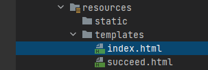
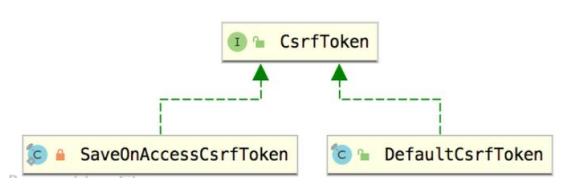
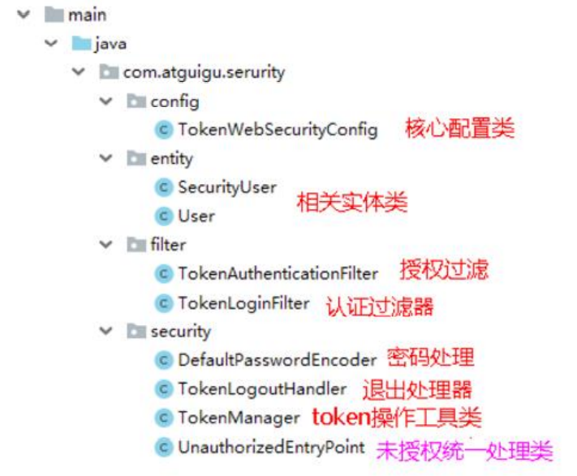
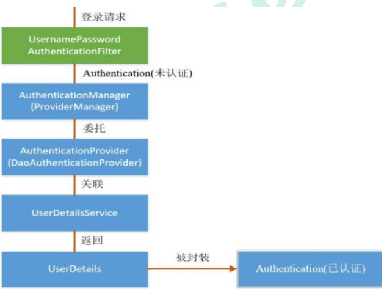
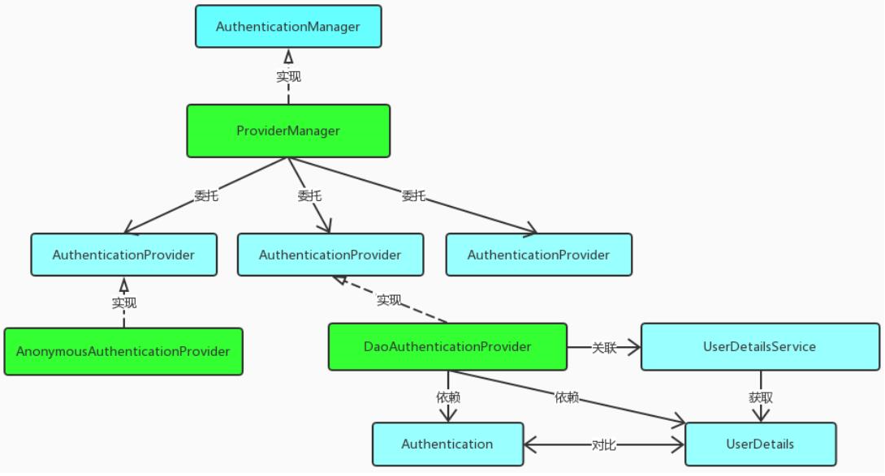
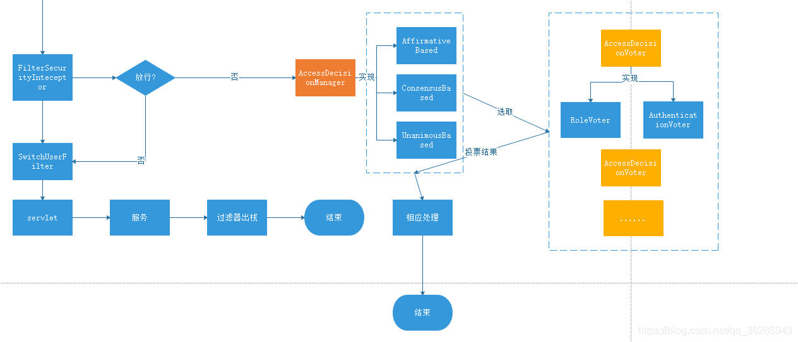

# 1、Spring Security

## 1、框架简介

Spring Security 基于 Spring 框架，提供了一套 Web 应用安全性的完整解决方案。

一般来说，Web 应用的安全性包括**用户认证（Authentication）**和**用户授权 （Authorization）**两个部分，这两点也是 Spring Security 重要核心功能：

- 用户认证：**验证某个用户是否为系统中的合法主体**，也就是说用户**能否访问该系统**。用户认证一般要求用户提供用户名和密码。系统通过校验用户名和密码来完成认证过程。**通俗点说就是系统认为用户是否能登录**。
- 用户授权：**验证某个用户是否有权限执行某个操作**。在一个系统中，**不同用户所具有的权限是不同的**。一般来说，系统会**为不同的用户分配不同的角色**，而**每个角色则对应一系列的权限**。**通俗点讲就是系统判断用户是否有权限去做某些事情**。

## 2、权限管理相关概念

**主体**：

- 英文单词：principal 

- 使用系统的用户或设备或从其他系统远程登录的用户等等。简单说就是**谁使用系统谁就是主体**。

**认证**：

- 英文单词：authentication 
- 权限管理系统确认一个主体的身份，允许主体进入系统。简单说就是**“主体”证明自己是谁**。 
- 笼统的认为就是以前所做的**登录操作**。

**授权**：

- 英文单词：authorization 
- 将操作系统的“权力”“授予”“主体”，这样主体就具备了操作系统中特定功 能的能力。 所以简单来说，**授权就是给用户分配权限**。

## 3、权限管理数据模型

权限表 -------多对多------- 角色表 -------多对多------- 用户表

权限--角色关系表、角色--用户关系表

# 2、入门案例

1、导入SpringWEB以及SpringSecurity依赖

2、编写一个配置类

```java
@Configuration
public class SecurityConfig extends WebSecurityConfigurerAdapter {
    @Override
    protected void configure(HttpSecurity http) throws Exception {
        http.formLogin() // 表单登录
            .and()
            .authorizeRequests() // 认证配置
            .anyRequest() // 任何请求
            .authenticated(); // 都需要身份验证
    }
}
```

**注意**：默认账号：user，默认密码由项目启动时自动生成。

3、添加一个控制器进行访问

```java
@Controller
public class TestController {

    @RequestMapping("/index")
    public ModelAndView indexH(){
        ModelAndView mav = new ModelAndView();
        mav.setViewName("index");
        return mav;
    }

}
```




# 3、常用注解

使用Spring Security注解之前要先在配置类上开启

~~~java
// 在主配置类上开启注解
@EnableGlobalMethodSecurity(securedEnabled=true)
~~~

## 1、@Secured

**判断是否具有角色**，另外需要注意的是这里匹配的字符串**需要添加前缀“ROLE_“**。 

在控制器的方法上添加注解

```java
// 测试注解：
@RequestMapping("testSecured")
@ResponseBody
@Secured({"ROLE_normal", "ROLE_admin"})
public String helloUser() {
    return "hello,user";
}
```

## 2、@PreAuthorize

**进入方法前的权限验证**， @PreAuthorize 可以将登录用户的 roles/permissions 参数传到方法中。

```java
@RequestMapping("/preAuthorize")
@ResponseBody
// @PreAuthorize("hasRole('ROLE_管理员')")
@PreAuthorize("hasAnyAuthority('menu:system')")
public String preAuthorize(){
    System.out.println("preAuthorize");
    return "preAuthorize";
}
```

## 3、@PostAuthorize

该注解使用并不多，在**方法执行后再进行权限验证**，适合验证带有返回值的权限。

```java
@RequestMapping("/testPostAuthorize")
@ResponseBody
@PostAuthorize("hasAnyAuthority('menu:system')")
public String preAuthorize(){
    System.out.println("test--PostAuthorize");
    return "PostAuthorize";
}
```

## 4、@PostFilter

**权限验证之后对数据进行过滤**。

表达式中的 **filterObject** 引用的是方法返回值 List 中的某一个元素

```java
@RequestMapping("getAll")
@PreAuthorize("hasRole('ROLE_管理员')")
@PostFilter("filterObject.username == 'admin1'")
@ResponseBody
public List<UserInfo> getAllUser(){
    ArrayList<UserInfo> list = new ArrayList<>();
    list.add(new UserInfo(1l,"admin1","6666"));
    list.add(new UserInfo(2l,"admin2","888"));
    return list;
}
```

## 5、@PreFilter

进入控制器之前对数据进行过滤

```java
@RequestMapping("getTestPreFilter")
@PreAuthorize("hasRole('ROLE_管理员')")
@PreFilter(value = "filterObject.id%2==0")
@ResponseBody
public List<UserInfo> getTestPreFilter(@RequestBody List<UserInfo> list){
    list.forEach(t-> { System.out.println(t.getId()+"\t"+t.getUsername()); });
    return list;
}
```

# 4、基本原理

## 1、本质

SpringSecurity 本质是一个使用责任链的**过滤器链**，在启动时打断点可以获取到过滤器链

```text
org.springframework.security.web.context.request.async.WebAsyncManagerIntegrationFilter
org.springframework.security.web.context.SecurityContextPersistenceFilter 
org.springframework.security.web.header.HeaderWriterFilter
org.springframework.security.web.csrf.CsrfFilter
org.springframework.security.web.authentication.logout.LogoutFilter 
org.springframework.security.web.authentication.UsernamePasswordAuthenticationFilter 
org.springframework.security.web.authentication.ui.DefaultLoginPageGeneratingFilter 
org.springframework.security.web.authentication.ui.DefaultLogoutPageGeneratingFilter
org.springframework.security.web.savedrequest.RequestCacheAwareFilter
org.springframework.security.web.servletapi.SecurityContextHolderAwareRequestFilter
org.springframework.security.web.authentication.AnonymousAuthenticationFilter 
org.springframework.security.web.session.SessionManagementFilter 
org.springframework.security.web.access.ExceptionTranslationFilter 
org.springframework.security.web.access.intercept.FilterSecurityInterceptor
```

## 2、主要的三个过滤器

### 1、FilterSecurityInterceptor

**方法级的权限过滤器**，位于过滤器链的**最底部**。

```java
public void invoke(FilterInvocation fi) throws IOException, ServletException {
    if ((fi.getRequest() != null)
        && (fi.getRequest().getAttribute(FILTER_APPLIED) != null)
        && observeOncePerRequest) {
        // filter already applied to this request and user wants us to observe
        // once-per-request handling, so don't re-do security checking
        fi.getChain().doFilter(fi.getRequest(), fi.getResponse());
    }
    else {
        // first time this request being called, so perform security checking
        if (fi.getRequest() != null && observeOncePerRequest) {
            fi.getRequest().setAttribute(FILTER_APPLIED, Boolean.TRUE);
        }

        // 查看之前的 filter 是否通过
        InterceptorStatusToken token = super.beforeInvocation(fi);

        try {
            // 真正的调用后台的服务
            fi.getChain().doFilter(fi.getRequest(), fi.getResponse());
        }
        finally {
            super.finallyInvocation(token);
        }

        super.afterInvocation(token, null);
    }
}
```

### 2、ExceptionTranslationFilter

**异常过滤器**，用来处理在认证授权过程中抛出的异常。

```java
public void doFilter(ServletRequest req, ServletResponse res, FilterChain chain)
    throws IOException, ServletException {
    HttpServletRequest request = (HttpServletRequest) req;
    HttpServletResponse response = (HttpServletResponse) res;

    try {
        chain.doFilter(request, response);

        logger.debug("Chain processed normally");
    }
    catch (IOException ex) {
        throw ex;
    }
    catch (Exception ex) {
        // Try to extract a SpringSecurityException from the stacktrace
        Throwable[] causeChain = throwableAnalyzer.determineCauseChain(ex);
        RuntimeException ase = (AuthenticationException) throwableAnalyzer
            .getFirstThrowableOfType(AuthenticationException.class, causeChain);

        if (ase == null) {
            ase = (AccessDeniedException) throwableAnalyzer.getFirstThrowableOfType(
                AccessDeniedException.class, causeChain);
        }

        if (ase != null) {
            if (response.isCommitted()) {
                throw new ServletException("Unable to handle the Spring Security Exception because the response is already committed.", ex);
            }
            handleSpringSecurityException(request, response, chain, ase);
        }
        else {
            // Rethrow ServletExceptions and RuntimeExceptions as-is
            if (ex instanceof ServletException) {
                throw (ServletException) ex;
            }
            else if (ex instanceof RuntimeException) {
                throw (RuntimeException) ex;
            }

            // Wrap other Exceptions. This shouldn't actually happen
            // as we've already covered all the possibilities for doFilter
            throw new RuntimeException(ex);
        }
    }
}
```

### 3、UsernamePasswordAuthenticationFilter

对**/login** 的 **POST** 请求做拦截，校验表单中用户名，密码。

```java
public Authentication attemptAuthentication(HttpServletRequest request,
                                            HttpServletResponse response) 
    										throws AuthenticationException {
    if (postOnly && !request.getMethod().equals("POST")) {
        throw new AuthenticationServiceException(
            "Authentication method not supported: " + request.getMethod());
    }

    String username = obtainUsername(request);
    String password = obtainPassword(request);

    if (username == null) {
        username = "";
    }

    if (password == null) {
        password = "";
    }

    username = username.trim();

    UsernamePasswordAuthenticationToken authRequest = 
        new UsernamePasswordAuthenticationToken(username, password);

    // Allow subclasses to set the "details" property
    setDetails(request, authRequest);

    return this.getAuthenticationManager().authenticate(authRequest);
}
```

# 5、重要的俩个接口

## 1、UserDetailsService接口 

### 1、接口简介

当Security什么也没有配置的时候，账号和密码是由 Spring Security 定义随机生成的。

而在实际项目中账号和密码都是从数据库中查询出来的，所以要通过**自定义逻辑控制认证逻辑**。

如果需要自定义逻辑时，需要**实现 UserDetailsService 接口**即可，接口定义如下：

```java
/**
* 加载用户特定数据的核心接口。
* 它在整个框架中用作用户DAO，并且是DaoAuthenticationProvider使用的策略。
* 该接口只需要一种只读方法，这简化了对新数据访问策略的支持。
*/
public interface UserDetailsService {
    /**
    * 根据用户名定位用户。 
    * 在实际实现中，搜索可能区分大小写，也可能不区分大小写，具体取决于实现实例的配置方式。 
    * 在这种情况下，返回的UserDetails对象的用户名。
    * 注意：可能与实际请求的用户名不同。
    * 参数：username – 标识需要其数据的用户的用户名。
    * 返回值：完全填充的用户记录（从不为null）
    * 异常：UsernameNotFoundException – 如果找不到用户或用户没有 //GrantedAuthority
    */
    UserDetails loadUserByUsername(String username) throws UsernameNotFoundException;
}
```

**注意**：

- 在项目启动时，会被注入进DaoAuthenticationProvider，在**InitializeUserDetailsBeanManagerConfigurer**类中进行，由getBeanOrNull(Class\<T> type)方法根据Bean的类型获取。

### 2、返回值UserDetails

**返回值 UserDetails**，这个类是系统默认的用户“**主体**”

```java
public interface UserDetails extends Serializable {
    // 表示获取登录用户所有权限
    Collection<? extends GrantedAuthority> getAuthorities();
    // 表示获取密码
    String getPassword();
    // 表示获取用户名
    String getUsername();
    // 表示判断账户是否过期
    boolean isAccountNonExpired();
    // 表示判断账户是否被锁定
    boolean isAccountNonLocked();
    // 表示凭证{密码}是否过期
    boolean isCredentialsNonExpired();
    // 表示当前用户是否可用
    boolean isEnabled();
}
```

### 3、实现类User


SpringSecurity内具有一个UserDetails的实现类**User**，之后只需要使用这个实体类即可。

简单的构造函数：

```java
// 调用更复杂的构造函数，并将所有布尔参数设置为true
public User(String username, 
            String password,
            Collection<? extends GrantedAuthority> authorities) {
    this(username, password, true, true, true, true, authorities);
}
```

方法参数 **username**：表示用户名，此值是客户端表单传递过来的数据，**默认情况下必须叫 username**，否则无法接收，密码同理。

## 2、PasswordEncoder接口

```java
public interface PasswordEncoder {
    // 用于把参数按照特定的解析规则进行解析
    String encode(CharSequence rawPassword);
    
    // 用于验证从存储中获取的已编码密码与编码后提交的原始密码是否匹配。
    // 如果密码匹配，则返回 true，如果不匹配，则返回 false。
    // 第一个参数：需要被解析的密码。		 
    // 第二个参数：存储的密码。
    boolean matches(CharSequence rawPassword, String encodedPassword);
    
    // 用于如果解析的密码能够再次进行解析且达到更安全的结果则返回 true，否则返回false。
    // 默认返回 false。
    default boolean upgradeEncoding(String encodedPassword) {
        return false;
    }
}
```


PasswordEncoder接口实现类非常多，**BCryptPasswordEncoder** 是 Spring Security 官方**推荐**的密码解析器，大多使用这个解析器。

BCryptPasswordEncoder 是对 **bcrypt** 强散列方法的具体实现，是基于 **Hash** 算法实现的单向加密，可以通过 **strength** 控制加密强度，默认 **10**.

演示：

```java
@Test
public void test01(){
    // 创建密码解析器
    BCryptPasswordEncoder bCryptPasswordEncoder = new BCryptPasswordEncoder();
    // 对密码进行加密
    String xxxx = bCryptPasswordEncoder.encode("xxxx");
    // 打印加密之后的数据
    System.out.println("加密之后数据：\t"+xxxx);
    // 判断原字符加密后和加密之前是否匹配
    boolean result = bCryptPasswordEncoder.matches("xxxx", xxxx);
    // 打印比较结果
    System.out.println("比较结果：\t"+result);
}
```


# 6、WEB案例

## 1、固定账号密码

1、编写配置文件

```properties
spring.security.user.name=xxxx
spring.security.user.password=xxxx
```

2、编写配置类

```java
@Configuration
public class SecurityConfig {
    // 注入 PasswordEncoder 类到 spring 容器中
    @Bean
    public PasswordEncoder passwordEncoder(){
        return new BCryptPasswordEncoder();
    }
}
```

3、实现UserDetailsService接口

```java
// 将用户名密码验证写死，实际上这些东西应该从数据库中取出对比
@Service
public class LoginService implements UserDetailsService {
    @Override
    public UserDetails loadUserByUsername(String username) throws 
        UsernameNotFoundException {
        // 判断用户名是否存在
        if (!"admin".equals(username)){
            throw new UsernameNotFoundException("用户名不存在！");
        }
        // 从数据库中获取的密码 atguigu 的密文
        String pwd = "$2a$10$2R/M6iU3mCZt3ByG7kwYTeeW0w7/UqdeXrb27zkBIizBvAven0/na";
        // 第三个参数表示权限
        return new User(username, pwd, AuthorityUtils.commaSeparatedStringToAuthorityList("admin,ROLE_p1"));
        // 1. 放入的是角色：需要加前缀ROLE_，而在controller使用时不需要加ROLE_前缀，详见注解
    	// 2. 放入的是权限：不能加ROLE_前缀，hasAuthority与放入的权限名称对应即可，详见注解
    }
}
```

## 2、实现数据库认证用户

1、创建数据库表

创建权限、角色、用户、权限---角色、角色---用户。五张表。

2、编写用户实体类

```java
@Data
public class Users {
    private Integer id;
    private String username;
    private String password;
}
```

4、编写配置文件

与之前不同，没有设置spring.security.user.name等。

```properties
#mysql 数据库连接
spring.datasource.driver-class-name=com.mysql.cj.jdbc.Driver 
spring.datasource.url=数据库地址
spring.datasource.username=账号
spring.datasource.password=密码
```

5、编写配置类

主要做四件事：

- 注册密码编码类
- 放行登录页面以及静态资源
- 配置认证权限，以及设置未授权的请求跳转登录页
- 自定义403页面

~~~java
@Configuration
public class SecurityConfig extends WebSecurityConfigurerAdapter {
    
    // 注入 PasswordEncoder 类到 spring 容器中
    @Bean
    public PasswordEncoder passwordEncoder(){
        return new BCryptPasswordEncoder();
    }

    @Override
    public void configure(WebSecurity web) throws Exception {
        // 解决静态资源被拦截的问题
        web.ignoring().antMatchers("/css/**", "/vendors/**");
    }

    @Override
    protected void configure(HttpSecurity http) throws Exception {
        // 配置认证
        http.formLogin()
            .loginPage("/index") // 配置哪个url为登录页面 GET .loginPage("/testpage.html")，写法有两种，详见问题
            .loginProcessingUrl("/login") // 设置哪个是提交登录的url。 POST
            .successForwardUrl("/success") // 登录成功之后跳转到哪个url POST
            .failureForwardUrl("/fail"); // 登录失败之后跳转到哪个url POST
        http.authorizeRequests()
            .antMatchers("/layui/**","/index") // 表示配置请求路径
            .permitAll() // 指定 URL 无需保护。
            .anyRequest() // 其他请求
            .authenticated(); // 需要认证
        http.csrf().disable(); // 关闭 csrf
        http.exceptionHandling().accessDeniedPage("/unauth"); // 403页面
    }

    // 简单版
    // @Override
    // protected void configure(HttpSecurity http) throws Exception {
    //     http.authorizeRequests()
    //             .antMatchers("/layui/**","/index") //表示配置请求路径
    //             .permitAll() // 指定 URL 无需保护。
    //             .anyRequest() // 其他请求
    //             .authenticated(); //需要认证
    // }
}
~~~

**注意**：

- anyRequest不能放在antMatchers之后，且不能写俩次。

- 页面的提交方式必须为post，且用户名和密码的字段必须为username和password

5、实现UserDetailsService接口

```java
@Service("userDetailsService")
public class MyUserDetailsService implements UserDetailsService {
    @Autowired
    private UsersMapper usersMapper;
    @Override
    public UserDetails loadUserByUsername(String username) throws UsernameNotFoundException {
        // mybatisplus查询
        QueryWrapper<Users> wrapper = new QueryWrapper();
        wrapper.eq("username", username);
        Users users = usersMapper.selectOne(wrapper);
        if(users == null) {
            throw new UsernameNotFoundException("用户名不存在！");
        }
        System.out.println(users);
        // 添加角色与权限
        List<GrantedAuthority> auths = AuthorityUtils.commaSeparatedStringToAuthorityList("role");
        return new User(users.getUsername(), users.getPassword(), auths);
    }
}
```

## 3、基于数据库的记住我

1、创建记住我的数据表

```sql
CREATE TABLE `persistent_logins` (
    `username` varchar(64) NOT NULL,
    `series` varchar(64) NOT NULL,
    `token` varchar(64) NOT NULL,
    `last_used` timestamp NOT NULL DEFAULT CURRENT_TIMESTAMP ON UPDATE 
    CURRENT_TIMESTAMP,
    PRIMARY KEY (`series`)
) ENGINE=InnoDB DEFAULT CHARSET=utf8;
```

2、编写配置类

```java
@Configuration
public class BrowserSecurityConfig {
    @Autowired
    private DataSource dataSource;
    
    @Bean
    public PersistentTokenRepository persistentTokenRepository(){
        JdbcTokenRepositoryImpl jdbcTokenRepository = new JdbcTokenRepositoryImpl();
        // 赋值数据源
        jdbcTokenRepository.setDataSource(dataSource);
        // 自动创建表,第一次执行会创建，以后要执行就要删除掉！
        jdbcTokenRepository.setCreateTableOnStartup(true);
        return jdbcTokenRepository;
    }
}
```

3、修改安全配置类

主要任务：

- 开启记住我的功能
- 设置过期时间，默认 2 周时间，可以通过设置状态有效时间，即使项目重新启动下次也可以正常登录。
- 开启用户注销功能

```java
@Autowired
private UsersServiceImpl usersService;
@Autowired
private PersistentTokenRepository tokenRepository;

@Override
protected void configure(HttpSecurity http) throws Exception {
    // 开启记住我功能
    http.rememberMe()
        .tokenRepository(tokenRepository)
        .userDetailsService(usersService)
        // 设置过期时间
        .tokenValiditySeconds(10) // 单位是秒
        .tokenRepository(tokenRepository)
        .userDetailsService(usersService)
   	// 开启用户登出
    http.logout()
        .logoutUrl("/logout")
        .logoutSuccessUrl("/index")
        .permitAll();
}

```

4、修改页面

- 页面添加记住我复选框

```html
<input type="checkbox"name="remember-me" title="记住密码"/><br/>
```

**注意**：name 属性值必须位 **remember-me** 不能改为其他值

- 页面添加登出url


```html
<a href="/logout">退出</a>
```


# 7、访问控制

## 1、hasAuthority()方法

如果当前的主体具有指定的权限，则返回 true，否则返回 false

```java
 http.authorizeRequests()			
     .antMatchers("/layui/**","/index").hasAuthority("admin") // 表示主体需要带有admin权限
```

## 2、hasAnyAuthority()方法

如果当前的主体有任何提供的权限（给定的作为一个逗号分隔的字符串列表）的话，返回 true。

## 3、hasRole()方法

如果用户具备给定角色就允许访问，否则出现 403，如果当前主体具有指定的角色，则返回 true。

```java
private static String hasRole(String role) {
    Assert.notNull(role, "role cannot be null");
    if (role.startsWith("ROLE_")) {
        throw new IllegalArgumentException(
            "role should not start with 'ROLE_' since it is automatically inserted. Got '"
            + role + "'");
    }
    return "hasRole('ROLE_" + role + "')";
}
```

**注意**：给主体**添加角色**时，得添加前缀”**ROLE_**“，而在设置hasRole()方法时，不需要添加该前缀，方法会自动添加。

## 4、hasAnyRole()方法

表示用户具备任何一个角色都可以访问。 

给用户添加角色：

```java
List<GrantedAuthority> auths = AuthorityUtils
    .commaSeparatedStringToAuthorityList("role，admin，ROLE_admin,ROLE_role");

return new User(users.getUsername(), new BCryptPasswordEncoder().encode(users.getPassword()), auths);
```

设置角色：

```java
 http.authorizeRequests()			
     .antMatchers("/layui/**","/index").hasAnyRole("admin"，"role”);
```

# 8、CSRF

## 1、基本概念

**跨站请求伪造**（英语：Cross-site request forgery），也被称为 **one-click  attack** 或者 **session riding**，通常缩写为 CSRF 或者 XSRF， 是一种挟制用户在当前已登录的 Web 应用程序上执行非本意的操作的攻击方法。

跟跨网站脚本（XSS）相比，XSS 利用的是用户对指定网站的信任，CSRF 利用的是网站对用户网页浏览器的信任。

跨站请求攻击是攻击者通过一些技术手段欺骗用户的浏览器去访问一个自己曾经认证过的网站并运行一些操作（如发邮件，发消息，甚至财产操作如转账和购买商品），由于浏览器曾经认证过，所以被访问的网站会认为是真正的用户操作而去运行， 这利用了 web 中用户身份验证的一个漏洞：**简单的身份验证只能保证请求发自某个用户的浏览器，却不能保证请求本身是用户自愿发出的**。

从 Spring Security 4.0 开始，**默认情况下会启用 CSRF 保护**，以防止 CSRF 攻击应用程序，Spring Security CSRF 会针对 **PATCH**，**POST**，**PUT** 和 **DELETE** 方法进行防护。

## 2、案例

在不关闭Security的CSRF情况下，在登陆页面添加一个隐藏域。

```html
<input  type="hidden"th:if="${_csrf}!=null"th:value="${_csrf.token}"name="_csrf"/>
```

**注意**：如果不关闭CSRF，则必须在form表单中添加这个，否则请求会被拒绝。

## 3、实现 CSRF 的原理

1、生成 **csrfToken** 保存到 **HttpSession** 或者 **Cookie** 中。



```java
public interface CsrfToken extends Serializable {
    String getHeaderName();

    String getParameterName();

    String getToken();
}
```

**SaveOnAccessCsrfToken** 类内有个 **CsrfTokenRepository** 接口。

```java
private static final class SaveOnAccessCsrfToken implements CsrfToken {
    private transient CsrfTokenRepository tokenRepository;
    private transient HttpServletRequest request;
    private transient HttpServletResponse response;
    private final CsrfToken delegate;
}
```


CsrfTokenRepository 接口实现类主要：**HttpSessionCsrfTokenRepository**，**CookieCsrfTokenRepository**。

2、请求到来时，从请求中提取 **csrfToken**，和保存的 **csrfToken** 做比较，进而判断当前请求是否合法，主要通过 **CsrfFilter** 过滤器来完成。

```java
static final String DEFAULT_CSRF_PARAMETER_NAME = "_csrf";
```

```java
@Override
public CsrfToken generateToken(HttpServletRequest request) {
    return new DefaultCsrfToken(this.headerName, this.parameterName,
                                createNewToken());
}
```

```java
private String createNewToken() {
    return UUID.randomUUID().toString();
}
```

CsrFilter部份源码

```java
private final CsrfTokenRepository tokenRepository;
```

```java
@Override
protected void doFilterInternal(HttpServletRequest request,
                                HttpServletResponse response, FilterChain filterChain)
    throws ServletException, IOException {
    request.setAttribute(HttpServletResponse.class.getName(), response);
	//CsrfToken有关内容
    CsrfToken csrfToken = this.tokenRepository.loadToken(request);
    final boolean missingToken = csrfToken == null;
    if (missingToken) {
        csrfToken = this.tokenRepository.generateToken(request);
        this.tokenRepository.saveToken(csrfToken, request, response);
    }
    request.setAttribute(CsrfToken.class.getName(), csrfToken);
    //此处key就是_csrf value就是token
    request.setAttribute(csrfToken.getParameterName(), csrfToken);
	//此处验证token是否正确
    if (!this.requireCsrfProtectionMatcher.matches(request)) {
        filterChain.doFilter(request, response);
        return;
    }

    String actualToken = request.getHeader(csrfToken.getHeaderName());
    if (actualToken == null) {
        actualToken = request.getParameter(csrfToken.getParameterName());
    }
    if (!csrfToken.getToken().equals(actualToken)) {
        if (this.logger.isDebugEnabled()) {
            this.logger.debug("Invalid CSRF token found for "
                              + UrlUtils.buildFullRequestUrl(request));
        }
        if (missingToken) {
            this.accessDeniedHandler.handle(request, response,
                                            new MissingCsrfTokenException(actualToken));
        }
        else {
            this.accessDeniedHandler.handle(request, response,
                                            new InvalidCsrfTokenException(csrfToken, actualToken));
        }
        return;
    }

    filterChain.doFilter(request, response);
}
```

# 9、JWT方案（不推荐）

## 1、认证授权过程分析

- 如果是基于 Session，那么 Spring-security 会对 cookie 里的 sessionid 进行解析，找到服务器存储的 session 信息，然后判断当前用户是否符合请求的要求。


- 如果是 token，则是解析出 token，然后将当前请求加入到 Spring-security 管理的权限信息中去。


用户根据用户名密码认证成功，然后获取当前用户角色的一系列权限值，并以用户名为 key，权限列表为 value 的形式存入 redis 缓存中，根据用户名相关信息生成 token 返回，浏览器将 token 记录到 cookie 中，每次调用 api 接口都默认将 token 携带到 header 请求头中，Spring-security 解析 header 头获取 token 信息，解析 token 获取当前用户名，根据用户名就可以从 redis 中获取权限列表，这样 Spring-security 就能够判断当前请求是否有权限访问。


## 2、JWT

### 1、访问令牌的类型

1. **By reference token**

   - 随机生成的字符串标识符，无法简单猜测授权服务器如何颁发和存储。

   - 资源服务器必须通过后端渠道发送回OAuth2授权服务器的令牌检查端点，才能校验令牌是否有效，并获取claims/scopes等额外信息。

2. **By value token**

   - 授权服务器颁发的令牌，包含关于用户或者客户的元数据和声明(claims)。

   - 通过检查签名，期望的颁发者(issuer)，期望的接收人aud(audience)，或者scope，资源服务器可以在本地校验令牌通常实现为签名的JSON Web Tokens(JWT)


### 2、JWT 组成


该对象为一个很长的字符串，字符之间通过"**.**"分隔符分为三个子串。

每一个子串表示了一个功能块，总共有以下三个部分：**JWT 头**、**有效载荷**和**签名**。

#### 1、JWT 头

JWT 头部分是一个描述 JWT 元数据的 JSON 对象，通常如下所示。

```json
{
    "alg": "HS256",
    "typ": "JWT"
}
```

- **alg** 属性表示签名使用的算法，默认为 HMAC SHA256（写为 HS256）
- **typ** 属性表示令牌的类型，JWT 令牌统一写为 JWT。

使用 Base64 URL 算法将上述 JSON 对象转换为字符串保存。

#### 2、有效载荷

载荷部分存在两个属性：**payload**和**claims**，两个属性均可作为载荷，jjwt中二者只能设置其一，如果同时设置，在终端方法**compact()** 中将抛出异常。

有效载荷部分，是 JWT 的主体内容部分，也是一个 JSON 对象，包含需要传递的数据， JWT 指定七个默认字段供选择。

- iss：发行人 
- exp：到期时间 
- sub：主题 
- aud：用户 
- nbf：在此之前不可用 
- iat：发布时间 
- jti：JWT ID 用于标识该 JWT 

除以上默认字段外，我们还可以自定义私有字段，如下例：

```json
{
    "sub": "1234567890",
    "name": "Helen",
    "admin": true
}
```

JSON 对象也使用 Base64 URL 算法转换为字符串保存。

**注意**：默认情况下 JWT 是未加密的，任何人都可以解读其内容，因此不要构建隐私信息字段，存放保密信息，以防止信息泄露。

#### 3、签名哈希

签名哈希部分是对上面两部分数据签名，通过指定的算法生成哈希，以确保数据不会被篡改。

首先，需要指定一个密码（secret）。该密码仅仅为保存在服务器中，并且不能向用户公开，使用标头中指定的签名算法（默认情况下为 HMAC SHA256）根据以下公式生成签名。

```java
HMACSHA256(base64UrlEncode(header) + "." + base64UrlEncode(claims), secret)
```

在计算出签名哈希后，JWT 头、有效载荷、签名哈希三个部分组合成一个字符串，每个部分用"."分隔，就构成整个 JWT 对象。

### 3、常用方法

#### 1、Jwts.builder**()** 

返回了一个 **DefaultJwtBuilder()**

DefaultJwtBuilder包含了一些Header和Payload的一些常用设置方法

DefaultJwtBuilder属性

```java
private static final ObjectMapper OBJECT_MAPPER = new ObjectMapper();
private Header header; //头部
private Claims claims; //声明
private String payload; //载荷
private SignatureAlgorithm algorithm; //签名算法
private Key key; //签名key
private byte[] keyBytes; //签名key的字节数组
private CompressionCodec compressionCodec; //压缩算法
```

#### 2、setHeader() 

有两种参数形式

- 一种是Header接口的实现。
- 一种是Map。

其中Header接口也继承自Map。如果以第二种形式（即Map）作为参数，在setHeader()的时候会生成默认的Header接口实现**DefaultHeader**对象。两种参数形式调用setHeader()，都会令Header重新赋值。即：

```java
this.header = header;
或者
this.header = new DefaultHeader(header);
```

#### 3、setHeaderParam()

向Header追加参数，同类方法setHeaderParams() 

两个方法都使用**ensureHeader()** 方法（返回当前header 如果不存在则创建DefaultHeader）

在生成jwt的时候，如果不设置签名，那么header中的alg应该为none。jjwt中compact()方法实现如下：

```java
if (key != null) {
    jwsHeader.setAlgorithm(algorithm.getValue());
} else {
    //no signature - plaintext JWT:
    jwsHeader.setAlgorithm(SignatureAlgorithm.NONE.getValue());
}
```

```json
{"alg":"none"}
```

#### 4、setPayload() 

- 设置payload，直接赋值

#### 5、setClaims() 

- 设置claims，以参数创建一个新Claims对象，直接赋值

#### 6、claim() 

- 如果builder中Claims属性为空，则创建DefaultClaims对象，并把键值放入；如果Claims属性不为空，获取之后判断键值，存在则更新，不存在则直接放入。

#### 7、compressWith()

- 压缩方法。当载荷过长时可对其进行压缩。可采用jjwt实现的两种压缩方法**CompressionCodecs.GZIP**和**CompressionCodecs.DEFLATE**

#### 8、signWith()

- 签名方法。两个参数分别是签名算法和自定义的签名Key（盐）。签名key可以byte[] 、String及Key的形式传入。前两种形式均存入builder的keyBytes属性，后一种形式存入builder的key属性。如果是第二种（及String类型）的key，则将其进行base64解码获得byte[] 。

#### 9、compact()

- 生成JWT

### 4、7个保留声明(可选)

- setIssuer()
- setSubject()
- setAudience()
- setExpiration()
- setNotBefore()
- setIssuedAt()
- setId()

```java
iss: 签发者
sub: 面向用户
aud: 接收者
iat(issued at): 签发时间
exp(expires): 过期时间
nbf(not before)：不能被接收处理时间，在此之前不能被接收处理
jti：JWT ID为web token提供唯一标识
```

可以在Payload中添加一些自定义的属性claims键值对


## 3、具体代码实现




### 1、编写配置类

```java
// 标注配置类
@Configuration
// 启用Web安全的注解，在SpringBoot项目中无需使用
@EnableWebSecurity
// 启用注解
@EnableGlobalMethodSecurity(prePostEnabled = true)
public class TokenWebSecurityConfig extends WebSecurityConfigurerAdapter {
    
    // 自定义查询数据库用户名密码和权限信息
    // 自定义实现UserDetailsServer接口，重写loadUserByUsername方法，从数据库获取用户名，密码，角色
    private UserDetailsService userDetailsService;
    // token 管理工具类（生成 token）
    private TokenManager tokenManager;
    // 密码管理工具类
    private DefaultPasswordEncoder defaultPasswordEncoder;
    // redis 操作工具类
    private RedisTemplate redisTemplate;
    
    // 在唯一有参构造器上自动注入
    @Autowired
    public TokenWebSecurityConfig(UserDetailsService userDetailsService, 
                                  DefaultPasswordEncoder defaultPasswordEncoder,
                                  TokenManager tokenManager, RedisTemplate 
                                  redisTemplate) {
        
        this.userDetailsService = userDetailsService;
        this.defaultPasswordEncoder = defaultPasswordEncoder;
        this.tokenManager = tokenManager;
        this.redisTemplate = redisTemplate;
        
    }
    
    /**
 	* 配置设置
 	*三个configure的配置
 	*/
    
    //设置退出的地址、token、redis 操作地址
    @Override
    protected void configure(HttpSecurity http) throws Exception {
        http.exceptionHandling()
            .authenticationEntryPoint(new UnauthorizedEntryPoint())
            .and()
            .csrf().disable()
            .authorizeRequests()
            .anyRequest()
            .authenticated()
            .and()
            .logout()
            .logoutUrl("/admin/acl/index/logout")
            .addLogoutHandler(new TokenLogoutHandler(tokenManager,redisTemplate))
            .and()
            .addFilter(new TokenLoginFilter(authenticationManager(), tokenManager, redisTemplate))
            .addFilter(new TokenAuthenticationFilter(authenticationManager(), tokenManager, redisTemplate))
            .httpBasic();
    }
    
    /**
 	* 密码处理
 	*/
    @Override
    public void configure(AuthenticationManagerBuilder auth) throws Exception {
        auth.userDetailsService(userDetailsService)
            .passwordEncoder(defaultPasswordEncoder);
    }
    
    /**
 	* 配置哪些请求不拦截
 	*/
    @Override
    public void configure(WebSecurity web) throws Exception {
        web.ignoring()
            .antMatchers("/api/**", "/swagger-ui.html/**");
    }
}
```

### 2、创建认证授权工具类

#### **DefaultPasswordEncoder**

密码处理的方法

```java
@Component
public class DefaultPasswordEncoder implements PasswordEncoder {
    public DefaultPasswordEncoder() {
        this(-1);
    }
    /**
 	* @param strength 
 	* the log rounds to use, between 4 and 31
 	*/
    public DefaultPasswordEncoder(int strength) {
    }
    
    public String encode(CharSequence rawPassword) {
        return MD5.encrypt(rawPassword.toString());
    }
    
    public boolean matches(CharSequence rawPassword, String encodedPassword) {
        return encodedPassword.equals(MD5.encrypt(rawPassword.toString()));
    }
}
```

#### **TokenManager**

token 操作的工具类

```java
@Component
public class TokenManager {
    
    private long tokenExpiration = 24*60*60*1000;
    private String tokenSignKey = "123456";
    
    public String createToken(String username) {
        String token = Jwts.builder()
            			    .setSubject(username)
            				.setExpiration(new Date(System.currentTimeMillis() + tokenExpiration))
            				.signWith(SignatureAlgorithm.HS512, tokenSignKey)
            				.compressWith(CompressionCodecs.GZIP)
            				.compact();
        return token;
    }
    
    public String getUserFromToken(String token) {
        String user = Jwts.parser()
            			  .setSigningKey(tokenSignKey)
            			  .parseClaimsJws(token)
           	 			  .getBody()
            			  .getSubject();
        return user;
    }
    
    public void removeToken(String token) {
        // jwttoken 无需删除，客户端扔掉即可。
    }
}
```

#### **TokenLogoutHandler**

退出实现

```java
public class TokenLogoutHandler implements LogoutHandler {
    private TokenManager tokenManager;
    private RedisTemplate redisTemplate;
    
    public TokenLogoutHandler(TokenManager tokenManager, RedisTemplate redisTemplate) {
        this.tokenManager = tokenManager;
        this.redisTemplate = redisTemplate;
    }
    
    @Override
    public void logout(HttpServletRequest request, 
                       HttpServletResponse response, 
                       Authentication authentication) {
        
        String token = request.getHeader("token");
        if (token != null) {
            tokenManager.removeToken(token);
            // 清空当前用户缓存中的权限数据
            String userName = tokenManager.getUserFromToken(token);
            redisTemplate.delete(userName);
        }
        ResponseUtil.out(response, R.ok());
    }
}
```

#### **UnauthorizedEntryPoint**

未授权统一处理

```java
public class UnauthorizedEntryPoint implements AuthenticationEntryPoint {
    @Override
    public void commence(HttpServletRequest request, 
                         HttpServletResponse  response, 
                         AuthenticationException authException) 
        throws IOException, ServletException {
        
        ResponseUtil.out(response, R.error());
        
    }
}
```

### 3、创建认证授权实体类

#### **SecutityUser**

```java
@Data
@Slf4j
public class SecurityUser implements UserDetails {
    // 当前登录用户
    private transient User currentUserInfo;
    // 当前权限
    private List<String> permissionValueList;
    
    public SecurityUser() {
    }
    public SecurityUser(User user) {
        if (user != null) {
            this.currentUserInfo = user;
        }
    }
    
    @Override
    public Collection<? extends GrantedAuthority> getAuthorities() {
        Collection<GrantedAuthority> authorities = new ArrayList<>();
        for(String permissionValue : permissionValueList) {
            if(StringUtils.isEmpty(permissionValue)) {
                  continue;
            }
            SimpleGrantedAuthority authority = new SimpleGrantedAuthority(permissionValue);
            authorities.add(authority);
        }
        return authorities;
    }
    
    @Override
    public String getPassword() {
        return currentUserInfo.getPassword();
    }
    @Override
    public String getUsername() {
        return currentUserInfo.getUsername();
    }
    @Override
    public boolean isAccountNonExpired() {
        return true;
    }
    @Override
    public boolean isAccountNonLocked() {
        return true;
    }
    @Override
    public boolean isCredentialsNonExpired() {
        return true;
    }
    @Override
    public boolean isEnabled() {
        return true;
    }
    
}
```

#### **User**

```java
@Data
@ApiModel(description = "用户实体类")
public class User implements Serializable {
    private String username;
    private String password;
    private String nickName;
    private String salt;
    private String token;
}
```

### 4、创建认证授权过滤器

#### **TokenLoginFilter**

认证的 filter 

```java
public class TokenLoginFilter extends UsernamePasswordAuthenticationFilter {
    
    private AuthenticationManager authenticationManager;
    private TokenManager tokenManager;
    private RedisTemplate redisTemplate;
    
    public TokenLoginFilter(AuthenticationManager authenticationManager, 
                            TokenManager tokenManager, 
                            RedisTemplate redisTemplate) {
        
        this.authenticationManager = authenticationManager;
        this.tokenManager = tokenManager;
        this.redisTemplate = redisTemplate;
        this.setPostOnly(false);
        this.setRequiresAuthenticationRequestMatcher(new AntPathRequestMatcher("/admin/acl/login","POST"));
    }
    
    @Override
    public Authentication attemptAuthentication(HttpServletRequest req, HttpServletResponse res)
        throws AuthenticationException {
        try {
            // 将表单中的账户、密码存入User类中
            User user = new ObjectMapper().readValue(req.getInputStream(), User.class);
            return authenticationManager.authenticate( new UsernamePasswordAuthenticationToken(
                user.getUsername(), user.getPassword(), new ArrayList<>()));
        } catch (IOException e) {
            throw new RuntimeException(e);
        }
    }
    
    /**
 	* 登录成功
 	*/
    @Override
    protected void successfulAuthentication(HttpServletRequest req, 
                                            HttpServletResponse res, 
                                            FilterChain chain,
                                            Authentication auth) throws IOException, ServletException {
        
        // 获取安全主体
        SecurityUser user = (SecurityUser) auth.getPrincipal();
        // 使用token管理类生成token
        String token = tokenManager.createToken(user.getCurrentUserInfo().getUsername());
        // 将token存入redis
        redisTemplate.opsForValue().set(user.getCurrentUserInfo().getUsername(), 
                                        user.getPermissionValueList());
        ResponseUtil.out(res, R.ok().data("token", token));
    }
    
    /**
 	* 登录失败
 	*/
    @Override
    protected void unsuccessfulAuthentication(HttpServletRequest request, 
                                              HttpServletResponse response,
                                              AuthenticationException e) throws 
        IOException, ServletException {
        ResponseUtil.out(response, R.error());
    }
}
```

#### TokenAuthenticationFilter

授权 filter 

```java
public class TokenAuthenticationFilter extends BasicAuthenticationFilter {
    private TokenManager tokenManager;
    private RedisTemplate redisTemplate;
    
    public TokenAuthenticationFilter(AuthenticationManager authManager, 
                                     TokenManager tokenManager,
                                     RedisTemplate redisTemplate) {
        super(authManager);
        this.tokenManager = tokenManager;
        this.redisTemplate = redisTemplate;
    }
    
    @Override
    protected void doFilterInternal(HttpServletRequest req,
                                    HttpServletResponse res, 
                                    FilterChain chain) throws IOException, ServletException {
        
        logger.info("================="+req.getRequestURI());
        if(req.getRequestURI().indexOf("admin") == -1) {
            chain.doFilter(req, res);
            return;
        }
        UsernamePasswordAuthenticationToken authentication = null;
        try {
            authentication = getAuthentication(req);
        } catch (Exception e) {
            ResponseUtil.out(res, R.error());
        }
        if (authentication != null) {
            SecurityContextHolder.getContext().setAuthentication(authentication);
        } else {
            ResponseUtil.out(res, R.error());
        }
        chain.doFilter(req, res);
    }
    
    private UsernamePasswordAuthenticationToken getAuthentication(HttpServletRequest request) {
        // token 置于 header 里
        String token = request.getHeader("token");
        if (token != null && "".equals(token.trim())) {
            String userName = tokenManager.getUserFromToken(token);
            List<String> permissionValueList = (List<String>) redisTemplate.opsForValue().get(userName);
            Collection<GrantedAuthority> authorities = new ArrayList<>();
            for(String permissionValue : permissionValueList) {
                if(StringUtils.isEmpty(permissionValue)) {
                    continue;
                }
                SimpleGrantedAuthority authority = new SimpleGrantedAuthority(permissionValue);
                authorities.add(authority);
            }
            if (!StringUtils.isEmpty(userName)) {
                return new UsernamePasswordAuthenticationToken(userName, token, authorities);
            }
            return null;
        }
        return null;
    }
}
```


# 10、动态权限方案

## 1、基本概念

原本的权限授予是在SpringSecurity的配置中写死，不能动态的根据需求修改权限。

```java
.antMatchers("/", "/index", "/user/register", "/user/login", "/user/authentication/register").permitAll()
.antMatchers("/msgg").hasRole("p2")
.antMatchers("/eat").hasAnyRole("p1")
.antMatchers("/happytime").hasAnyRole("p2")
.antMatchers("/admin/**").hasAnyRole("root")
```

而动态权限就是将url与角色写入数据库中，使用自定义的**FilterInvocationSecurityMetadataSource**与**AccessDecisionVoter**实现。

如果不自定义投票器也可以通过自定义AccessDecisionManager实现，不过我认为AccessDecisionManager不应该改变其原本的唱票者身份，所以选择自定义AccessDecisionVoter。

**流程**：当用户登录后，获取用户访问路径并对其进行解析，查看数据库中访问该路径所需要的用户角色，并对比当前用户所拥有的角色，如果相匹配则可以访问，还有一些路径，只需要用户登录即可访问，无关用户角色，则可以在解析路径时返回默认标识或者空值以表示该路径无需用户角色。

## 2、实现流程

首先是自定义的**FilterInvocationSecurityMetadataSource** 

```java
@Component
public class CustomizeSecurityMetadataSource implements FilterInvocationSecurityMetadataSource {

    // 用于获取url以及所需的角色
    @Autowired
    MenuService menuService;
	// 匹配请求的url与数据库中的url
    AntPathMatcher pathMatcher = new AntPathMatcher();

    @Override
    public Collection<ConfigAttribute> getAttributes(Object object) throws IllegalArgumentException {
        /* 根据请求地址，分析请求该地址需要什么角色 */

        // 获取请求地址
        String url = ((FilterInvocation) object).getRequestUrl();
        // 获取所有地址
        List<Menu> menuList = menuService.getAllMenus();
        // 对请求地址进行匹配
        for (Menu m: menuList) {
            String pattern = m.getUrl();
            if(pathMatcher.match(pattern, url)) {
                // 获取该地址所需的角色
                MenuRoleVo rolesByMenuUrl = menuService.getRolesByMenuUrl(pattern);
                List<String> roleList = rolesByMenuUrl.getRoleList()
                    								  .stream()
                    								  .map(Role::getRoleName)
                    								  .collect(Collectors.toList());
                if (roleList.size() != 0) {
                    String[] roles = roleList.toArray(new String[0]);
                    // 返回所需的角色
                    return SecurityConfig.createList(roles);
                }
            }
        }
        // 如果该地址无需授权，返回null
        return null;
    }

    @Override
    public Collection<ConfigAttribute> getAllConfigAttributes() {
        return null;
    }

    @Override
    public boolean supports(Class<?> clazz) {
        // 为了支持所有的类型，直接返回true
        return true;
    }
}
```

接着自定义**AccessDecisionVoter** 

```java
@Component
public class DynamicAccessDecisionVoter implements AccessDecisionVoter<Object> {
    @Override
    public boolean supports(ConfigAttribute attribute) {
        // 同样为了支持所有类型，直接返回true
        return true;
    }

    @Override
    public boolean supports(Class<?> clazz) {
        // 同样为了支持所有类型，直接返回true
        return true;
    }

    @Override
    public int vote(Authentication authentication, Object object, Collection<ConfigAttribute> attributes) {
        // 默认弃权票
        int result = ACCESS_ABSTAIN;
        Object principal = authentication.getPrincipal();
        
        if ("anonymousUser".equals(principal)) {
            // 当前用户未登录，如果不要求权限->允许访问，否则拒绝访问
            // 如果当前地址在之前是返回null，则判断
            return CollectionUtils.isEmpty(attributes) ? ACCESS_GRANTED : ACCESS_DENIED;
        } else {
            // 用户所具有的权限
            Collection<? extends GrantedAuthority> authorities = authentication.getAuthorities();
            // 对比用户权限与所需权限
            // 只要具有一个角色即可通过
            for (ConfigAttribute attribute : attributes) {
                for (GrantedAuthority authority : authorities) {
                    if (attribute.getAttribute().equals(authority.getAuthority())) {
                        result = ACCESS_GRANTED;
                    }
                }
            }
            return result;
        }
    }
}
```

最后注册到配置中，与之前相比无需配置众多的antMatchers和hasRole等

```java
.authorizeRequests()
// .antMatchers("/", "/index", "/user/register", "/user/login", "/user/authentication/register").permitAll()
// .antMatchers("/msgg").hasRole("p2")
// .antMatchers("/eat").hasAnyRole("p1")
// .antMatchers("/happytime").hasAnyRole("p2")
// .antMatchers("/admin/**").hasAnyRole("root")
// 任何请求,都需要身份验证
.anyRequest().authenticated()
.withObjectPostProcessor(new ObjectPostProcessor<FilterSecurityInterceptor>() {
    @Override
    public <O extends FilterSecurityInterceptor> O postProcess(O fsi) {
        fsi.setSecurityMetadataSource(customizeSecurityMetadataSource);
        fsi.setAccessDecisionManager(new AffirmativeBased(getDecisionVoters()));
        return fsi;
    }
})
```

# 扩展

## 1、SpringSecurity 过滤器介绍

SpringSecurity 采用的是**责任链**的设计模式，它有一条很长的过滤器链，现在对这条过滤器链的 **15** 个过滤器进行说明:

1、 **WebAsyncManagerIntegrationFilter**：将 Security 上下文与 Spring Web 中用于处理异步请求映射的 **WebAsyncManager** 进行集成。 

2、 **SecurityContextPersistenceFilter**：在**每次请求处理之前**将该请求相关的安全上下文信息加载到 **SecurityContextHolder** 中，然后在该次请求处理完成之后，将 SecurityContextHolder 中关于这次请求的信息存储到一个“仓储”中，然后将 SecurityContextHolder 中的信息清除，例如在 Session 中维护一个用户的安全信息就是这个过滤器处理的。 

3、 **HeaderWriterFilter**：用于将头信息加入响应中。 

4、 **CsrfFilter**：用于处理跨站请求伪造。 

5、**LogoutFilter**：用于处理退出登录。 

6、**UsernamePasswordAuthenticationFilter**：用于处理基于表单的登录请求，从表单中获取用户名和密码。默认情况下处理来自 /login 的请求。从表单中获取用户名和密码时，默认使用的表单 name 值为 username 和 password，这两个值可以通过设置这个过滤器的 **usernameParameter** 和 **passwordParameter** 两个参数的值进行修改。 

7、**DefaultLoginPageGeneratingFilter**：如果没有配置登录页面，那系统初始化时就会配置这个过滤器，并且用于在需要进行登录时生成一个登录表单页面。 

8、**BasicAuthenticationFilter**：检测和处理 http basic 认证。 

9、**RequestCacheAwareFilter**：用来处理请求的缓存。 

10、**SecurityContextHolderAwareRequestFilter**：主要是包装请求对象 request。 

11、**AnonymousAuthenticationFilter**：检测 SecurityContextHolder 中是否存在 Authentication 对象，如果不存在为其提供一个匿名 Authentication。 

12、**SessionManagementFilter**：管理 session 的过滤器 

13、**ExceptionTranslationFilter**：处理 AccessDeniedException 和 AuthenticationException 异常。 

14、**FilterSecurityInterceptor**：可以看做过滤器链的出口。

 15、**RememberMeAuthenticationFilter**：当用户没有登录而直接访问资源时，从 cookie  里找出用户的信息，如果 Spring Security 能够识别出用户提供的 remember me cookie，用户将不必填写用户名和密码，而是直接登录进入，该过滤器默认不开启。

## 2、SpringSecurity 基本流程

Spring Security 采取过滤链实现认证与授权，只有当前过滤器通过，才能进入下一个 过滤器


绿色部分是**认证过滤器**，需要我们自己配置，可以配置**多个**认证过滤器。

认证过滤器可以使用 Spring Security 提供的认证过滤器，也可以自定义过滤器（例如：短信验证）。

认证过滤器要在 **configure(HttpSecurity http)**方法中配置，没有配置不生效。

例如：

- UsernamePasswordAuthenticationFilter 过滤器：该过滤器会拦截前端提交的 **POST** 方式的登录表单请求，并进行身份认证。 

- ExceptionTranslationFilter 过滤器：该过滤器不需要我们配置，对于前端提交的请求会直接放行，捕获后续抛出的异常并进行处理（例如：权限访问限制）。 

- FilterSecurityInterceptor 过滤器：该过滤器是过滤器链的最后一个过滤器，根据资源权限配置来判断当前请求是否有权限访问对应的资源，如果访问受限会抛出相关异常，并由 ExceptionTranslationFilter 过滤器进行捕获和处理。

## 3、SpringSecurity 认证流程

认证流程是在 **UsernamePasswordAuthenticationFilter** 过滤器中处理的，具体流程如下所示： 



当前端提交的是一个 **POST** 方式的登录表单请求，就会被 **UsernamePasswordAuthenticationFilter** 过滤器拦截，通过该过滤器的 **doFilter()** 方法进行身份认证。

而 UsernamePasswordAuthenticationFilter 的 doFilter() 方法的实现在其抽象父类**AbstractAuthenticationProcessingFilter** 中。

在 AbstractAuthenticationProcessingFilter 的 doFilter() 方法中会对该请求进行判断，是否需要验证，如果需要则调用子类实现的**attemptAuthentication()** 方法进行验证（也就是UsernamePasswordAuthenticationFilter）。

在 attemptAuthentication() 方法中会判断该请求是否符合要求，然后生成 **Authentication**对象再交给**AuthenticationManager**接口的实现类进行验证。

AuthenticationManager接口的实现类会判断 Authentication对象属于哪一个类型，使用对应的验证 **AuthenticationProvider**对象进行验证。

验证完毕后除去Authentication对象的敏感信息，需要实现 **credentialsContainer**接口。

最后判断验证成功还是失败，如果成功调用 **successfulAuthentication**()方法，如果失败调用 **unsuccessfulAuthentication**()方法。

如果成功了，将认证成功的 Authentication对象 封装入 SecurityContext对象中并存入SecurityContextHolder，还要发布认证成功事件等。

如果失败了，清除该线程在 SecurityContextHolder 中对应的 SecurityContext对象。




## 4、SpringSecurity 授权流程

授权的方式包括web授权和方法授权：

- web授权是通过**url拦截**进行授权。
- 方法授权是通过**方法拦截**进行授权。

二者都会调用**accessDecisionManager**进行授权决策：

- 若为web授权则拦截器为FilterSecurityInterceptor
- 若为方法授权则拦截器为MethodSecurityInterceptor。

如果同时通过web授权和方法授权则先执行web授权，再执行方法授权，最后决策通过，则允许访问资源，否则将禁止访问。

首先会拦截请求，已认证用户访问受保护的web资源将被SecurityFilterChain中的 **FilterSecurityInterceptor** 拦截，在该过滤器中会从**SecurityContextHolder** 获取其中的 **Authentication**，然后获取当前用户的权限信息，用于后续判断是否拥有访问当前资源所需的权限。

然后获取资源访问允许列表，FilterSecurityInterceptor 会从 **SecurityMetadataSource** 获取要访问当前资源所需要的权限 Collection，SecurityMetadataSource 其实就是读取访问策略的抽象，而读取的内容，其实就是配置的访问规则。

最后，FilterSecurityInterceptor 会调用 **AccessDecisionManager** 进行授权决策，若决策通过，则允许访问资源，否则将禁止访问。



## 5、SpringSecurity 过滤器类

### 1、ExceptionTranslationFilter 类

该过滤器是用于处理异常的，不需要配置，对于前端提交的请求会直接放行，捕获后续抛出的异常并进行处理（例如：权限访问限制）。

具体源码如下：

```java
public void doFilter(ServletRequest req, ServletResponse res, FilterChain chain) throws IOException, ServletException {
    HttpServletRequest request = (HttpServletRequest) req;
    HttpServletResponse response = (HttpServletResponse) res;
	// 对前端的请求不拦截直接放行
    try {
        chain.doFilter(request, response);
        logger.debug("Chain processed normally");
    }
    catch (IOException ex) {
        throw ex;
    }
    catch (Exception ex) {
        // 捕获后续的异常进行处理
        Throwable[] causeChain = throwableAnalyzer.determineCauseChain(ex);
        // 访问需要认证的资源，但当前请求未认证所抛出的异常
        RuntimeException ase = (AuthenticationException) throwableAnalyzer 		
            				   .getFirstThrowableOfType(AuthenticationException.class, causeChain);
        if (ase == null) {
            // 访问权限受限抛出的异常
            ase = (AccessDeniedException) throwableAnalyzer.getFirstThrowableOfType(
                AccessDeniedException.class, causeChain);
        }
        if (ase != null) {
            if (response.isCommitted()) {
                throw new ServletException("Unable to handle the Spring Security Exception because the response is already committed.", ex);
            }
            handleSpringSecurityException(request, response, chain, ase);
        }
        else {
            // Rethrow ServletExceptions and RuntimeExceptions as-is
            if (ex instanceof ServletException) {
                throw (ServletException) ex;
            }
            else if (ex instanceof RuntimeException) {
                throw (RuntimeException) ex;
            }
            // Wrap other Exceptions. This shouldn't actually happen
            // as we've already covered all the possibilities for doFilter
            throw new RuntimeException(ex);
        }
    }
}
```

###  2、AbstractSecurityInterceptor 类

**AbstractSecurityInterceptor** 的授权过滤器主要方法**beforeInvocation()**，**afterInvocation()**，**authenticateIfRequired()**

其最主要的方法**beforeInvocation()** 分析如下：

```java
protected InterceptorStatusToken beforeInvocation(Object object) {
       ....
    // 从SecurityMetadataSource读取权限属性
    Collection<ConfigAttribute> attributes = this.obtainSecurityMetadataSource().getAttributes(object);
    if (attributes == null || attributes.isEmpty()) {
             .....
        publishEvent(new PublicInvocationEvent(object));
        return null; // no further work post-invocation
    }

    //调用认证环节获取authenticated（包含用户的详细信息）
    Authentication authenticated = authenticateIfRequired();

    // Attempt authorization
    try {
        //进行关键的一步：授权的最终决策  
        this.accessDecisionManager.decide(authenticated, object, attributes);
    }
    catch (AccessDeniedException accessDeniedException) {
        publishEvent(new AuthorizationFailureEvent(object, attributes, authenticated,
                accessDeniedException));

        throw accessDeniedException;
    }

    // Attempt to run as a different user
    Authentication runAs = this.runAsManager.buildRunAs(authenticated, object,
            attributes);

    if (runAs == null) {
        if (debug) {
            logger.debug("RunAsManager did not change Authentication object");
        }

        // no further work post-invocation
        return new InterceptorStatusToken(SecurityContextHolder.getContext(), false,
                attributes, object);
    }
    else {
        if (debug) {
            logger.debug("Switching to RunAs Authentication: " + runAs);
        }

        SecurityContext origCtx = SecurityContextHolder.getContext();
        SecurityContextHolder.setContext(SecurityContextHolder.createEmptyContext());
        SecurityContextHolder.getContext().setAuthentication(runAs);

        // need to revert to token.Authenticated post-invocation 
        return new InterceptorStatusToken(origCtx, true, attributes, object);
    }
}
```

####  1、FilterSecurityInterceptor 类

FilterSecurityInterceptor 是过滤器链的最后一个过滤器，该过滤器是过滤器链的最后一个过滤器，根据资源权限配置来判断当前请求是否有权限访问对应的资源。

如果访问受限会抛出相关异常，最终所抛出的异常会由前一个过滤器 ExceptionTranslationFilter 进行捕获和处理。

在**FilterSecurityInterceptor**中有一个封装了**过滤链**、**request**以及**response**的**FilterInvocation**对象进行操作，主要由**invoke()**方法调用其父类**AbstractSecurityInterceptor**的方法。

具体源码如下：

```java
public void doFilter(ServletRequest request, 
                     ServletResponse response,
                     FilterChain chain) 
    				 throws IOException, ServletException {
    FilterInvocation fi = new FilterInvocation(request, response, chain);
    invoke(fi);
}
```

```java
public void invoke(FilterInvocation fi) throws IOException, ServletException {
    if ((fi.getRequest() != null)
        && (fi.getRequest().getAttribute(FILTER_APPLIED) != null)
        && observeOncePerRequest) {
        // filter already applied to this request and user wants us to observe
        // once-per-request handling, so don't re-do security checking
        fi.getChain().doFilter(fi.getRequest(), fi.getResponse());
    }
    else {
        // first time this request being called, so perform security checking
        if (fi.getRequest() != null && observeOncePerRequest) {
            fi.getRequest().setAttribute(FILTER_APPLIED, Boolean.TRUE);
        }
         // 获取accessDecisionManager权限决策后结果状态、以及权限属性
		// 根据资源权限的配置来判断当前请求是否权限访问，如果不能访问，则抛出相应异常
        InterceptorStatusToken token = super.beforeInvocation(fi);

        try {
            // 访问资源，通过SpringMVC的核心组件 DispatcherServlet进行访问
            fi.getChain().doFilter(fi.getRequest(), fi.getResponse());
        }
        finally {
            super.finallyInvocation(token);
        }

        super.afterInvocation(token, null);
    }
}
```


### 2、AbstractAuthenticationProcessingFilter 类

doFilter() 相关源码

```java
public void doFilter(ServletRequest req, ServletResponse res, FilterChain chain)
    throws IOException, ServletException {

    HttpServletRequest request = (HttpServletRequest) req;
    HttpServletResponse response = (HttpServletResponse) res;
    // 判断是否为POST请求，如果是则继续，不是则过滤器链继续
    // 使用的是AntPathRequestMatcher，初始化在子类构造器
    // 判断是否需要验证
    if (!requiresAuthentication(request, response)) {
        chain.doFilter(request, response);
        return;
    }

    if (logger.isDebugEnabled()) {
        logger.debug("Request is to process authentication");
    }

    // 用于存储用户认证信息的类
    Authentication authResult;

    try {
        // 调用子类重写过的方法进行身份认证
        // 返回的authResult对象，封装用户认证信息
        // 源码见UsernamePasswordAuthenticationFilter
        authResult = attemptAuthentication(request, response);
        if (authResult == null) {
            // return immediately as subclass has indicated that it hasn't completed
            // authentication
            return;
        }
        // session处理策略，如果有设置用户session最大并发数量，则在此判断并处理
        sessionStrategy.onAuthentication(authResult, request, response);
    } catch (InternalAuthenticationServiceException failed) {
        logger.error(
            "An internal error occurred while trying to authenticate the user.",
            failed);
        // 认证失败
        unsuccessfulAuthentication(request, response, failed);
        return;
    }
    catch (AuthenticationException failed) {
        // 认证失败
        unsuccessfulAuthentication(request, response, failed);
        return;
    }

    // 认证成功
    if (continueChainBeforeSuccessfulAuthentication) {
        // 默认的continueChainBeforeSuccessfulAuthentication为false，所以认证成功后，不进入下一个过滤器
        chain.doFilter(request, response);
    }
			
    successfulAuthentication(request, response, chain, authResult);
}
```

#### 1、UsernamePasswordAuthenticationFilter 类

~~~java
// 默认用户名为username
public static final String SPRING_SECURITY_FORM_USERNAME_KEY = "username";
// 默认密码名为password
public static final String SPRING_SECURITY_FORM_PASSWORD_KEY = "password";
// 默认只能为POST请求
private boolean postOnly = true;

// 默认登陆表单的请求地址为/login，请求方式为POST
public UsernamePasswordAuthenticationFilter() {
    super(new AntPathRequestMatcher("/login", "POST"));
}
~~~


##### 1、attemptAuthentication() 方法

UsernamePasswordAuthenticationFilter 的 **attemptAuthentication()** 方法

源码如下：

```java
// doFilter()方法会调用此方法
@Override
public Authentication attemptAuthentication(HttpServletRequest request, HttpServletResponse response)
    throws AuthenticationException {
    // 默认情况下，如果请求方式不是POST则会抛出异常
    if (this.postOnly && !request.getMethod().equals("POST")) {
        throw new AuthenticationServiceException("Authentication method not supported: " 
                                                 + request.getMethod());
    }
    
    // 获取请求携带的信息
    String username = obtainUsername(request);
    username = (username != null) ? username : "";
    username = username.trim();
    String password = obtainPassword(request);
    password = (password != null) ? password : "";
    
    // 使用请求携带的用户信息构造Authentication对象，并标记为未认证
    UsernamePasswordAuthenticationToken authRequest = 
        new UsernamePasswordAuthenticationToken(username, password);
    // Allow subclasses to set the "details" property
    
    // 将请求中的其他信息设置到Authentication对象中，例如rememberme、sessionId
    setDetails(request, authRequest);
    
    // 调用ProviderManager类的authenticate()方法进行身份认证
    return this.getAuthenticationManager().authenticate(authRequest);
}
```

创建的 **UsernamePasswordAuthenticationToken** 是 **Authentication** 接口的实现类。

该类有**两个构造器**：

- 一个用于封装前端请求传入的未认证的用户信息
- 一个用于封装认证成功后的用户信息

```java
// 用于封装前端请求传入的未认证的用户信息，前面的authRequest对象，就是调用该构造器构造的
public UsernamePasswordAuthenticationToken(Object principal, Object credentials) {
    // 用户权限为null
    super(null);
    // 前端传入的用户名
    this.principal = principal;
    // 前端传入的密码
    this.credentials = credentials;
    // 标记为未认证
    setAuthenticated(false);
}
// 用于封装认证成功后的用户信息
public UsernamePasswordAuthenticationToken(Object principal, Object credentials,
                                           Collection<? extends GrantedAuthority> authorities) {
    // 用户权限集合
    super(authorities);
    // 封装认证用户信息的UserDetails对象，不再是用户名
    this.principal = principal;
    // 前端传入的面膜
    this.credentials = credentials;
    // 标记认证成功
    super.setAuthenticated(true); // must use super, as we override
}
```

##### 2、successfulAuthentication() 方法

验证完毕回到 UsernamePasswordAuthenticationFilter 过滤器的 doFilter() 方法，查看认证成功/失败的处理方法。

即查看查看**successfulAuthentication()**和**unsuccessfulAuthentication()**方法源码︰

```java
// 认证成功处理器
protected void successfulAuthentication(HttpServletRequest request,
                                        HttpServletResponse response, 
                                        FilterChain chain, 
                                        Authentication authResult)
    									throws IOException, ServletException {

    if (logger.isDebugEnabled()) {
        logger.debug("Authentication success. Updating SecurityContextHolder to contain: "
                     + authResult);
    }
	// 将认证成功的 Authentication对象 封装入 SecurityContext对象中
    // 并存入SecurityContextHolder，该类是对ThreadLocal的一个封装
    SecurityContextHolder.getContext().setAuthentication(authResult);
	// remember me处理
    rememberMeServices.loginSuccess(request, response, authResult);

    // Fire event
    if (this.eventPublisher != null) {
        // 发布认证成功事件
        eventPublisher.publishEvent(new InteractiveAuthenticationSuccessEvent(
            authResult, this.getClass()));
    }
	// 调用认证成功处理器
    successHandler.onAuthenticationSuccess(request, response, authResult);
}
```

##### 3、unsuccessfulAuthentication() 方法

~~~java
// 认证失败处理器
protected void unsuccessfulAuthentication(HttpServletRequest request,
                                          HttpServletResponse response, 
                                          AuthenticationException failed)
    									  throws IOException, ServletException {
    // 清除该线程在 SecurityContextHolder 中对应的 SecurityContext对象
    SecurityContextHolder.clearContext();
    
    if (logger.isDebugEnabled()) {
        logger.debug("Authentication request failed: " + failed.toString(), failed);
        logger.debug("Updated SecurityContextHolder to contain null Authentication");
        logger.debug("Delegating to authentication failure handler " + failureHandler);
    }
    // remember处理
    rememberMeServices.loginFail(request, response);
    // 调用认证失败处理器
    failureHandler.onAuthenticationFailure(request, response, failed);
}
~~~


## 6、SpringSecurity 身份验证对象

### 1、Authentication 接口

 **Authentication** 接口的实现类用于**存储用户认证信息**。

该接口具体定义：

```java
// 用户权限集合
Collection<? extends GrantedAuthority> getAuthorities();

// 用户密码
Object getCredentials();

// 未认证时前端传入的用户名，认证成功后为封装认证用户信息的UserDetails对象
Object getPrincipal();

// 请求携带的一些属性信息，例如：remoteAddress、sessionId
Object getDetails();

// 判断是否被认证（T：认证成功，F：未认证）
boolean isAuthenticated();

// 设置是否被认证（T：认证成功，F：未认证）
void setAuthenticated(boolean isAuthenticated) throws IllegalArgumentException;
```


### 2、UsernamePasswordAuthenticationToken 类

认证成功之后会剔除敏感信息，调用 CredentialsContainer 接口定义的 eraseCredentials() 方法去除敏感信息。

查看 UsernamePasswordAuthenticationToken 实现的 eraseCredentials() 方法，该方法实现在其父类中：

```java
// 实现了 CredentialsContainer接口
public abstract class AbstractAuthenticationToken implements Authentication, CredentialsContainer {
	
    public void eraseCredentials() {
        // 前端传入的密码，会被置为null
        eraseSecret(getCredentials());
        // principal在已认证的Authentication中是 userDetails实现类。
        // 如果该实现类想要去除敏感信息，需要实现 credentialsContainer接口的 eraseCredentials()方法
        eraseSecret(getPrincipal());
        // 去除详细信息，默认由WebAuthenticationDetails存储
        eraseSecret(details);
    }

    private void eraseSecret(Object secret) {
        if (secret instanceof CredentialsContainer) {
            ((CredentialsContainer) secret).eraseCredentials();
        }
    }
}


// SpringSecurity提供的User类实现了该接口并重写了该方法
@Override
public void eraseCredentials() {
    this.password = null;
}
```


## SecurityMetadataSource 接口

**SecurityMetadataSource** 是Spring Security的一个概念模型接口，用于表示对受权限保护的"安全对象"的权限设置信息。

一个该类对象可以被理解成一个映射表，映射表中的每一项包含如下信息 ：

- 安全对象
- 安全对象所需权限信息

**SecurityMetadataSource** 是从数据库或者其他数据源中加载**ConfigAttribute**，为了在**AccessDecisionManager.decide()** 最终决策中进行match。其有三个方法：

- 获取某个受保护的安全对象object的所需要的权限信息，是一组**ConfigAttribute**对象的集合，如果该安全对象object不被当前SecurityMetadataSource对象支持，则抛出异常IllegalArgumentException。
  该方法通常配合boolean supports(Class<?> clazz)一起使用，先使用boolean supports(Class<?\> clazz)确保安全对象能被当前SecurityMetadataSource支持，然后再调用该方法。

```java
Collection<ConfigAttribute> getAttributes(Object var1) throws IllegalArgumentException;//加载权限资源
```

- 获取该SecurityMetadataSource对象中保存的针对所有安全对象的权限信息的集合。该方法的主要目的是被**AbstractSecurityInterceptor**用于启动时校验每个**ConfigAttribute**对象。

```java
Collection<ConfigAttribute> getAllConfigAttributes();//加载所有权限资源
```

- 这里clazz表示安全对象的类型，该方法用于告知调用者当前SecurityMetadataSource是否支持此类安全对象，只有支持的时候，才能对这类安全对象调用getAttributes方法。

```java
boolean supports(Class<?> var1);
```

Spring Security对SecurityMetadataSource提供了两个子接口 ：

**MethodSecurityMetadataSource** 由Spring Security Core定义，用于**表示安全对象是方法**调用(**MethodInvocation**)的安全元数据源。

**FilterInvocationSecurityMetadataSource** 由Spring Security Web定义，用于**表示安全对象是Web请求**调用(**FilterInvocation**)的安全元数据源。


## ProviderManager 类

**UsernamePasswordAuthenticationFilter** 过滤器的 **attemptAuthentication()** 方法的最后一步将未认证的 **Authentication** 对象传入 **ProviderManager** 类的 **authenticate()** 方法进行身份认证。

ProviderManager 是 **AuthenticationManager** 接口的实现类，该接口是认证相关的核心接口，也是**认证的入口**。

在实际开发中，我们可能有多种不同的认证方式，例如：用户名+ 密码、邮箱+密码、手机号+验证码等，而这些认证方式的入口始终只有一个，那就是 **AuthenticationManager接口**。

在该接口的常用实现类 ProviderManager 内部会维护一个 **List\<AuthenticationProvider>列表**，存放多种认证方式，实际上这是**委托者模式** （Delegate）的应用。

**每种认证方式对应着一个 AuthenticationProvider**， **AuthenticationManager 根据认证方式的不同（通过传入的 Authentication 类型判断）委托对应的 AuthenticationProvider 进行用户认证。** 

ProviderManager 的 authenticate 源码如下：

```java
// 传入未认证的Authentication对象
public Authentication authenticate(Authentication authentication)
    throws AuthenticationException {
    // 获取 Authentication对象 的类型，根据上文我们传入的是 UsernamePasswordAuthenticationToken类
    Class<? extends Authentication> toTest = authentication.getClass();
    
    AuthenticationException lastException = null;
    AuthenticationException parentException = null;
    Authentication result = null;
    Authentication parentResult = null;
    boolean debug = logger.isDebugEnabled();
	
    // 获取认证方式列表即为 List<AuthenticationProvider>列表
    for (AuthenticationProvider provider : getProviders()) {
        // 判断当前的 AuthenticationProvider 是否适用于于 Authentication对象
        if (!provider.supports(toTest)) {
            continue;
        }
        if (debug) {
            logger.debug("Authentication attempt using " + provider.getClass().getName());
        }
		// 找到适配的 AuthenticationProvider，此处应该为 DaoAuthenticationProvider
        try {
            // 调用 DaoAuthenticationProvider 的 authenticate()方法
            // 如果认证成功，会返回一个已认证的 Authentication对象
            result = provider.authenticate(authentication);

            if (result != null) {
                // 认证成功后，会将传入的 Authentication对象详细信息，复制到已认证的 Authentication对象
                copyDetails(authentication, result);
                break;
            }
        }
        catch (AccountStatusException | InternalAuthenticationServiceException e) {
            prepareException(e, authentication);
            // SEC-546: Avoid polling additional providers if auth failure is due to
            // invalid account status
            throw e;
        } catch (AuthenticationException e) {
            lastException = e;
        }
    }
	
    // 如果认证失败，调用 父类AuthenticationManager 进行验证
    if (result == null && parent != null) {
        // Allow the parent to try.
        try {
            result = parentResult = parent.authenticate(authentication);
        }
        catch (ProviderNotFoundException e) {
            // ignore as we will throw below if no other exception occurred prior to
            // calling parent and the parent
            // may throw ProviderNotFound even though a provider in the child already
            // handled the request
        }
        catch (AuthenticationException e) {
            lastException = parentException = e;
        }
    }

    // 认证成功后
    if (result != null) {
        // 认证成功后，去除result的敏感信息，要求相关类实现 CredentialsContainer接口
        if (eraseCredentialsAfterAuthentication && (result instanceof CredentialsContainer)) {
            // Authentication is complete. Remove credentials and other secret data
            // from authentication
            // 去除过程就是调用 CredentialsContainer 的 eraseCredentials()方法
            ((CredentialsContainer) result).eraseCredentials();
        }

        // If the parent AuthenticationManager was attempted and successful than it will publish an AuthenticationSuccessEvent
        // This check prevents a duplicate AuthenticationSuccessEvent if the parent AuthenticationManager already published it
        if (parentResult == null) {
            // 发布认证成功时间
            eventPublisher.publishAuthenticationSuccess(result);
        }
        // 返回结果
        return result;
    }

    // Parent was null, or didn't authenticate (or throw an exception).
	// 认证失败后，抛出异常信息
    if (lastException == null) {
        lastException = new ProviderNotFoundException(messages.getMessage(
            "ProviderManager.providerNotFound",
            new Object[] { toTest.getName() },
            "No AuthenticationProvider found for {0}"));
    }

    // If the parent AuthenticationManager was attempted and failed than it will publish an AbstractAuthenticationFailureEvent
    // This check prevents a duplicate AbstractAuthenticationFailureEvent if the parent AuthenticationManager already published it
    if (parentException == null) {
        prepareException(lastException, authentication);
    }

    throw lastException;
}
```


# 问题

## 1、自定义UsernamePasswordAuthenticationFilter

- 可以通过实现**AuthenticationSuccessHandler**接口的方法
- 或者继承UsernamePasswordAuthenticationFilter默认的successHandler------>**SavedRequestAwareAuthenticationSuccessHandler**，重写其方法

若使用第一种，springsecurity不会自动跳转登陆前的页面

## 2、JWT过期后获取Claims报错

获取**Claims**是通过JWT的**parseClaimsJws()**方法，而jwt默认实现是**DefaultJwtParser**，该类调用自身的**parse()**方法，然后如果获取到的Claims不为空，会先判断该token是否过期，如果过期抛出**ExpiredJwtException**异常，导致获取Claims失败。

解决办法：通过源码发现抛出该异常之前已经获取了Claims，且会放入该异常中，只要在逻辑中捕获异常获取Claims即可

```java
throw new ExpiredJwtException(header, claims, msg);
```

## 3、为什么账号密码必须为username和password

**原因**：

在执行登陆时会经过一个过滤器**UsernamePasswordAuthenticationFilter**，其有以下两个属性，在响应时根据这两个属性获取值。

```java
public static final String SPRING_SECURITY_FORM_USERNAME_KEY = "username";
public static final String SPRING_SECURITY_FORM_PASSWORD_KEY = "password";
```

如果修改配置可以调用 **usernameParameter()**和 **passwordParameter()**方法。

```java
 http.usernameParameter("xxxxx") // 指定获取的登陆用户的字段名
     .passwordParameter("xxxx") // 指定获取的登陆密码的字段名
```

## 4、loginPage的两种写法

如果里面写URL，则需要一个对应的Controller去跳转，该Controller需要返回一个页面，可以重定到一个页面，也可以跳转。

如果写的是一个文件的URL，那么需要能够被访问到。

**注意**：如果采用第一种写法，记得给前往登陆界面的URL放行

## 5、使用successForwardUrl()跳转出现405

~~~java
.successForwardUrl("/success") // 登录成功之后跳转到哪个url
.failureForwardUrl("/fail"); // 登录失败之后跳转到哪个url
~~~

由于登陆请求时POST请求，而successForwardUrl和failureForwardUrl均是请求转发，转发过后依旧时POST请求。

如果你在Controller中这样写，第一个success可以成功转发，第二个fail转发失败出现405

~~~java
@PostMapping("/success")
public ModelAndView successLogin(){
    return new ModelAndView("success");
}

@GetMapping("fail")
public ModelAndView failLogin(){
    return new ModelAndView("fail");
}
~~~

## 6、当继承了默认User后UserDetailsService的loadUserByUsername修改

在继承了默认User后，loadUserByUsername因该返回自定义的SecurityUser，否则可能会报错

~~~java
public class SecurityUser extends User{

    public SecurityUser(String username, 
                        String password, 
                        Collection<? extends GrantedAuthority> authorities) {
        super(username, password, authorities);
    }

}
~~~

~~~java
class org.springframework.security.core.userdetails.User cannot be cast to class com.example.securitytest.pojo.SecurityUser (org.springframework.security.core.userdetails.User and com.example.securitytest.pojo.SecurityUser are in unnamed module of loader 
~~~


~~~html
V2.0，2022-4-17
~~~