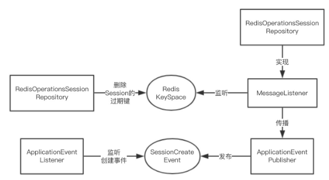

# SpringSession

## 简介

Spring Session 提供了用于管理用户会话信息的 API 和实现，同时也使得支持集群会话变得微不足道，而不受特定于应用程序容器的解决方案的束缚。

它还提供与以下各项的透明集成：

- HttpSession：允许以中立的方式替换应用程序中的 HttpSession，支持在标头中提供会话 ID 以与 RESTful API 一起使用
- WebSocket：接收 WebSocket 消息时，保持 HttpSession 活力
- WebSession：允许以中立的方式替换应用程序中的 Spring WebFlux’s WebSession


## 快速开始

### 1、引入依赖-PMO

```xml
<!-- spring-session -->
<dependency>
    <groupId>org.springframework.session</groupId>
    <artifactId>spring-session-data-redis</artifactId>
</dependency>
<!-- redis -->
<dependency>
    <groupId>org.springframework.boot</groupId>
    <artifactId>spring-boot-starter-data-redis</artifactId>
</dependency>
```

### 2、添加注解

给主启动类添加注解

```java
@EnableRedisHttpSession
```

### 3、修改配置文件

添加连接redis相关属性

以及配置SpringSession

```properties
# 会话存储类型
spring.session.store-type=redis
# 会话超时。如果未指定持续时间后缀，则使用秒。
server.servlet.session.timeout=5
# 会话刷新模式。
spring.session.redis.flush-mode=on_save
# 用于存储会话的键的命名空间。
spring.session.redis.namespace=spring:session
# Redis 服务器主机。
spring.redis.host=150.230.56.69
# Redis 服务器的登录密码。
spring.redis.password=admin
# Redis 服务器端口。
spring.redis.port=6379
```

### 4、运行流程

注解与配置文件会创建一个名为**springSessionRepositoryFilter**的Filter，其是负责将HttpSession替换为SpringSession。

### 5、补充

5.1、如果类路径上存在单个 SpringSession 模块，则 Spring Boot 会自动使用该存储实现。如果您有多个实现，则必须选择StoreType要用于存储会话的实现。

```properties
# 指定为Redis
spring.session.store-type=redis
# 禁用SpringSession
spring.session.store-type=none
```

5.2、每个Session仓库都有特定的附加设置。例如，可以为 JDBC 存储Session自定义表的名称，如以下示例所示

```properties
spring.session.jdbc.table-name=SESSIONS
```

## 工作原理简析

以下来自官方文档的汉化：

首先，**HttpSession**和**HttpServletRequest**（用于获取HttpSession的API ）都是接口。这意味着我们可以为这些 API 中的每一个提供我们自己的实现。

下面介绍SpringSession如何集成HttpSession：

- 首先，创建了一个自定义的 HttpServletRequest，它返回一个 HttpSession 的自定义实现。 如下文：
  - 任何返回 HttpSession 的方法都会被覆盖。
  - 所有其他方法都由 HttpServletRequestWrapper 实现并委托给原始的 HttpServletRequest 实现。

```java
public class SessionRepositoryRequestWrapper extends HttpServletRequestWrapper {

	public SessionRepositoryRequestWrapper(HttpServletRequest original) {
		super(original);
	}

	public HttpSession getSession() {
		return getSession(true);
	}

	public HttpSession getSession(boolean createNew) {
		// create an HttpSession implementation from Spring Session
	}

	// ... other methods delegate to the original HttpServletRequest ...
}
```

- 使用名为 SessionRepositoryFilter 的 servlet 过滤器替换 HttpServletRequest 实现
  - 通过将自定义 HttpServletRequest 实现传递到 FilterChain，我们确保在 Filter 之后调用的任何内容都使用自定义 HttpSession 实现。
  - 这突出了为什么将 SpringSession 的 SessionRepositoryFilter 放在任何与 HttpSession 交互的东西之前很重要。（需要进行Session接管）

```java
public class SessionRepositoryFilter implements Filter {

	public doFilter(ServletRequest request, ServletResponse response, FilterChain chain) {
		HttpServletRequest httpRequest = (HttpServletRequest) request;
        // 自定义HttpServletRequest 
		SessionRepositoryRequestWrapper customRequest = new SessionRepositoryRequestWrapper(httpRequest);
		chain.doFilter(customRequest, response, chain);
	}

	// ...
}
```

## 扩展

### TraditionalSession&SpringSession


传统模式中，当request进入web容器，根据reqest获取session时，如果web容器中存在session则返回，如果不存在，web容器则创建一个session。然后返回response时，将sessonId作为response的head一并返回给客户端或者浏览器。

说明了traditional-session的局限性在于：单机session。在此限制的相反面，即将session从web容器中抽出来，形成独立的模块，以便分布式应用或者集群都能共享，即能解决。

spring-session的核心思想在于此：将session从web容器中剥离，存储在独立的存储服务器中。目前支持多种形式的session存储器：Redis、Database、MogonDB等。session的管理责任委托给spring-session承担。当request进入web容器，根据request获取session时，由spring-session负责存存储器中获取session，如果存在则返回，如果不存在则创建并持久化至存储器中。

### JSR340规范

JSR340是Java Servlet 3.1的规范提案，其中定义了大量的api。是标准的web容器需要遵循的规约，如tomcat/jetty/weblogic等等。

包括：

- servlet
- servletRequest、HttpServletRequest、HttpServletRequestWrapper

- servletResponse、HttpServletResponse、HttpServletResponseWrapper
- Filter、Session等

### SpringSession的透明继承

如果引入spring-session，要如何获取session？

- 遵循servlet规范，同样方式获取session，对应用**代码无侵入**且对于developers**透明化**

关键点在于做到透明和兼容：

- 接口适配：仍然使用HttpServletRequest获取session，获取到的session仍然是HttpSession类型——**适配器模式** 
- 类型包装增强：Session不能存储在web容器内，要外化存储——**装饰模式** 

## 源码解读

### SpringSession流程图


### SpringSession核心模块

- **SessionRepositoryFilter**：Servlet规范中Filter的实现，用来切换HttpSession至Spring Session，包装HttpServletRequest和HttpServletResponse。
- **HttpServerletRequest**、**HttpServletResponse**、**HttpSessionWrapper**包装器：包装原有的HttpServletRequest、HttpServletResponse和Spring Session，实现切换Session和透明继承HttpSession的关键之所在。
- **Session**：Spring Session模块。
- **SessionRepository**：管理Spring Session的模块。
- **HttpSessionStrategy**：映射HttpRequst和HttpResponse到Session的策略。

### SessionRepositoryFilter

SessionRepositoryFilter是一个Filter过滤器，符合Servlet的规范定义，用来修改包装请求和响应。这里负责包装切换HttpSession至SpringSession的请求和响应。

```java
// 每个HttpRequest进入，都会被该Filter包装成切换Session的请求很响应对象。
@Override
protected void doFilterInternal(HttpServletRequest request,
                                HttpServletResponse response, 
                                FilterChain filterChain)
    							throws ServletException, IOException {
    // 设置SessionRepository至Request的属性中
    request.setAttribute(SESSION_REPOSITORY_ATTR, this.sessionRepository);

    // 包装原始HttpServletRequest至SessionRepositoryRequestWrapper
    SessionRepositoryRequestWrapper wrappedRequest = new SessionRepositoryRequestWrapper(request, 
                                                                                         response, 
                                                                                         this.servletContext);

    // 包装原始HttpServletResponse响应至SessionRepositoryResponseWrapper
    SessionRepositoryResponseWrapper wrappedResponse = new SessionRepositoryResponseWrapper(wrappedRequest, response);

    // 设置当前请求的HttpSessionStrategy策略
    HttpServletRequest strategyRequest = this.httpSessionStrategy.wrapRequest(wrappedRequest, wrappedResponse);

    // 设置当前响应的HttpSessionStrategy策略
    HttpServletResponse strategyResponse = this.httpSessionStrategy.wrapResponse(wrappedRequest, wrappedResponse);

    try {
        filterChain.doFilter(strategyRequest, strategyResponse);
    }
    finally {
        // 提交session
        wrappedRequest.commitSession();
    }
}
```

### SessionRepositoryRequestWrapper

获取HttpSession的api

```java
HttpServletRequest request = ...;
HttpSession session = request.getSession(true);
```

在SpringSession中request的实际类型是**SessionRepositoryRequestWrapper**。调用SessionRepositoryRequestWrapper的getSession方法会触发创建spring session，而非web容器的HttpSession。

SessionRepositoryRequestWrapper用来包装原始的HttpServletRequest实现HttpSession切换至SpringSession。是透明SpringSession透明集成HttpSession的关键。

```java
private final class SessionRepositoryRequestWrapper extends HttpServletRequestWrapper {

    private final String CURRENT_SESSION_ATTR = HttpServletRequestWrapper.class.getName();

    // 当前请求sessionId有效
    private Boolean requestedSessionIdValid;
    // 当前请求sessionId无效
    private boolean requestedSessionInvalidated;
    
    private final HttpServletResponse response;
    private final ServletContext servletContext;

    private SessionRepositoryRequestWrapper(HttpServletRequest request,
                                            HttpServletResponse response, 
                                            ServletContext servletContext) {
        // 调用HttpServletRequestWrapper构造方法，实现包装
        super(request);
        this.response = response;
        this.servletContext = servletContext;
    }
}
```

SessionRepositoryRequestWrapper继承Servlet规范中定义的包装器**HttpServletRequestWrapper**。HttpServletRequestWrapper是Servlet规范api提供的用于扩展HttpServletRequest的扩张点——即装饰器模式，可以通过重写一些api达到功能点的增强和自定义。

- HttpServletRequestWrapper持有一个HttpServletRequest对象，然后实现HttpServletRequest接口的所有方法，所有方法实现中都是调用持有的HttpServletRequest对象的相应的方法。继承HttpServletRequestWrapper 可以对其重写。

- SessionRepositoryRequestWrapper继承HttpServletRequestWrapper，在构造方法中将原有的HttpServletRequest通过调用super完成对HttpServletRequestWrapper中持有的HttpServletRequest初始化赋值，然后重写和session相关的方法。这样就保证SessionRepositoryRequestWrapper的其他方法调用都是使用原有的HttpServletRequest的数据，只有session相关的是重写的逻辑。

```java
// SessionRepositoryRequestWrapper的getSession方法
@Override
public HttpSessionWrapper getSession() {
	return getSession(true);
}
```

重写HttpServletRequest的getSession()方法，调用有参数getSession(arg)方法，默认为true，表示当前request没有session时创建session。继续看下有参数getSession(arg)的重写逻辑。

```java
@Override
public HttpSessionWrapper getSession(boolean create) {
    // 从当前请求的attribute中获取session，如果有直接返回
    HttpSessionWrapper currentSession = getCurrentSession();
    if (currentSession != null) {
        return currentSession;
    }

    // 获取当前request的sessionId，这里使用了HttpSessionStrategy
    // 决定怎样将Request映射至Session，默认使用Cookie策略，即从cookies中解析sessionId
    String requestedSessionId = getRequestedSessionId();
    // 如果请求的sessionId存在且当前request的attribute中的session属性没有失效
    // 则根据sessionId获取spring session
    if (requestedSessionId != null && getAttribute(INVALID_SESSION_ID_ATTR) == null) {
        S session = getSession(requestedSessionId);
        // 如果spring session不为空，则将spring session包装成HttpSession
        // 并设置到当前Request的attribute中，防止同一个request getsession时频繁的到存储器中获取session，提高性能
        if (session != null) {
            this.requestedSessionIdValid = true;
            currentSession = new HttpSessionWrapper(session, getServletContext());
            currentSession.setNew(false);
            setCurrentSession(currentSession);
            return currentSession;
        }
        // 如果根据sessionId，没有获取到session，则设置当前request属性，此sessionId无效
        // 同一个请求中获取session，直接返回无效
        else {
            // This is an invalid session id. No need to ask again if
            // request.getSession is invoked for the duration of this request
            if (SESSION_LOGGER.isDebugEnabled()) {
                SESSION_LOGGER.debug(
                    "No session found by id: Caching result for getSession(false) for this HttpServletRequest.");
            }
            setAttribute(INVALID_SESSION_ID_ATTR, "true");
        }
    }
    // 判断是否创建session
    if (!create) {
        return null;
    }
    if (SESSION_LOGGER.isDebugEnabled()) {
        SESSION_LOGGER.debug(
            "A new session was created. 
            "To help you troubleshoot where the session was created we provided a StackTrace (this is not an error). 
            "You can prevent this from appearing by disabling DEBUG logging for "
            + SESSION_LOGGER_NAME,
            new RuntimeException("For debugging purposes only (not an error)"));
    }
    // 根据sessionRepository创建spring session
    S session = SessionRepositoryFilter.this.sessionRepository.createSession();
    // 设置session的最新访问时间
    session.setLastAccessedTime(System.currentTimeMillis());
    // 包装成HttpSession透明化集成
    currentSession = new HttpSessionWrapper(session, getServletContext());
    // 设置session至Requset的attribute中，提高同一个request访问session的性能
    setCurrentSession(currentSession);
    return currentSession;
}
```

再来看下SpringSession的持久化。上述SessionRepositoryFilter在包装HttpServletRequest后，执行FilterChain中使用finally保证请求的Session始终会被提交，此提交操作中将sesionId设置到response的head中并将session持久化至存储器中。

持久化只持久SpringSession，并不是将SpringSession包装后的HttpSession持久化，因为HttpSession不过是包装器，持久化没有意义。

```java
private void commitSession() {
    // 获取当前session
    HttpSessionWrapper wrappedSession = getCurrentSession();
    // 如果当前session为空，则删除cookie中的相应的sessionId
    if (wrappedSession == null) {
        if (isInvalidateClientSession()) {
            SessionRepositoryFilter.this.httpSessionStrategy.onInvalidateSession(this, this.response);
        }
    }
    else {
        // 从HttpSession中获取当前spring session
        S session = wrappedSession.getSession();
        // 持久化spring session至存储器
        SessionRepositoryFilter.this.sessionRepository.save(session);
        // 如果是新创建spring session，将sessionId存到response的cookie
        if (!isRequestedSessionIdValid() || !session.getId().equals(getRequestedSessionId())) {
            SessionRepositoryFilter.this.httpSessionStrategy.onNewSession(session, this, this.response);
        }
    }
}
```

### SessionRepositoryResponseWrapper

包装响应。

```java
/**
 * Allows ensuring that the session is saved if the response is committed.
 *
 * @author Rob Winch
 * @since 1.0
 */
private final class SessionRepositoryResponseWrapper extends OnCommittedResponseWrapper {
	private final SessionRepositoryRequestWrapper request;
	/**
	 * Create a new {@link SessionRepositoryResponseWrapper}.
	 * @param request the request to be wrapped
	 * @param response the response to be wrapped
	 */
	SessionRepositoryResponseWrapper(SessionRepositoryRequestWrapper request, HttpServletResponse response) {
		super(response);
		if (request == null) {
			throw new IllegalArgumentException("request cannot be null");
		}
		this.request = request;
	}
	@Override
	protected void onResponseCommitted() {
		this.request.commitSession();
	}
}
```

从注释上可以看出包装响应是为了：**确保如果响应被提交session能够被保存**。

上述的SessionRepositoryFilter.doFilterInternal方法中已经request.commitSession()了，FilterChain执行完或者异常后都会执行Finally中的request.commitSession。包装器中的onResponseCommitted方法可以看出也是做了一次request.commitSession()。都是为了确保如果响应response被提交之前session能够被保存或被创建。

进一步查看了ServletResponse的**flushBuffer**

```java
/**
 * Forces any content in the buffer to be written to the client. A call to
 * this method automatically commits the response, meaning the status code
 * and headers will be written.
 *
 * @throws IOException if an I/O occurs during the flushing of the response
 *
 * @see #setBufferSize
 * @see #getBufferSize
 * @see #isCommitted
 * @see #reset
 */
public void flushBuffer() throws IOException;
```

结合以上两点，一旦response执行flushBuffer方法，迫使Response中在Buffer中任何数据都会被返回至client端。

这个方法自动提交响应中的status code和head。如果不包装请求，监听flushBuffer事件，在提交response之前，将session写入response和持久化session，将导致无法追踪session。

SessionRepositoryResponseWrapper继承父类**OnCommittedResponseWrapper**，其中flushBuffer方法如下：

```java
/**
 * Makes sure {@link OnCommittedResponseWrapper#onResponseCommitted()} is invoked
 * before calling the superclass <code>flushBuffer()</code>.
 * @throws IOException if an input or output exception occurred
 */
@Override
public void flushBuffer() throws IOException {
    doOnResponseCommitted();
    super.flushBuffer();
}


/**
 * Calls <code>onResponseCommmitted()</code> with the current contents as long as
 * {@link #disableOnResponseCommitted()} was not invoked.
 */
private void doOnResponseCommitted() {
    if (!this.disableOnCommitted) {
        onResponseCommitted();
        disableOnResponseCommitted();
    }
}
```

重写HttpServletResponse方法，监听response commit，当发生response commit时，可以在commit之前将session存至response中并持久化session。

tip：spring mvc中HttpMessageConverters使用到的jackson即调用了outstream.flushBuffer()，当使用@ResponseBody时。

### Session接口

#### 简介

SpringSession和tomcat中的Session的实现模式上有很大不同，tomcat中直接对HttpSession接口进行实现，而SpringSession中则抽象出单独的Session层接口，然后再使用适配器模式将Session适配成Servlet规范中的HttpSession。

Session的实现和适配整个UML类图如下：


Session是spring-session对session的抽象，主要是为了鉴定用户，为Http请求和响应提供上下文过程，该Session可以被HttpSession、WebSocket Session，非WebSession等使用。

定义了Session的基本行为：

- **getId**：获取sessionId
- **setAttribute**：设置session属性
- **getAttribte**：获取session属性

**ExipringSession**：提供Session额外的过期特性。定义了以下关于过期的行为：

- **setLastAccessedTime**：设置最近Session会话过程中最近的访问时间
- **getLastAccessedTime**：获取最近的访问时间
- **setMaxInactiveIntervalInSeconds**：设置Session的最大闲置时间
- **getMaxInactiveIntervalInSeconds**：获取最大闲置时间
- **isExpired**：判断Session是否过期

**MapSession**：基于java.util.Map的ExpiringSession的实现

**RedisSession**：基于MapSession和Redis的ExpiringSession实现，提供Session的持久化能力

#### MapSession

代码源码片段如下：

```java
public final class MapSession implements ExpiringSession, Serializable {
    /**
	 * Default {@link #setMaxInactiveIntervalInSeconds(int)} (30 minutes).
	 */
    public static final int DEFAULT_MAX_INACTIVE_INTERVAL_SECONDS = 1800;

    private String id;
    private Map<String, Object> sessionAttrs = new HashMap<String, Object>();
    private long creationTime = System.currentTimeMillis();
    private long lastAccessedTime = this.creationTime;

    /**
	 * Defaults to 30 minutes.
	 */
    private int maxInactiveInterval = DEFAULT_MAX_INACTIVE_INTERVAL_SECONDS;
```

MapSession中持有HashMap类型的变量sessionAtts用于存储Session设置属性，比如调用的setAttribute方法的k-v就存储在该HashMap中。

这个和tomcat内部实现HttpSession的方式类似，tomcat中使用了ConcurrentHashMap存储。

其中lastAccessedTime用于记录最近的一次访问时间，maxInactiveInterval用于记录Session的最大闲置时间（过期时间--针对没有Request活跃的情况下的最大时间，即相对于最近一次访问后的最大闲置时间）。

```java
public void setAttribute(String attributeName, Object attributeValue) {
    if (attributeValue == null) {
        removeAttribute(attributeName);
    }
    else {
        this.sessionAttrs.put(attributeName, attributeValue);
    }
}
```

setAttribute方法极其简单，null时就移除attributeName，否则put存储。

#### RedisSession

源码片段如下：

```java
// 基于MapSession的基本映射实现的Session
// 能够追踪发生变化的所有属性，当调用saveDelta方法后，变化的属性将被持久化！
final class RedisSession implements ExpiringSession {
    private final MapSession cached;
    private Map<String, Object> delta = new HashMap<String, Object>();
    private Long originalLastAccessTime;
    private boolean isNew;
    private String originalPrincipalName;
```

RedisSession中有两个非常重要的成员属性：

- cached：实际上是一个MapSession实例，用于做本地缓存，每次在getAttribute时无需从Redis中获取，主要为了提高性能
- delta：用于跟踪变化数据，做持久化

最为重要的行为**saveDelta**——持久化Session至Redis中：

```java
/**
 * Saves any attributes that have been changed and updates the expiration of this
 * session.
 */
private void saveDelta() {
    // 如果delta为空，则Session中没有任何数据需要存储
    if (this.delta.isEmpty()) {
        return;
    }
    String sessionId = getId();
    
    // 使用spring data redis将delta中的数据保存至Redis中
    getSessionBoundHashOperations(sessionId).putAll(this.delta);
    
    String principalSessionKey = getSessionAttrNameKey(FindByIndexNameSessionRepository.PRINCIPAL_NAME_INDEX_NAME);
    String securityPrincipalSessionKey = getSessionAttrNameKey(SPRING_SECURITY_CONTEXT);
    if (this.delta.containsKey(principalSessionKey)
        || this.delta.containsKey(securityPrincipalSessionKey)) {
        if (this.originalPrincipalName != null) {
            String originalPrincipalRedisKey = getPrincipalKey(this.originalPrincipalName);
            RedisOperationsSessionRepository.this
                							.sessionRedisOperations
                							.boundSetOps(originalPrincipalRedisKey)
                							.remove(sessionId);
        }
        String principal = PRINCIPAL_NAME_RESOLVER.resolvePrincipal(this);
        this.originalPrincipalName = principal;
        if (principal != null) {
            String principalRedisKey = getPrincipalKey(principal);
            RedisOperationsSessionRepository.this
                                            .sessionRedisOperations
                                            .boundSetOps(principalRedisKey)
                                            .add(sessionId);
        }
    }	
    // 清空delta，代表没有任何需要持久化的数据。
    // 同时保证 SessionRepositoryFilter 和 SessionRepositoryResponseWrapper 的 onResponseCommitted
    // 只会持久化一次Session至Redis中
    this.delta = new HashMap<String, Object>(this.delta.size());  
    // 更新过期时间，滚动至下一个过期时间间隔的时刻
    Long originalExpiration = this.originalLastAccessTime == null ? 
        null : this.originalLastAccessTime + TimeUnit.SECONDS.toMillis(getMaxInactiveIntervalInSeconds());
    RedisOperationsSessionRepository.this.expirationPolicy.onExpirationUpdated(originalExpiration, this);
}
```

可以看出，saveDelta用于存储Session的属性：

1. 保存Session中的属性数据至Redis中
2. 清空delta中数据，防止重复提交Session中的数据
3. 更新过期时间至下一个过期时间间隔的时刻

再看下RedisSession中的其他行为

```java
// 设置session的存活时间，即最大过期时间。先保存至本地缓存，然后再保存至delta
public void setMaxInactiveIntervalInSeconds(int interval) {
	this.cached.setMaxInactiveIntervalInSeconds(interval);
	this.delta.put(MAX_INACTIVE_ATTR, getMaxInactiveIntervalInSeconds());
	flushImmediateIfNecessary();
}

// 直接从本地缓存获取过期时间
public int getMaxInactiveIntervalInSeconds() {
	return this.cached.getMaxInactiveIntervalInSeconds();
}

// 直接从本地缓存中获取Session中的属性
@SuppressWarnings("unchecked")
public Object getAttribute(String attributeName) {
	return this.cached.getAttribute(attributeName);
}

// 保存Session属性至本地缓存和delta中
public void setAttribute(String attributeName, Object attributeValue) {
	this.cached.setAttribute(attributeName, attributeValue);
	this.delta.put(getSessionAttrNameKey(attributeName), attributeValue);
	flushImmediateIfNecessary();
}
```

### SessionRepository

SpringSession中用于管理spring session的核心组件。

其内的抽象接口如下：

```java
S createSession();
void save(S session);
S getSession(String id);
void delete(String id);
```

分别对应创建、保存、获取、删除Session的接口行为。

根据Session的不同，分为很多种Session操作仓库，如下：


### RedisOperationsSessionRepository

RedisSession的存储细节如下：

spring:session:sessions:33fdd1b6-b496-4b33-9f7d-df96679d32fe
spring:session:sessions:expires:33fdd1b6-b496-4b33-9f7d-df96679d32fe
spring:session:expirations:1439245080000

Redis会为每个RedisSession存储三个k-v：

1. 第一个k-v用来存储Session的详细信息，包括Session的过期时间间隔、最近的访问时间、attributes等等。这个k的过期时间为Session的最大过期时间 + 5分钟。如果默认的最大过期时间为30分钟，则这个k的过期时间为35分钟
2. 第二个k-v用来表示Session在Redis中的过期时间，这个k-v不存储任何有用数据，只是表示Session过期而设置。这个k在Redis中的过期时间即为Session的过期时间间隔
3. 第三个k-v存储这个Session的id，是一个Set类型的Redis数据结构。这个k中的最后的1439245080000值是一个时间戳，根据这个Session过期时刻滚动至下一分钟而计算得出。

RedisSession的存储用到了三个Key原因：

- 对于Session的实现，需要支持HttpSessionEvent，即Session创建、过期、销毁等事件。当应用用监听器设置监听相应事件，Session发生上述行为时，监听器能够做出相应的处理。
- Redis的强大之处在于支持KeySpace Notifiction——键空间通知。即可以监视某个key的变化，如删除、更新、过期。当key发生上述行为时，便可以接收到变化的通知做出相应的处理。

Redis中检查过期的key有两种方式：

- 当访问时发现其过期
- Redis后台逐步查找过期键

当访问时发现其过期，会产生过期事件，但是无法保证key的过期时间抵达后立即生成过期事件。

SpringSession为了能够及时的产生Session的过期时的过期事件，所以增加了：

spring:session:sessions:expires:33fdd1b6-b496-4b33-9f7d-df96679d32fe
spring:session:expirations:1439245080000

SpringSession中有个定时任务，每个整分钟都会查询相应的**spring:session:expirations:整分钟的时间戳**中的过期SessionId，然后再访问一次这个SessionId，即**spring:session:sessions:expires:SessionId**，以便能够让Redis及时的产生key过期事件——即Session过期事件。

查看RedisOperationsSessionRepository中的具体实现原理：

**createSession**方法：

```java
public RedisSession createSession() {
    // new一个RedisSession实例
    RedisSession redisSession = new RedisSession();
    // 如果设置的最大过期时间不为空，则设置RedisSession的过期时间
    if (this.defaultMaxInactiveInterval != null) {
        redisSession.setMaxInactiveIntervalInSeconds(this.defaultMaxInactiveInterval);
    }
    return redisSession;
}
```

RedisSession的**构造方法**：

```java
/**
 * Creates a new instance ensuring to mark all of the new attributes to be
 * persisted in the next save operation.
 */
RedisSession() {
	// 设置本地缓存为MapSession
	this(new MapSession());
	// 设置Session的基本属性
	this.delta.put(CREATION_TIME_ATTR, getCreationTime());
	this.delta.put(MAX_INACTIVE_ATTR, getMaxInactiveIntervalInSeconds());
	this.delta.put(LAST_ACCESSED_ATTR, getLastAccessedTime());
	// 标记Session的是否为新创建
	this.isNew = true;
	// 持久化
	flushImmediateIfNecessary();
}
```

**save**方法：

```java
public void save(RedisSession session) {
	// 调用RedisSession的saveDelta持久化Session
	session.saveDelta();
	// 如果Session为新创建，则发布一个Session创建的事件
	if (session.isNew()) {
		String sessionCreatedKey = getSessionCreatedChannel(session.getId());
		this.sessionRedisOperations.convertAndSend(sessionCreatedKey, session.delta);
		session.setNew(false);
	}
}
```

**getSession**方法：

```java
// 根据SessionId获取Session，这里的false代表的参数
// 指：如果Session已经过期，是否仍然获取返回
public RedisSession getSession(String id) {
	return getSession(id, false);
}
```

在有些情况下，Session过期，仍然需要能够获取到Session。如下：

**getSession(String id, boolean allowExpired)**：

```java
private RedisSession getSession(String id, boolean allowExpired) {
	// 根据SessionId，从Redis获取到持久化的Session信息
	Map<Object, Object> entries = getSessionBoundHashOperations(id).entries();
	// 如果Redis中没有，则返回null
	if (entries.isEmpty()) {
		return null;
	}
	// 根据Session信息，加载创建一个MapSession对象
	MapSession loaded = loadSession(id, entries);
	//  判断是否允许过期后获取和Session是否过期
	if (!allowExpired && loaded.isExpired()) {
		return null;
	}
	// 根据MapSession new一个信息的RedisSession，此时isNew为false
	RedisSession result = new RedisSession(loaded);
	// 设置最新的访问时间
	result.originalLastAccessTime = loaded.getLastAccessedTime();
	return result;
}
```

这里需要注意的是loaded.isExpired()和loadSession。

loaded.isExpired判断Session是否过期，如果过期返回null：

```java
public boolean isExpired() {
	// 根据当前时间判断是否过期
	return isExpired(System.currentTimeMillis());
}
boolean isExpired(long now) {
	// 如果maxInactiveInterval小于0，表示Session永不过期
	if (this.maxInactiveInterval < 0) {
		return false;
	}
	// 最大过期时间单位转换为毫秒
	// 当前时间减去Session的最大有效期间隔以获取理论上有效的上一次访问时间
	// 然后在与实际的上一次访问时间进行比较
	// 如果大于，表示理论上的时间已经在实际的访问时间之后，那么表示Session已经过期
	return now - TimeUnit.SECONDS.toMillis(this.maxInactiveInterval) >= this.lastAccessedTime;
}
```

loadSession中，将Redis中存储的Session信息转换为MapSession对象，以便从Session中获取属性时能够从内存直接获取提高性能：

```java
private MapSession loadSession(String id, Map<Object, Object> entries) {
	MapSession loaded = new MapSession(id);
	for (Map.Entry<Object, Object> entry : entries.entrySet()) {
		String key = (String) entry.getKey();
		if (CREATION_TIME_ATTR.equals(key)) {
			loaded.setCreationTime((Long) entry.getValue());
		}
		else if (MAX_INACTIVE_ATTR.equals(key)) {
			loaded.setMaxInactiveIntervalInSeconds((Integer) entry.getValue());
		}
		else if (LAST_ACCESSED_ATTR.equals(key)) {
			loaded.setLastAccessedTime((Long) entry.getValue());
		}
		else if (key.startsWith(SESSION_ATTR_PREFIX)) {
			loaded.setAttribute(key.substring(SESSION_ATTR_PREFIX.length()),
					entry.getValue());
		}
	}
	return loaded;
}
```

**delete**方法：

```java
public void delete(String sessionId) {
	// 获取Session
	RedisSession session = getSession(sessionId, true);
	if (session == null) {
		return;
	}
	cleanupPrincipalIndex(session);
	// 从过期集合中移除sessionId
	this.expirationPolicy.onDelete(session);
	String expireKey = getExpiredKey(session.getId());
	// 删除session的过期键
	this.sessionRedisOperations.delete(expireKey);
	// 设置session过期
	session.setMaxInactiveIntervalInSeconds(0);
	save(session);
}
```

### HttpSessionStrategy


HttpSessionStrategy是建立Request、Response和Session之间的映射关系的策略。

该策略接口中定义一套策略行为：

```java
// 根据请求获取SessionId，即建立请求至Session的映射关系
String getRequestedSessionId(HttpServletRequest request);
// 对于新创建的Session，通知客户端
void onNewSession(Session session, HttpServletRequest request, HttpServletResponse response);
// 对于session无效，通知客户端
void onInvalidateSession(HttpServletRequest request, HttpServletResponse response);
```

查看SpringSession中类SpringHttpSessionConfiguration，在注册SessionRepositoryFilter Bean时默认采用**CookieHttpSessionStrategy**：

```java
@Bean
public <S extends ExpiringSession> SessionRepositoryFilter<? extends ExpiringSession> springSessionRepositoryFilter(
    SessionRepository<S> sessionRepository) {
    SessionRepositoryFilter<S> sessionRepositoryFilter = new SessionRepositoryFilter<S>(sessionRepository);
    sessionRepositoryFilter.setServletContext(this.servletContext);
    if (this.httpSessionStrategy instanceof MultiHttpSessionStrategy) {
        sessionRepositoryFilter.setHttpSessionStrategy((MultiHttpSessionStrategy) this.httpSessionStrategy);
    }
    else {
        sessionRepositoryFilter.setHttpSessionStrategy(this.httpSessionStrategy);
    }
    return sessionRepositoryFilter;
}
```

CookieHttpSessionStrategy策略使用Cookie来映射Request/Response至Session。即Request/Response的head中cookie存储SessionId。

当请求至web服务器，可以解析请求head中的cookie，然后获取sessionId，根据sessionId获取spring-session。

当创建新的session或者session过期，将相应的sessionId写入response的set-cookie或者从respose中移除sessionId。

**getRequestedSessionId**方法

```java
public String getRequestedSessionId(HttpServletRequest request) {
	// 获取当前请求的sessionId：session别名和sessionId映射
	Map<String, String> sessionIds = getSessionIds(request);
	// 获取当前请求的Session别名 此方法源码见下文
	String sessionAlias = getCurrentSessionAlias(request);
	// 获取相应别名的sessionId
	return sessionIds.get(sessionAlias);
}
```

获取SessionIds的具体过程：

```java
public Map<String, String> getSessionIds(HttpServletRequest request) {
    // 解析request中的cookie值                          此方法源码如下文
    List<String> cookieValues = this.cookieSerializer.readCookieValues(request);
    // 获取sessionId
    String sessionCookieValue = cookieValues.isEmpty() ? "" : cookieValues.iterator().next();
    Map<String, String> result = new LinkedHashMap<String, String>();
    // 根据分词器对sessionId进行分割，因为spring-session支持多session。默认情况只有一个session
    StringTokenizer tokens = new StringTokenizer(sessionCookieValue, this.deserializationDelimiter);
    // 如果只有一个session，则设置默认别名为0
    if (tokens.countTokens() == 1) {
        result.put(DEFAULT_ALIAS, tokens.nextToken());
        return result;
    }
    // 如果有多个session，则建立别名和sessionId的映射
    while (tokens.hasMoreTokens()) {
        String alias = tokens.nextToken();
        if (!tokens.hasMoreTokens()) {
            break;
        }
        String id = tokens.nextToken();
        result.put(alias, id);
    }
    return result;
}


public List<String> readCookieValues(HttpServletRequest request) {
    // 获取request的cookie
    Cookie[] cookies = request.getCookies();
    List<String> matchingCookieValues = new ArrayList<String>();
    if (cookies != null) {
        for (Cookie cookie : cookies) {
            // 如果是以SESSION开头，则表示是SessionId，毕竟cookie不只有sessionId，还有可能存储其他内容
            if (this.cookieName.equals(cookie.getName())) {
                // 决策是否需要base64 decode
                String sessionId = this.useBase64Encoding ? base64Decode(cookie.getValue()) : cookie.getValue();
                if (sessionId == null) {
                    continue;
                }
                if (this.jvmRoute != null && sessionId.endsWith(this.jvmRoute)) {
                    sessionId = sessionId.substring(0, sessionId.length() - this.jvmRoute.length());
                }
                // 存入list中
                matchingCookieValues.add(sessionId);
            }
        }
    }
    return matchingCookieValues;
}
```

获取当前request对应的Session的别名方法**getCurrentSessionAlias**：

```java
public String getCurrentSessionAlias(HttpServletRequest request) {
	// 如果session参数为空，则返回默认session别名
	if (this.sessionParam == null) {
		return DEFAULT_ALIAS;
	}
	// 从request中获取session别名，如果为空则返回默认别名
	String u = request.getParameter(this.sessionParam);
	if (u == null) {
		return DEFAULT_ALIAS;
	}
	if (!ALIAS_PATTERN.matcher(u).matches()) {
		return DEFAULT_ALIAS;
	}
	return u;
}
```

spring-session为了支持多session，才弄出多个session别名。一般应用场景都是一个session，都是默认的session别名0。

上述获取sessionId和别名映射关系中，也是默认别名0。这里返回别名0，所以返回当前请求对应的sessionId。

**onNewSession**方法

```java
public void onNewSession(Session session, HttpServletRequest request, HttpServletResponse response) {
	// 从当前request中获取已经写入Cookie的sessionId集合
	Set<String> sessionIdsWritten = getSessionIdsWritten(request);
	// 判断是否包含，如果包含，表示该sessionId已经写入过cookie中，则直接返回
	if (sessionIdsWritten.contains(session.getId())) {
		return;
	}
	// 如果没有写入，则加入集合，后续再写入
	sessionIdsWritten.add(session.getId());
	Map<String, String> sessionIds = getSessionIds(request);
	String sessionAlias = getCurrentSessionAlias(request);
	sessionIds.put(sessionAlias, session.getId());
	// 获取cookieValue
	String cookieValue = createSessionCookieValue(sessionIds);
	//将cookieValue写入Cookie中
	this.cookieSerializer
			.writeCookieValue(new CookieValue(request, response, cookieValue));
}
```

sessionIdsWritten主要是用来记录已经写入Cookie的SessionId，防止SessionId重复写入Cookie中。

**onInvalidateSession**方法

```java
public void onInvalidateSession(HttpServletRequest request, HttpServletResponse response) {
	// 从当前request中获取sessionId和别名映射
	Map<String, String> sessionIds = getSessionIds(request);
	// 获取别名
	String requestedAlias = getCurrentSessionAlias(request);
	// 移除sessionId
	sessionIds.remove(requestedAlias);
	String cookieValue = createSessionCookieValue(sessionIds);
	// 写入移除后的sessionId   此方法源码见下文
	this.cookieSerializer.writeCookieValue(new CookieValue(request, response, cookieValue));
}
```

具体的写入**writeCookieValue**原理：

```java
public void writeCookieValue(CookieValue cookieValue) {
	// 获取request、respose和cookie值
	HttpServletRequest request = cookieValue.getRequest();
	HttpServletResponse response = cookieValue.getResponse();
	String requestedCookieValue = cookieValue.getCookieValue();
	String actualCookieValue = this.jvmRoute == null ? requestedCookieValue : requestedCookieValue + this.jvmRoute;
	// 构造servlet规范中的Cookie对象，注意这里cookieName为：SESSION，表示为Session，
	// 上述的从Cookie中读取SessionId，也是使用该cookieName
	Cookie sessionCookie = new Cookie(this.cookieName, this.useBase64Encoding 
                                      ? base64Encode(actualCookieValue) : actualCookieValue);
	// 设置cookie的属性：secure、path、domain、httpOnly
	sessionCookie.setSecure(isSecureCookie(request));
	sessionCookie.setPath(getCookiePath(request));
	String domainName = getDomainName(request);
	if (domainName != null) {
		sessionCookie.setDomain(domainName);
	}
	if (this.useHttpOnlyCookie) {
		sessionCookie.setHttpOnly(true);
	}
	// 如果cookie值为空，则失效
	if ("".equals(requestedCookieValue)) {
		sessionCookie.setMaxAge(0);
	}
	else {
		sessionCookie.setMaxAge(this.cookieMaxAge);
	}
	// 写入cookie到response中
	response.addCookie(sessionCookie);
}
```

### Session事件的抽象


Session Event最顶层是ApplicationEvent，即Spring上下文事件对象。

SpringSession的事件机制是基于Spring上下文事件实现。

抽象的AbstractSessionEvent事件对象提供了获取Session（这里的是指Spring Session的对象）和SessionId。

基于事件的类型，分类为：

1. Session创建事件
2. Session删除事件
3. Session过期事件

tip：Session销毁事件只是删除和过期事件的统一，并无实际含义。

### 事件的触发机制


**ApplicationEventPublisher**实现用于发布Spring上下文事件**ApplicationEvent**

**ApplicationListener**实现用于监听Spring上下文事件**ApplicationEvent**

**ApplicationEvent**抽象上下文事件

ApplicationEventPublisher发布一个事件：

```java
@FunctionalInterface
public interface ApplicationEventPublisher {

	/**
	 * Notify all <strong>matching</strong> listeners registered with this
	 * application of an application event. Events may be framework events
	 * (such as RequestHandledEvent) or application-specific events.
	 * @param event the event to publish
	 * @see org.springframework.web.context.support.RequestHandledEvent
	 */
	default void publishEvent(ApplicationEvent event) {
		publishEvent((Object) event);
	}

	/**
	 * Notify all <strong>matching</strong> listeners registered with this
	 * application of an event.
	 * <p>If the specified {@code event} is not an {@link ApplicationEvent},
	 * it is wrapped in a {@link PayloadApplicationEvent}.
	 * @param event the event to publish
	 * @since 4.2
	 * @see PayloadApplicationEvent
	 */
	void publishEvent(Object event);

}
```

ApplicationListener用于监听相应的事件：

```java
@FunctionalInterface
public interface ApplicationListener<E extends ApplicationEvent> extends EventListener {

	/**
	 * Handle an application event.
	 * @param event the event to respond to
	 */
	void onApplicationEvent(E event);

}
```

Tips：这里使用到了发布/订阅模式，事件监听器可以监听感兴趣的事件，发布者可以发布各种事件。不过这是内部的发布订阅，即观察者模式。

Session事件的流程实现如下：


事件源来自于Redis键空间通知。在spring-data-redis项目中抽象MessageListener监听Redis事件源，然后将其传播至spring应用上下文发布者，由发布者发布事件。在spring上下文中的监听器Listener即可监听到Session事件。

在RedisOperationSessionRepository中持有ApplicationEventPublisher对象用于发布Session事件。

```java
private ApplicationEventPublisher eventPublisher = new ApplicationEventPublisher() {
    @Override
    public void publishEvent(ApplicationEvent event) {
    }
    @Override
    public void publishEvent(Object event) {
    }
};
```

但是该ApplicationEventPublisher是**空实现**，实际实现是在应用启动时由SpringSession自动配置。

在spring-session-data-redis模块中RedisHttpSessionConfiguration中有关于创建RedisOperationSessionRepository Bean时将调用set方法将ApplicationEventPublisher配置。

```java
@Configuration
@EnableScheduling
public class RedisHttpSessionConfiguration extends SpringHttpSessionConfiguration
    									   implements BeanClassLoaderAware, 
                                                      EmbeddedValueResolverAware, 
                                                	  ImportAware,
                                               		  SchedulingConfigurer {

    private ApplicationEventPublisher applicationEventPublisher;

    @Bean
    public RedisOperationsSessionRepository sessionRepository() {
        RedisTemplate<Object, Object> redisTemplate = createRedisTemplate();
        RedisOperationsSessionRepository sessionRepository = new RedisOperationsSessionRepository(redisTemplate);
        // 注入依赖
        sessionRepository.setApplicationEventPublisher(this.applicationEventPublisher);
        if (this.defaultRedisSerializer != null) {
            sessionRepository.setDefaultSerializer(this.defaultRedisSerializer);
        }
        sessionRepository.setDefaultMaxInactiveInterval(this.maxInactiveIntervalInSeconds);
        if (StringUtils.hasText(this.redisNamespace)) {
            sessionRepository.setRedisKeyNamespace(this.redisNamespace);
        }
        sessionRepository.setRedisFlushMode(this.redisFlushMode);
        return sessionRepository;
    }

    // 注入上下文中的ApplicationEventPublisher Bean
    @Autowired
    public void setApplicationEventPublisher(ApplicationEventPublisher applicationEventPublisher) {
        this.applicationEventPublisher = applicationEventPublisher;
    }

}
```

在进行自动配置时，将上下文中的ApplicationEventPublisher的注入，即ApplicationContext对象。

对于ApplicationListener是自行实现，注册成Bean即可。当有Session Event发布时，即可监听。

```java
/**
 * session事件监听器
 *
 * @author huaijin
 */
@Component
public class SessionEventListener implements ApplicationListener<SessionDeletedEvent> {

    private static final String CURRENT_USER = "currentUser";

    @Override
    public void onApplicationEvent(SessionDeletedEvent event) {
        Session session = event.getSession();
        UserVo userVo = session.getAttribute(CURRENT_USER);
        System.out.println("Current session's user:" + userVo.toString());
    }
}
```

核心事件的触发发布则是由Redis的**键空间通知机制触发**，当有Session创建/删除/过期时，Redis键空间会通知Spring-Session应用。

RedisOperationsSessionRepository实现spring-data-redis中的MessageListener接口：

```java
/**
 * Listener of messages published in Redis.
 *
 * @author Costin Leau
 * @author Christoph Strobl
 */
public interface MessageListener {

	/**
	 * Callback for processing received objects through Redis.
	 *
	 * @param message message must not be {@literal null}.
	 * @param pattern pattern matching the channel (if specified) - can be {@literal null}.
	 */
	void onMessage(Message message, @Nullable byte[] pattern);
}
```

该监听器即用来监听redis发布的消息。

RedisOperationsSessionRepositorys实现了该Redis键空间消息通知监听器接口，实现如下：

```java
public class RedisOperationsSessionRepository implements 
    	FindByIndexNameSessionRepository<RedisOperationsSessionRepository.RedisSession>,
		MessageListener {

	@Override
	@SuppressWarnings("unchecked")
	public void onMessage(Message message, byte[] pattern) {
		// 获取该消息发布的redis通道channel
		byte[] messageChannel = message.getChannel();
		// 获取消息体内容
		byte[] messageBody = message.getBody();
		String channel = new String(messageChannel);

		// 如果是由Session创建通道发布的消息，则是Session创建事件
		if (channel.startsWith(getSessionCreatedChannelPrefix())) {
			// 从消息体中载入Session
			Map<Object, Object> loaded = (Map<Object, Object>) this.defaultSerializer.deserialize(message.getBody());
			// 发布创建事件
			handleCreated(loaded, channel);
			return;
		}

		// 如果消息体不是以过期键前缀，直接返回。因为spring-session在redis中的key命名规则：
		// "${namespace}:sessions:expires:${sessionId}"，如：
		// session.example:sessions:expires:a5236a19-7325-4783-b1f0-db9d4442db9a
		// 所以判断键是否为spring-session的过期键。如果不是，可能是应用中其他的键的操作，所以直接return
		String body = new String(messageBody);
		if (!body.startsWith(getExpiredKeyPrefix())) {
			return;
		}

		// 根据channel判断键空间的事件类型del或者expire时间
		boolean isDeleted = channel.endsWith(":del");
		if (isDeleted || channel.endsWith(":expired")) {
			int beginIndex = body.lastIndexOf(":") + 1;
			int endIndex = body.length();
			// Redis键空间消息通知内容即操作的键，spring-session键中命名规则：
			// "${namespace}:sessions:expires:${sessionId}"，以下是根据规则解析sessionId
			String sessionId = body.substring(beginIndex, endIndex);

			// 根据sessionId加载session
			RedisSession session = getSession(sessionId, true);

			if (session == null) {
				logger.warn("Unable to publish SessionDestroyedEvent for session "
						+ sessionId);
				return;
			}

			if (logger.isDebugEnabled()) {
				logger.debug("Publishing SessionDestroyedEvent for session " + sessionId);
			}

			cleanupPrincipalIndex(session);

			// 发布Session delete事件
			if (isDeleted) {
				handleDeleted(session);
			}
			else {
				// 否则发布Session expire事件
				handleExpired(session);
			}
		}
	}
}
```

### Session创建事件的触发


1. 由RedisOperationSessionRepository向Redis指定通道**${namespace}:event:created:${sessionId}**发布一个message
2. MessageListener的实现RedisOperationSessionRepository监听到Redis指定通道**${namespace}:event:created:${sessionId}**的消息
3. 将其传播至ApplicationEventPublisher
4. ApplicationEventPublisher发布SessionCreateEvent
5. ApplicationListener监听SessionCreateEvent，执行相应逻辑

RedisOperationSessionRepository中保存一个Session时，判断Session是否新创建。如果新创建，则向该通道发布session数据

```java
@Override
public void save(RedisSession session) {
	session.saveDelta();
	// 判断是否为新创建的session
	if (session.isNew()) {
		// 获取redis指定的channel：${namespace}:event:created:${sessionId}，
		// 如：session.example:event:created:82sdd-4123-o244-ps123
		String sessionCreatedKey = getSessionCreatedChannel(session.getId());
		// 向该通道发布session数据
		this.sessionRedisOperations.convertAndSend(sessionCreatedKey, session.delta);
		// 设置session为非新创建
		session.setNew(false);
	}
}
```

### Session删除事件的触发

删除事件中使用到了Redis KeySpace Notification



1. 由RedisOperationSessionRepository删除Redis键空间中的指定Session的过期键，Redis键空间会向**__keyevent@\*:del**的channel发布删除事件消息
2. MessageListener的实现RedisOperationSessionRepository监听到Redis指定通道**__keyevent@\*:del**的消息
3. 将其传播至ApplicationEventPublisher
4. ApplicationEventPublisher发布SessionDeleteEvent
5. ApplicationListener监听SessionDeleteEvent，执行相应逻辑

当调用HttpSession的**invalidate**方法让Session失效时，即会调用RedisOperationSessionRepository的**deleteById**方法删除Session的过期键。

```java
/**
 * Allows creating an HttpSession from a Session instance.
 *
 * @author Rob Winch
 * @since 1.0
 */
private final class HttpSessionWrapper extends HttpSessionAdapter<S> {
	HttpSessionWrapper(S session, ServletContext servletContext) {
		super(session, servletContext);
	}

	@Override
	public void invalidate() {
		super.invalidate();
		SessionRepositoryRequestWrapper.this.requestedSessionInvalidated = true;
		setCurrentSession(null);
		clearRequestedSessionCache();
		// 调用删除方法
		SessionRepositoryFilter.this.sessionRepository.deleteById(getId());
	}
}
```

**deleteById**内容：

```java
@Override
public void deleteById(String sessionId) {
	// 如果session为空则返回
	RedisSession session = getSession(sessionId, true);
	if (session == null) {
		return;
	}

	cleanupPrincipalIndex(session);
	this.expirationPolicy.onDelete(session);
	// 获取session的过期键
	String expireKey = getExpiredKey(session.getId());
	// 删除过期键，redis键空间产生del事件消息，被MessageListener即RedisOperationSessionRepository监听
	this.sessionRedisOperations.delete(expireKey);
	session.setMaxInactiveInterval(Duration.ZERO);
	save(session);
}
```

### Session失效事件的触发

Session的过期事件流程比较特殊，因为Redis的键空间通知的特殊性，Redis键空间通知不能保证过期键的通知的及时性。


1. RedisOperationsSessionRepository中有个定时任务方法每整分运行访问整分Session过期键集合中的过期sessionId，如：spring:session:expirations:1439245080000。触发Redis键空间会向**__keyevent@\*:expired**的channel发布过期事件消息
2. MessageListener的实现RedisOperationSessionRepository监听到Redis指定通道**__keyevent@\*:expired**的消息
3. 将其传播至ApplicationEventPublisher
4. ApplicationEventPublisher发布SessionDeleteEvent
5. ApplicationListener监听SessionDeleteEvent，执行相应逻辑

```java
@Scheduled(cron = "0 * * * * *")
public void cleanupExpiredSessions() {
	this.expirationPolicy.cleanExpiredSessions();
}
```

定时任务每整分运行，执行cleanExpiredSessions方法。expirationPolicy是RedisSessionExpirationPolicy实例，是RedisSession过期策略。

```java
ublic void cleanExpiredSessions() {
    // 获取当前时间戳
	long now = System.currentTimeMillis();
	// 时间滚动至整分，去掉秒和毫秒部分
	long prevMin = roundDownMinute(now);
	if (logger.isDebugEnabled()) {
		logger.debug("Cleaning up sessions expiring at " + new Date(prevMin));
	}
	// 根据整分时间获取过期键集合，如：spring:session:expirations:1439245080000
	String expirationKey = getExpirationKey(prevMin);
	// 获取所有的所有的过期session
	Set<Object> sessionsToExpire = this.redis.boundSetOps(expirationKey).members();
	// 删除过期Session键集合
	this.redis.delete(expirationKey);
	// touch访问所有已经过期的session，触发Redis键空间通知消息
	for (Object session : sessionsToExpire) {
		String sessionKey = getSessionKey((String) session);
		touch(sessionKey);
	}
}
```

将时间戳滚动至整分

```java
static long roundDownMinute(long timeInMs) {
	Calendar date = Calendar.getInstance();
	date.setTimeInMillis(timeInMs);
	// 清理时间戳的秒位和毫秒位
	date.clear(Calendar.SECOND);
	date.clear(Calendar.MILLISECOND);
	return date.getTimeInMillis();
}
```

获取过期Session的集合

```java
String getExpirationKey(long expires) {
	return this.redisSession.getExpirationsKey(expires);
}

// 如：spring:session:expirations:1439245080000
String getExpirationsKey(long expiration) {
	return this.keyPrefix + "expirations:" + expiration;
}
```

调用Redis的Exists命令，访问过期Session键，触发Redis键空间消息

```java
/**
 * By trying to access the session we only trigger a deletion if it the TTL is
 * expired. This is done to handle
 * https://github.com/spring-projects/spring-session/issues/93
 *
 * @param key the key
 */
private void touch(String key) {
	this.redis.hasKey(key);
}
```

### SpringSession自动配置原理

spring-boot-**autoconfigure模块**中包含了spinrg-session的自动配置。

包org.springframework.boot.**autoconfigure.session**中包含了spring-session的所有自动配置项。

RedisSession的核心配置项是**RedisHttpSessionConfiguration**类。

```java
@Configuration
@ConditionalOnClass({ RedisTemplate.class, RedisOperationsSessionRepository.class })
@ConditionalOnMissingBean(SessionRepository.class)
@ConditionalOnBean(RedisConnectionFactory.class)
@Conditional(ServletSessionCondition.class)
@EnableConfigurationProperties(RedisSessionProperties.class)
class RedisSessionConfiguration {

	@Configuration
	public static class SpringBootRedisHttpSessionConfiguration
			extends RedisHttpSessionConfiguration {

		// 加载application.yml或者application.properties中自定义的配置项：
		// 命名空间：用于作为session redis key的一部分
		// flushmode：session写入redis的模式
		// 定时任务时间：即访问redis过期键的定时任务的cron表达式
		@Autowired
		public void customize(SessionProperties sessionProperties, RedisSessionProperties redisSessionProperties) {
			Duration timeout = sessionProperties.getTimeout();
			if (timeout != null) {
				setMaxInactiveIntervalInSeconds((int) timeout.getSeconds());
			}
			setRedisNamespace(redisSessionProperties.getNamespace());
			setRedisFlushMode(redisSessionProperties.getFlushMode());
			setCleanupCron(redisSessionProperties.getCleanupCron());
		}
	}
}
```

RedisSessionConfiguration配置类中嵌套**SpringBootRedisHttpSessionConfiguration**继承了**RedisHttpSessionConfiguration**配置类。

首先看下RedisHttpSessionConfiguration配置类持有的成员。

```java
@Configuration
@EnableScheduling
public class RedisHttpSessionConfiguration extends SpringHttpSessionConfiguration
										   implements BeanClassLoaderAware, 
                                                      EmbeddedValueResolverAware, 
                                                      ImportAware,
                                                      SchedulingConfigurer {


	// 默认的cron表达式，application.yml可以自定义配置
	static final String DEFAULT_CLEANUP_CRON = "0 * * * * *";

	// session的有效最大时间间隔， application.yml可以自定义配置
	private Integer maxInactiveIntervalInSeconds = MapSession.DEFAULT_MAX_INACTIVE_INTERVAL_SECONDS;

	// session在redis中的命名空间，主要为了区分session，application.yml可以自定义配置
	private String redisNamespace = RedisOperationsSessionRepository.DEFAULT_NAMESPACE;

	// session写入Redis的模式，application.yml可以自定义配置
	private RedisFlushMode redisFlushMode = RedisFlushMode.ON_SAVE;

	// 访问过期Session集合的定时任务的定时时间，默认是每整分运行任务
	private String cleanupCron = DEFAULT_CLEANUP_CRON;

	private ConfigureRedisAction configureRedisAction = new ConfigureNotifyKeyspaceEventsAction();

	// spring-data-redis的redis连接工厂
	private RedisConnectionFactory redisConnectionFactory;

	// spring-data-redis的RedisSerializer，用于序列化session中存储的attributes
	private RedisSerializer<Object> defaultRedisSerializer;

	// session时间发布者，默认注入的是AppliationContext实例
	private ApplicationEventPublisher applicationEventPublisher;

	// 访问过期session键的定时任务的调度器
	private Executor redisTaskExecutor;

	private Executor redisSubscriptionExecutor;

	private ClassLoader classLoader;

	private StringValueResolver embeddedValueResolver;
}
```

该配置类中初始化了RedisSession的最为核心模块之一**RedisOperationsSessionRepository**。

```java
@Bean
public RedisOperationsSessionRepository sessionRepository() {
	// 创建RedisOperationsSessionRepository
	RedisTemplate<Object, Object> redisTemplate = createRedisTemplate();
	RedisOperationsSessionRepository sessionRepository = new RedisOperationsSessionRepository(
			redisTemplate);
	// 设置Session Event发布者。如果对此迷惑，传送门：https://www.cnblogs.com/lxyit/p/9719542.html
	sessionRepository.setApplicationEventPublisher(this.applicationEventPublisher);
	if (this.defaultRedisSerializer != null) {
		sessionRepository.setDefaultSerializer(this.defaultRedisSerializer);
	}
	// 设置默认的Session最大有效期间隔
	sessionRepository.setDefaultMaxInactiveInterval(this.maxInactiveIntervalInSeconds);
	// 设置命名空间
	if (StringUtils.hasText(this.redisNamespace)) {
		sessionRepository.setRedisKeyNamespace(this.redisNamespace);
	}
	// 设置写redis的模式
	sessionRepository.setRedisFlushMode(this.redisFlushMode);
	return sessionRepository;
}
```

同时也初始化了Session事件监听器**MessageListener**模块

```java
@Bean
public RedisMessageListenerContainer redisMessageListenerContainer() {
	// 创建MessageListener容器，这属于spring-data-redis范畴，略过
	RedisMessageListenerContainer container = new RedisMessageListenerContainer();
	container.setConnectionFactory(this.redisConnectionFactory);
	if (this.redisTaskExecutor != null) {
		container.setTaskExecutor(this.redisTaskExecutor);
	}
	if (this.redisSubscriptionExecutor != null) {
		container.setSubscriptionExecutor(this.redisSubscriptionExecutor);
	}
	// 模式订阅redis的__keyevent@*:expired和__keyevent@*:del通道，
	// 获取redis的键过期和删除事件通知
	container.addMessageListener(sessionRepository(),
                                 Arrays.asList(new PatternTopic("__keyevent@*:del"),
								 new PatternTopic("__keyevent@*:expired")));
	// 模式订阅redis的${namespace}:event:created:*通道，当该向该通道发布消息，
	// 则MessageListener消费消息并处理
	container.addMessageListener(sessionRepository(),
			Collections.singletonList(new PatternTopic(sessionRepository().getSessionCreatedChannelPrefix() + "*")));
	return container;
}
```

关于RedisSession的存储管理部分已经初始化。

SpringSession的另一个基础设施模块SessionRepositoryFilter是在RedisHttpSessionConfiguration父类SpringHttpSessionConfiguration中初始化。

```java
@Bean
public <S extends Session> SessionRepositoryFilter<? extends Session> 
    springSessionRepositoryFilter(SessionRepository<S> sessionRepository) {
    
	SessionRepositoryFilter<S> sessionRepositoryFilter = new SessionRepositoryFilter<>(sessionRepository);
	sessionRepositoryFilter.setServletContext(this.servletContext);
	sessionRepositoryFilter.setHttpSessionIdResolver(this.httpSessionIdResolver);
	return sessionRepositoryFilter;
    
}
```

Spring-Boot整合Spring-Session配置的层次：

```
RedisSessionConfiguration
	|_ _ SpringBootRedisHttpSessionConfiguration
			|_ _ RedisHttpSessionConfiguration
					|_ _ SpringHttpSessionConfiguration
```

总结

- **SpringHttpSessionConfiguration**是SpringSession本身的配置类，与SpringBoot无关，毕竟SpringSession也可以整合单纯的spring项目，只需要使用该SpringSession的配置类即可。
- **RedisHttpSessionConfiguration**用于配置SpringSession的Redission，毕竟SpringSession还支持其他的各种session：Map/JDBC/MogonDB等，将其从SpringHttpSessionConfiguration隔离开来，遵循开闭原则和接口隔离原则。但是其必须依赖基础的SpringHttpSessionConfiguration，所以使用了继承。RedisHttpSessionConfiguration是SpringSession和Spring-Data-Redis整合配置，需要依赖Spring-Data-Redis。
- **SpringBootRedisHttpSessionConfiguration**才是Spring-Boot中关键配置
- **RedisSessionConfiguration**主要用于处理自定义配置，将application.yml或者application.properties的配置载入。


