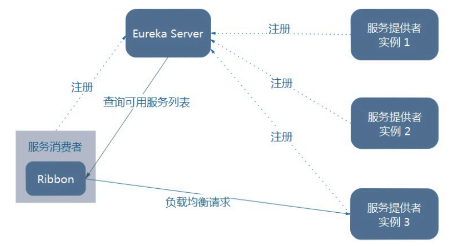

# Ribbon简介

作用：LB（负载均衡）

>集中式LB
>
>即在服务的消费方和提供方之间使用独立的LB设施(可以是硬件，如F5, 也可以是软件，如nginx), 由该设施负责把访问请求通过某种策略转发至服务的提供方。

>进程内LB
>
>将LB逻辑集成到消费方，消费方从服务注册中心获知有哪些地址可用，然后自己再从这些地址中选择出一个合适的服务器。
>

**Ribbon就属于进程内LB**，它只是一个类库，**集成于消费方进程**，消费方通过它来获取到服务提供方的地址。

# Ribbon构建

## 修改consumer-80工程

修改microservicecloud-consumer-dept-80工程

修改pom.xml文件，**引入Ribbon与Eureka依赖spring-cloud-starter-ribbon/eureka**

```xml
<project xmlns="http://maven.apache.org/POM/4.0.0" xmlns:xsi="http://www.w3.org/2001/XMLSchema-instance"
  xsi:schemaLocation="http://maven.apache.org/POM/4.0.0 http://maven.apache.org/xsd/maven-4.0.0.xsd">
  <modelVersion>4.0.0</modelVersion>
 
  <parent>
   <groupId>com.atguigu.springcloud</groupId>
   <artifactId>microservicecloud</artifactId>
   <version>0.0.1-SNAPSHOT</version>
  </parent>
 
  <artifactId>microservicecloud-consumer-dept-80</artifactId>
  <description>部门微服务消费者</description>
 
  <dependencies>
   <dependency><!-- 自己定义的api -->
     <groupId>com.atguigu.springcloud</groupId>
     <artifactId>microservicecloud-api</artifactId>
     <version>${project.version}</version>
   </dependency>
   <dependency>
     <groupId>org.springframework.boot</groupId>
     <artifactId>spring-boot-starter-web</artifactId>
   </dependency>
   <!-- 修改后立即生效，热部署 -->
   <dependency>
     <groupId>org.springframework</groupId>
     <artifactId>springloaded</artifactId>
   </dependency>
   <dependency>
     <groupId>org.springframework.boot</groupId>
     <artifactId>spring-boot-devtools</artifactId>
   </dependency>
   <!-- Ribbon相关 -->
   <dependency>
     <groupId>org.springframework.cloud</groupId>
     <artifactId>spring-cloud-starter-eureka</artifactId>
   </dependency>
   <dependency>
     <groupId>org.springframework.cloud</groupId>
     <artifactId>spring-cloud-starter-ribbon</artifactId>
   </dependency>
   <dependency>
     <groupId>org.springframework.cloud</groupId>
     <artifactId>spring-cloud-starter-config</artifactId>
   </dependency>
  </dependencies>
</project>
```

修改application.yml  ,追加eureka的服务注册地址，注册到eureka

```yml
server:
  port: 80
 
eureka:
  client:
    register-with-eureka: false
    service-url: 
      defaultZone: http://eureka7001.com:7001/eureka/,
      			   http://eureka7002.com:7002/eureka/,
      			   http://eureka7003.com:7003/eureka/
```

对ConfigBean添加新注解@LoadBalanced，获得RestTemplate 时加入Ribbon的配置

```java
package com.atguigu.springcloud.cfgbeans;
 
import org.springframework.cloud.client.loadbalancer.LoadBalanced;
import org.springframework.context.annotation.Bean;
import org.springframework.context.annotation.Configuration;
import org.springframework.web.client.RestTemplate;
 
@Configuration
public class ConfigBean
{
  @Bean
  @LoadBalanced // 添加Ribbon
  public RestTemplate getRestTemplate()
  {
   return new RestTemplate();
  }
}

```

主启动类DeptConsumer80_App添加注解@EnableEurekaClient

```java
package com.atguigu.springcloud;
 
import org.springframework.boot.SpringApplication;
import org.springframework.boot.autoconfigure.SpringBootApplication;
import org.springframework.cloud.netflix.eureka.EnableEurekaClient;
 
 
@SpringBootApplication
@EnableEurekaClient
public class DeptConsumer80_App
{
  public static void main(String[] args)
  {
   SpringApplication.run(DeptConsumer80_App.class, args);
  }
}
```

修改DeptController_Consumer客户端访问类，使用**服务名称调用服务** 

```java
package com.atguigu.springcloud.controller;
 
import java.util.List;
 
import org.springframework.beans.factory.annotation.Autowired;
import org.springframework.web.bind.annotation.PathVariable;
import org.springframework.web.bind.annotation.RequestMapping;
import org.springframework.web.bind.annotation.RestController;
import org.springframework.web.client.RestTemplate;
 
import com.atguigu.springcloud.entities.Dept;
 
@RestController
public class DeptController_Consumer
{
  //private static final String REST_URL_PREFIX = "http://localhost:8001";
  private static final String REST_URL_PREFIX = "http://MICROSERVICECLOUD-DEPT"; // 使用服务名称代替
  
  @Autowired
  private RestTemplate restTemplate;
  
  @RequestMapping(value="/consumer/dept/add")
  public boolean add(Dept dept)
  {
   return restTemplate.postForObject(REST_URL_PREFIX+"/dept/add", dept, Boolean.class);
  }
  
  @RequestMapping(value="/consumer/dept/get/{id}")
  public Dept get(@PathVariable("id") Long id)
  {
   return restTemplate.getForObject(REST_URL_PREFIX+"/dept/get/"+id, Dept.class);
  }
  
  @SuppressWarnings("unchecked")
  @RequestMapping(value="/consumer/dept/list")
  public List<Dept> list()
  {
   return restTemplate.getForObject(REST_URL_PREFIX+"/dept/list", List.class);
  } 
}
```

## 测试

先启动3个eureka集群后，再启动microservicecloud-provider-dept-8001并注册进eureka

## 总结

Ribbon和Eureka整合进Consumer模块后，可以直接调用服务而**不用再关心地址和端口号**

# Ribbon负载均衡

## 架构说明



## 步骤

参考microservicecloud-provider-dept-8001，新建两份，分别根据端口命名为8002，8003

新建8002/8003数据库，各自微服务分别连各自的数据库

修改8002/8003各自YML

```yml
server:
  port: 8002 # 根据模块修改
  
mybatis:
  config-location: classpath:mybatis/mybatis.cfg.xml  # mybatis所在路径
  type-aliases-package: com.atguigu.springcloud.entities # entity别名类
  mapper-locations:
  - classpath:mybatis/mapper/**/*.xml # mapper映射文件
    
spring:
   application:
    name: microservicecloud-dept # 注意：此项三个模块要一样
   datasource:
    type: com.alibaba.druid.pool.DruidDataSource
    driver-class-name: org.gjt.mm.mysql.Driver
    url: jdbc:mysql://localhost:3306/cloudDB02 # 根据模块修改
    username: root
    password: 123456
    dbcp2:
      min-idle: 5
      initial-size: 5
      max-total: 5
      max-wait-millis: 200
      
eureka:
  client: # 客户端注册进eureka服务列表内
    service-url: 
      defaultZone: http://eureka7001.com:7001/eureka/,
      			   http://eureka7002.com:7002/eureka/,
      			   http://eureka7003.com:7003/eureka/
  instance:
    instance-id: microservicecloud-dept8002   # 自定义服务名称信息
    prefer-ip-address: true     # 访问路径可以显示IP地址
      
info:
  app.name: atguigu-microservicecloud
  company.name: www.atguigu.com
  build.artifactId: $project.artifactId$
  build.version: $project.version$
```

## 测试

启动3个eureka集群

启动microservicecloud-consumer-dept-80

Consumer客户端通过Ribbo完成负载均衡并访问上一步的Provider微服务

## 总结

Ribbon其实就是一个软负载均衡的客户端组件，他可以和其他所需请求的客户端结合使用，和eureka结合只是其中的一个实例。

# Ribbon核心组件IRule

## 简介

lRule：根据特定算法中从服务列表中选取一个要访问的服务

- RoundRobinRule
  - 轮询。
- RandomRule
  - 随机。
- AvailabilityFilteringRule
  - 会先过滤掉由于多次访问故障而处于断路器跳闸状态的服务，还有并发的连接数量超过阈值的服务，然后对剩余的服务列表按照轮询策略进行访问。
- WeightedResponseTimeRule
  - 根据平均响应时间计算所有服务的权重，响应时间越快服务权重越大被选中的概率越高。刚启动时如果统计信息不足，则使用RoundRobinRule策略，等统计信息足够，会切换到WeightedResponseTimeRule。
- RetryRule
  - 先按照RoundRobinRule的策略获取服务，如果获取服务失败则在指定时间内会进行重试，获取可用的服务。
- BestAvailableRule
  - 会先过滤掉由于多次访问故障而处于断路器跳闸状态的服务，然后选择一个并发量最小的服务。
- ZoneAvoidanceRule
  - 默认规则，复合判断server所在区域的性能和server的可用性选择服务器。

## 修改默认规则

可以实现IRule接口自定义算法并注册到Bean容器中

也可以直接选择预设的算法注册到Bean容器中

```java
@Configuration
public class MyRule {
    @Bean
    public IRule rule(){
        return new RandomRule();
    }
}
```

## 自定义Rule

主启动类添加@RibbonClient注解

在启动该微服务的时候就能去加载我们的自定义Ribbon配置类，从而使配置生效形如

```java
@SpringBootApplication
@EnableEurekaClient
@RibbonClient(name = "MICROSERVICECLOUD-DEPT", configuration = MyRule.class)
public class Consumer_Dept_80 {
    public static void main(String[] args) {
        SpringApplication.run(Consumer_Dept_80.class, args);
    }
}
```

这个自定义配置类不能放在@ComponentScan所扫描的当前包下以及子包下，否则我们自定义的这个配置类就会被所有的Ribbon客户端所共享，也就是说我们达不到特殊化定制的目的了。


