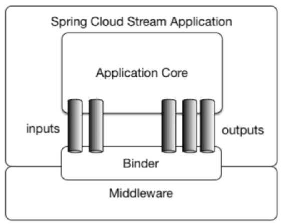
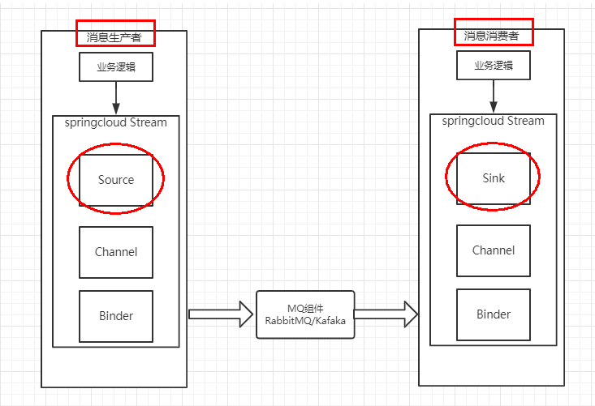
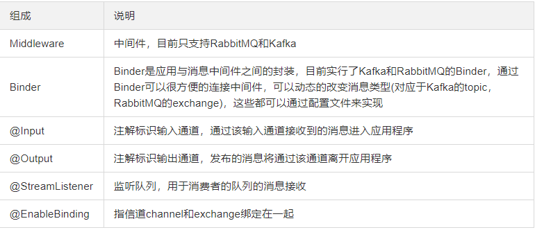

# Stream概述

官方定义 Spring Cloud Stream 是一个构建消息驱动微服务的框架。

应用程序通过 inputs 或者 outputs 来与 Spring Cloud Stream中**binder**对象交互。

而用户只需配置**binding**(绑定) 。

binder对象负责与消息中间件交互。

通过使用Spring **Integration**来连接消息代理中间件以实现消息事件驱动。

Spring Cloud Stream 为一些供应商的消息中间件产品提供了个性化的自动化配置实现，引用了发布-订阅、消费组、分区的三个核心概念。

目前仅支持RabbitMQ、Kafka。

总结：屏蔽底层消息中间件的差异，降低切换成本，统一消息的编程模型。

# Stream设计思想

标准MQ的设计

生产者、消费者之间靠**消息媒介**传递信息内容 -----》Message

消息必须走特定的**通道** ------》消息通道MessageChannel

消息通道里的消息如何被消费呢 ----》由消息通道MessageChannel的子接口SubscribableChannel

谁负责收发处理 -----》由MessageHandler消息处理器所订阅

 

Stream中的消息通信方式遵循了发布-订阅模式。

Topic主题进行广播，在RabbitMQ就是Exchange、在Kakfa中就是Topic

# Stream流程

Binder：很方便的连接中间件，屏蔽差异

Channel：通道，是队列Queue的一种抽象，在消息通讯系统中就是实现存储和转发的媒介，通过Channel对队列进行配置。

Source和Sink：简单的可理解为参照对象是Spring Cloud Stream自身，从Stream发布消息就是输出，接受消息就是输入。

 

 

# API与常用注解

 

# 构建步骤

## 1、构建消息生产模块

### 1、引入POM

```xml
 <?xml version="1.0" encoding="UTF-8"?>
<project xmlns="http://maven.apache.org/POM/4.0.0"
         xmlns:xsi="http://www.w3.org/2001/XMLSchema-instance"
         xsi:schemaLocation="http://maven.apache.org/POM/4.0.0 http://maven.apache.org/xsd/maven-4.0.0.xsd">
    <parent>
        <artifactId>mscloud</artifactId>
        <groupId>com.atguigu.springcloud</groupId>
        <version>1.0-SNAPSHOT</version>
    </parent>
    <modelVersion>4.0.0</modelVersion>

    <artifactId>cloud-stream-rabbitmq-provider8801</artifactId>

    <dependencies>
        <dependency>
            <groupId>org.springframework.boot</groupId>
            <artifactId>spring-boot-starter-web</artifactId>
        </dependency>
        <dependency>
            <groupId>org.springframework.boot</groupId>
            <artifactId>spring-boot-starter-actuator</artifactId>
        </dependency>
        <dependency>
            <groupId>org.springframework.cloud</groupId>
            <artifactId>spring-cloud-starter-netflix-eureka-client</artifactId>
        </dependency>
		<!--Stream-->   
        <dependency>
            <groupId>org.springframework.cloud</groupId>
            <artifactId>spring-cloud-starter-stream-rabbit</artifactId>
        </dependency>
        <!--基础配置-->
        <dependency>
            <groupId>org.springframework.boot</groupId>
            <artifactId>spring-boot-devtools</artifactId>
            <scope>runtime</scope>
            <optional>true</optional>
        </dependency>
        <dependency>
            <groupId>org.projectlombok</groupId>
            <artifactId>lombok</artifactId>
            <optional>true</optional>
        </dependency>
        <dependency>
            <groupId>org.springframework.boot</groupId>
            <artifactId>spring-boot-starter-test</artifactId>
            <scope>test</scope>
        </dependency>
    </dependencies>

</project>
```

### 2、修改YML

```yml
server:
  port: 8801

spring:
  application:
    name: cloud-stream-provider
  cloud:
      stream:
        binders: # 在此处配置要绑定的rabbitmq的服务信息；
          defaultRabbit: # 表示定义的名称，用于binding整合
            type: rabbit # 消息组件类型
            environment: # 设置rabbitmq的相关的环境配置
              spring:
                rabbitmq:
                  host: localhost
                  port: 5672
                  username: guest
                  password: guest
        bindings: # 服务的整合处理
          output: # 这个名字是一个通道的名称
            destination: studyExchange # 表示要使用的Exchange名称定义
            content-type: application/json # 设置消息类型，本次为json，文本则设置“text/plain”
            binder: defaultRabbit # 设置要绑定的消息服务的具体设置

eureka:
  client: # 客户端进行Eureka注册的配置
    service-url:
      defaultZone: http://localhost:7001/eureka
  instance:
    lease-renewal-interval-in-seconds: 2 # 设置心跳的时间间隔（默认是30秒）
    lease-expiration-duration-in-seconds: 5 # 如果现在超过了5秒的间隔（默认是90秒）
    instance-id: send-8801.com  # 在信息列表时显示主机名称
    prefer-ip-address: true     # 访问的路径变为IP地址
```

### 3、业务类

主启动类无需额外注解

```java
// 消息发送接口
public interface IMessageProvider{
    public String send() ;
}

// 接口实现类
@EnableBinding(Source.class) // 可以理解为是一个消息的发送管道的定义
public class MessageProviderImpl implements IMessageProvider{
    @Resource
    private MessageChannel output; // 消息的发送管道

    @Override
    public String send(){
        String serial = UUID.randomUUID().toString();
        this.output.send(MessageBuilder.withPayload(serial).build()); // 创建并发送消息
        System.out.println("***serial: "+serial);

        return serial;
    }
}

// Controller层
@RestController
public class SendMessageController {
    @Resource
    private IMessageProvider messageProvider;

    @GetMapping(value = "/sendMessage")
    public String sendMessage() {
        return messageProvider.send();
    }
}
```

### 测试

启动Eurake与RabbitMQ，以及消息生产者模块

http://localhost:8801/sendMessage

 

## 2、构建消息消费模块

### 1、引入POM

```xml
<?xml version="1.0" encoding="UTF-8"?>
<project xmlns="http://maven.apache.org/POM/4.0.0"
         xmlns:xsi="http://www.w3.org/2001/XMLSchema-instance"
         xsi:schemaLocation="http://maven.apache.org/POM/4.0.0 http://maven.apache.org/xsd/maven-4.0.0.xsd">
    <parent>
        <artifactId>mscloud</artifactId>
        <groupId>com.atguigu.springcloud</groupId>
        <version>1.0-SNAPSHOT</version>
    </parent>
    <modelVersion>4.0.0</modelVersion>

    <artifactId>cloud-stream-rabbitmq-provider8801</artifactId>

    <dependencies>
        <dependency>
            <groupId>org.springframework.boot</groupId>
            <artifactId>spring-boot-starter-web</artifactId>
        </dependency>
        <dependency>
            <groupId>org.springframework.cloud</groupId>
            <artifactId>spring-cloud-starter-netflix-eureka-client</artifactId>
        </dependency>
        <!--Stream-->
        <dependency>
            <groupId>org.springframework.cloud</groupId>
            <artifactId>spring-cloud-starter-stream-rabbit</artifactId>
        </dependency>
        <dependency>
            <groupId>org.springframework.boot</groupId>
            <artifactId>spring-boot-starter-actuator</artifactId>
        </dependency>
        <!--基础配置-->
        <dependency>
            <groupId>org.springframework.boot</groupId>
            <artifactId>spring-boot-devtools</artifactId>
            <scope>runtime</scope>
            <optional>true</optional>
        </dependency>
        <dependency>
            <groupId>org.projectlombok</groupId>
            <artifactId>lombok</artifactId>
            <optional>true</optional>
        </dependency>
        <dependency>
            <groupId>org.springframework.boot</groupId>
            <artifactId>spring-boot-starter-test</artifactId>
            <scope>test</scope>
        </dependency>
    </dependencies>

</project>
```

### 2、修改YML

```yml
server:
  port: 8802

spring:
  application:
    name: cloud-stream-consumer
  cloud:
      stream:
        binders: # 在此处配置要绑定的rabbitmq的服务信息；
          defaultRabbit: # 表示定义的名称，用于于binding整合
            type: rabbit # 消息组件类型
            environment: # 设置rabbitmq的相关的环境配置
              spring:
                rabbitmq:
                  host: localhost
                  port: 5672
                  username: guest
                  password: guest
        bindings: # 服务的整合处理
          input: # 这个名字是一个通道的名称
            destination: studyExchange # 表示要使用的Exchange名称定义
            content-type: application/json # 设置消息类型，本次为对象json，如果是文本则设置“text/plain”
            binder: defaultRabbit # 设置要绑定的消息服务的具体设置

eureka:
  client: # 客户端进行Eureka注册的配置
    service-url:
      defaultZone: http://localhost:7001/eureka
  instance:
    lease-renewal-interval-in-seconds: 2 # 设置心跳的时间间隔（默认是30秒）
    lease-expiration-duration-in-seconds: 5 # 如果现在超过了5秒的间隔（默认是90秒）
    instance-id: receive-8802.com  # 在信息列表时显示主机名称
    prefer-ip-address: true     # 访问的路径变为IP地址
```

### 3、业务类

主启动类无需添加额外注解

```java
@Component
@EnableBinding(Sink.class)
public class ReceiveMessageListener {
    @Value("${server.port}")
    private String serverPort;

    @StreamListener(Sink.INPUT)
    public void input(Message<String> message) {
        System.out.println("消费者1号，------->接收到的消息：" + message.getPayload()+"\t port: "+serverPort);
    }
}
```

### 测试

启动Eurake、RabbitMQ，与消息生产者

http://localhost:8801/sendMessage

测试8801发送8802接收消息

# 分组消费与持久化

## 问题发现

首先启动两份消息消费者模块，使消息生产者发送一次消息。俩个消息消费者均消费消息。得出有重复消费问题，以及消息持久化问题。

## 解决方案

分组和持久化属性**group**。

**注意**：在Stream中处于**同一个group**中的多个消费者是竞争关系，轮询，能够保证消息只会被其中一个应用消费一次。

不同组是可以全面消费的(重复消费)，同一组内会发生竞争关系，只有其中一个可以消费。

## 分组

### 1、修改YML

将两个消息消费者分为两组

在bings块里进行分组

```yml
cloud:
      stream:
        binders: # 在此处配置要绑定的rabbitmq的服务信息；
          defaultRabbit: # 表示定义的名称，用于于binding整合
            type: rabbit # 消息组件类型
            environment: # 设置rabbitmq的相关的环境配置
              spring:
                rabbitmq:
                  host: localhost
                  port: 5672
                  username: guest
                  password: guest
        bindings: # 服务的整合处理
          input: # 这个名字是一个通道的名称
            destination: studyExchange # 表示要使用的Exchange名称定义
            content-type: application/json # 设置消息类型，本次为对象json，如果是文本则设置“text/plain”
            binder: defaultRabbit # 设置要绑定的消息服务的具体设置
            group: atguiguA # 进行分组
```


### 测试

依旧是重复消费，因为两个消费者在不同组，不同组是可以重复消费的。

只要将两个消费者分在同一组即可。

## 持久化

如果我们没有给服务实例进行分组，当消费者A由于某些原因故障下线了，而此时生产者发送的消息，A即使上线了也收不到，意味着消息丢失了。如果有分组的服务，重启之后则可以消费待消费的消息。

# 扩展

## Binder

通过定义绑定器Binder作为中间层，实现了应用程序与消息中间件细节之间的隔离。

Binder可以生成Binding，Binding用来绑定消息容器的生产者和消费者。

Binding有两种类型，INPUT和OUTPUT，INPUT对应于消费者，OUTPUT对应于生产者。

## Stream凭什么可以统一底层差异？

在没有绑定器这个概念的情况下，我们的SpringBoot应用要直接与消息中间件进行信息交互的时候，由于各消息中间件构建的初衷不同，它们的实现细节上会有较大的差异性。

Stream对消息中间件的进一步封装，可以做到代码层面对中间件的无感知，甚至于动态的切换中间件(rabbitmq切换为kafka)，使得微服务开发的高度解耦，服务可以关注更多自己的业务流程。

通过定义绑定器Binder作为中间层，完美地实现了应用程序与消息中间件细节之间的隔离。

通过向应用程序暴露统一的Channel通道，使得应用程序不需要再考虑各种不同的消息中间件实现。

 


