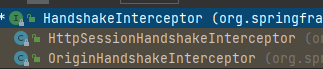
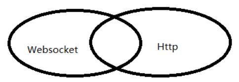

# WebSocket简介

## 1、基本概念

WebSocket 是一种网络通信协议。RFC6455 定义了它的通信标准。

WebSocket 是 HTML5 开始提供的一种在**单个 TCP 连接上进行全双工通讯的协议**。是一种持久化协议。

**出现原因**：

首先HTTP 协议是一种无状态的、无连接的、单向的应用层协议，它采用了请求/响应模型，通信请求只能由客户端发起，服务端对请求做出应答处理。

这种通信模型有一个弊端：HTTP 协议无法实现服务器主动向客户端发起消息。

这种单向请求的特点，注定了如果服务器有连续的状态变化，客户端要获知就非常麻烦。大多数 Web 应用程序将通过频繁的异步 JavaScript 和 XML（AJAX）请求实现长轮询。轮询的效率低，非常浪费资源（因为必须不停连接，或者 HTTP 连接始终打开）。

而 WebSocket 连接允许客户端和服务器之间进行全双工通信，以便任一方都可以通过建立的连接将数据推送到另一端。

WebSocket 优势在于只需要建立一次连接，就可以一直保持连接状态，这相比于轮询方式的不停建立连接显然效率要大大提高。

## 2、原理

首先Websocket是基于HTTP协议的，借用了HTTP的协议来完成一部分握手。

先看一个典型的Websocket握手

~~~http
GET /chat HTTP/1.1
Host: server.example.com
Upgrade: websocket   #核心
Connection: Upgrade  #核心
Sec-WebSocket-Key: x3JJHMbDL1EzLkh9GBhXDw== 
Sec-WebSocket-Protocol: chat, superchat
Sec-WebSocket-Version: 13
Origin: http://example.com
~~~

Upgrade和Connection 用于告诉服务器此次发起的是ws链接

Sec-WebSocket-Key 是浏览器随机生成的Base64 encode的值，用于验证服务器能不能处理ws

Sec-WebSocket-Protocol 是一个用户定义的字符串，用来区分同URL下，不同的服务所需要的协议

Sec-WebSocket-Version 告诉服务器所使用的Websocket Draft（协议版本）

连接成功后，服务器会返回一下内容

~~~http
HTTP/1.1 101 Switching Protocols
Upgrade: websocket
Connection: Upgrade
Sec-WebSocket-Accept: HSmrc0sMlYUkAGmm5OPpG2HaGWk=
Sec-WebSocket-Protocol: chat
~~~

Upgrade和Connection 告诉客服端，服务器已经切换协议

Sec-WebSocket-Accept 经过服务器确认，并且加密过后的 Sec-WebSocket-Key

Sec-WebSocket-Protocol 则是表示最终使用的协议

至此，HTTP已经完成它所有工作了，接下来就是完全按照Websocket协议进行了。


# WebSocket+SpringBoot

## 1、需要先引入依赖--POM

在SpringBoot中集成WebSocket

```xml
<!-- web -->
<dependency>
    <groupId>org.springframework.boot</groupId>
    <artifactId>spring-boot-starter-web</artifactId>
</dependency>

<!-- thymeleaf -->
<dependency>
    <groupId>org.springframework.boot</groupId>
    <artifactId>spring-boot-starter-thymeleaf</artifactId>
    <!-- 2.1.6版本 -->
</dependency>

<!-- WebSocket -->
<dependency>
    <groupId>org.springframework.boot</groupId>
    <artifactId>spring-boot-starter-websocket</artifactId>
</dependency>

<!-- jackson -->
<!-- 由于SockJs与Spring WebSocket之间采用JSON通讯，需要引入jackson的相关jar包 -->
<dependency>
    <groupId>com.fasterxml.jackson.core</groupId>
    <artifactId>jackson-databind</artifactId>
</dependency>
```

## 2、在主启动类添加注解

```java
@SpringBootApplication
// 添加原生Servlet组件
@ServletComponentScan
// 开启WebSocket支持
@EnableWebSocketMessageBroker
public class EatwhatApplication {
    public static void main(String[] args) {
        SpringApplication.run(EatwhatApplication.class, args);
    }

}
```

## 3、增加一个配置类

用于定义 WebSocket 全局配置信息

```java
@Configuration
public class WebSocketConfig implements WebSocketMessageBrokerConfigurer {

    @Override
    public void registerStompEndpoints(StompEndpointRegistry registry) {
        // 配置客户端尝试连接地址
        // 将 /context-path/msg 路径注册为STOMP的端点，用户连接了这个端点后就可以进行websocket通讯
        registry.addEndpoint("/webSocket")
                // 表示可以跨域
                .setAllowedOrigins("*")
                // 表示支持socktJS访问
                // 即可通过http://IP:PORT/context-path/ws来和服务端websocket连接
                .withSockJS();
    }

    @Override
    public void configureMessageBroker(MessageBrokerRegistry registry) {
        // 设置广播节点
        // 表示客户端订阅地址的前缀信息，也就是客户端接收服务端消息的地址的前缀信息
        registry.enableSimpleBroker("/topic");
        // 客户端向服务端发送消息需有/app 前缀
        // "/app" 为配置应用服务器的地址前缀，表示所有以 /app 开头的客户端消息或请求都会路由到带有 @MessageMapping 注解的方法中
        registry.setApplicationDestinationPrefixes("/app");
    }
}
```

## 4、相关注解

### 4.1、@MessageMapping

作用：接收客户端请求连接注解。

注意：只会处理SEND发送的消息。

Spring 对于 WebSocket 封装的特别简单，提供了一个 @MessageMapping 注解，功能类似 @RequestMapping，它是存在于Controller中的（也就是说该类需要添加@Controller注解），定义一个消息的基本请求，功能也跟 @RequestMapping类似，包括支持通配符 的url定义等等。

### 4.2、@SendTo

作用：可以把消息广播到路径上去。

例如下面可以把消息广播到 "/topic/greetings”

```java
@SendTo("/topic/greetings”)
```

如果客户端在这个路径订阅消息，则可以接收到消息

### 4.3、@SubscribeMapping

作用：接收客户端请求连接注解。

注意：只会处理SUBSCRIBE发送的消息。

## 5、简单的后台代码实现

```java
@RestController
public class MSGWebSocketController {

    // 广播模式
    // 接收然后转发至客户端消息
    @MessageMapping("/broadcast")
    @SendTo("/topic/broadcast")
    public String broadcast(String requestMsg) {
        return requestMsg;
    }
    
    // 订阅模式
    @SubscribeMapping("/subscribe")
    public String subscribe() {
        return "success";
    }

}
```

## 6、前台部份JS库函数解释

### 6.1、连接到服务器

必须调用其`connect()`方法来有效地连接和验证到 STOMP 服务器。

连接是异步完成的：您无法保证在调用`connect`返回时有效连接。

要获得连接通知，您需要向该`connect()`方法传递一个成功回调函数，同理也存在一个失败回调函数。

该`connect()`方法接受不同数量的参数以提供在大多数情况下使用的简单 API：

```js
client.connect(login, passcode, connectCallback);
client.connect(login, passcode, connectCallback, errorCallback);
client.connect(login, passcode, connectCallback, errorCallback, host);
```

tip：其中`login`,`passcode`是字符串，`connectCallback`和`errorCallback`是函数（一些代理还需要传递[主机](http://stomp.github.io/stomp-specification-1.1.html#CONNECT_or_STOMP_Frame)字符串host）。

`connect()`如果您需要传递其他标头，该方法还接受其他两个变体：

```
  client.connect(headers, connectCallback);
  client.connect(headers, connectCallback, errorCallback);
```

注意：如果使用这些表单，则**必须自己**添加`login`, `passcode`（最终是`host`）标题：

例子：

```js
var headers = {
    login: 'mylogin',
    passcode: 'mypasscode',
    // additional header
    'client-id': 'my-client-id'
};
client.connect(headers, connectCallback);
```

如果headers为空请使用{}

要断开客户端与服务器的连接，您可以调用其`disconnect()`方法。断开连接是异步的：为了在断开连接有效时得到通知，该`disconnect`方法采用一个可选`callback`参数。同`connect()`

```js
client.disconnect(function() {
    alert("See you next time!");
};
```

### 6.2、发送信息

使用`send()`方法发送 STOMP 消息。

该方法采用`destination`即目的地地址 与 STOMP 目标相对应的强制参数（例如/xxxx/1，在后台请求为/xxxx/{id}）。它还需要两个可选参数：`headers`一个包含附加消息头的 JavaScript 对象和`body`一个 String 对象。

```js
client.send("/queue/test", {priority: 9}, "Hello, STOMP");
```

如果headers为空请使用{}

### 6.3、订阅和接收消息

要在浏览器中接收消息，STOMP 客户端必须首先订阅目的地。

tip：可以在连接成功的回调函数中订阅。

可以使用`subscribe()`方法订阅目的地。该方法采用 2 个强制参数：`destination`即目标地址，一个对应于处理返回目标的字符串 `callback`回调函数，一个带有一个`message`参数和一个*可选*参数的函数`headers`，一个用于附加标头的 JavaScript 对象。

```js
client.subscribe("/queue/test", callback);
callback = function(message) {
    // called when the client receives a STOMP message from the server
    if (message.body) {
        alert("got message with body " + message.body)
    } else {
        alert("got empty message");
    }
});
```

### 6.4、JSON 支持

STOMP 消息的正文必须是`String`. 如果要发送和接收 [JSON](http://json.org/)对象，可以使用`JSON.stringify()`和`JSON.parse()`将 JSON 对象转换为字符串，反之亦然。

```js
var quote = {symbol: 'APPL', value: 195.46};
client.send("/topic/stocks", {}, JSON.stringify(quote));

client.subcribe("/topic/stocks", function(message) {
    var quote = JSON.parse(message.body);
    alert(quote.symbol + " is at " + quote.value);
};
```

## 7、简单的前台代码实现

```html
<!DOCTYPE html>
<html lang="en">
<head>
    <meta charset="UTF-8">
    <title>webSocket</title>
	<!--  引入三个相关依赖  -->
    <script th:src="@{'js/jquery-3.6.0.min.js'}"></script>
    <script th:src="@{'js/sockjs.min.js'}"></script>
    <script th:src="@{'js/stomp.min.js'}"></script>
</head>
<body>

<div>
    <button id="connect">连接</button>
    <button id="disconnect" disabled="disabled">断开</button>
</div>
<div>
    <h3>广播形式</h3>
    <button id="broadcastButton">发送</button>
    <input id="broadcastText" type="text">
    <label>广播消息：</label><input id="broadcastMsg" type="text" disabled="disabled">
</div>
<div>
    <h3>订阅形式</h3>
    <label>订阅消息：</label><input id="subscribeMsg" type="text" disabled="disabled">
</div>

</body>

<script>
    let stomp = null;

    $("#connect").click(function () {
        const url = "http://localhost:8894/hungry/webSocket";
        const socket = new SockJS(url);
        stomp = Stomp.over(socket);
        // 连接
        // 采用的是 client.connect(headers, connectCallback, errorCallback);
        // headers为映射，可传递其他标头
        stomp.connect({}, connect_callback, error_callback);
    });

    // 连接成功回调函数
    const connect_callback = function () {
        // called back after the client is connected and authenticated to the STOMP server
        alert("连接成功，欢迎!")

        // 要接收到消息，需要先订阅地址
        // 使用方法subscribe()订阅目的地
        // 订阅广播
        // "/topic/broadcast"：订阅的地址
        // function：回调函数，接收到消息后干的事
        // 每次服务端向客户端发送消息时，客户端会依次调用该消息对应的 STOMP Frame 对象的回调
        stomp.subscribe("/topic/broadcast", function (res) {
            $("#broadcastMsg").val(res.body);
        });

        // 订阅，一般只有订阅的时候在返回
        stomp.subscribe("/app/subscribe", function (res) {
            $("#subscribeMsg").val(res.body);
        });
        setConnect(true);
    };

    // 连接失败回调函数
    const error_callback = function () {
        // display the error's message header:
        alert("连接失败咯");
    };

    // 断开连接
    $("#disconnect").click(function () {
        if (stomp != null) {
            stomp.disconnect();
        }
        setConnect(false);
    });

    // 设置按钮状态
    function setConnect(connectStatus) {
        $("#connect").attr("disabled", connectStatus);
        $("#disconnect").attr("disabled", !connectStatus);
    }

    // 发送广播消息
    $("#broadcastButton").click(function () {
        // "/app/broadcast"：要发送的目的地
        // {}：没有要传递的标头，使用空的JavaScript文字{}
        // JSON.stringify({"body": $("#broadcastText").val()})：body一个 String 对象
        stomp.send("/app/broadcast", {}, JSON.stringify({"body": $("#broadcastText").val()}))
    });

</script>
</html>
```

## 8、补充

### 8.1、配置拦截器

默认有两种：

- **HandshakeInterceptor**：拦截websocket的握手请求。在服务端和客户端在进行握手时会被执行。
- **ChannelInterceptor**：拦截Message。可以在Message对被在发送到MessageChannel前后查看修改此值，也可以在MessageChannel接收MessageChannel对象前后修改此值。

### 8.2、HandshakeInterceptor拦截器

实现**接口HandshakeInterceptor**或继承**类DefaultHandshakeHandler**   



两个实现类：

- **HttpSessionHandshakeInterceptor**：关于HttpSession的操作，这个拦截器用来管理握手和握手后的事情。我们可以通过请求信息，比如token、或者session判用户是否可以连接，这样就能够防范非法用户 。

- **OriginHandshakeInterceptor**：检查Origin头字段的合法性

**自定义HandshakeInterceptor ：**

```java
@Component
public class IHandShakeInterceptor implements HandshakeInterceptor {
    @Override
    public boolean beforeHandshake(ServerHttpRequest request, ServerHttpResponse response, WebSocketHandler wsHandler, Map<String, Object> attributes) throws Exception {
        System.out.println(this.getClass().getCanonicalName() + "http协议转换websoket协议进行前, 握手前"+request.getURI());
        // http协议转换websoket协议进行前，可以在这里通过session信息判断用户登录是否合法
        return true;

    }

    @Override
    public void afterHandshake(ServerHttpRequest request, ServerHttpResponse response, WebSocketHandler wsHandler, Exception exception) {
        //握手成功后,
        System.out.println(this.getClass().getCanonicalName() + "握手成功后...");
    }
}
```

### 8.3、ChannelInterceptor拦截器

在此拦截器中使用**StompHeaderAccessor** 或 **SimpMessageHeaderAccessor**访问消息

**自定义ChannelInterceptorAdapter**：

```java
@Component
public class MyChannelInterceptorAdapter extends ChannelInterceptorAdapter {

    @Autowired
    private SimpMessagingTemplate simpMessagingTemplate;

    @Override
    public boolean preReceive(MessageChannel channel) {
        System.out.println(this.getClass().getCanonicalName() + " preReceive");
        return super.preReceive(channel);
    }

    @Override
    public Message<?> preSend(Message<?> message, MessageChannel channel) {
        System.out.println(this.getClass().getCanonicalName() + " preSend");
        StompHeaderAccessor accessor = StompHeaderAccessor.wrap(message);
        StompCommand command = accessor.getCommand();
        //检测用户订阅内容（防止用户订阅不合法频道）
        if (StompCommand.SUBSCRIBE.equals(command)) {
            System.out.println(this.getClass().getCanonicalName() + " 用户订阅目的地=" + accessor.getDestination());
            // 如果该用户订阅的频道不合法直接返回null前端用户就接受不到该频道信息
            return super.preSend(message, channel);
        } else {
            return super.preSend(message, channel);
        }

    }
    @Override
    public void afterSendCompletion(Message<?> message, MessageChannel channel, boolean sent, Exception ex) {
        System.out.println(this.getClass().getCanonicalName() +" afterSendCompletion");
        StompHeaderAccessor accessor = StompHeaderAccessor.wrap(message);
        StompCommand command = accessor.getCommand();
        if (StompCommand.SUBSCRIBE.equals(command)){
            System.out.println(this.getClass().getCanonicalName() + " 订阅消息发送成功");
            this.simpMessagingTemplate.convertAndSend("/topic/getResponse","消息发送成功");
        }
        //如果用户断开连接
        if (StompCommand.DISCONNECT.equals(command)){
            System.out.println(this.getClass().getCanonicalName() + "用户断开连接成功");
            simpMessagingTemplate.convertAndSend("/topic/getResponse","{'msg':'用户断开连接成功'}");
        }

        super.afterSendCompletion(message, channel, sent, ex);
    }
}
```

### 8.4、注册拦截器

- 在**registerStompEndpoints()**方法中通过registry.addInterceptors(myHandShakeInterceptor)添加自定义**HandShkeInceptor** 拦截

- 在**configureClientInboundChannel()**方法中registration.setInterceptors(myChannelInterceptorAdapter)添加**ChannelInterceptor**拦截器

## 9、扩展

### 9.1、HttpSessionHandshakeInterceptor拦截器

`HttpSessionHandshakeInterceptor`将HttpSession中的值保存到了一个Map里面，可以通过注入`SimpMessageHeaderAccessor`在Controller方法中获取到那些值。

```java
@MessageMapping("/chat")
public void chat(SimpMessageHeaderAccessor headerAccessor, @RequestBody ChatMessage chatMessage) {
    User user = (User) headerAccessor.getSessionAttributes().get("user");  // right
    chatService.chat(user,chatMessage);
}
```

### 9.2、SpringSession整合

添加依赖后，修改WebSocket配置类

- 不实现接口 **WebSocketMessageBrokerConfigurer**，而是继承 **AbstractSessionWebSocketMessageBrokerConfigurer<>**
- 将方法 **registerStompEndpoints()** 重命名为 **configureStompEndpoints()** 

AbstractSessionWebSocketMessageBrokerConfigurer类**在后台做的事**：

- **WebSocketConnectHandlerDecoratorFactory** 作为 **WebSocketHandlerDecoratorFactory** 添加到 **WebSocketTransportRegistration** 
  - 这可确保触发包含 WebSocketSession 的自定义 SessionConnectEvent
  - 当SpringSession结束时，WebSocketSession是结束仍然打开的任何 WebSocket 连接所必需的。
- **SessionRepositoryMessageInterceptor** 作为 **HandshakeInterceptor** 添加到 **StompWebSocketEndpointRegistration** 
  - 这可确保将 Session 添加到 WebSocket 属性以启用更新上次访问的时间。
- **SessionRepositoryMessageInterceptor** 作为 **ChannelInterceptor** 添加到入站的 **ChannelRegistration** 
  - 这确保每次收到入站消息时，都会更新 SpringSession 的最后访问时间。
- **WebSocketRegistryListener** 被创建并添加入到Spring的IOC容器中。
  - 这确保我们将所有 SessionID 映射到相应的 WebSocket 连接。通过维护这个映射，我们可以在一个 SpringSession（HttpSession）结束时关闭所有的 WebSocket 连接。

### 9.3、SimpMessageHeaderAccessor

通过注入`SimpMessageHeaderAccessor`在Controller方法中获取到那些值。

# 问题

## 1、HTTP 和 WebSocket

Websocket 是一个新协议，跟 HTTP 协议基本没有关系，只是为了兼容现有浏览器的握手规范而已，也就是说它是 HTTP 协议上的一种补充。




