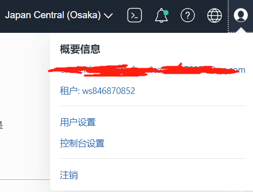
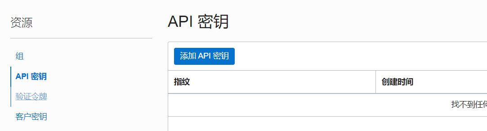
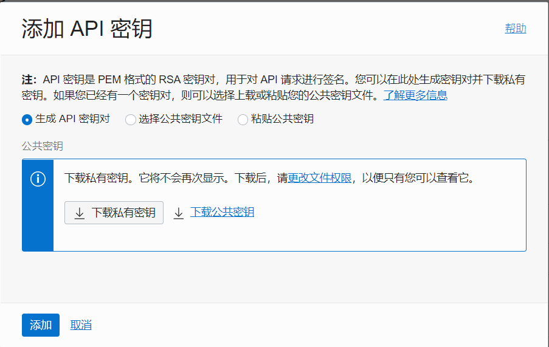
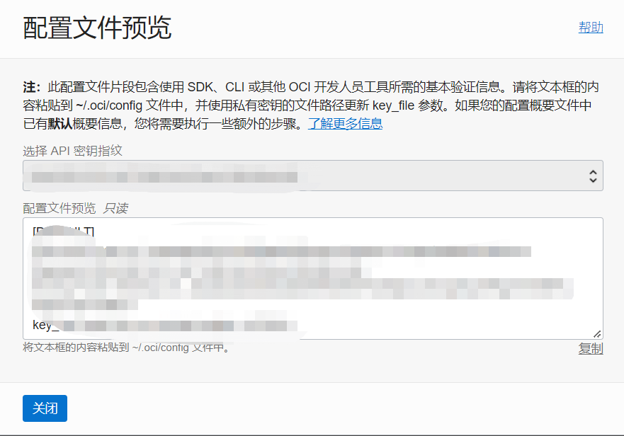

# 1、OracleCloud

## 1、对象存储

### 1、配置

先点击右上角的用户控制台，点击用户设置



选择API密钥，添加API密钥



下载私有密钥即可



然后点击添加，复制配置文件内容



### 2、配置JavaSDK

在POM文件添加依赖

~~~xml
<dependencies>
    <dependency>
        <groupId>com.oracle.oci.sdk</groupId>
        <artifactId>oci-java-sdk-audit</artifactId>
    </dependency>
    <dependency>
        <groupId>com.oracle.oci.sdk</groupId>
        <artifactId>oci-java-sdk-core</artifactId>
    </dependency>
    <dependency>
        <groupId>com.oracle.oci.sdk</groupId>
        <artifactId>oci-java-sdk-database</artifactId>
    </dependency>
    <dependency>
        <groupId>com.oracle.oci.sdk</groupId>
        <artifactId>oci-java-sdk-objectstorage</artifactId>
    </dependency>
    <dependency>
        <groupId>com.oracle.oci.sdk</groupId>
        <artifactId>oci-java-sdk-common</artifactId>
    </dependency>

    <dependency>
        <groupId>com.fasterxml.jackson.core</groupId>
        <artifactId>jackson-annotations</artifactId>
    </dependency>
    <dependency>
        <groupId>com.fasterxml.jackson.core</groupId>
        <artifactId>jackson-databind</artifactId>
    </dependency>
    <dependency>
        <groupId>com.google.guava</groupId>
        <artifactId>guava</artifactId>
    </dependency>


</dependencies>

<dependencyManagement>
    <dependencies>
        <dependency>
            <groupId>com.oracle.oci.sdk</groupId>
            <artifactId>oci-java-sdk-bom</artifactId>
            <!-- replace the version below with your required version -->
            <version>1.5.2</version>
            <type>pom</type>
            <scope>import</scope>
        </dependency>
    </dependencies>
</dependencyManagement>
~~~

### 3、编码

```java
// 使用自定义的配置，默认配置更方便
// 但是由于本次测试实在win环境下，就是用自定的
public class OOSUtil {
    // 根据对象储存所在位置配置端点
    public static String point = "https://objectstorage.ap-osaka-1.oraclecloud.com";
    String keyFile = "刚刚下载的 .pem 文件路径";

    public void test() throws IOException {

        // 认证权限提供
        Supplier<InputStream> privateKeySupplier = new SimplePrivateKeySupplier(keyFile);
        AuthenticationDetailsProvider provider
                = SimpleAuthenticationDetailsProvider.builder()
                .tenantId("在刚刚复制的config里")
                .userId("在刚刚复制的config里")
                .fingerprint("在刚刚复制的config里")
                .privateKeySupplier(privateKeySupplier)
                .build();

        // 创建对象存储客户端
        ObjectStorageClient client = new ObjectStorageClient(provider);
        // 设置端点
        client.setEndpoint(point);

        // 获取桶列表
        ListBucketsRequest listBucketsRequest = ListBucketsRequest.builder()
                .namespaceName("名称空间")
            	.compartmentId("和tenantId一致")
                .build();
        ListBucketsResponse listBuckets = client.listBuckets(listBucketsRequest);
        List<BucketSummary> items = listBuckets.getItems();
        BucketSummary bucket = items.get(0);
        System.out.println(bucket);

        // 获取对象列表
        String prefix = "对象";
        ListObjectsRequest listObjectsRequest = ListObjectsRequest.builder()
                .namespaceName(bucket.getNamespace())
                .bucketName(bucket.getName())
                .prefix(prefix) // 设置过滤对象名前缀
                .build();
        ListObjectsResponse listObjectsResponse = client.listObjects(listObjectsRequest);
        ListObjects listObjects = listObjectsResponse.getListObjects();
        List<ObjectSummary> objects = listObjects.getObjects();
        System.out.println(objects);

        // 获取对象
        ObjectSummary object = objects.get(1);
        String name = object.getName();
        GetObjectRequest getObjectRequest = GetObjectRequest.builder()
                .namespaceName(bucket.getNamespace())
                .bucketName(bucket.getName())
                .objectName(name)
                .build();
        GetObjectResponse objectResponse = client.getObject(getObjectRequest);
        InputStream is = objectResponse.getInputStream();
        System.out.println(objectResponse.getContentLength());
        byte[] bytes = is.readAllBytes();
        FileOutputStream fos = new FileOutputStream(name.substring(prefix.length()+1));
        BufferedOutputStream bos = new BufferedOutputStream(fos);
        bos.write(bytes);
        fos.close();
        bos.close();
        is.close();

        // 发送对象
        String path = "Deploy.png";
        File file = new File(path);
        FileInputStream fis = new FileInputStream(file);
        PutObjectRequest putObjectRequest = PutObjectRequest.builder()
                .namespaceName(bucket.getNamespace())
                .bucketName(bucket.getName())
                .objectName(prefix+"/"+path)
                .contentLength(file.length())
                .putObjectBody(fis)
                .build();
        PutObjectResponse putObjectResponse = client.putObject(putObjectRequest);
        System.out.println(putObjectResponse);
    }
```


