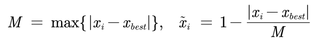
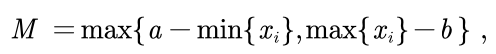
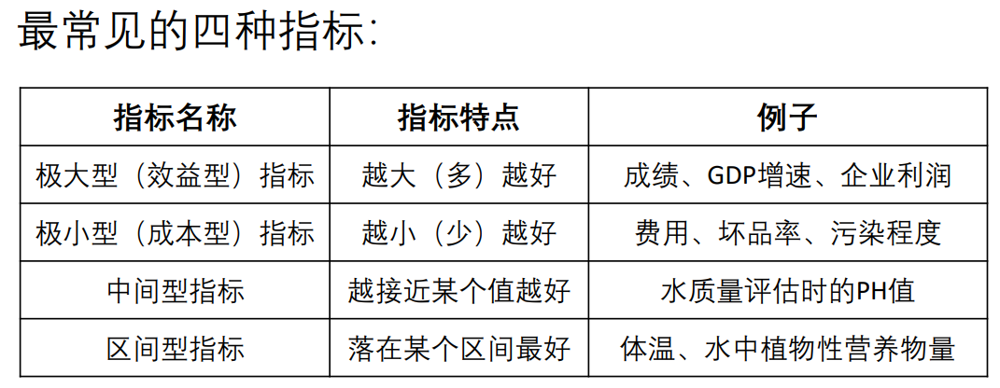
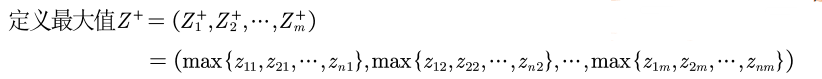
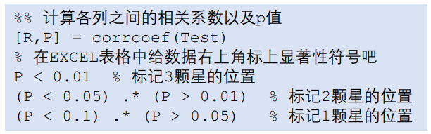
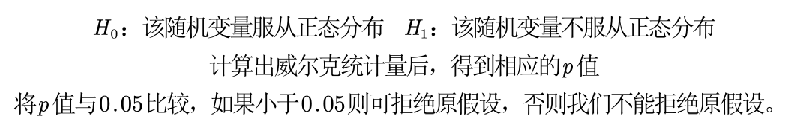

# 1、层次分析法

## 1、概览

## 2、步骤

**1、**分析系统中各因素之间的关系，建立系统的递阶层次结构

**2、**对于同一层次的各元素关于上一层次中某一准则的重要性进行两两比较，构造两两比较矩阵（判断矩阵）

**3、**对判断矩阵进行一致性检验（检验通过权重才能用）

第一步：计算一致性指标CI

第二步：查找对应的平均随机一致性指标RI

第三步：计算一致性比例CR

如果CR < 0.1,  则可认为判断矩阵的一致性可以接受，否则需要对判断矩阵进行修正。

**4、**由判断矩阵计算被比较元素对于该准则的相对权重

三种方法计算权重：

- 算术平均法
- 几何平均法
- 特征值法

**5、**根据权重矩阵计算得分，并进行排序

## 3、局限性

- 评价的决策层不能太多，太多的话n会很大，判断矩阵和一致矩阵差异可能会很大。

- 可以利用决策层中已知的指标数据

# 2、优劣解距离法

## 1、概览

TOPSIS 法是一种常用的综合评价方法，其能充分利用原始数据的信息，精确地反映各评价方案之间的差距

## 2、步骤

**1、**将原始矩阵正向化

所谓的将原始矩阵正向化，就是要将所有的指标类型统一转化为极大型指标。

- 极小型指标：max -  x，如果所有的元素均为正数，那么也可以使用 1 / x
- 中间型指标：
- 区间型指标：

**2、**正向化矩阵标准化

标准化的目的是消除不同指标量纲的影响

或者 (x‐x的均值)/x的标准差

**3、**计算得分并归一化

扩展：添加权重

可以使用层次分析法添加权重，熵权法（不推荐）

# 3、插值算法

## 1、概览

现有的数据极少，不足以支撑分析的进行，需要使用一些数学的方法，“模拟产生”一些新的但又比较靠谱的值来满足需求

方法：拉格朗日插值、牛顿插值、埃尔米特插值

注意：龙格现象

## 2、步骤

# 4、拟合算法

## 1、概览

与插值问题不同，在拟合问题中不需要曲线一定经过给定的点

拟合问题的目标是寻求一个函数（曲线），使得该曲线在某种准则下与所有的数据点最为接近，即曲线拟合的最好（最小化损失函数）。

方法：最小二乘法、cftool工具箱

## 2、步骤

# 5、相关系数

## 1、概览

皮尔逊pearson相关系数和斯皮尔曼spearman等级相关系数，它们可用来衡量两个变量之间的相关性的大小

- 总体：所要考察对象的全部个体叫做总体，我们总是希望得到总体数据的一些特征（例如均值方差等） 
- 样本：从总体中所抽取的一部分个体叫做总体的一个样本
- 计算这些抽取的样本的统计量来估计总体的统计量：使用样本均值、样本标准差来估计总体的均值和总体的标准差（偏离程度）

## 2、皮尔逊相关系数

### 1、步骤

皮尔逊相关系数也可以看成是剔除了两个变量量纲影响，即将X和Y标准化后的协方差。

**注意**：

- 非线性相关也会导致线性相关系数很大，图二
- 离群点对相关系数的影响很大，图三
- 如果两个变量的相关系数很大也不能说明两者相关，可能是受到了异常值的影响，图四
- 相关系数计算结果为0，只能说不是线性相关，但说不定会有更复杂的相关关系（非线性相关），图五
- 必须先确认这两个变量是线性相关的，才能用相关系数说明之间的关系
- 比起相关系数的大小，更关注的是显著性

### 2、假设检验

**注意**：

- 实验数据通常假设是成对的来自于正态分布的总体，因为我们在求皮尔逊相关性系数以后，通常还会用t检验之类的方法来进行皮尔逊相关性系数检验， 而t检验是基于数据呈正态分布的假设的
- 实验数据之间的差距不能太大，皮尔逊相关性系数受异常值的影响比较大
- 每组样本之间是独立抽样的，构造t统计量时需要用到

### 3、p值判断法

**注意**：

- Matlab计算的是双侧检验的p值，如果需要单侧的话只需要除以2即可。

## 3、正态分布检验

### 1、雅克贝拉检验

**注意**：

- 大样本 n > 30

### 2、夏皮洛威尔克检验

样本量：3 <= n <= 50

可使用spss

### 3、QQ图

## 4、斯皮尔曼相关系数

### 1、步骤

**注意**：

- 如果有的数值相同，则将它们所在的位置取算术平均

### 2、假设性检验

样本量：n <= 30

直接查表

**注意**：

- 连续数据，正态分布，线性关系，用pearson相关系数是最恰当，当然用spearman相关系数也可以，就是效率没有pearson相关系数高
- 上述任一条件不满足，就用spearman相关系数，不能用pearson相关系数
- 两个定序数据之间也用spearman相关系数，不能用pearson相关系数

定序数据是指仅仅反映观测对象等级、顺序关系的数据，是由定序尺度计量形成的，表现为类别，可以进行排序的属于品质数据

