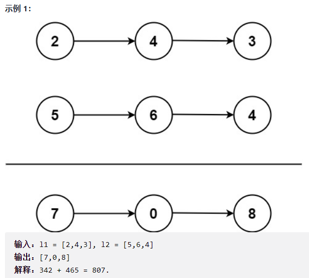

# 腾讯面试题

## 1、链表

### 1.1、两数相加

```text
给你两个 非空 的链表，表示两个非负的整数。它们每位数字都是按照 逆序 的方式存储的，并且每个节点只能存储 一位 数字。

请你将两个数相加，并以相同形式返回一个表示和的链表。

你可以假设除了数字 0 之外，这两个数都不会以 0 开头。
```



思路：不能够将两个链表反转后，依次取出转为int型，测试用例会超出int型的范围。需要逐个计算，首先创建一个新节点 result 存放结果，一个操作节点 tp 用于直接操作，再创建一个int型 num 用于存放两节点之和且用其判断是否需要最后进位，通过while循环遍历两条链表。

```java
public ListNode addTwoNumbers(ListNode l1, ListNode l2) {
    ListNode result = new ListNode();
    ListNode tp = result;
    int num = 0;
    								//判断最后是否需要进位
    while (l1 != null || l2 != null || num != 0) {

        if(l1 != null) {
            num += l1.val;
            l1 = l1.next;
        }
        if(l2 != null) {
            num += l2.val;
            l2 = l2.next;
        }

        tp.next = new ListNode(num % 10);
        tp = tp.next;
        num /= 10;

    }
    return result.next;
}
```

