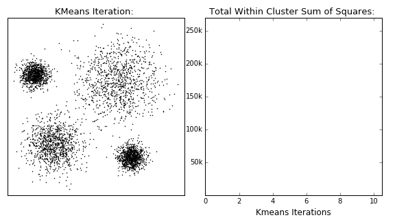

# 3、聚类算法

## 1、概述

聚类（Clustering）是最常见的无监督学习算法，它指的是按照某个特定标准（如距离）把一个数据集分割成不同的类或簇，使得同一个簇内的数据对象的相似性尽可能大，同时不在同一个簇中的数据对象的差异性也尽可能地大，也即聚类后同一类的数据尽可能聚集到一起，不同类数据尽量分离。

聚类算法在很多场景下都有应用，例如新闻自动分组，用户分群，图像分割等等，很多时候，无监督的聚类算法，得到的聚类结果还可以作为特征在后续监督学习中应用，提升整体效果。

> 监督学习：分类预测、回归分析
>
> 无监督学习：聚类、降维
>
> 强化学习：Q-Learning、时间差学习

主流的聚类算法可以分成两类：**划分聚类**（Partitioning Clustering）和**层次聚**类（Hierarchical Clustering）

- 划分聚类算法会给出一系列**扁平结构的簇**（分开的几个类），它们之间没有任何显式的结构来表明彼此的关联性。
  - 常见算法有 K-Means/K-Medoids、Gaussian Mixture Model （高斯混合模型）、Spectral Clustering（谱聚类）、Centroid-based Clustering（质心聚类）等。
- 层次聚类会输出一个具有**层次结构的簇**集合，因此能够比划分聚类输出的无结构簇集合提供更丰富的信息，层次聚类可以认为是是嵌套的划分聚类。
  - 常见算法有 Single-linkage、Complete-linkage、Connectivity-based Clustering等。

聚类VS分类：

- 聚类：不关心某一类是什么，目标是指吧相同的东西划分在一类，只需要知道如何计算相似度即可开始。

- 分类：告诉分类器某一个东西被分为一类的例子，分类器就会从数据集中学习，具备对未知数据分类的能力

## 2、划分聚类

### 1、K-Means算法

#### 1、核心概念

数据点到中心点的距离，一般选择L2距离。

对于多个中心点的情况，全局最优是一个相当难的问题，理论上存在一个全局最优解，但是不一定能找到，所以看能不能找到局部最优解。

>L1距离（也就是曼哈顿距离Manhattan Distance）：求点的绝对值
>
>L2距离（就是欧氏距离）：两个点相减的平方和再开根号

K-Means采用EM算法迭代确定中心点，流程分两步：

- **更新中心点**：初始化的时候以随机取点作为起始点，迭代过程中遍历所有样本，把样本划分到距离最近的一个中心，取同一类的所有数据点的重心（或质心）作为新中心点。
- **分配数据点**：把所有的数据点分配到离它最近的中心点。
- 重复上面的两个步骤，一直到中心点不再改变为止、所有的距离最小、迭代次数达到设定值都会停止

#### 2、K-Means缺点与改进

K-Means算法简单易用，但是也有缺点：

- 中心点是所有同一类数据点的质心，所以聚类中心点可能不属于数据集的样本点。
- 计算距离时我们用的是L2距离的平方，对离群点很敏感，**噪声**（Noisy Data）和**离群点**（Outlier）会把中心点拉偏，甚至改变分割线的位置。

### 2、K-Medoids算法

针对K-Means算法的缺点改进得到了K-Medoids算法：

- 限制聚类中心点必须来自数据点。

  - 求中心点的计算方法，由原来的直接计算重心，变成计算完重心后，在重心附近找一个数据点作为新的中心点。

  - K-Medoids重拟合步骤比直接求平均的K-Means要复杂一些。

- 为避免平方计算对离群点的敏感，把平方变成绝对值，即L2距离转为L1距离。

总结来说，K-Medoids算法的迭代过程与K-Means是一致的，不同点如下所示：

- 起始点不是随机点，而是任意选择数据集中的点。
- 距离使用L1距离，而不是L2距离。
- 新的中心点，也不是同类所有点的重心，而是同一类别所有数据点中，离其它点最近的点。
- 复杂度方面，相比于K-Means的 O(n) ，K-Medoids更新中心点的复杂度 O(n2)要更高一些。

## 3、层次聚类

### 1、Single-Linkage 算法

#### 1、核心概念

这个算法是构造一棵二叉树，用叶节点代表数据，而二叉树的每一个内部节点代表一个聚类。

初始化的时候，将每个数据看做一个类，然后进行迭代，每次选择**距离最近的两个类**进行合并，将合并的类从类簇中删除，将新类加入到类簇中。

距离最近的两个类：两个类中距离最近的两个元素。

层次聚类的计算复杂度是 O(n3) 级别，可以用优先队列的数据结构对算法加速，加速后能减低到 O(n2logn) 的级别。

### 2、Complete-Linkage算法

#### 1、核心概念

与Single-Linkage算法相似，Complete-Linkage的迭代思路是一样的，不同的是在合并类时，Complete-Linkage恰恰相反，用**距离最远**的两个数据点之间的距离作为这两个类之间的距离。

## 4、密度聚类

#### 1、DB-SCAN算法

