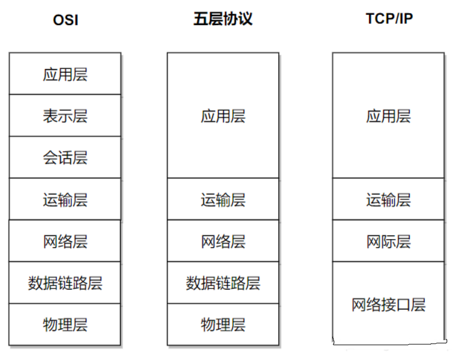
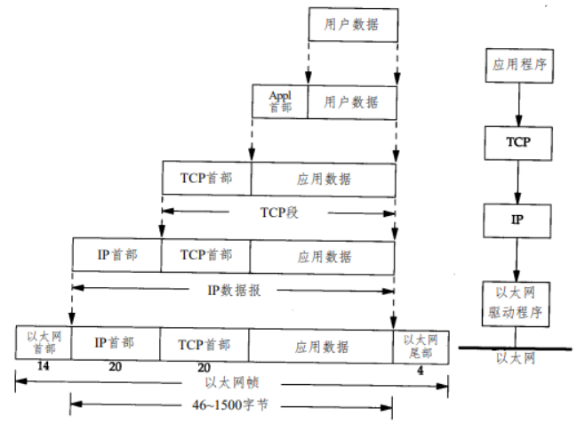
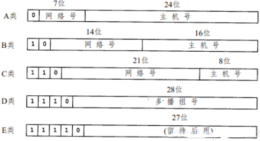
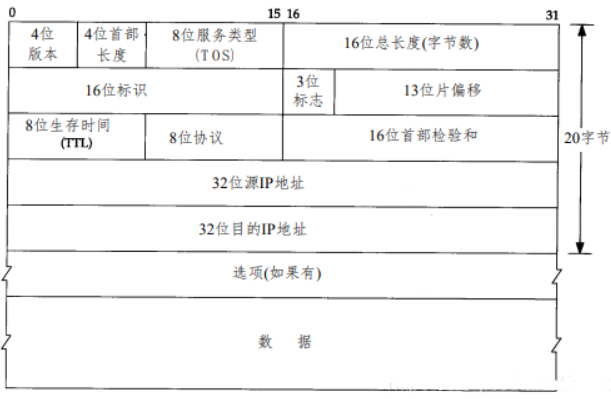
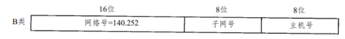

# 1、计算机网络体系结构

## 1、概览

## 2、分层简介

**五层协议**：

- **应用层**：为**特定应用程序**提供数据传输服务
  - Telnet： 远程登录。
  - FTP：文件传输协议。
  - SMTP： 简单邮件传送协议。
  - SNMP：简单网络管理协议。
- **传输层**：为**主机中的进程**提供通用数据传输服务
  - 端到端----进程之间
  - 由于应用层协议很多，定义通用的传输层协议就可以支持不断增多的应用层协议，也就是弥补上三层与下三层数据传输服务质量之间的差异（差错率、差错恢复能力、吞吐率、延时、费用等），对高层屏蔽网络层的服务的差异，提供稳定和一致的界面
  - 传输层会将数据分段，并进行必要的控制，以便将这些片段重组成各种通信流，在此过程中，传输层负责：
    - 跟踪源主机和目的主机上应用程序间的每次通信
    - 将数据分段，并管理每个片段
    - 将分段数据重组为应用程序数据流
    - 标识不同的应用程序

  - 主要协议：
    - TCP：传输控制协议 （面向字节流 ）
    - UDP：用户数据报协议（面向数据报） 

- **网络层**：为**主机**提供数据传输服务
  - 点到点----主机之间
  - 网络层把传输层传递下来的报文段或者用户数据报封装成分组
  - 网络层的分组传输是不可靠的，无法了解数据到达终点的时间，无法了解数据未达终点的状态
  - IP协议：网际协议
  - ICMP协议：Internet互联网控 制报文协议
  - IGMP协议：Internet组管理协议 

- **数据链路层**：链路层协议就是为**同一链路的主机**提供数据传输服务
  - 主机之间可以有很多链路
  - 数据链路层把网络层传下来的分组封装成帧

- **物理层**：考虑的是怎样**在传输媒体上传输数据比特流**，而不是指具体的传输媒体
  - 物理层的作用是尽可能屏蔽传输媒体和通信手段的差异，使数据链路层感觉不到这些差异

**OSI七层**：

- **表示层**：数据压缩、加密以及数据描述，这使得应用程序不必关心在各台主机中数据内部格式不同的问题
- **会话层**：建立及管理会话
- prc协议：(远程方法调用协议)

**TCP/IP四层**：

- 它只有四层，相当于五层协议中数据链路层和物理层合并为网络接口层
- TCP/IP 体系结构不严格遵循 OSI 分层概念，应用层可能会直接使用 IP 层或者网络接口层

## 3、数据封装

元数据进行网络传输，需要先进行**逐层封装**和**逐层解析**的过程，如下图：

向下的过程中，需要添加下层协议所需要的首部或者尾部，而在向上的过程中不断拆开首部和尾部

路由器只有下面三层协议，因为路由器位于网络核心中，不需要为进程或者应用程序提供服务，因此也就不需要传输层和应用层

## 4、端口号

### 1、基本概念

运行在计算机中的进程是用**进程标识符**来标志的，运行在应用层的各种应用进程却由于操作系统的不同，不能使用该方法，所以再运输层使用协议端口号(protocol port number)，或通常简称为端口(port)，来标识

一个应用进程可以绑定多个端口号，而一个端口号只能被一个应用进程绑定

### 2、端口号范围的划分

0 - 1023：知名端口号，HTTP，FTP，SSH等这些广为使用的应用层协议，其端口号都是固定的

1024 - 65535：操作系统动态分配的端口号，客户端程序的端口号就是由操作系统从这个范围分配的

# 2、IP 协议

## 1、概览

IP协议在OSI七层协议中位于**网络层**，在物理层和链路层之上

网络层是整个互联网的核心，使用 IP 协议，可以把异构的物理网络连接起来，使得在网络层看起来好像是一个统一的网络

IP协议是TCP/IP协议族中最为核心的协议，所有的 TCP、UDP、ICMP及IGMP数据都以IP数据报格式传输

IP数据报传送服务具有不可靠性、无连接性

- **不可靠性**（unreliable）：
  - 意思是它不能保证IP数据报能成功地到达目的地
  - IP仅提供最好的传输服务，如果发生某种错误时，如某个路由器暂时用完了缓冲区， IP有一个简单的错误处理算法：丢弃该数据报，然后发送 ICMP 消息报给信源端
  - 任何要求的可靠性必须由上层来提供（如TCP）

- **无连接性**（connectionless）：
  - 这个术语的意思是IP并不维护任何关于后续数据报的状态信息
  - 每个数据报的处理是相互独立的，这也说明， IP数据报可以不按发送顺序接收，如果一信源向相同的信宿发送两个连续的数据报（先是A，然后是B），每个数据报都是独立地进行路由选择，可能选择不同的路线，因此B可能在A到达之前先到达

与 IP 协议配套使用的还有三个协议：

- 地址解析协议 ARP（Address Resolution Protocol）
- 网际控制报文协议 ICMP（Internet Control Message Protocol）
- 网际组管理协议 IGMP（Internet Group Management Protocol）

## 2、IP分类

IP地址长为**32 bit**，地址具有一定的结构，五类不同的**互联网地址格式**下：

各类IP**地址的范围**：

| 类型 | 范 围                        |
| ---- | ---------------------------- |
| A    | 0.0.0.0 到 127.255.255.255   |
| B    | 128.0.0.0 到 191.255.255.255 |
| C    | 192.0.0.0 到 223.255.255.255 |
| D    | 224.0.0.0 到 239.255.255.255 |
| E    | 240.0.0.0 到 247.255.255.255 |

**三类IP地址**：

- 单播地址（目的为单个主机）
- 广播地址（目的端为给定网络上的所有主机）
- 多播地址（目的端为同一组内的所有主机）

## 3、IP数据报格式

IP地址长度为32bit，普通的IP首部长为20个字节

- 8位生存时间TTL
  - TTL（time - to - live）生存时间字段设置了数据报可以经过的最多路由器数
  - 它指定了数据报的生存时间
  - TTL的初始值由源主机设置（通常为 32或64），一旦经过一个处理它的路由器， 它的值就减去 1，当该字段的值为0时，数据报就被丢弃，并发送 ICMP报文通知源主机
- 16位首部检验和
  - 用于验证传送数据报和接受数据报的差异
  - 首先把检验和字段置为 0，对首部中每个 16 bit 进行二进制反码求和 ，结果存在检验和字段中，收到数据报后再对首部进行计算，相同就把检验和字段置为 1，不同那么IP就丢弃收到的数据报 ，但是不生成差错报文，由上层去发现丢失的数据报并进行重传
- 总长度：占用16位二进制位，总长度字段是指整个IP数据报的长度（报头区+数据区）

## 4、IP路由选择

IP数据包(或者说是路由器)是如何将数据包送到目的地的呢？它是怎么选择一个合适的路径来送货的呢？

最特殊的情况，目的主机和主机直连，那么主机根本不用寻找路由，直接把数据靠ARP协议传递过去就可以了

通常情况，主机通过若干个路由器(router)和目的主机连接，那么路由器就要通过IP包的信息来为IP包寻找到一个合适的目标来进行传递，比如合适的主机，或者合适的路由

路由器或者主机将会用如下的方式来处理某一个IP数据包：

- 如果IP数据包的TTL(生命周期)以到，则该IP数据包就被抛弃
- 搜索路由表，优先搜索匹配主机，如果能找到和IP地址完全一致的目标主机，则将该包发向目标主机
- 搜索路由表，如果匹配主机失败，则匹配同子网的路由器，这需要“子网掩码(1.3.)”的协助，如果找到路由器，则将该包发向路由器
- 搜索路由表，如果匹配同子网路由器失败，则匹配同网号路由器，如果找到路由器，则将该包发向路由器
- 搜索路由表，如果以上都失败了，就搜索默认路由，如果默认路由存在，则发包
- 如果都失败了，就丢掉这个包

这再一次证明了，ip包是不可靠的，因为它不保证送达

## 5、子网寻址

IP地址的定义是 **网络号** + **主机号**，但是现在所有的主机都要求子网编址，也就是说，把主机号在细分成 **子网号 **+ **主机号**

最终一个IP地址就成为 **网络号**+**子网号**+**主机号**

下面就是一个B类地址：

B类网络地址 （140.252），在剩下的16 bit中，8 bit用于子网号，8 bit用于主机号，这样就允许有254个子网，每个子网可以有254台主机（8位一共有256种可能，由于全0或全1的主机号都是无效的， 所以就有254种可能）

# 3、ARP 协议

网络层实现主机之间的通信，而链路层实现具体每段链路之间的通信

在通信过程中，IP 数据报的源地址和目的地址始终不变，而 MAC 地址随着链路的改变而改变，ARP 实现由 IP 地址得到 MAC 地址，称为地址解析协议

每个主机都有一个 ARP 高速缓存，里面有本局域网上的各主机和路由器的 IP 地址 到 MAC 地址的映射表

如果主机 A 知道主机 B 的 IP 地址，但是 ARP 高速缓存中没有该 IP 地址到 MAC 地址的映射，此时主机 A 通过广播的方式发送 ARP 请求分组，主机 B 收到该请求后会发送 ARP 响应分组给主机 A 告知其 MAC 地址，随后主机 A 向其高速缓存中写入主机 B 的 IP 地址到 MAC 地址的映射

# 4、ICMP 协议

ICMP（网际控制报文） 经常被认为是 IP 层的一个组成部分

ICMP 传递差错报文以及其他需要注意的信息

ICMP 报文通常被IP层或更高层协议（ TCP 或 UDP ）使用，例如一些 ICMP 报文把差错报文返回给用户进程

当传送IP数据包发生错误，比如主机不可达，路由不可达等等，ICMP 协议将会把错误信息封包，然后传送回主机并给主机一个处理错误的机会，这也就是为什么说建立在IP层以上的协议是可能做到安全的原因，ICMP 数据包由 8 bit 的错误类型和 8 bit 的代码和 16 bit 的校验和组成，而前16bit就组成了ICMP所要传递的信息

在大多数情况下，错误的包传送应该给出ICMP报文，但是在特殊情况下，是不产生ICMP错误报文的

- 如下 (所有的这一切规定，都是为了防止产生ICMP报文的无限传播而定义的)
  - ICMP差错报文不会产生ICMP差错报文（出IMCP查询报文）（防止IMCP的无限产生和传送）

  - 目的地址是广播地址或多播地址的IP数据报

  - 作为链路层广播的数据报

  - 不是IP分片的第一片

  - 源地址不是单个主机的数据报，这就是说，源地址不能为零地址、环回地址、广播地址或多播地址

ICMP协议大致分为两类，一种是查询报文，一种是差错报文，其中查询报文有以下几种用途 :

- ping查询

- 网掩码查询（用于无盘工作站在初始化自身的时候初始化子网掩码）

- 时间戳查询（可以用来同步时间)。

**PING**：

Ping 是 ICMP 的一个重要应用，主要用来测试两台主机之间的连通性

Ping 的原理是通过向目的主机发送 ICMP Echo 请求报文，目的主机收到之后会发送 Echo 回答报文

Ping 会根据时间和成功响应的次数估算出数据包往返时间以及丢包率

**Traceroute**：

Traceroute 是 ICMP 的另一个应用，用来跟踪一个分组从源点到终点的路径

Traceroute 发送的 IP 数据报封装的是无法交付的UDP用户数据报，并由目的主机发送终点不可达差错报告报文

- 源主机向目的主机发送一连串的 IP 数据报。第一个数据报 P1 的生存时间 TTL 设置为 1，当 P1 到达路径上的第一个路由器 R1 时，R1 收下它并把 TTL 减 1，此时 TTL 等于 0，R1 就把 P1 丢弃，并向源主机发送一个 ICMP 时间超过差错报文
- 源主机接着发送第二个数据报 P2，并把 TTL 设置为 2。P2 先到达 R1，R1 收下后把 TTL 减 1 再转发给 R2，R2 收下后也把 TTL 减 1，由于此时 TTL 等于 0，R2 就丢弃 P2，并向源主机发送一个 ICMP 时间超过差错报文
- 不断执行这样的步骤，直到最后一个数据报刚刚到达目的主机，主机不转发数据报，也不把 TTL 值减 1。但是因为数据报封装的是无法交付的 UDP，因此目的主机要向源主机发送 ICMP 终点不可达差错报告报文
- 之后源主机知道了到达目的主机所经过的路由器 IP 地址以及到达每个路由器的往返时间

# 5、UDP 协议

## 1、概述

UDP是一个简单的**面向数据包**的运输层协议：进程的**每个输出操作都正好产生一个 UDP 数据报**，**并组装成一份待发送的IP数据报**

这与面向字节流的协议不同，如 TCP，应用程序产生的全体数据与真正发送的单个IP数据报可能没有什么联系

用户数据报协议 UDP（User Datagram Protocol）是**无连接的**，**尽最大可能交付**，**没有拥塞控制**，**面向报文**（对于应用程序传下来的报文不合并也不拆分，只是添加 UDP 首部），**支持一对一**、**一对多**、**多对一**和**多对多**的交互通信

**注意**： UDP是传输层协议，和TCP协议处于一个分层中，但是与TCP协议不同，UDP协议并不提供**超时重传**，**出错重传**等功能，也就是说其是不可靠的协议

## 2、UDP首部

UDP的首部占8个字节，其内容数据如下图：

在ip首部为20个字节，由于数据封装是逐层进行的所有UDP的数据报为下图：

### 1、UDP端口号

由于很多软件需要用到UDP协议，所以UDP协议必须通过某个标志用以区分不同的程序所需要的数据包

端口号的功能就在于此，例如某一个UDP程序A在系统中注册了3000端口，那么，以后从外面传进来的目的端口号为3000的UDP包都会交给该程序

端口号理论上可以有2^16这么多，因为它的长度是16个bit

### 2、UDP检验和

- UDP和TCP在首部中都有覆盖它们首部和数据的检验和，UDP的检验和是可选的，而TCP的检验和是必需的（伪首部的长度为12个字节，所以TCP的长度一定为20）
- UDP检验和 覆盖UDP协议头 和 数据，这和 IP的检验和 是不同的，IP协议的检验和 只是覆盖 IP数据头，并不覆盖所有的数据
- UDP和TCP都包含一个伪首部，这是为了计算 检验和 而设置的，伪首部甚至还包含IP地址这样的IP协议里面都有的信息，目的是让UDP两次检查数据是否已经正确到达目的地
  - 如果发送端没有打开 检验和 选项，而接收端计算 检验和 有差错，那么UDP数据将会被悄悄的丢掉（不保证送达），而不产生任何差错报文

## 3、UDP长度

理论上，IP数据报的最大长度是64K(65535字节)（2的16次幂），这是由IP首部16比特总长度字段所限制的，去除20字节的IP首部和8个字节的UDP首部，UDP数据报中用户数据的最长长度为65507字节，但是一般网络在传送的时候，一次一般传送不了那么长的协议（涉及到MTU的问题），就只好对数据分片，这些是对UDP等上级协议透明的，UDP不需要关心IP协议层对数据如何分片

在一个以太网上，数据帧的最大长度是 1500字节 ，假定IP首部为20字节， 而且UDP首部为8字节，所以每片UDP最大数据为1472个字节

1. IP数据报是指IP层端到端的传输单元（在分片之前和重新组装之后）
2. 分组是指在IP层和链路层之间传送的数据单元，一个分组可以是一个完整的IP数据报， 也可以是IP数据报的一个分片

## 4、UDP服务器设计

- 关于客户IP和地址：服务器必须能根据客户IP地址和端口号判断数据包是否合法
- 关于目的地址：服务器必须要有过滤广播地址的能力
- 关于数据输入：通常服务器系统的每一个端口号都会和一块输入缓冲区对应，进来的输入根据先来后到的原则等待服务器的处理，所以难免会出现缓冲区溢出的问题，这种情况下，UDP数据包可能会被丢弃，而应用服务器程序本身并不知道这个问题
- 服务器应该限制本地IP地址：它应该可以把自己绑定到某一个网络接口的某一个端口上

## 5、UDP的应用

三种IP地址：单播地址、广播地址和多播地址 ，广播和多播仅应用于UDP

> 有时一个主机要向网上的所有其他主机发送帧， 这就是广播 
>
> 多播 (multicast) 处于单播和广播之间：帧仅传送给属于多播组的多个主机
>

>
> 广播和多播仅应用于UDP，它们对需将报文同时传往多个接收者的应用来说十分重要 
>
> TCP是一个面向连接的协议，它意味着分别运行于两主机（由IP地址确定）内的两进程（由端口号确定）间存在一条连接

IP多播提供两类服务：

- 向多个目的地址传送数据。向多个接收者传送信息的应用：例如交互式会议系统，向多个接收者分发邮件或新闻，不过某些应用可能采用TCP来保证它的可靠性

- 客户对服务器的请求，例如，无盘工作站需要确定启动引导服务器，这项服务是通过广播来提供的，但是使用多播可降低不提供这项服务主机的负担

# 6、TCP 协议

## 1、概述

TCP和UDP都使用相同的网络层IP，但是TCP却向应用层提供与UDP完全不同的服务

TCP提供一种**面向连接**的、**可靠**的**字节流**服务

TCP要比UDP可靠的多，UDP是把数据包直接发出去，而不管对方是不是在收信，就算是UDP无法送达，也不会产生ICMP差错报文

## 2、可靠的TCP

TCP保证可靠性的简单工作原理如下：

1. 应用数据被分割成TCP认为最适合发送的数据块，这和UDP完全不同，TCP发送数据报长度将保持不变，由TCP传递给IP的信息单位称为报文段或段（segment）
2. 当TCP发出一个段后，它启动一个定时器，等待目的端确认收到这个报文段，如果不能及时收到一个确认，将重发这个报文段
3. 当收到发自TCP连接另一端的数据，它将发送一个确认，这个确认不是立即发送， 通常将推迟几分之一秒
4. TCP将保持它首部和数据的检验和，这是一个端到端的检验和，目的是检测数据在传输过程中的任何变化，如果收到段的检验和有差错， TCP将丢弃这个报文段和不确认收到此报文段（希望发端超时并重发）
5. TCP报文段作为IP数据报来传输，而IP数据报的到达可能会失序，因此TCP报文段的到达也可能会失序，所以如果有必要， TCP将对收到的数据进行重新排序，将收到的数据以正确的顺序交给应用层
6. 由于IP数据报会发生重复，TCP的接收端必须丢弃重复的数据
7. TCP还能提供流量控制，TCP连接的双方都有固定大小的缓冲空间， TCP的接收端只允许发送端发送接收端缓冲区所能接纳的数据，这将防止较快主机致使较慢主机的缓冲区溢出

由此可以看出TCP使用**超时重传**来实现可靠传输：如果一个已经发送的报文段在超时时间内没有收到确认，那么就重传这个报文段

**RTT**：一个报文段从发送再到接收到确认所经过的时间称为往返时间 RTT，加权平均往返时间 RTTs 计算如下：
$$
RTTs=(1−a)∗(RTTs)+a∗RTT
$$
**RTO**：超时时间 RTO 应该略大于 RTTs，TCP 使用的超时时间计算如下：
$$
RTO=RTTs+4∗RTTd
$$

## 3、TCP首部格式

- **序号**：发送序号(Sequence Number)，用于对字节流进行编号，表示在这个报文段中的第一个数据字节的顺序号，例如序号为 301，表示第一个字节的编号为 301，如果携带的数据长度为 100 字节，那么下一个报文段的序号应为 401。当建立一个新的连接时， SYN标志变 1，顺序号字段包含由这个主机选择的该连接的初始顺序号 ISN（ Initial Sequence Number）
- **确认号 ack**：期望收到的下一个报文段的序号。例如 B 正确收到 A 发送来的一个报文段，序号为 501，携带的数据长度为 200 字节，因此 B 期望下一个报文段的序号为 701，B 发送给 A 的确认报文段中确认号就为 701
- **数据偏移**：指的是数据部分距离报文段起始处的偏移量，实际上指的是首部的长度
- **确认标记 ACK**：当 ACK=1 时确认号字段有效，否则无效，TCP 规定，在连接建立后所有传送的报文段都必须把 ACK 置 1
- **同步标记 SYN**：在连接建立时用来同步序号。当 SYN=1，ACK=0 时表示这是一个连接请求报文段，若对方同意建立连接，则响应报文中 SYN=1，ACK=1
- **终止 FIN**：用来释放一个连接，当 FIN=1 时，表示此报文段的发送方的数据已发送完毕，并要求释放连接
- **窗口**：窗口值作为接收方让发送方设置其发送窗口的依据。之所以要有这个限制，是因为接收方的数据缓存空间是有限的
- **端口号**：源端口号(Source Port)和目标端口号(Destination Port)，源端口号标识了发送主机的进程，目标端口号标识接受方主机的进程

## 4、TCP的三次握手

- 首先 B 处于 LISTEN（监听）状态，等待客户的连接请求
- A 向 B 发送连接请求报文，SYN=1，ACK=0，选择一个初始的序号 x
- B 收到连接请求报文，如果同意建立连接则向 A 发送连接确认报文，SYN=1，ACK=1，确认号是连接请求报文中的初始序号+1即为 x+1，同时也选择一个初始的序号 y
- A 收到 B 的连接确认报文后，还要向 B 发出确认，其中确认号为收到的连接确认报文中的序号+1即为 y+1，同时序号为 初始序号+1
- B 收到 A 的确认后，连接建立

**三次握手的原因**：

- 第三次握手是为了防止失效的连接请求到达服务器，让服务器错误打开连接

  1. 客户端发送的连接请求如果在网络中滞留，那么就会隔很长一段时间才能收到服务器端发回的连接确认
  2. 客户端等待一个超时重传时间之后，就会重新请求连接，但是这个滞留的连接请求最后还是会到达服务器
  3. 如果不进行三次握手，那么服务器就会打开两个连接，如果有第三次握手，客户端会忽略服务器之后发送的对滞留连接请求的连接确认，不进行第三次握手，不会再次打开连接

## 5、TCP的四次挥手

- A 发送连接释放报文，FIN = 1，seq = u
- B 收到之后发出确认，此时 TCP 属于半关闭状态，B 能向 A 发送数据但是 A 不能向 B 发送数据，ACK = 1，seq = v， ack = u + 1
- 当 B 不再需要连接时，发送连接释放报文，FIN = 1，ACK = 1，seq = w，ack = u + 1
- A 收到后发出确认，进入 TIME-WAIT 状态，等待 2 MSL（最大报文存活时间）后释放连接，ACK = 1，seq = u + 1，ack = w + 1
- B 收到 A 的确认后释放连接

**四次挥手的原因**：

- 客户端发送了 FIN 连接释放报文之后，服务器收到了这个报文，就进入了 CLOSE-WAIT 状态，这个状态是为了让服务器端发送还未传送完毕的数据，传送完毕之后，服务器会发送 FIN 连接释放报文

**TIME_WAIT** 作用：

- 客户端接收到服务器端的 FIN 报文后进入此状态，此时并不是直接进入 CLOSED 状态，还需要等待一个时间计时器设置的时间 2MSL这么做有两个理由：

  - 确保最后一个确认报文能够到达，如果 B 没收到 A 发送来的确认报文，那么就会重新发送连接释放请求报文，A 等待一段时间就是为了处理这种情况的发生

  - 等待一段时间是为了让本连接持续时间内所产生的所有报文都从网络中消失，使得下一个新的连接不会出现旧的连接请求报文

## 6、TCP滑动窗口

窗口是缓存的一部分，用来暂时存放字节流

- 发送方和接收方各有一个窗口，接收方通过 TCP 报文段中的窗口字段告诉发送方自己的窗口大小，发送方根据这个值和其它信息设置自己的窗口大小

发送窗口内的字节都允许被发送，接收窗口内的字节都允许被接收

- 如果发送窗口左部的字节已经发送并且收到了确认，那么就将发送窗口向右滑动一定距离，直到左部第一个字节不是已发送并且已确认的状态，接收窗口的滑动类似，接收窗口左部字节已经发送确认并交付主机，就向右滑动接收窗口

接收窗口只会对窗口内最后一个按序到达的字节进行确认

- 例如接收窗口已经收到的字节为 {31，34，35}，其中 {31} 按序到达，而 {34，35} 就不是，因此只对字节 31 进行确认
- 发送方得到一个字节的确认之后，就知道这个字节之前的所有字节都已经被接收

## 7、TCP流量控制

流量控制是为了控制发送方发送速率，保证接收方来得及接收

接收方发送的确认报文中的窗口字段可以用来控制发送方窗口大小，从而影响发送方的发送速率

将窗口字段设置为 0，则发送方不能发送数据

## 8、TCP拥塞控制

如果网络出现拥塞，分组将会丢失，此时发送方会继续重传，从而导致网络拥塞程度更高，因此当出现拥塞时，应当控制发送方的速率

这一点和流量控制很像，但是出发点不同，流量控制是为了让接收方能来得及接收，而拥塞控制是为了降低整个网络的拥塞程度

TCP 主要通过四个算法来进行拥塞控制：**慢开始**、**拥塞避免**、**快重传**、**快恢复**

发送方需要维护一个叫做拥塞窗口（cwnd）的状态变量

**注意**：

- 拥塞窗口与发送方窗口的区别：拥塞窗口只是一个状态变量，实际决定发送方能发送多少数据的是发送方窗口

**慢开始与拥塞避免**：

1. 发送方最初执行慢开始，令 cwnd = 1，发送方只能发送 1 个报文段，当收到确认后，将 cwnd 加倍，因此之后发送方能够发送的报文段数量为：2、4、8 …

2. 注意到慢开始每个轮次都将 cwnd 加倍，这样会让 cwnd 增长速度非常快，从而使得发送方发送的速度增长速度过快，网络拥塞的可能性也就更高，设置一个慢开始门限 ssthresh，当 cwnd >= ssthresh 时，进入拥塞避免，每个轮次只将 cwnd 加 1。

3. 如果出现了超时，则令 ssthresh = cwnd / 2，然后重新执行慢开始

**快重传与快恢复**：

1. 对于接收方，要求每次接收到报文段都应该对最后一个已收到的有序报文段进行确认。例如已经接收到 M1 和 M2，此时收到 M4，应当发送对 M2 的确认。
2. 对于发送方，如果收到三个重复确认，那么可以知道下一个报文段丢失，此时执行快重传，立即重传下一个报文段。例如收到三个 M2，则 M3 丢失，立即重传 M3。
3. 在这种情况下，只是丢失个别报文段，而不是网络拥塞，因此执行快恢复，令 ssthresh = cwnd / 2 ，cwnd = ssthresh，注意到此时直接进入拥塞避免。

慢开始和快恢复的快慢指的是 cwnd 的设定值，而不是 cwnd 的增长速率。慢开始 cwnd 设定为 1，而快恢复 cwnd 设定为 ssthresh。

# 问题

## 1、TCP/UDP的不同

首先TCP和UDP都是传输层协议，它们的网络层协议都是IP协议，而IP协议具有两个特点：无连接、不可靠

UDP（用户数据报协议）保留IP协议的特点，常用于广播和多播，UDP协议不可靠

TCP（传输控制协议 (面向字节流的协议)）通过三次握手机制，为客户端和服务器提供全双工服务，同时还提供了超时和重发机制，保证传输数据不被丢失，并且TCP协议还能进行流量控制与拥塞控制

## 2、TCP协议如何保证数据不被丢失

网络层协议还有个ICMP协议，ICMP协议常常认为是IP协议的一部分，由于IP协议对上层运输层和下层物理链路层是透明的，当发送数据报被丢弃时，ICMP会把错误信息反馈给TCP，而UDP不会得到任何返回信息，TCP解析后会进行数据重传，由于IP发送数据报可能会分片发送，TCP协议还会对数据进行重排后给应用层

## 3、为什么ICMP会把数据报返回给TCP而不是UDP

TCP的首部长度为20个字节，而UDP的首部长度为8字节，多的12个字节中有4个字节保存的是32位的ICMP信息，而ICMP数据包由8bit的错误类型和8bit的代码和16bit的校验和组成

## 4、TCP和UDP每次传输的数据大小

首先UDP是无连接的，发送一次数据报连接就断开了，并且 **32位IP 是由4位（版本）+ 4位（头长度）+ 8位（服务类型）+ 16位（总长度：报头区+数据区）组成的**，所以最大传输数据为2的16次幂64K，还有 **UDP首部8位**，**IP首部20位**，所以UDP理论最大传输数据为**64K - 20bit - 8bit**（事实上受物理网络的限制，涉及MTU，因此要比这个数值小很多，实际上1472字节）

TCP提供全双工服务，由于物理网络层一般要限制每次发送数据帧的最大长度，IP发送数据会分片发送，MTU（网络传输最大报文包）最大值为1500bit，所以TCP数据报最大为1500-20-20=1460bit（IP首部和TCP首部都是20bit），理想状态下MSS（网络传输数据最大值）等于MTU，当然如果对于非本地的IP，这个MSS可能就只有536字节，而且，如果中间的传输网络的MSS更小的话，这个值还会减小

## 5、面向连接和面向无连接

面向连接的：信息发送方需要与接收方联系并通过联系来维持一个对话，且希望接收方能顺序接收所有内容，也即需要维护后继分组

无连接的：没有任何预先联系就发送消息，且不保证接收顺序，也即每个分组独立

TCP面向连接，UDP面向无连接（在默认的阻塞模式下）：

- 在TCP协议中，当客户端退出程序或断开连接时，TCP协议的recv函数会立即返回不再阻塞，因为服务端知道客户端已经退出或断开连接，证明它是面向连接的

- 在UDP协议中，recvfrom这个接收函数将会始终保持阻塞，因为服务端不知道客户端已经退出或断开连接，证明它是面向无连接的

## 6、面向字节流和面向数据报

面向字节流：不论应用层发送给TCP的数据报长度多少，TCP都把应用层产生的数据报看成是一连串的无结构的字节流，依靠TCP自身的缓冲，当数据报超过缓存长度，就把这些数据报切割成等长后发送，如果数据报小于缓存长度，TCP可以等待填满缓存再发送

面向报文：面向报文的传输方式是应用层交给UDP多长的报文，UDP就照样发送，即一次发送一个报文，因此应用层必须选择合适大小的报文，若报文太长，则IP层需要分片，降低效率，若太短，会导致IP报文首部长度过长，同样降低效率

## 7、在默认的阻塞模式下，TCP无边界UDP有边界

TCP：客户端连续发送数据，只要服务端的这个函数的缓冲区足够大，会一次性接收过来，即使客户端是分好几次发过来，但是服务端却能一次性接收过来，所以证明是无边界的

UDP：客户端连续发送数据，即使服务端的这个函数的缓冲区足够大，也只会一次一次的接收，发送多少次接收多少次，也就是客户端分几次发送过来，服务端就必须按几次接收，从而证明，这种UDP的通讯模式是有边界的

## 8、UDP 如何发送大量的数据？如何处理分包？

用UDP一次不能发送太大的数据量，不然就会报错：发送的消息大于内部消息缓冲器或其他一些网络限制，或用于接收数据报的缓冲器比数据报小

首先在客户端将要发送的内容分块，每块内容进行编号然后发送，服务端在接收到你的分块数据以后，根据你的客户端数据内容的编号重新组装，一般在发送数据的时候，尽量采用比较小的数据块的方式，数据块太大的话容易出现发送和接收的数据时间长，匹配出问题

## 9、TCP粘包原因以及解决

**出现原因**：

- 发送端为了将多个发往接收端的包，更加高效的的发给接收端，于是采用了优化算法（Nagle算法），将多次间隔较小、数据量较小的数据，合并成一个数据量大的数据块，然后进行封包
  - Nagle算法：会在上一个分组确认后，发送下一个分组，并且合并小包在一个确认到达时发送
  - 所以所谓的粘包，即前一份Send的数据跟后一份Send的数据可能会暂存到缓冲当中，然后一起发送

- 接收端TCP接收到数据包时，应用层并不会立即处理，TCP将接收到的数据包保存在接收缓存里，然后应用程序主动从缓存读取收到的分组，如果TCP接收数据包到缓存的速度大于应用程序从缓存中读取数据包的速度，多个包就会被缓存，应用程序就有可能读取到多个首尾相接粘到一起的包

**解决方法**：

- 关闭Nagle算法，使用TCP_NODELAY选项来关闭算法

- TCP只要保证自己写入的流是按 长度 + 内容 + 长度 + 内容 就可以解决粘包问题，不要采用所谓的 开始标识 + 数据 + 结束标识 来分包，适用性极低，错误率极高，除非数据都是固定有格式，否则是不能采用这种方式的

UDP就不同了，面向报文形式，系统是不会缓冲的，也不会做优化的，Send的时候，就会直接Send到网络上，对方收不收到也不管，所以这块数据总是能够能一包一包的形式接收到，而不会出现前一个包跟后一个包都写到缓冲然后一起Send

UDP传送当中，只存在丢包的可能，收到包的时候，肯定这个包的内容就是正确的，很少会有错误的，因为UDP本身也会用CRC32进行验证，还有长度验证，验证不通过，系统自动就会丢弃

## 10、UDP丢包原因

**丢包原因**：

- 接收端处理时间过长导致丢包，前一次调用rece方法接收处理数据时间过长，下一次发送包后不能及时recv导致丢包
- 发送的包过大，超过接受者缓存导致丢包，或者切分后数量过多丢包
- 发送的包频率太快，UDP的SendTo不会造成线程阻塞，它不保证当执行下一条语句时数据是否被发送，如果要发送的数据过多或者过大，那么在缓冲区满的那个瞬间要发送的报文就很有可能被丢失
- 缓存太小，不能及时接收数据

**解决方法**：

- 将接收的包放入缓存，尽量在最短的时间继续接收下一个（多线程回调机制）
- socket接收缓冲增大
- sleep，暂缓发包
- 在应用层自己实现丢包重发机制，超时机制，常见的可靠传输算法有模拟TCP协议，重发请求（ARQ）协议，它又可分为连续ARQ协议、选择重发ARQ协议、滑动窗口协议

TCP在建立连接时有三次握手的过程，这样就保证的连接的有效性，发包时发包完成也有反馈（对方接收完成有标记），所以TCP不存在丢包乱序的问题，但是发包过于频繁时会出现粘包的问题

UDP建立连接并没有三次握手的过程，而且发送数据只是负责发送，不会有发送成功的反馈，所以当数据量大会被切分为多个小数据发包时会出现丢包现象

