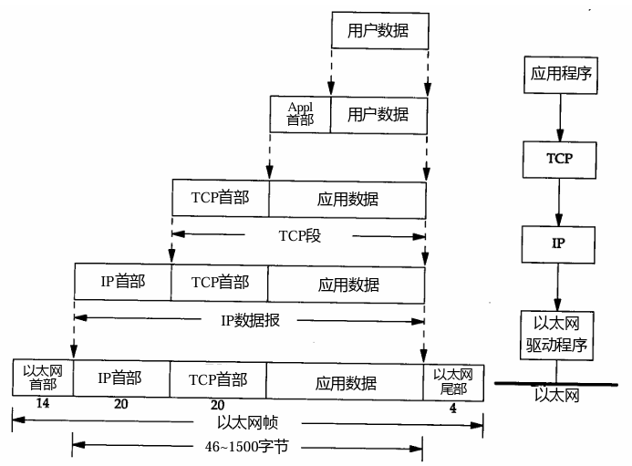
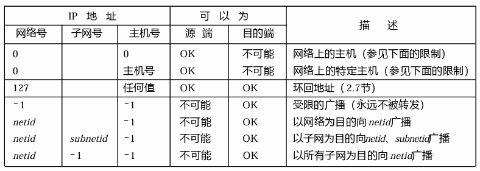
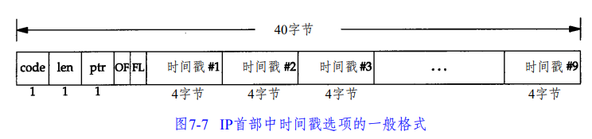
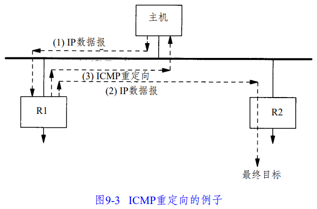
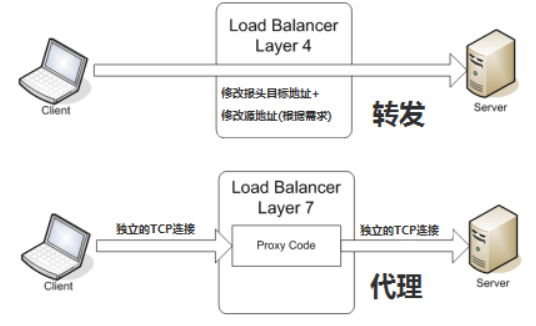

# 1、体系结构

## 1、概览

## 2、分层

### 1、概述

网络协议通常分不同层次进行开发，每一层分别负责不同的通信功能

一个**协议簇**，比如：

- TCP/IP：一组不同层次上的多个协议的组合，通常被认为是一个四层协议系统

### 2、五层协议

**应用层**：为**特定应用程序**提供数据传输服务

- Telnet： 远程登录
- FTP：文件传输协议
- SMTP： 简单邮件传送协议
- SNMP：简单网络管理协议

**传输层**：为**主机中的进程**提供通用数据传输服务，属于端到端、进程之间

- 由于应用层协议很多，定义通用的传输层协议就可以支持不断增多的应用层协议，也就是弥补上三层与下三层数据传输服务质量之间的差异（差错率、差错恢复能力、吞吐率、延时、费用等），对高层屏蔽网络层的服务的差异，提供稳定和一致的界面
- 传输层会将数据分段，并进行必要的控制，以便将这些片段重组成各种通信流，在此过程中，传输层负责：
  - 跟踪源主机和目的主机上应用程序间的每次通信
  - 将数据分段，并管理每个片段
  - 将分段数据重组为应用程序数据流
  - 标识不同的应用程序

- 主要协议：
  - TCP：传输控制协议 （面向字节流 ）
  - UDP：用户数据包协议（面向数据包） 

**网络层**：为**主机**提供数据传输服务，属于点到点、主机之间

- 网络层把传输层传递下来的报文段或者用户数据包封装成分组
- 网络层的分组传输是不可靠的，无法了解数据到达终点的时间，无法了解数据未达终点的状态
- 相关协议：
  - IP 协议：网际协议
  - ICMP 协议：Internet 互联网控 制报文协议
  - IGMP 协议：Internet 组管理协议 

**数据链路层**：链路层协议就是为**同一链路的主机**提供数据传输服务

- 主机之间可以有很多链路
- 数据链路层把网络层传下来的分组封装成帧

**物理层**：考虑的是怎样**在传输媒体上传输数据比特流**，而不是指具体的传输媒体

- 物理层的作用是尽可能屏蔽传输媒体和通信手段的差异，使数据链路层感觉不到这些差异

### 3、OSI 七层协议

将五层协议的应用层拆分为应用层、表示层、会话层即为七层协议

**表示层**：数据压缩、加密以及数据描述，这使得应用程序不必关心在各台主机中数据内部格式不同的问题

**会话层**：建立及管理会话

prc 协议：(远程方法调用协议)

### 4、TCP/IP 四层协议

它只有四层，相当于五层协议中数据链路层和物理层合并为网络接口层，TCP/IP 体系结构不严格遵循 OSI 分层概念，应用层可能会直接使用 IP 层或者网络接口层，该协议族的另一个名字是 Internet 协议族（Internet Protocol Suite）

**应用层**：负责处理特定的应用程序细节（FTP、Telnet）

**运输层**：主要为两台**主机**上的应用程序提供**端到端**的通信，提供可靠的服务

- 在 TCP/IP 协议族中，有两个互不相同的传输协议：TCP（传输控制协议）和 UDP（用户数据包协议）
  - TCP：为两台主机提供高可靠性的数据通信，它主要用于数据分块交付网络层，确认接收到的分组，设置发送最后确认分组的超时时钟等，由于运输层提供了高可靠性的端到端的通信，因此应用层可以忽略所有这些细节
  - UDP：为应用层提供一种非常简单的服务，它只是把称作数据包的分组从一台主机发送到另一台主机，并不保证该数据包能到达另一端，任何必需的可靠性必须由应用层来提供

**网络层**：处理分组在网络中的活动，尽可能快地把分组从源结点送到目的结点，但是并不提供任何可靠性保证，例如：分组的选路

**网络接口层**：也叫链路层，包括操作系统中的**设备驱动程序**和计算机中对应的**网络接口卡**，负责具体每段链路之间的通信，这俩协同处理任何传输媒介（电缆）的物理接口细节（以太网、令牌 环网等），其支持多种不同的链路层协议，这取决于网络所使用的硬件，如：以太网、令牌环网、FDDI 及 RS-232 串行线路等

- 链路层主要有三个目的：

  - 为 IP 模块发送和接收数据包

  - 为 ARP 模块发送请求和接收应答
  - 为 RARP 发送请求和接收应答

## 3、数据封装

元数据进行网络传输，需要先进行**逐层封装**和**逐层解析**的过程，如下图：

每一层对收到的数据都要增加一些首部信息（有时还要增加尾部信息），也即向下的过程中，需要添加下层协议所需要的首部或者尾部

- TCP 和 UDP 都用一个 16 bit 的端口号来表示不同的应用程序，TCP 和 UDP 把源端口号和目的端口号分别存入报文首部中
- IP 协议在首部中存入一个长度为 8 bit的数值，称作协议域
  - 1 表示为 ICMP 协议
  - 2 表示为 IGMP 协议
  - 6 表示为 TCP 协议
  - 17 表示为 UDP 协议

**注意**：

- 以太网数据帧的物理特性是其长度必须在 46～1500 字节之间，特意不包含以太网首部和尾部
- 大多数的设备驱动程序或接口卡自动地用填充字符把以太网数据帧充满到最小长度

## 4、数据分用

当目的主机收到一个以太网数据帧时，数据就开始从协议栈中由底向上升，同时去掉各层协议加上的报文首部

每层协议盒都要去检查报文首部中的协议标识，以确定接收数据的上层协议，这个过程称作分用（Demultiplexing）

也即在向上的过程中不断拆开首部和尾部

**注意**：

- ICMP 和 IGMP 报文都被封装在IP数据包中，因此放在 IP 层上方，ARP 与 RARP 同理

## 5、路由器

路由器是一种特殊的用于网络互连的硬件盒，也称作 IP 路由器（IP Router），用于在**网络层**上对网络进行互连

路由器的好处是为不同类型的物理网络提供连接：以太网、令牌环网、 点对点的链接和FDDI（光纤分布式数据接口）等等

从定义上看，一个路由器具有两个或多个网络接口层（因为它连接了两个或多个网络），但不一定指那种在互联网中用来转发分组的特殊硬件盒，拥有都接口的主机经过特殊设置也可以实现

路由器只有下面三层协议，因为路由器位于网络核心中，不需要为进程或者应用程序提供服务，因此也就不需要传输层和应用层

## 6、网桥

网桥是在**链路层**上对网络进行互连

网桥使得多个局域网（LAN）组合在一起，这样对上层来说就好像是一个局域网

## 7、网关

网关这个术语只用来表示应用层网关：一个连接两种不同协议族的进程（例如：TCP/IP 和 IBM 的 SNA）

网关为某个特定的应用程序服务（常常是电子邮件或文件传输）

## 8、端口号

### 1、基本概念

运行在计算机中的进程是用**进程标识符**来标志的，运行在应用层的各种应用进程却由于操作系统的不同，不能使用该方法，所以再运输层使用协议端口号(protocol port number)，或通常简称为端口(port)，来标识

一个应用进程可以绑定多个端口号，而一个端口号只能被一个应用进程绑定

### 2、端口号范围的划分

0 - 1023：知名端口号，HTTP，FTP，SSH等这些广为使用的应用层协议，其端口号都是固定的，由 IANA 机构分配

- 在 unix 中也叫做保留端口号，sroot 权限的进程才可分配

1024 - 65535：操作系统动态分配的端口号，客户端程序的端口号就是由操作系统从这个范围分配的

>/etc/service 文件可查知名端口号分配情况 

## 9、环回接口

环回接口允许运行在**同一台主机**上的客户程序和服务器程序通过 TCP/IP 进行通信

通常 127.0.0.1 分配给这个接口，并命名为 localhost，一个传给环回接口的 IP 数据包不能在任何网络上出现

网络层把一份数据包传送给环回接口，就像传给其他链路层一样，当环回数据回到上层的协议栈中时，它已经过传输层和 IP 层完整的处理过程

**注意**：

-  传给环回地址的任何数据均作为 IP 输入
- 任何传给该主机I P地址的数据均送到环回接口

## 10、MTU

### 1、最大传输单元

以太网和 802.3 对数据帧的长度都有一个限制，其最大值分别是 1500 和 1492 字节，链路层的这个特性称作 MTU，最大传输单元

如果 IP 层有一个数据包要传，而且数据的长度比链路层的 MTU 还大，那么 IP 层就需要进行分片，把数据包分成若干片且均小于 MTU

### 2、路径 MTU

如果两台主机之间的通信要通过多个网络，那么每个网络的链路层就可能有不同的 MTU，此时最重要的是两台主机网络路径之间的最小 MTU，其被称作路径 MTU

路径 MTU 不一定是固定的，它取决于所选取的路由，且由于来去路径不一定对称，因此来去 MTU 不一定相等

## 11、串行线路吞吐量计算

$$
耗时 = \frac{数据长度}{线路速率}
$$

# IP 协议

## 1、概览

IP 协议在 OSI 七层协议中位于**网络层**，在物理层和链路层之上，网络层是整个互联网的核心，使用 IP 协议，可以把异构的物理网络连接起来，使得在网络层看起来好像是一个统一的网络

IP 协议是 TCP/IP 协议族中最为核心的协议，所有的 TCP、UDP、ICMP、IGMP 数据都以 IP 数据包格式传输，如果协议版本号是 4，IP 协议也称作 IPv4

IP 数据包传送服务具有不可靠性、无连接性：

- **不可靠性**（unreliable）：
  - 意思是它不能保证 IP 数据包能成功地到达目的地
  - IP 仅提供最好的传输服务，如果发生某种错误时，如某个路由器暂时用完了缓冲区， IP 有一个简单的错误处理算法：丢弃该数据包，然后发送 ICMP 消息报给信源端
  - 任何要求的可靠性必须由上层来提供（如 TCP）

- **无连接性**（connectionless）：
  - 这个术语的意思是 IP 并不维护任何关于后续数据包的状态信息
  - 每个数据包的处理是相互独立的，这也说明， IP 数据包可以不按发送顺序接收，如果一信源向相同的信宿发送两个连续的数据包（先是 A，然后是 B），每个数据包都是独立地进行路由，可能选择不同的路线，因此 B 可能在 A 到达之前先到达

与 IP 协议配套使用的还有三个协议：

- 地址解析协议 ARP（Address Resolution Protocol）
- 网际控制报文协议 ICMP（Internet Control Message Protocol）
- 网际组管理协议 IGMP（Internet Group Management Protocol）

IP 数据包传输次序：

- 最高位在左边，记为 0 bit，最低位在右边，记为 31 bit，一共 32 bit，4 个字节的 32 bit 值以下面的次序传输：首先是 0～7 bit，其次 8～15 bit，然后 16～23 bit， 最后是 24~31 bit，这种传输次序称作 big endian 字节序，又称作网络字节序，其他字节序发送前需要转换

## 2、IP 分类

### 1、概述

IP 地址长为 **32 bit**，地址具有一定的结构，这些 32 位的地址通常写成**四个十进制**的数，其中每个整数对应一个 byte，这种表示方法称作点分十进制表示法（Dotted decimal notation）

IP 地址可以分为两类：有类间域地址、无类间域地址

### 2、有类间域地址

最早的 IP 地址分配和管理方式，将 IP 地址分为 A、B、C、D、E 五类，其拥有定长子网掩码（FLSM) 

五类不同的**互联网地址格式**下：

**各类 IP 地址的范围**：

| 类型 | 范 围                                |
| ---- | ------------------------------------ |
| A    | **0**.0.0.0 到 **127**.255.255.255   |
| B    | **128**.0.0.0 到 **191**.255.255.255 |
| C    | **192**.0.0.0 到 **223**.255.255.255 |
| D    | **224**.0.0.0 到 **239**.255.255.255 |
| E    | **240**.0.0.0 到 **247**.255.255.255 |

**三类IP地址**：

- 单播地址（目的为单个主机）
- 广播地址（目的端为给定网络上的所有主机）
- 多播地址（目的端为同一组内的所有主机）

**注意**：

- 多接口主机具有多个 IP 地址，其中每个接口都对应一个 IP 地址

**有类间域地址划分**：

定义是**网络号** + **子网号 **+ **主机号**

下面就是一个 B 类地址：

B 类网络地址 （140.252），在剩下的 16 bit 中，8 bit 用于子网号，8 bit 用于主机号，这样就允许有 254 个子网，每个子网可以有 254 台主机（8 位一共有 256 种可能，由于全 0 或全 1 的主机号都是无效的， 所以就有 254 种可能）

划分子网的主要目的就是为了缩减路由表的规模

### 3、无类域间地址

无类域间地址，也叫 CIDR，消除了有类的界限，使子网掩码的三层结构回到两层，只使用**网络号** + **主机号**的划分

分配 IP 地址时不再按类别分配，而是按可变长度的地址块分配，提高 IPv4 地址空间分配效率

无类地址格式：a.b.c.d / x，其中 x 为前缀长度，表示网络号的位数

使用 CIDR 表示法，可以灵活地分配 IP 地址，例如将一个 /24 网络（255.255.255.0）划分成多个 /26 子网（255.255.255.192）：

- 原始网络：192.168.1.0/24（IP范围：192.168.1.0 - 192.168.1.255）
- 子网1：192.168.1.0/26（IP范围：192.168.1.0 - 192.168.1.63）
- 子网2：192.168.1.64/26（IP范围：192.168.1.64 - 192.168.1.127）
- 子网3：192.168.1.128/26（IP范围：192.168.1.128 - 192.168.1.191）
- 子网4：192.168.1.192/26（IP范围：192.168.1.192 - 192.168.1.255）

## 3、IP 数据包格式

首部长度字段：

- 首部长度指的是首部占 32 bit 字的数目（包括选项栏），由于首部长度是一个 4 bit 字段，因此首部最长为 60 个 byte
- 普通 IP 数据包（没有任何选择项）字段的值是 5，因此普通的 IP 首部长度为 20 个 byte

服务类型 TOS 字段：

- 一个 3 bit 的优先权子字段（现在已被忽略）
- 一个 4 bit 的 TOS 子字段，分别代表：最小时延、最大吞吐量、最高可靠性和最小费用，4 bit 中只能置其中 1 bit，如果所有 4 bit 均为 0，那么就意味着是一般服务
- 一个 1 bit 未用位但必须置 0

8 位生存时间 TTL 字段：

- TTL（time - to - live）生存时间字段设置了数据包可以经过的最多路由器数，它指定了数据包的生存时间
- TTL 的初始值由源主机设置（通常为 32 或 64），一旦经过一个处理它的路由器， 它的值就减去 1，当该字段的值为 0 时，数据包就被丢弃，并发送 ICMP 报文通知源主机

16 位首部检验和字段：

- 根据 IP 首部计算的检验和码，用于验证传送数据包和接受数据包的差异，不对首部后面的数据进行计算
- 首先把检验和字段置为 0，对首部中每个 16 bit 进行二进制反码求和 ，结果存在检验和字段中，收到数据包后再对首部进行计算，相同就把检验和字段置为 1，不同那么IP就丢弃收到的数据包 ，但是不生成差错报文，由上层去发现丢失的数据包并进行重传

总长度字段：

- 占用 16 位二进制位，总长度字段是指整个 IP 数据包的长度（报头区+数据区），以字节为单位
- 利用首部长度字段和总长度字段， 就可以知道 IP 数据包中数据内容的起始位置和长度，由于该字段长 16 bit，所以 IP 数据包最长可达 65535 字节

标识字段：

- 唯一地标识主机发送的每一份数据包，通常每发送一份报文它的值就会加 1  

## 4、IP 路由 Routing

### 1、概述

对于主机来说 IP 路由是简单的，如果目的主机与源主机直接相连或都在一个共享网络上，那么 IP 数据包就直接送到目的主机上，否则主机把数据包发往默认路由器，由路由器来转发该数据包

IP 路由是逐跳地（hop-by-hop）进行的，所有的 IP 路由只为数据包传输提供下一站路由器的 IP 地址

 IP 层在内存中有一个路由表，当收到一份数据包，它将搜索该表一次并进行发送，当数据包来自某个网络接口时，IP 首先检查**目的 IP 地址**是否为本机的 IP 地址之一或者 IP 广播地址：

1. 如果是，数据包就被送到由 IP 首部协议字段所指定的协议模块进行处理
2. 如果数据包的目的不是这些地址
   1. 如果 IP 层被设置为路由器的功能，那么就对数据包进行转发
   2. 否则数据包被丢弃

### 2、相关术语

**路由器**（Router）：用于接不同网络的设备，负责根据路由表将数据包转发到适当的下一跳

**路由表**（Routing Table）：存储路由信息的表格，包括目的网络、子网掩码、下一跳地址以及接口等信息

**下一跳**（Next Hop）：数据包应该转发到的下一个路由器或主机的 IP 地址

**自治系统**（AS）：由一个或多个网络组成，受同一管理机构控制，使用统一的路由策略

**路由类型**：

- 静态路由（Static Routing）：由网络管理员手动配置和管理的固定路由，适用于小型和简单网络
- 动态路由（Dynamic Routing）：使用路由协议自动发现和维护路由信息，适用于大型和复杂网络

**路由协议**：

- 内部网关协议（IGP）：AS 内
  - RIP（Routing Information Protocol）
  - OSPF（Open Shortest Path First）
  - EIGRP（Enhanced Interior Gateway Routing Protocol）
    - 思科私有协议，结合距离向量和链路状态特性
    - 快速收敛，使用复合度量值（带宽、延迟等）
- 外部网关协议（EGP）：AS 之间
  - BGP（Border Gateway Protocol）：使用通告消息（Advertisement Message）通告路径属性
    - 用于不同自治系统（AS）之间的路由
    - 基于路径向量算法，使用 AS 路径作为主要度量
    - 适用于互联网规模的路由，具备高可扩展性和灵活性

**路由表信息内容**：

- 目的 IP 地址：
  - 既可以是一个完整的主机地址，也可以是一个网络地址，由该表目中的标志字段来指定
  - 主机地址有一个非 0 的主机号，以指定某一特定的主机，而网络地址中的主机号为 0，以指定网络中的所有主机（如以太网，令牌环网）
- 下一站（或下一跳）路由器（next-hop router）的 IP 地址，或者有直接连接的网络 IP 地址：
  - 下一站路由器是指一个在直接相连网络上的路由器，通过它可以转发数据包
  - 下 一站路由器不是最终的目的，但是它可以把传送给它的数据包转发到最终目的
- 标志：
  - 一个标志指明目的 IP 地址是网络地址还是主机地址
  - 一个标志指明下一站路由器是否为真正的下一站路由器，还是一个直接相连的接口
- 为数据包的传输指定一个网络接口

**路由发现**：路由器通过静态配置或动态路由协议获取路由信息

**路由计算**：根据路由协议的算法，计算最佳路径并更新路由表

**路由转发**：当数据包到达路由器时，路由器查找路由表，根据匹配的最优路径将数据包转发到下一跳

### 3、动态选路协议

#### 1、概述

动态选路是一种用于路由器之间通信的技术，主要用于在网络中自动更新和管理路由表，路由器通过选路协议从相邻路由器接收到信息，更新内核中的路由表

动态选路的关键点：

- **自动更新**：动态选路协议允许路由器自动更新路由表，而不需要手动配置
- **路由守护程序**：路由器上运行的进程，称为路由守护程序，会根据接收到的信息动态地增加或删除路由表项
- **常见协议**：常见的动态选路协议包括 RIP（路由信息协议）、OSPF（开放最短路径优先）和 BGP（边界网关协议）
- **适应性**：当网络拓扑发生变化时，动态选路协议可以快速适应，选择最佳路径并更新路由表

#### 2、RIP 协议

##### 1、概述

RIP（Routing Information Protocol）协议一种距离矢量路由协议

**距离矢量协议**：RIP 是距离矢量协议，它使用跳数（hop count）作为度量标准，选择跳数最少的路径

**跳数限制**：RIP 的最大跳数限制为 15 跳，超过 15 跳的路径被视为不可达。这限制了 RIP 在大型网络中的应用

**定时更新**：RIP 每隔 30 秒向相邻路由器广播整个路由表，这种定时更新机制会产生额外的网络流量，但确保了路由表的一致性

##### 2、工作原理

**路由更新**：每个 RIP 路由器会定期向相邻路由器发送包含整个路由表的更新消息，这些消息中包含了所有已知目的地及其对应的跳数

**路由选择**：当路由器收到来自相邻路由器的更新消息时，会将其中的路由信息与自己的路由表进行比较，如果通过相邻路由器到达某个目的地的跳数更少，路由器会更新其路由表

**路由失效检测**：如果路由器在 180 秒内没有收到某个相邻路由器的更新消息，则认为该路由器不可达，并将相应的路由条目标记为不可达

**防环机制**：RIP 使用多种机制防止路由环路的产生，包括：

- **水平分割**：路由器不会将通过某个接口学习到的路由信息再次通过同一接口发送
- **毒性逆转**：当路由器检测到某条路由不可达时，会将该路由的跳数设置为 16（不可达），并通告给相邻路由器
- **触发更新**：当路由信息发生变化时，路由器立即发送更新消息，而不等待 30 秒的更新周期

##### 2、缺点

**收敛速度慢**：RIP 协议使用的是逐跳更新和定时更新机制，这导致网络拓扑发生变化时，路由表更新较慢，网络中的所有路由器达到一致的路由信息状态需要较长时间

**路由环路**：距离矢量协议容易产生路由环路问题，虽然 RIP 采用了防环措施（如水平分割、毒性逆转等），但这些方法不能完全避免环路的产生

**不支持子网划分**：传统的 RIP 协议（RIP v1）不支持子网掩码信息的传播，这限制了其在复杂网络中的应用，虽然RIP v2 引入了子网掩码，但依然存在其他限制

**不考虑链路质量**：RIP 仅以跳数作为路径选择的唯一标准，忽略了链路带宽、延迟、负载等其他重要因素，可能导致选择的路径并非最佳路径

RIP v2 在 RIP v1 的基础上的改进包括：

1. 包含子网掩码信息：RIP v2 在路由更新消息中加入了子网掩码字段，使路由器能够识别和处理子网信息
2. 有类路由：RIP v2 支持有类路由（Classless Routing），可以处理 VLSM 和 CIDR（无类别域间路由），从而支持更灵活的网络划分

#### 3、OSPF 协议

##### 1、概述

**链路状态协议**：OSPF 是一种链路状态协议，每个路由器都会生成链路状态公告（LSA），并将其发送到网络中的其他所有路由器，通过这些 LSA，每个路由器能够构建整个网络的拓扑图

**区域（Area）**：为了管理大型网络，OSPF 引入了区域的概念，一个 OSPF 网络可以分为多个区域，每个区域有自己的链路状态数据库，区域之间通过骨干区域（Area 0）互联

**链路状态数据库**：每个 OSPF 路由器维护一个链路状态数据库（LSDB），该数据库包含整个网络的链路状态信息。路由器使用这些信息来计算最优路径。

**Dijkstra算法**：OSPF 使用 Dijkstra 算法来计算从一个路由器到网络中其他所有节点的最短路径计算结果存储在路由表中

##### 2、工作原理

**邻接关系建立**：OSPF 路由器通过发送 Hello 报文与相邻路由器建立邻接关系，Hello 报文包含路由器 ID、Hello 间隔时间、区域 ID 等信息

**链路状态广告（LSA）**：建立邻接关系后，路由器会生成 LSA，并将其泛洪到整个网络，LSA 包含路由器的链路状态信息，如直接相连的路由器、链路的成本等

**链路状态数据库同步**：路由器接收到 LSA 后，将其存储在 LSDB 中，并向其他路由器转发，确保网络中所有路由器的LSDB一致

**最短路径计算**：每个路由器使用 Dijkstra 算法，基于 LSDB 中的信息计算到达其他路由器的最短路径，计算结果用于更新路由表

##### 3、优点

**快速收敛**：由于 OSPF 使用链路状态协议和 Dijkstra 算法，它比距离矢量协议（如 RIP）收敛更快当网络拓扑发生变化时，新的 LSA 能够迅速传播并更新路由表

**可扩展性**：OSPF 支持区域划分，通过将网络分成多个区域来减少 LSDB 的大小和路由计算的复杂度，从而提高可扩展性

**支持多路径**：OSPF 支持等价多路径路由（Equal-Cost Multi-Path，ECMP），即允许多条具有相同成本的路径同时存在，从而提高网络的冗余性和负载均衡能力

**安全性**：OSPF 支持认证机制，能够防止未经授权的路由器注入错误的路由信息，增强了协议的安全性

#### 4、BGP 协议

##### 1、概述

BGP（Border Gateway Protocol，边界网关协议）是用于在不同自治系统（AS）之间交换路由信息的路径向量路由协议，它是互联网的核心路由协议，负责维护全球互联网的路由信息

**路径向量协议**：

- BGP是路径向量协议，每个BGP路由器维护一个到达每个目的地的路径信息，包括经过的所有AS。路径信息有助于防止路由环路。

**对等关系（Peering）**：

- BGP路由器通过建立对等关系（Peering）来交换路由信息。对等关系可以是内部BGP（iBGP）或外部BGP（eBGP），分别用于同一AS内部和不同AS之间的路由信息交换。

##### 2、工作原理

**建立对等关系**：BGP 路由器首先通过 TCP 会话建立对等关系，对等路由器交换 BGP Open 报文来初始化会话

**路由通告**：建立对等关系后，BGP 路由器通过 BGP Update 报文通告其路由信息，包括网络前缀和路径属性（如AS路径、下一跳、前缀长度等）

**路径选择**：BGP 使用多个属性（如 AS 路径长度、下一跳 IP、路由器 ID、Local Preference 等）来选择最佳路径。路径选择过程包括：

- 优先选择本地优先级（Local Preference）最高的路径
- 选择AS路径长度最短的路径
- 选择下一跳IP地址最优的路径
- 其他属性的比较（如路由源类型、MED 值等）

**路由更新**：当网络拓扑发生变化时，BGP 路由器会发送 BGP Update 报文，更新其对等路由器的路由信息，BGP具有增量更新机制，只发送变化的路由信息

## 5、IP 选路 Forwarding

### 1、概述

IP 层进行的选路实际上是一种选路机制，它搜索路由表并决定向哪个网络接口发送分组，这区别于路由策略，路由策略只是一组决定把哪些路由放入路由表的规则

IP 选路是 IP 路由的一部分

### 2、选路原理

**路由表维护**：

- 路由表包含网络中所有路由的信息，这些信息决定了 IP 层的路由决策
- 路由表中主要包括匹配主机地址的路由项、匹配网络地址的路由项和默认路由项
- 内核通过路由守护程序（daemon）和 ICMP 重定向报文等机制动态更新路由表

**IP 选路步骤**：

1. 搜索匹配的主机地址，首先检查路由表中是否有匹配目的 IP 地址的主机路由项
2. 搜索匹配的网络地址，如果没有匹配的主机路由项，则检查是否有匹配目的网络的网络路由项
3. 搜索默认路由，如果前两步都没有找到匹配的路由项，则使用默认路由（一般网络号为 0 的路由项）

**路由决策**：

- 一旦找到匹配的路由项，IP 层会根据路由表中的信息决定将数据包发送到哪个网络接口
- IP 层的选路机制是实际执行路由选择的过程，而路由策略则是决定哪些路由进入路由表的规则

**动态更新**：

- 路由表会根据网络的变化动态更新，例如通过 ICMP 重定向报文让主机逐渐学习更好的路由路径

### 3、选路过程

**详细选路过程**：路由器或者主机将会用如下的方式来处理某一个 IP 数据包：（这再一次证明了，IP 包是不可靠的，因为它不保证送达）

- 如果 IP 数据包的 TTL 已到，则该 IP 数据包就被抛弃
- 搜索路由表，优先搜索匹配主机，如果能找到和 IP 地址完全一致的目标主机，则将该包发向目标主机
- 搜索路由表，如果匹配主机失败，则匹配同子网的路由器，这需要子网掩码的协助，如果找到路由器，则将该包发向路由器
- 搜索路由表，如果匹配同子网路由器失败，则匹配同网号路由器，如果找到路由器，则将该包发向路由器
- 搜索路由表，如果以上都失败了，就搜索默认路由，如果默认路由存在，则发包
- 如果都失败了，就丢掉这个包

**注意**：

- 如果以下步骤都失败，则该数据包不传送，如果该包来自本机，则会返回主机/网络不可达的错误
  - 搜索路由表，寻找能与**目的 IP 地址完全匹配**的表目（网络号和主机号都要匹配）如果找到，则把报文发送给该表目指定的下一站路由器或直接连接的网络接口（取决于标志字段的值）
  - 搜索路由表，寻找能与**目的网络号相匹配**的表目，如果找到，则把报文发送给该表目指定的下一站路由器或直接连接的网络接口（取决于标志字段的值），目的网络上的所有主机都可以通过这个表目来处置，这种搜索网络的匹配方法必须考虑可能的子网掩码
  - 搜索路由表，寻找标为**默认**的表目，如果找到，则把报文发送给该表目指定的下一站路由器

**注意**：

- 所有的路由决策都是基于目的 IP 地址
- 链路层首部永远只想下一站链路层 IP 地址

## 6、子网掩码

### 1、概述

主机需要知道有多少 bit 用于网络号及多少 bit 用于主机号，这些都是通过子网掩码判断的

对于有类域间地址，如果知道本机的 IP 地址，那么就知道它是否为 A 类、B 类、C 类地址（从 IP 地址的高位可以得知），也就知道**网络号**和**子网号**之间的分界线，而根据子网掩码就可知道**子网号**与**主机号**之间的**分界线**

子网掩码是一个 32 bit 的值，其中值为 **1 的 bit 留给网络号**，为 **0 的 bit 留给主机号**，通过将子网掩码与 IP 地址进行**与**操作，可求出 IP 地址所属的网络号

给定 IP 地址和子网掩码以后，主机就可以确定 IP 数据包的目的地：

1. 本子网上的主机
2. 本网络中其他子网中的主机
3. 其他网络上的主机

有类间域地址对应的默认子网掩码：

- A类：255.0.0.0
- B类：255.255.0.0
- C类：255.255.255.0

子网掩码有两种表示方式：

1. **点分十进制表示**：如255.255.255.0
2. **斜杠表示法（CIDR 表示法）**：如 /24，其中 24 表示网络部分占据了 24 位

### 2、例子

例如：

- IP地址：192.168.1.10

- 子网掩码：255.255.255.0

二进制表示：

- IP地址：11000000.10101000.00000001.00001010
- 子网掩码：11111111.11111111.11111111.00000000

按位与运算结果：

- 网络地址：11000000.10101000.00000001.00000000 (192.168.1.0)

### 3、变长子网

变长子网掩码（VLSM）是一种灵活的子网划分技术，允许在同一个网络中使用不同长度的子网掩码，与固定长度子网掩码（FLSM）不同，VLSM 能够根据实际需求对网络进行更高效的划分，从而优化IP地址的利用率

使用 VLSM 进行子网划分时，首先选择一个初始子网，然后根据需要进一步划分子网，每个子网可以有不同的子网掩码，具体步骤如下：

1. 确定需要的子网和每个子网的规模
2. 选择一个起始子网进行划分
3. 为每个子网分配适当长度的子网掩码
4. 重复上述步骤，直到所有子网都被创建

假设有一个网络 192.168.1.0/24，需要创建以下子网：

1. 一个有50个主机的子网
2. 一个有20个主机的子网
3. 两个有10个主机的子网

第一步：创建 50 个主机的子网

- 需要的主机数：50
- 最近的 2 的幂：64（2^6 = 64）
- 子网掩码：/26（255.255.255.192）

- 子网1：192.168.1.0/26，范围：192.168.1.0 - 192.168.1.63

第二步：创建 20 个主机的子网

- 需要的主机数：20
- 最近的2的幂：32（2^5 = 32）
- 子网掩码：/27（255.255.255.224）

- 子网2：192.168.1.64/27，范围：192.168.1.64 - 192.168.1.95

第三步：创建两个 10 个主机的子网

- 需要的主机数：10
- 最近的2的幂：16（2^4 = 16）
- 子网掩码：/28（255.255.255.240）

- 子网3：192.168.1.96/28，范围：192.168.1.96 - 192.168.1.111
- 子网4：192.168.1.112/28，范围：192.168.1.112 - 192.168.1.127

经过上述划分后，剩余的 IP 地址范围 192.168.1.128 - 192.168.1.255 还可以继续划分，创建更多的子网

## 7、子网划分

### 1、概述

把 IP 地址进一步划分为更小的网络，即子网划分，经过子网划分后，IP 地址的子网掩码不再是标准 IP 地址的掩码，标准子网掩码只能定义较大的网络，为了灵活管理 IP 地址，通常会进行子网划分

标准 IP 地址的掩码指的是有类间域地址 A\B\C 类的默认子网掩码，标准子网掩码是基于 IP 有类间域地址定义的，常见的有：

- **A类地址**：255.0.0.0 (/8)
- **B类地址**：255.255.0.0 (/16)
- **C类地址**：255.255.255.0 (/24)

子网划分后的子网掩码比标准子网掩码更具体，通常具有更长的前缀长度，通过增加子网掩码的位数，可以创建更多的子网，使得每个子网的规模更小

**划分步骤**：

1. 确定需要的子网数量：根据需要，计算出需要多少个子网，2^n
2. 计算子网掩码：根据需要的子网数量，确定新的子网掩码
3. 划分网络地址：根据新的子网掩码，将原始网络地址划分为多个子网
4. 分配 IP 地址：为每个子网分配具体的 IP 地址范围

### 2、例子

假设有一个 C 类网络：192.168.1.0/24，希望将其划分为 4 个子网

1. **确定子网数量**：
   - 需要 2^2 = 4 个子网，因此需要增加 2 位用于子网划分
2. **新的子网掩码**：
   - 原始子网掩码：255.255.255.0 (/24)
   - 新的子网掩码：255.255.255.192 (/26)，因为增加了 2 位用于子网划分，前缀长度变为 26
3. **划分后的子网**：
   - 子网1：192.168.1.0/26，范围：192.168.1.0 - 192.168.1.63
   - 子网2：192.168.1.64/26，范围：192.168.1.64 - 192.168.1.127
   - 子网3：192.168.1.128/26，范围：192.168.1.128 - 192.168.1.191
   - 子网4：192.168.1.192/26，范围：192.168.1.192 - 192.168.1.255

通过这种划分，将一个 C 类网络划分为 4 个子网，每个子网有 64 个地址（包含网络地址和广播地址）

例1：

>11111111 11111111 11111111 00000000  连续的1代表网络号，连续的0代表主机号，转换为 255.255.255.0
>
>根据掩码规则
>
>- 由于 1 代表网络和子网号，因此 255.255.255 代表网络号
>- 最后的 0 代表主机号
>
>假设 IP 为 192.168.33.112 ，则 192.168.33 为网络号，112 为主机号，以此划分子网

例2：

>172.31.128.255/18，这里使用了 CIDR 表示法，即 / 后面跟上数字
>
>其中 18 表示，高位开始连续 18 个 1
>
>11111111 11111111 11000000 00000000 转换为 255.255.192.0 

**计算网络号**：将 IP 地址的二进制和子网掩码的二进制进行 & 运算

**计算主机号**：用 IP 地址的二进制和子网掩码的二进制的反码进行 & 运算

**计算广播地址**：计算子网掩码中表示主机号的数量 n，将网络号从右开始填 n 次 1

**计算子网数**：对于 ABC 类默认子网掩码，借了 n 位为网络号，则子网数为 2^n - 2

- A：8 ≤ 子网掩码 < 16，n = 子网掩码 - 8
- B：16 ≤ 子网掩码 < 24，n = 子网掩码 - 16

- C：24 ≤ 子网掩码 < 32，n = 子网掩码 - 24

**计算主机数**：网络号 + 1 - 广播地址 - 1 或者 2^N - 2，其中 N 为主机号位数

- N = 32 - 子网掩码为 1 的位数

| 192.168.1.0 | /24  | /25  | /26  | /27  | /28  | /29  | /30  | /31  | /32  |
| ----------- | ---- | ---- | ---- | ---- | ---- | ---- | ---- | ---- | ---- |
| 子网掩码    | 0    | 128  | 192  | 224  | 240  | 248  | 252  | 254  | 255  |
| 子网个数    | 1    | 2    | 4    | 8    | 16   | 32   | 64   | 128  | 256  |
| IP 数量     | 256  | 128  | 64   | 32   | 16   | 8    | 4    | 2    | 1    |
| IP 个数     | 254  | 126  | 62   | 30   | 14   | 6    | 2    | 2    | 1    |

>例子：192.168.1.0/24
>
>I P  地址：11000000.10101000.00000001.00000000 => 192.168.1.0
>
>子网掩码：11111111.11111111.11111111.00000000 => 255.255.255.0
>
>网 络 号  ：11000000.10101000.00000001.00000000 => 192.168.1.0
>
>广播地址：11000000.10101000.00000001.11111111 => 192.168.1.255
>
>子网数量：2^0 = 1
>
>主机数量：192.168.1.1 ~ 192.168.1.254

## 8、特殊 IP 地址

表的头两项是特殊的源地址，中间项是特殊的环回地址， 最后四项是广播地址

0 表示所有的比特位全为 0

-1 表示所有的比特位全为 1

netid、subnetid、hostid 分别表示不为全 0 或全 1 的对应字段

子网号栏为空表示该地址没有进行子网划分

#  SLIP 协议

## 1、概述

一种在串行线路上对 IP 数据包进行封装的简单形式，一般提供基于服务类型的排队方法，允许对交互通信数据在处理大块数据之前进行处理

SLIP 协议帧格式：

- IP 数据包以一个称作 END（0 x c0）的特殊字符结束，且为了防止数据到来前的数据噪声，会在前面也放置一个 END

- 如果 IP 报文中某个字符为 END，那么就要连续传输两个字节 0xdb（ESC字符） 和 0xdc 来取代它
- 如果 IP 报文中某个字符为  SLIP 的 ESC 字符，那么就要连续传输两个字节 0xdb 和 0xdd 来取代它

## 2、CSLIP 协议

由于串行线路的速率通常较低（19200 b/s 或更低），且由于交互式通信，SLIP 协议上有许多小的 TCP 分组交换，而 CSLIP 可以对数据压缩，并在每端维持多达 16 个 TCP 连接，

# PPP 协议

PPP 协议包括以下三个部分：

- 在串行链路上封装 IP 数据包的方法，既支持数据为 8 位和无奇偶检验的异步模式，还支持面向比特的同步链接
- 建立、配置及测试数据链路的链路控制协议（LCP：Link Control Protocol），它允许通信双方进行协商，以确定不同的选项
- 针对不同网络层协议的网络控制协议（NCP：Network Control Protocol）体系，当前 RFC 定义的网络层有 IP、OSI 网络层、DECnet 以及 AppleTalk

PPP 比 SLIP 具有下面这些优点：

- PPP 支持在单根串行线路上运行多种协议， 不只是 IP 协议
- 每一帧都有循环冗余检验
- 通信双方可以进行 IP 地址的动态协商（使用 IP 网络控制协议）
- TCP 和 IP 报文首部进行压缩
- 链路控制协议可以对多个数据链路选项进行设置

# ARP 协议

## 1、概述

在通信过程中，IP 数据包的源地址和目的地址始终不变，而 MAC 地址（硬件地址）随着链路的改变而改变，ARP 实现由 IP 地址得到 MAC 地址，称为地址解析协议

- 网络接口有一个硬件地址，一个 48 bit 的值，标识不同的以太网或令牌环网络接口，在硬件层次上进行的数据帧交换必须有正确的接口地址
- ARP 的功能是在 32 bit 的 IP 地址和采用不同网络技术的硬件地址之间提供动态映射

**注意**：

- 知道主机的 IP 地址并不能让内核发送帧数据给主机，内核必须知道目的端的硬件地址才能发送数据
- 点对点链路不使用 ARP

## 2、解析过程

**流程解析一**：

ARP 广播一份 ARP 请求的以太网数据帧给以太网上的每个主机，ARP 请求数据帧中包含目的主机的 IP 地址

目的主机的 ARP 层收到报文后，识别出这是发送端在寻址，于是发送一个 ARP 应答，该应答包含 IP 地址及对应的硬件地址

收到 ARP 应答后，IP 数据包就可以传送

**流程解析二**：

如果主机 A 知道主机 B 的 IP 地址，但是 ARP 高速缓存中没有该 IP 地址到 MAC 地址的映射，此时主机 A 通过广播的方式发送 ARP 请求分组，主机 B 收到该请求后会发送 ARP 响应分组给主机 A 告知其 MAC 地址，随后主机 A 向其高速缓存中写入主机 B 的 IP 地址到 MAC 地址的映射

## 3、高速缓存

每个主机都有一个 ARP 高速缓存，里面有本局域网上的各主机和路由器的 IP 地址 到 MAC 地址的映射表

48 bit 的 MAC 地址用 6 个十六进制的数来表示，中间以冒号隔开

高速缓存中每一项的生存时间一般为 20 分钟，起始时间从被创建时开始算起

**注意**：

- 接收到 ARP 请求的主机，需要使用请求中的发送端硬件地址更新在自身的高速缓存

## 4、分组格式

帧类型字段的前四个字段指定了最后四个字段的类型和长度

以太网报头中的前两个字段是以太网的源地址和目的地址

帧类型：表示后面数据的类型，对于 ARP 请求或应答来说，该字段的值为0x0806

硬件类型：表示硬件地址的类型，它的值为 1 即表示以太网地址

协议类型：表示要映射的协议地址类型，它的值为 0x0800 即表示 IP 地址，其与包含 IP 数据包的以太网数据帧中的类型字段的值相同

硬件地址长度：以字节为单位，对于以太网上 IP 地址的 ARP 请求或应答来说，值为 6

协议地址长度：以字节为单位，对于以太网上 IP 地址的 ARP 请求或应答来说，值为 4

操作字段：指出四种操作类型，它们是 ARP 请求（值为 1）、ARP应答（值为 2）、RARP 请求（值为 3）、RARP 应答（值为 4），这个字段必需的，因为 ARP 请求和应答的帧类型字段值是相同的

**注意**：

- 在以太网的数据帧报头中和 ARP 请求数据帧中都有发送端的硬件地址（前面的源地址，后面的发送端以太网地址）
- 对于一个 ARP 请求来说，除目的以太网地址外的所有其他的字段都有填充值
- 对于一个 ARP 应答来说，两个目的地址（IP、以太网）会分别替换两个发送端地址，并把操作字段置为 2

## 5、ARP 代理

如果 ARP 请求是从一个网络的主机发往另一个网络上的主机，那么连接这两个网络的路由器就可以回答该请求，这个过程称作委托 ARP、ARP 代理、混合 ARP、ARP 出租

## 6、免费 ARP

在引导过程中，发送自己 IP 地址的 ARP 请求

- 通过它来确定另一个主机是否设置了相同的 IP 地址
- 更新其他主机高速缓存中旧的 MAC 地址

## 7、RARP 协议

### 1、概述

具有本地磁盘的系统引导时，一般是从磁盘上的配置文件中读取 IP 地址，但是无盘机， 则需要采用其他方法（RARP）来获得 IP 地址，无盘系统 的 RARP 实现过程是从接口卡上读取唯一的硬件地址，然后发送一份 RARP 请求（一帧在网络上广播的数据），请求某个主机响应该无盘系统的 IP 地址（在 RARP 应答中）

### 2、分组格式

RARP 分组的格式与 ARP 分组基本一致

主要的差别是 RARP 请求或应答的帧类型代码为 0x8035，而且 RARP 请求的操作代码为 3，应答操作代码为 4

# ICMP 协议

## 1、概述

ICMP（网际控制报文协议） 经常被认为是 IP 层的一个组成部分，ICMP 报文是被封装在 IP 报文内的

ICMP 传递差错报文以及其他需要注意的信息，因此 ICMP 报文通常被IP层或更高层协议（ TCP 或 UDP ）使用，例如：一些 ICMP 报文把差错报文返回给用户进程

当传送 IP 数据包发生错误，比如：主机不可达，路由不可达等等，ICMP 协议将会把错误信息封包，然后传送回主机并给主机一个处理错误的机会，这也就是建立在 IP 层以上的协议是可能做到安全的原因

## 2、分组格式

ICMP 数据包由

- 8 bit 的错误类型
- 8 bit 的代码
- 16 bit 的校验和组成
- 而前16bit 就组成了 ICMP 所要传递的信息

## 3、特殊情况

在大多数情况下，错误的包传送应该给出 ICMP 报文，但是在特殊情况下，是不产生 ICMP 错误报文的，所有的这一切规定，都是为了防止产生 ICMP 报文的无限传播而定义的

- ICMP 差错报文不会产生 ICMP 差错报文（但是 ICMP 查询报文会）

- 目的地址是广播地址或多播地址的 IP 数据包

- 作为链路层广播的数据包

- 不是 IP 分片的第一片

- 源地址不是单个主机的数据包（源地址不能为零地址、环回地址、广播地址、多播地址）

## 4、用途

ICMP 协议大致分为两类，一种是查询报文，一种是差错报文

### 1、地址掩码请求

用于无盘系统在引导过程中获取自己的子网掩码

标识符和序列号字段由发送端任意选择设定，这些值在应答中将被返回，用于交由发送端匹配

ICMP 地址掩码应答必须是收到请求接口的子网掩码，这是因为多接口主机每个接口有不同的子网掩码

### 2、时间戳请求

ICMP 时间戳请求允许系统向另一个系统查询当前的时间，返回的建议值是 UTC，其提供了毫秒级的分辨率

请求端填写发起时间戳，然后发送报文，应答端收到请求报文时填写接收时间戳，在发送应答时填写发送时间戳，实际上大多数的实现把后面两个字段都设成相同的值

提供三个字段的原因是可以让请求端分别计算发送请求的时间和发送应答的时间

### 3、PING

Ping 是 ICMP 的一个重要应用，主要用来测试两台主机之间的连通性，其原理是通过向目的主机发送 ICMP Echo 请求报文，目的主机收到之后会发送 Echo 回答报文

Ping 程序通过在 ICMP 报文数据中存放发送请求的时间值来计算往返时间，其还可以根据成功响应的次数估算出丢包率

IP 首部格式：

- code：一个字节，指明 IP 选项的类型，值为 7
- len：总字节长度，在这种情况下为 39，Ping 总是提供 39 字节的选项字段，最多可以记录 9 个IP 地址
- ptr：指针字段，它是一个基于 1 的指针，指向存放下一个 IP 地址的位置，最小值为 4，指向存放第一个 IP 地址的位置，ptr 的值为 40，表示清单已满

Ping 还可以提供查看 IP 记录路由（RR）选项：

IP 时间戳选项与 RR 选项类似：

**注意**：

- Ping 程序第1个往返时间值要比其他的大，这是由于目的端的硬件地址不在 ARP 高速缓存中
- 并不是所有的路由器都支持记录路由选项
- 记录路由一般是单向的选项
- IP 首部中留给选项的空间有限，不能存放当前大多数的路径

### 4、Traceroute

#### 1、概述

Traceroute 是 ICMP 的另一个应用，用来跟踪一个数据包从源点到终点的路径，其使用 ICMP 报文和 IP 首部中的 TTL 字段，TTL 字段是由发送端初始设置的一个 8 bit 字段，推荐的初始值由分配数字 RFC 指定，当前值为 64

Traceroute 发送的 IP 数据包封装的是无法交付的 UDP 数据包，其选择一个不可能的值作为 UDP 端口，当数据包到达目的主机时，目的主机会发送终点不可达差错报告报文，因此 Traceroute 只需要区分超时报文和不可达报文

#### 2、流程

源主机向目的主机发送一连串的 IP 数据包，第一个数据包 P1 的生存时间 TTL 设置为 1，当 P1 到达路径上的第一个路由器 R1 时，R1 收下它并把 TTL 减 1，此时 TTL 等于 0，R1 就把 P1 丢弃，并向源主机发送一个 ICMP 时间超过差错报文

源主机接着发送第二个数据包 P2，并把 TTL 设置为 2，P2 先到达 R1，R1 收下后把 TTL 减 1 再转发给 R2，R2 收下后也把 TTL 减 1，由于此时 TTL 等于 0，R2 就丢弃 P2，并向源主机发送一个 ICMP 时间超过差错报文

不断执行这样的步骤，直到最后一个数据包刚刚到达目的主机，主机不转发数据包，也不把 TTL 值减 1，但是因为 UDP 数据包无法交付，因此目的主机要向源主机发送 ICMP 终点不可达差错报告报文

之后源主机知道了到达目的主机所经过的路由器 IP 地址以及到达每个路由器的往返时间

**注意**：

- Traceroute 并不能保证现在的路由也是将来所要采用的路由，甚至两份连续的 IP 数据包都可能采用不同的路由
- 不能保证 ICMP 报文的路由与 Traceroute 程序发送的 UDP 数据包采用同一路由，因此产生的往返时间存在差异
- 返回的 ICMP 报文中的信源 IP 地址是 UDP 数据包到达的路由器接口的 I P地址

#### 3、IP 源站选路选项

源站路由选项的实际称呼为源站及记录路由，这是因为在数据包沿路由发送过程中，对 IP 地址清单进行了更新，源站选路选项与记录路由选项格式基本一致

对于源站路由选项有两种：

- 严格的源路由：发送端指明 IP 数据包所必须采用的确切路由，如果路由器发现源路由所指定的下一个路由器不在其直接连接的网络上，那么就返回一个源站路由失败的 ICMP 差错报文
- 宽松的源站选路：发送端指明了一个数据包经过的 IP 地址清单，但是数据包在清单上指明的任意两个地址之间可以通过其他路由器

对于宽松的源站选路来说， code 字段的值是 0x83，而对于严格的源站选路，其值为 0x89

**注意**：

- 使用宽松的源站选路，可以使往返的路由路径相同，只要指定一个宽松的源站路由，该路由的目的端和宽松路径一样，但发送端为目的主机

## 5、差错报文

### 1、概述

 ICMP 差错报文包括：

- 生成该差错报文的数据包 IP 首部（包含任何选项）
- 至少包括跟在该 IP 首部后面的前 8 个字节

在该例子中，跟在 IP 首部后面的前 8 个字节包含 UDP 的首部， 而 UDP 首部中的内容是源端口号和目的端口号

导致差错的数据包中的 IP 首部要被送回的原因是因为 IP 首部中包含了协议字段，使得 ICMP 可以知道如何解释后面的 8 个字节

### 2、不可达差错

### 3、重定向差错

当 IP 数据包应该被发送到另一个路由器时，实际收到数据包的路由器就要发送 ICMP 重定向差错报文给 IP 数据包的发送端

重定向一般用来让具有很少选路信息的主机逐渐建立更完善的路由表

ICMP 重定向报文的接收者必须查看三个 IP 地址：

- 导致重定向的 IP 地址
- 发送重定向报文的路由器的 IP 地址
- 应该采用的路由器 IP 地址

**注意**：

- 重定向报文只能由路由器生成，而不能由主机生成

### 4、路由器发现

主机在引导后要广播或多播一份路由器请求报文，使得一台或多台路由器均响应一份路由器通告报文，另外路由器随机广播或多播路由器通告报文，允许正在监听的主机更新自身路由表

### 5、源站抑制差错

当接收方（如路由器或主机）接收数据报的速度比其处理速度快，导致缓存耗尽时，可以发送源站抑制，这种配置非强制性，即时发生了也可以不发送

这种消息旨在告知发送方降低发送速率，以避免网络拥塞

源站抑制在现代网络中使用较少，主要原因是 TCP 协议自带拥塞控制机制，而 UDP 本身不提供可靠传输和流量控制，通常由应用层负责实现这些功能

## 6、选路原理

IP 层进行的选路实际上是一种选路机制，它搜索路由表并决定向哪个网络接口发送分组，而选路策略只是一组决定把哪些路由放入路由表的规则，IP 执行选路机制，路由守护程序提供选路策略

## 7、初始化路由表

每当初始化一个接口时（通常是用 ifconfig 命令设置接口地址），就为接口自动创建一个直接路由，对于点对点链路和环回接口来说，路由是到达主机（例如，设置 H 标志），对于广播接口来说，如以太网，路由是到达网络

一种方法是在系统引导时显式地在初始化文件中运行 route 命令，但是基本没有这样做的系统，通常初始化路由表的其他方法是运行路由守护程序或者用较新的路由器发现协议

# UDP 协议

## 1、概述

UDP（User Datagram Protocol，用户数据包协议） 是**面向数据包**的传输层协议：进程的**每个输出操作都正好产生一个 UDP 数据包**，**并组装成一份待发送的 IP 数据包**

UDP 是**无连接的**，**尽最大可能交付**，**没有拥塞控制**，**面向报文**（对于应用程序传下来的报文不合并也不拆分，只是添加 UDP 首部），**支持一对一**、**一对多**、**多对一**和**多对多**的交互通信

这与面向字节流的协议不同，如：TCP，应用程序产生的全体数据与真正发送的单个 IP 数据包可能没有什么联系

**注意**：

- UDP 是传输层协议，和 TCP 协议处于一个分层中，但是与 TCP 协议不同，UDP 协议并不提供**超时重传**，**出错重传**等功能，也就是说其是不可靠的协议
- 一个数据包是指从发送方传输到接收方的一个信息单元（例如：发送方指定的一定字节数的信息）

## 2、UDP 报文格式

### 1、概述

UDP 报文由报头和数据部分组成，报头包含以下字段：

- **源端口号（16 位）**：发送方的端口号
- **目的端口号（16 位）**：接收方的端口号
- **长度（16 位）**：UDP 报文的总长度，包括报头和数据部分
- **校验和（16 位）**：用于检测报文在传输过程中是否出现错误，如果发送方不计算校验和，该字段置为 0

### 2、UDP 检验和

UDP 和 TCP 在首部中都有覆盖它们首部和数据的检验和，UDP 的检验和是可选的，而 TCP 的检验和是必需的（伪首部的长度为 12 个字节，所以 TCP 的长度一定为 20）

UDP 检验和覆盖 UDP 协议头和数据，这和 IP 的检验和是不同的，IP 协议的检验和只是覆盖 IP 数据头，并不覆盖所有的数据

UDP 和 TCP 都包含一个伪首部，这是为了计算检验和而设置的，伪首部甚至还包含 IP 地址这样的 IP 协议里面都有的信息，目的是让 UDP 两次检查数据是否已经正确到达目的地

**注意**：

- UDP 检验和的基本计算方法是 16 bit 字的二进制反码，但由于 UDP 数据包长度可以为奇数，因此有时需要在最后增加填充字节 0，这只是为了检验和的计算，增加的填充字节通常不被传输
- 如果发送端没有打开检验和选项，而接收端计算检验和有差错，那么 UDP 数据将会被悄悄的丢掉（不保证送达），而不产生任何差错报文

### 2、UDP 端口号

由于很多软件需要用到 UDP 协议，所以 UDP 协议必须通过某个标志用以区分不同的程序所需要的数据包

端口号的功能就在于此，例如某一个 UDP 程序 A 在系统中注册了 3000 端口，那么，以后从外面传进来的目的端口号为 3000 的 UDP 包都会交给该程序

端口号理论上可以有 2^16 这么多，因为它的长度是 16 个 bit

### 3、UDP 长度

理论上，IP 数据包的最大长度是 64K（65535字节）（2 的 16 次幂），这是由 IP 首部 16 比特总长度字段所限制的，去除 20 字节的 IP 首部和 8 个字节的 UDP 首部，UDP 数据包中用户数据的最长长度为 65507 字节

但是一般网络在传送的时候，一次一般传送不了那么长的协议（涉及到 MTU 的问题），就只好对数据分片，这些是对 UDP 等上级协议透明的，UDP 不需要关心 IP 协议层对数据如何分片

在一个以太网上，数据帧的最大长度是 1500 字节 ，假定 IP 首部为 20 字节， 而且 UDP 首部为 8 字节，所以每片 UDP 最大数据为 1472 个字节

1. IP 数据包是指 IP 层端到端的传输单元（在分片之前和重新组装之后）
2. 分组是指在 IP 层和链路层之间传送的数据单元，一个分组可以是一个完整的 IP 数据包， 也可以是 IP 数据包的一个分片

## 4、UDP 服务器设计

关于客户 IP 和地址：服务器必须能根据客户 IP 地址和端口号判断数据包是否合法

关于目的地址：服务器必须要有过滤广播地址的能力

关于数据输入：通常服务器系统的每一个端口号都会和一块输入缓冲区对应，进来的输入根据先来后到的原则等待服务器的处理，所以难免会出现缓冲区溢出的问题，这种情况下，UDP 数据包可能会被丢弃，而应用服务器程序本身并不知道这个问题

服务器应该限制本地 IP 地址：它应该可以把自己绑定到某一个网络接口的某一个端口上

## 5、UDP 应用

三种 IP 地址：单播地址、广播地址和多播地址 ，广播和多播仅应用于 UDP

> 有时一个主机要向网上的所有其他主机发送帧， 这就是广播 
>
> 多播 (multicast) 处于单播和广播之间：帧仅传送给属于多播组的多个主机
>

>
> 广播和多播仅应用于 UDP，它们对需将报文同时传往多个接收者的应用来说十分重要 
>
> TCP 是一个面向连接的协议，它意味着分别运行于两主机（由 IP 地址确定）内的两进程（由端口号确定）间存在一条连接

IP 多播提供两类服务：

- 向多个目的地址传送数据。向多个接收者传送信息的应用：例如交互式会议系统，向多个接收者分发邮件或新闻，不过某些应用可能采用 TCP 来保证它的可靠性

- 客户对服务器的请求，例如，无盘工作站需要确定启动引导服务器，这项服务是通过广播来提供的，但是使用多播可降低不提供这项服务主机的负担

## 6、与 ARP 的交互

~~~shell
bsdi % arp -a # 确认空 arp 缓存
bsdi % sock -u -i -nl -w8192 svr4 discard
~~~

**现象1：多个ARP请求的产生**：在发送一个大数据报时，IP 层将数据报分片，每个分片在发送之前都需要知道目的MAC 地址，以便将分片封装在链路层帧中，如果发送方的 ARP 缓存中没有目的 IP 地址对应的 MAC 地址，那么每个分片的发送都会触发 ARP 请求，以下是具体过程：

1. **数据报分片**：假设原始数据报被分成 6 个分片，每个分片在发送前都需要进行 ARP 解析
2. **ARP 请求触发**：由于 ARP 缓存中没有目的 IP 地址的 MAC 地址，每个分片的发送都触发一个 ARP 请求
3. **ARP 请求发送**：6 个分片对应 6 个 ARP 请求，广播到局域网，等待 ARP 应答

**现象2：只发送最后一个数据报片**：在接收到第一个 ARP 应答时，只发送最后一个数据报片，而前面的数据报片被丢弃，这个网络协议栈的一种优化策略，目的是减少网络拥塞和资源浪费，以下是详细原因：

1. **等待 ARP 应答**：在等待 ARP 应答时，IP 层已经生成了多个分片，但因为没有目的 MAC 地址，分片无法立即发送
2. **发送最后一个分片**：在接收到第一个 ARP 应答后，协议栈立即发送最后一个分片而不是重新发送所有分片，这是因为：
   - **缓存压力**：发送方可能有限制的缓冲区空间，无法长期保存所有分片
   - **避免重复发送**：发送前面的分片可能已经触发了多个 AR P请求，再次发送会引起网络拥塞
   - **策略优化**：这种做法可能是基于经验和性能优化，减少网络中不必要的数据包传输

# TCP 协议

## 1、概述

TCP 和 UDP 都使用相同的网络层的 IP 协议，但是 TCP 却向应用层提供与 UDP 完全不同的服务

TCP 提供一种**面向连接**的、**可靠**的**字节流**服务

TCP 要比 UDP 可靠的多，UDP 是把数据包直接发出去，而不管对方是不是在收信，就算是 UDP 无法送达，也不会产生 ICMP 差错报文

## 2、可靠的TCP

TCP保证可靠性的简单工作原理如下：

1. 应用数据被分割成TCP认为最适合发送的数据块，这和UDP完全不同，TCP发送数据包长度将保持不变，由TCP传递给IP的信息单位称为报文段或段（segment）
2. 当TCP发出一个段后，它启动一个定时器，等待目的端确认收到这个报文段，如果不能及时收到一个确认，将重发这个报文段
3. 当收到发自TCP连接另一端的数据，它将发送一个确认，这个确认不是立即发送， 通常将推迟几分之一秒
4. TCP将保持它首部和数据的检验和，这是一个端到端的检验和，目的是检测数据在传输过程中的任何变化，如果收到段的检验和有差错， TCP将丢弃这个报文段和不确认收到此报文段（希望发端超时并重发）
5. TCP报文段作为IP数据包来传输，而IP数据包的到达可能会失序，因此TCP报文段的到达也可能会失序，所以如果有必要， TCP将对收到的数据进行重新排序，将收到的数据以正确的顺序交给应用层
6. 由于IP数据包会发生重复，TCP的接收端必须丢弃重复的数据
7. TCP还能提供流量控制，TCP连接的双方都有固定大小的缓冲空间， TCP的接收端只允许发送端发送接收端缓冲区所能接纳的数据，这将防止较快主机致使较慢主机的缓冲区溢出

由此可以看出TCP使用**超时重传**来实现可靠传输：如果一个已经发送的报文段在超时时间内没有收到确认，那么就重传这个报文段

**RTT**：一个报文段从发送再到接收到确认所经过的时间称为往返时间 RTT，加权平均往返时间 RTTs 计算如下：
$$
RTTs=(1−a)∗(RTTs)+a∗RTT
$$
**RTO**：超时时间 RTO 应该略大于 RTTs，TCP 使用的超时时间计算如下：
$$
RTO=RTTs+4∗RTTd
$$

## 3、TCP首部格式

- **序号**：发送序号(Sequence Number)，用于对字节流进行编号，表示在这个报文段中的第一个数据字节的顺序号，例如序号为 301，表示第一个字节的编号为 301，如果携带的数据长度为 100 字节，那么下一个报文段的序号应为 401。当建立一个新的连接时， SYN标志变 1，顺序号字段包含由这个主机选择的该连接的初始顺序号 ISN（ Initial Sequence Number）
- **确认号 ack**：期望收到的下一个报文段的序号。例如 B 正确收到 A 发送来的一个报文段，序号为 501，携带的数据长度为 200 字节，因此 B 期望下一个报文段的序号为 701，B 发送给 A 的确认报文段中确认号就为 701
- **数据偏移**：指的是数据部分距离报文段起始处的偏移量，实际上指的是首部的长度
- **确认标记 ACK**：当 ACK=1 时确认号字段有效，否则无效，TCP 规定，在连接建立后所有传送的报文段都必须把 ACK 置 1
- **同步标记 SYN**：在连接建立时用来同步序号。当 SYN=1，ACK=0 时表示这是一个连接请求报文段，若对方同意建立连接，则响应报文中 SYN=1，ACK=1
- **终止 FIN**：用来释放一个连接，当 FIN=1 时，表示此报文段的发送方的数据已发送完毕，并要求释放连接
- **窗口**：窗口值作为接收方让发送方设置其发送窗口的依据。之所以要有这个限制，是因为接收方的数据缓存空间是有限的
- **端口号**：源端口号(Source Port)和目标端口号(Destination Port)，源端口号标识了发送主机的进程，目标端口号标识接受方主机的进程

## 4、TCP的三次握手

- 首先 B 处于 LISTEN（监听）状态，等待客户的连接请求
- A 向 B 发送连接请求报文，SYN=1，ACK=0，选择一个初始的序号 x
- B 收到连接请求报文，如果同意建立连接则向 A 发送连接确认报文，SYN=1，ACK=1，确认号是连接请求报文中的初始序号+1即为 x+1，同时也选择一个初始的序号 y
- A 收到 B 的连接确认报文后，还要向 B 发出确认，其中确认号为收到的连接确认报文中的序号+1即为 y+1，同时序号为 初始序号+1
- B 收到 A 的确认后，连接建立

**三次握手的原因**：第三次握手是为了防止失效的连接请求到达服务器，让服务器错误打开连接

1. 客户端发送的连接请求如果在网络中滞留，那么就会隔很长一段时间才能收到服务器端发回的连接确认
2. 客户端等待一个超时重传时间之后，就会重新请求连接，但是这个滞留的连接请求最后还是会到达服务器
3. 如果不进行三次握手，那么服务器就会打开两个连接，如果有第三次握手，客户端会忽略服务器之后发送的对滞留连接请求的连接确认，不进行第三次握手，不会再次打开连接

## 5、TCP的四次挥手

- A 发送连接释放报文，FIN = 1，seq = u
- B 收到之后发出确认，此时 TCP 属于半关闭状态，B 能向 A 发送数据但是 A 不能向 B 发送数据，ACK = 1，seq = v， ack = u + 1
- 当 B 不再需要连接时，发送连接释放报文，FIN = 1，ACK = 1，seq = w，ack = u + 1
- A 收到后发出确认，进入 TIME-WAIT 状态，等待 2 MSL（最大报文存活时间）后释放连接，ACK = 1，seq = u + 1，ack = w + 1
- B 收到 A 的确认后释放连接

**四次挥手的原因**：

- 客户端发送了 FIN 连接释放报文之后，服务器收到了这个报文，就进入了 CLOSE-WAIT 状态，这个状态是为了让服务器端发送还未传送完毕的数据，传送完毕之后，服务器会发送 FIN 连接释放报文

**TIME_WAIT** 作用：

- 客户端接收到服务器端的 FIN 报文后进入此状态，此时并不是直接进入 CLOSED 状态，还需要等待一个时间计时器设置的时间 2MSL这么做有两个理由：

  - 确保最后一个确认报文能够到达，如果 B 没收到 A 发送来的 ACK 报文，由于 ACK 报文不会重发，那么 B 就会重新发送连接释放请求报文

  - 等待一段时间是为了让本连接持续时间内所产生的所有报文都从网络中消失，使得下一个新的连接不会出现旧的连接请求报文

## 6、TCP滑动窗口

窗口是缓存的一部分，用来暂时存放字节流

- 发送方和接收方各有一个窗口，接收方通过 TCP 报文段中的窗口字段告诉发送方自己的窗口大小，发送方根据这个值和其它信息设置自己的窗口大小

发送窗口内的字节都允许被发送，接收窗口内的字节都允许被接收

- 如果发送窗口左部的字节已经发送并且收到了确认，那么就将发送窗口向右滑动一定距离，直到左部第一个字节不是已发送并且已确认的状态，接收窗口的滑动类似，接收窗口左部字节已经发送确认并交付主机，就向右滑动接收窗口

接收窗口只会对窗口内最后一个按序到达的字节进行确认

- 例如接收窗口已经收到的字节为 {31，34，35}，其中 {31} 按序到达，而 {34，35} 就不是，因此只对字节 31 进行确认
- 发送方得到一个字节的确认之后，就知道这个字节之前的所有字节都已经被接收

## 7、TCP流量控制

流量控制是为了控制发送方发送速率，保证接收方来得及接收

接收方发送的确认报文中的窗口字段可以用来控制发送方窗口大小，从而影响发送方的发送速率

将窗口字段设置为 0，则发送方不能发送数据

## 8、TCP拥塞控制

如果网络出现拥塞，分组将会丢失，此时发送方会继续重传，从而导致网络拥塞程度更高，因此当出现拥塞时，应当控制发送方的速率

这一点和流量控制很像，但是出发点不同，流量控制是为了让接收方能来得及接收，而拥塞控制是为了降低整个网络的拥塞程度

TCP 主要通过四个算法来进行拥塞控制：**慢开始**、**拥塞避免**、**快重传**、**快恢复**

发送方需要维护一个叫做拥塞窗口（cwnd）的状态变量

**注意**：

- 拥塞窗口与发送方窗口的区别：拥塞窗口只是一个状态变量，实际决定发送方能发送多少数据的是发送方窗口

**慢开始与拥塞避免**：

1. 发送方最初执行慢开始，令 cwnd = 1，发送方只能发送 1 个报文段，当收到确认后，将 cwnd 加倍，因此之后发送方能够发送的报文段数量为：2、4、8 …

2. 注意到慢开始每个轮次都将 cwnd 加倍，这样会让 cwnd 增长速度非常快，从而使得发送方发送的速度增长速度过快，网络拥塞的可能性也就更高，设置一个慢开始门限 ssthresh，当 cwnd >= ssthresh 时，进入拥塞避免，每个轮次只将 cwnd 加 1。

3. 如果出现了超时，则令 ssthresh = cwnd / 2，然后重新执行慢开始

**快重传与快恢复**：

1. 对于接收方，要求每次接收到报文段都应该对最后一个已收到的有序报文段进行确认。例如已经接收到 M1 和 M2，此时收到 M4，应当发送对 M2 的确认。
2. 对于发送方，如果收到三个重复确认，那么可以知道下一个报文段丢失，此时执行快重传，立即重传下一个报文段。例如收到三个 M2，则 M3 丢失，立即重传 M3。
3. 在这种情况下，只是丢失个别报文段，而不是网络拥塞，因此执行快恢复，令 ssthresh = cwnd / 2 ，cwnd = ssthresh，注意到此时直接进入拥塞避免。

慢开始和快恢复的快慢指的是 cwnd 的设定值，而不是 cwnd 的增长速率。慢开始 cwnd 设定为 1，而快恢复 cwnd 设定为 ssthresh。

# DNS

## 1、概述

在 TCP/IP 领域中，域名系统（DNS）是一个分布的数据库，由它来提供 IP 地址和主机名之间的映射信息

# 扩展

## 1、NIC 机构

由于互联网上的每个接口必须有一个唯一的 IP 地址，因此必须要有一个管理机构为接入互联网的网络分配 IP 地址，这个管理机构就是互联网络信息中心（Internet Network Information Centre），称作 InterNIC，其只分配网络号，主机号的分配由系统管理员来负责

Internet 注册服务（IP 地址和 DNS 域名）过去由 NIC 来负责，其网络地址是 nic.ddn.mil，1993 年 4 月 1 日，InterNIC 成立，现在 NIC 只负责处理国防数据网的注册请求，所有其他的 Internet 用户注册请求均由 InterNIC 负责处理，其网址是：rs.InterNIC.net

事实上 InterNIC 由三部分组成：

- 注册服务（rs.InterNIC.net）
- 目录和数据库服务（ds.InterNIC.net）
- 以及信息服务（is.InterNIC.net）

## 2、IEEE 802

## 3、MSL

MSL 是 Maximum Segment Lifetime 英文的缩写，中文可以译为**报文最大生存时间**，是任何报文在网络上存在的最长时间，超过这个时间报文将被丢弃

因为 TCP 报文（segment）是 IP 数据包（datagram）的数据部分，而 IP 头中有一个 TTL 域，TTL 是 time to live 的缩写，中文可以译为**生存时间**，这个生存时间是由源主机设置初始值但不是生存的具体时间，而是存储了一个 IP 数据包可以经过的最大路由数，每经过一个处理他的路由器此值就减 1，当此值为 0 则数据包将被丢弃，同时发送 ICMP 报文通知源主机

RFC 793 中规定 MSL 为 2 分钟，实际应用中常用的是 30 秒、1 分钟、2分钟等

TCP 在实际应用中可以通过设置 SO_REUSEADDR 选项达到不必等待 2MSL 时间结束再使用此端口

MSL 要大于等于 TTL

## 4、分层负载均衡

负载均衡器的分层原则是以 OSI 七层协议

二层负载均衡：会通过一个虚拟 MAC 地址接收请求，然后再分配到真实的 MAC 地址

三层负载均衡：会通过一个虚拟 IP 地址接收请求，然后再分配到真实的 IP 地址

四层负载均衡：通过虚拟 IP + 端口接收请求，然后再分配到真实的服务器，本质是转发

七层负载均衡：通过虚拟的 URL 或主机名接收请求，然后再分配到真实的服务器，本质是内容交换和代理

例如：四层负载均衡就是通过发布三层的虚拟 IP + 端口号，对需要处理的流量进行 NAT 处理，转发至后台服务器，并记录下这个 TCP 或者 UDP 的流量是由哪台服务器处理的，后续这个连接的所有流量都转发到同一台服务器处理，七层负载均衡就是在四层的基础上（没有四层是不会有七层的），再考虑应用层的特征，比如同一个 Web 服务器的负载均衡，除了根据 VIP 加 80 端口辨别是否需要处理的流量， 还可根据七层的 URL、浏览器类别、语言来决定是否要进行负载均衡

## 5、DMZ

### 1、概述

DMZ 是一种网络架构的布置方案，常用方案是在不可信的外部网络和可信的内部网络外，建立一个面向外部网络的物理或逻辑子网，该子网能让内部网络设置用于对外部网络的服务器

DMZ 一般使用在防火墙、路由器等区隔内外网的设备

### 2、原理

将部分用于提供对外服务的服务器划分到一个特定的 DMZ 子网，在 DMZ 的主机能与同处 DMZ 内的主机和外部网络的主机通信，与内部网络的通信会受到防火墙限制

### 3、家用路由器的 DMZ

将家中某一台设备（电脑、游戏机或服务器）暴露给外部网络（互联网），使其可以直接被外部访问，以绕过路由器的防火墙设置，简化端口转发配置

这意味着：DMZ 设备直接暴露在互联网环境中，外部用户可以直接与其通信

## 6、IP 分片

### 1、概述

IP 分片（IP Fragmentation）是指将一个大的 IP 数据报分割成多个较小的数据包，分片主要原因是网络中不同链路和设备对数据包大小的限制不一致，IP 层在往本地接口发送数据包之前，需要先查询该接口的 MTU

在网络中传输的每个数据包都有一个最大传输单元（MTU，Maximum Transmission Unit）限制，MTU 决定了一个数据包可以有多大，例如以太网的标准 MTU 为 1500 字节

### 2、分片原理

#### 1、概述

**分片点**：IP 数据报在发送方或中间路由器上进行分片，分片通常发生在需要通过一个具有较小 MTU 的链路时

**分片头部**：每个分片都包含原始 IP 数据报的一部分，并且每个分片都有自己的 IP 首部，IP 首部中的一些字段用于标识和重组这些分片

**重组**：在目的地，接收方使用分片首部的信息将这些分片重新组装成原始的 IP 数据报

#### 2、分片字段

IP 头部中的一些关键字段用于支持分片和重组：

1. **标识（Identification）**：每个 IP 数据报有一个唯一的标识字段，接收方使用这个字段来识别属于同一数据报的分片
2. **标志（Flags）**：这个字段有 3 位，但目前只使用其中的两位：
   - 第一位（保留位）：未使用，通常为 0
   - 第二位（DF，Don't Fragment）：如果设置为 1，表示不允许分片，如果数据报需要分片，但 DF 位设置为 1，路由器将丢弃该数据报并发送 ICMP（Internet Control Message Protocol）不可达错误消息
   - 第三位（MF，More Fragments）：如果设置为 1，表示后面还有更多的分片，最后一个分片的 MF 位设置为 0
3. **片偏移（Fragment Offset）**：这个字段表示当前分片在原始数据报中的相对位置，它以 8 字节为单位，因此偏移量是 8 的倍数，这是因为 IP 分片必须在 8 字节的边界上进行

#### 3、分片过程

1. **确定分片数量**：根据 MTU 和 IP 头部长度，确定每个分片的数据负载大小，数据负载大小通常是 MTU 减去 IP 首部长度
2. **分片数据**：将数据报分成多个片段，每个片段都有自己的 IP 头部，标识字段在所有分片中保持相同，MF 位在最后一个分片中设置为 0，其他分片设置为 1，片偏移字段根据每个分片在原始数据报中的位置进行设置
3. **发送分片**：
   - 发送每个分片，接收方根据标识字段和片偏移字段将分片重组为原始数据报

#### 4、分片重组

在接收方的 IP 层根据标识字段、片偏移字段和 MF 位将分片重组为原始数据报

在接收方的 IP 层进行重组，目的是使分片和重新组装过程对传输层透明化

接收方等待所有分片到达，并检查每个分片的片偏移和数据长度，如果所有分片都到达且没有丢失，接收方将数据报重组成功，否则，数据报重组失败，分片被丢弃

### 示例

假设一个原始 IP 数据报大小为 4000 字节，目标网络的 MTU 为 1500 字节，IP 头部长度为 20 字节

1. **每个分片的数据负载**：
   - 每个分片的数据负载为1500 - 20 = 1480 字节
2. **分片数量**：
   - 4000 字节的数据需要分成 3 个分片：
     - 第一个分片：1480 字节数据，片偏移为 0，MF 位为 1
     - 第二个分片：1480 字节数据，片偏移为 1480 / 8 = 185，MF 位为 1
     - 第三个分片：剩余 1040 字节数据，片偏移为 2960 / 8 = 370，MF 位为0

### 分片问题

1. **分片重组的负担**：接收方需要维护一个分片缓冲区和定时器，以便在超时时丢弃未完成的重组数据报。
2. **效率问题**：分片会增加额外的 IP 头部，降低传输效率
3. **安全问题**：分片攻击，如分片重叠攻击，可能会导致接收方的操作系统崩溃或出现其他安全问题

**解决方案**：现代网络中，尽量避免 IP 分片，通常通过路径 MTU 发现（PMTUD，Path MTU Discovery）来确保数据报大小适应路径中的最小 MTU，以避免分片

# 问题

## 1、TCP/UDP的不同

首先TCP和UDP都是传输层协议，它们的网络层协议都是IP协议，而IP协议具有两个特点：无连接、不可靠

UDP（用户数据包协议）保留IP协议的特点，常用于广播和多播，UDP协议不可靠

TCP（传输控制协议 (面向字节流的协议)）通过三次握手机制，为客户端和服务器提供全双工服务，同时还提供了超时和重发机制，保证传输数据不被丢失，并且TCP协议还能进行流量控制与拥塞控制

## 2、TCP协议如何保证数据不被丢失

网络层协议还有个ICMP协议，ICMP协议常常认为是IP协议的一部分，由于IP协议对上层运输层和下层物理链路层是透明的，当发送数据包被丢弃时，ICMP会把错误信息反馈给TCP，而UDP不会得到任何返回信息，TCP解析后会进行数据重传，由于IP发送数据包可能会分片发送，TCP协议还会对数据进行重排后给应用层

## 3、为什么ICMP会把数据包返回给TCP而不是UDP

TCP的首部长度为20个字节，而UDP的首部长度为8字节，多的12个字节中有4个字节保存的是32位的ICMP信息，而ICMP数据包由8bit的错误类型和8bit的代码和16bit的校验和组成

## 4、TCP和UDP每次传输的数据大小

首先UDP是无连接的，发送一次数据包连接就断开了，并且 **32位IP 是由4位（版本）+ 4位（头长度）+ 8位（服务类型）+ 16位（总长度：报头区+数据区）组成的**，所以最大传输数据为2的16次幂64K，还有 **UDP首部8位**，**IP首部20位**，所以UDP理论最大传输数据为**64K - 20bit - 8bit**（事实上受物理网络的限制，涉及MTU，因此要比这个数值小很多，实际上1472字节）

TCP提供全双工服务，由于物理网络层一般要限制每次发送数据帧的最大长度，IP发送数据会分片发送，MTU（网络传输最大报文包）最大值为1500bit，所以TCP数据包最大为1500-20-20=1460bit（IP首部和TCP首部都是20bit），理想状态下MSS（网络传输数据最大值）等于MTU，当然如果对于非本地的IP，这个MSS可能就只有536字节，而且，如果中间的传输网络的MSS更小的话，这个值还会减小

## 5、面向连接和面向无连接

面向连接的：信息发送方需要与接收方联系并通过联系来维持一个对话，且希望接收方能顺序接收所有内容，也即需要维护后继分组

无连接的：没有任何预先联系就发送消息，且不保证接收顺序，也即每个分组独立

TCP面向连接，UDP面向无连接（在默认的阻塞模式下）：

- 在TCP协议中，当客户端退出程序或断开连接时，TCP协议的recv函数会立即返回不再阻塞，因为服务端知道客户端已经退出或断开连接，证明它是面向连接的

- 在UDP协议中，recvfrom这个接收函数将会始终保持阻塞，因为服务端不知道客户端已经退出或断开连接，证明它是面向无连接的

## 6、面向字节流和面向数据包

面向字节流：不论应用层发送给TCP的数据包长度多少，TCP都把应用层产生的数据包看成是一连串的无结构的字节流，依靠TCP自身的缓冲，当数据包超过缓存长度，就把这些数据包切割成等长后发送，如果数据包小于缓存长度，TCP可以等待填满缓存再发送

面向报文：面向报文的传输方式是应用层交给UDP多长的报文，UDP就照样发送，即一次发送一个报文，因此应用层必须选择合适大小的报文，若报文太长，则IP层需要分片，降低效率，若太短，会导致IP报文首部长度过长，同样降低效率

## 7、在默认的阻塞模式下，TCP无边界UDP有边界

TCP：客户端连续发送数据，只要服务端的这个函数的缓冲区足够大，会一次性接收过来，即使客户端是分好几次发过来，但是服务端却能一次性接收过来，所以证明是无边界的

UDP：客户端连续发送数据，即使服务端的这个函数的缓冲区足够大，也只会一次一次的接收，发送多少次接收多少次，也就是客户端分几次发送过来，服务端就必须按几次接收，从而证明，这种UDP的通讯模式是有边界的

## 8、UDP 如何发送大量的数据？如何处理分包？

用UDP一次不能发送太大的数据量，不然就会报错：发送的消息大于内部消息缓冲器或其他一些网络限制，或用于接收数据包的缓冲器比数据包小

首先在客户端将要发送的内容分块，每块内容进行编号然后发送，服务端在接收到你的分块数据以后，根据你的客户端数据内容的编号重新组装，一般在发送数据的时候，尽量采用比较小的数据块的方式，数据块太大的话容易出现发送和接收的数据时间长，匹配出问题

## 9、TCP 粘包原因以及解决

**出现原因**：

- 发送端为了将多个发往接收端的包，更加高效的的发给接收端，于是采用了优化算法（Nagle算法），将多次间隔较小、数据量较小的数据，合并成一个数据量大的数据块，然后进行封包
  - Nagle算法：会在上一个分组确认后，发送下一个分组，并且合并小包在一个确认到达时发送
  - 所以所谓的粘包，即前一份Send的数据跟后一份Send的数据可能会暂存到缓冲当中，然后一起发送

- 接收端TCP接收到数据包时，应用层并不会立即处理，TCP将接收到的数据包保存在接收缓存里，然后应用程序主动从缓存读取收到的分组，如果TCP接收数据包到缓存的速度大于应用程序从缓存中读取数据包的速度，多个包就会被缓存，应用程序就有可能读取到多个首尾相接粘到一起的包

**解决方法**：

- 关闭 Nagle 算法，使用 TCP_NODELAY 选项来关闭算法
- 固定长度消息：每个消息使用固定长度，不足的部分用填充字符补齐
- 特殊分隔符：在每个消息之间插入特殊字符或字符串作为分隔符，如 \n、| 等
- 消息长度前缀：在每个消息前添加一个表示消息长度的字段，接收方根据该长度字段读取完整的消息

UDP 就不同了，面向包形式，系统是不会缓冲的，也不会做优化的，Send 的时候，就会直接 Send 到网络上，对方收不收到也不管，所以这块数据总是能够能一包一包的形式接收到，而不会出现前一个包跟后一个包都写到缓冲然后一起 Send

UDP 传送当中，只存在丢包的可能，收到包的时候，肯定这个包的内容就是正确的，很少会有错误的，因为 UDP 本身也会用 CRC32 进行验证，还有长度验证，验证不通过，系统自动就会丢弃

## 10、UDP 丢包原因

**丢包原因**：

- 接收端处理时间过长导致丢包，前一次调用 rece 方法接收处理数据时间过长，下一次发送包后不能及时 recv 导致丢包
- 发送的包过大，超过接受者缓存导致丢包，或者切分后数量过多丢包
- 发送的包频率太快，UDP 的 SendTo 不会造成线程阻塞，它不保证当执行下一条语句时数据是否被发送，如果要发送的数据过多或者过大，那么在缓冲区满的那个瞬间要发送的报文就很有可能被丢失
- 缓存太小，不能及时接收数据

**解决方法**：

- 将接收的包放入缓存，尽量在最短的时间继续接收下一个（多线程回调机制）
- socket 接收缓冲增大
- sleep 暂缓发包
- 在应用层自己实现丢包重发机制，超时机制，常见的可靠传输算法有模拟 TCP 协议，重发请求（ARQ）协议，它又可分为连续 ARQ 协议、选择重发 ARQ 协议、滑动窗口协议

TCP 在建立连接时有三次握手的过程，这样就保证的连接的有效性，发包时发包完成也有反馈（对方接收完成有标记），所以TCP不存在丢包乱序的问题，但是发包过于频繁时会出现粘包的问题

UDP 建立连接并没有三次握手的过程，而且发送数据只是负责发送，不会有发送成功的反馈，所以当数据量大会被切分为多个小数据发包时会出现丢包现象

## 11、计算各类 IP 地址数量

$$
最大网络数量（网段） = 2^{网络号位} - 2
$$

$$
最大主机数 = 2^{主机号位} - 2
$$

减 2 是因为除两个保留地址

>10
