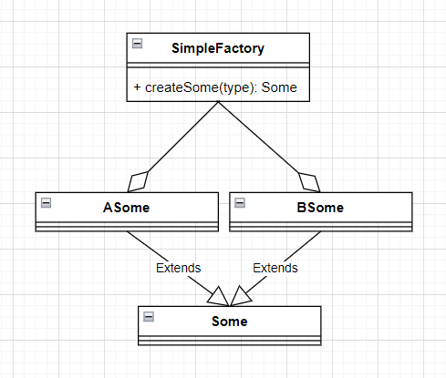
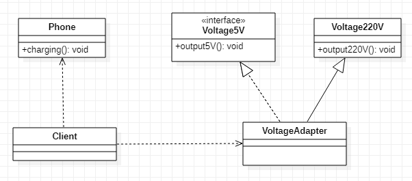
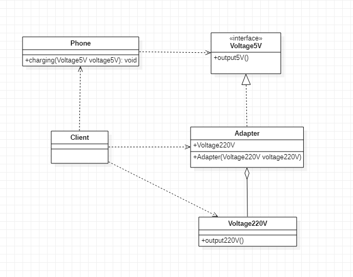
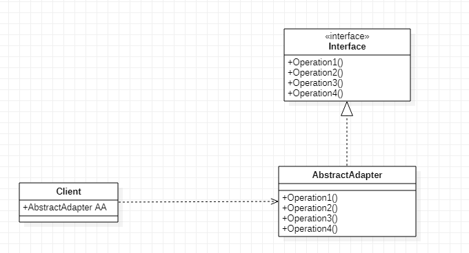
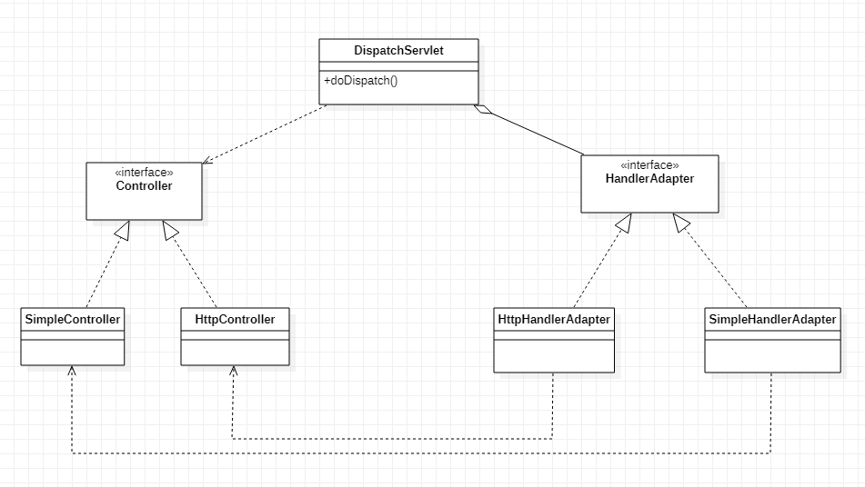
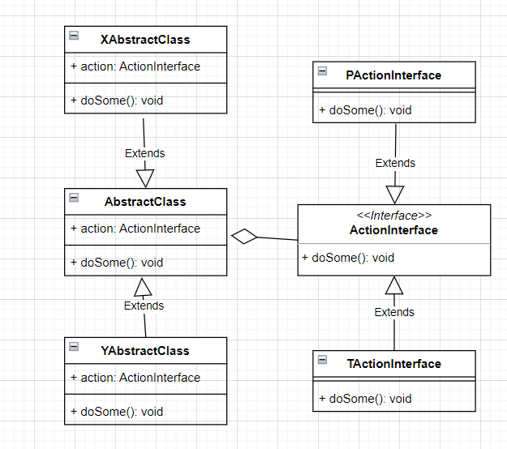
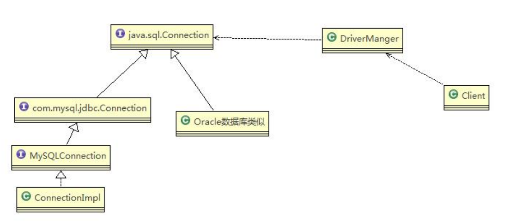

# 1、设计模式七大原则

## 1、单一职责原则

### 1、基本介绍

针对类，即**一个类应该只负责一项职责**

- 例如：类 A 负责两个不同职责：职责 1，职责 2，当职责 1 需求变更而改变 A 时，可能造成职责 2 执行错误，所以需要将类 A 的粒度分解为 A1，A2


### 2、注意事项和细节

1. 降低类的复杂度，一个类只负责一项职责
2. 提高类的可读性，可维护性
3. 降低变更引起的风险
4. 通常情况下，我们应当遵守单一职责原则，只有**逻辑足够简单**，才可以在代码级违反单一职责原则
5. 只有类中方法数量足够少，可以在方法级别保持单一职责原则


## 2、接口隔离原则

### 1、基本介绍

客户端不应该依赖它不需要的接口，即**一个类对另一个类的依赖应该建立在最小的接口上**


## 3、依赖倒置原则

### 1、基本介绍

1. 高层模块不应该依赖低层模块，二者都应该依赖其抽象
2. 抽象不应该依赖细节，细节应该依赖抽象
3. 依赖倒转的中心思想是面向接口编程
4. 依赖倒转原则是基于这样的设计理念：
   - 相对于细节的多变性，抽象的东西要稳定的多
   - 以抽象为基础搭建的架构比以细节为基础的架构要稳定的多
   - 抽象指的是接口或抽象类，细节就是具体的实现类

5. 使用接口或抽象类的目的是制定好规范，而不涉及任何具体的操作，把展现细节的 任务交给他们的实现类去完成


### 2、注意事项和细节

1. 低层模块尽量都要有抽象类或接口，或者两者都有，程序稳定性更好
2. 变量的声明类型尽量是抽象类或接口，这样我们的变量引用和实际对象间，就存在一个缓冲层，利于程序扩展和优化
3. 继承时遵循里氏替换原则


## 4、里氏替换原则

### 1、前言

OO中的继承性的思考和说明：

- 继承包含这样一层含义：父类中实现的方法，实际上是一种规范与契约，如果子类对已实现的方法进行修改，会破坏继承体系
- 继承会给程序设计带来便利，但是会给程序带来侵入性，导致程序移植性降低，增加对象的耦合性
  - 例如：修改一个父类，需要考虑到所有子类的功能会出现故障


### 2、基本介绍

1. 如果对每个类型为 T1 的对象 o1，都有类型为 T2 的对象 o2，使得以 T1 定义的所有程序 P 在所有的对象 o1 都代换成 o2 时，程序 P 的行为没有发生变化，那么类型 T2 是类型 T1 的子类型
   - 换句话说，**所有引用基类的地方必须能透明地使用其子类的对象**

2. 在使用继承时，遵循里氏替换原则，在子类中尽量不要重写父类的方法
3. 里氏替换原则告诉我们，继承实际上让两个类耦合性增强了，在适当的情况下，可以通过聚合，组合，依赖来解决问题


### 3、解决方法

通用的做法是：原来的父类和子类都继承一个更通俗的基类，原有的继承关系去掉， 采用依赖，聚合，组合等关系代替


## 5、开闭原则

### 1、基本介绍

1. 一个软件实体如类，模块和函数应该对扩展开放(对提供方)，对修改关闭(对使用方)
   - 用抽象构建框架，用实现扩展细节

2. 当软件需要变化时，尽量通过扩展软件实体的行为来实现变化，而不是通过修改已有的代码来实现变化
3. 编程中遵循其它原则，以及使用设计模式的目的就是遵循开闭原则


## 6、迪米特法则

### 1、基本介绍

1. 一个对象应该对其他对象保持最少的了解
2. 类与类关系越密切，耦合度越大
3. 迪米特法则(Demeter Principle)又叫最少知道原则，即一个类对自己依赖的类知道的越少越好
   - 也就是说，对于被依赖的类不管多么复杂，都尽量将逻辑封装在类的内部
   - 对外除了提供的 public 方法，不对外泄露任何信息

4. 迪米特法则还有个更简单的定义：只与直接的朋友通信


### 2、直接朋友

每个对象都会与其他对象有耦合关系，只要两个对象之间有耦合关系，就说这两个对象之间是朋友关系

耦合的方式很多，依赖，关联，组合，聚合等，称出现**成员变量**，**方法参数**，**方法返回值**中的类为直接的朋友，而出现在**局部变量**中的类不是直接的朋友

也就是说，**陌生的类最好不要以局部变量的形式出现在类的内部**


### 3、注意事项和细节

1. 迪米特法则的核心是降低类之间的耦合
2. 注意：由于每个类都减少了不必要的依赖，因此迪米特法则只是要求降低类间(对象间)耦合关系， 并不是要求完全没有依赖关系


## 7、合称复用原则

### 1、基本介绍

原则是尽量使用合成/聚合的方式，而不是使用继承


## 8、设计原则的核心思想

1. 找出应用中可能需要变化之处，把它们独立出来，不要和那些不需要变化的代码混在一起
2. 针对接口编程，而不是针对实现编程
3. 为了交互对象之间的松耦合设计而努力


# 2、UML类图

## 1、简介

1. 用于描述系统中的类(对象)本身的组成和类(对象)之间的各种静态关系
2. 类之间的关系：**依赖**、**泛化**（继承）、**实现**、**关联**、**聚合**、**组合**


## 2、六大关系

### 1、依赖关系

只要是在**类中用到了对方**，那么它们之间就存在依赖关系，如果没有对方，就连编译都通过不了

- 类中用到了对方
- 类的成员属性
- 方法的返回类型
- 方法接收的参数类型
- 方法中使用到

```java
public class PersonServiceBean {
    // 类
    private PersonDao personDao;
    public void save(Person person){}
    public IDCard getIDCard(Integer personid){}
    public void modify(){
        Department department = new Department();
    }
}
public class PersonDao{}
public class IDCard{}
public class Person{}
public class Department{}
```


### 2、泛化关系

泛化关系实际上就是**继承关系**，他是**依赖关系的特例**

- 泛化关系实际上就是继承关系
- 如果A类继承了B类，我们就说A和B存在泛化关系

```java
public abstract class DaoSupport{
	public void save(Object entity){}
	public void delete(Object id){}
}
public class PersonServiceBean extends Daosupport{}
```


### 3、实现关系

实现关系实际上就是**A类实现B接口**，他也是**依赖关系的特例**

```java
public interface PersonService {
	public void delete(Interger id);
}
public class PersonServiceBean implements PersonService {
	public void delete(Interger id){}
}
```


### 4、关联关系

关联关系实际上就是**类与类之间的联系**，他也是**依赖关系的特例**

关联具有**导航性**：即双向关系或单向关系

关系具有**多重性**：如“1”（表示有且仅有一个），“0...”（表示0个或者多个）， “0，1”（表示0个或者一个），“n...m”(表示n到 m个都可以)，“m...*”（表示至少m 个）

```java
//单向一对一关系
public class Person {
	private IDCard card;
}
public class IDCard{}

//双向一对一关系
public class Person {
	private IDCard card;
}
public class IDCard{
	private Person person
}
```


### 5、聚合关系

聚合关系（Aggregation）表示的是**整体和部分的关系**，整体与部分**可以分开**

聚合关系是**关联关系的特例**，具有关联的导航性与多重性


### 6、组合关系

组合关系：也是**整体与部分的关系**，但是整体与部分**不可以分开**

```java
public class Person{
	private IDCard card;
	private Head head = new Head();
}
public class IDCard{}
public class Head{}
```


# 3、设计模式概述

## 1、简介

设计模式分为 3 大类型，共 23 种

1. **创建型模式**：**单例模式**、抽象工厂模式、原型模式、建造者模式、**工厂模式**
2. **构造型模式**：适配器模式、桥接模式、**装饰模式**、组合模式、外观模式、享元模式、**代理模式**
3. **行为型模式**：模板方法模式、命令模式、访问者模式、迭代器模式、**观测者模式**、中介者模式、备忘录模式、解释器模式、状态模式、策略模式、**责任链模式**


# 4、创建型

## 1、单例模式

### 1、简介

所谓类的单例设计模式，就是采取一定的方法保证在整个的软件系统中，对某个类**只能存在一个对象实例**，并且该类只提供一个取得其对象实例的方法(静态方法)

比如：Hibernate 的 SessionFactory，它充当数据存储源的代理，并负责创建 Session 对象，SessionFactory 并不是轻量级的，一般情况下，一个项目通常只需要一个 SessionFactory 就够，这是就会使用到单例模式


### 2、八种方式

1. **饿汉式：静态常量，静态代码块**
2. 懒汉式：普通版（线程不安全），同步方法、同步代码块、**同步代码块双重检查**
3. **静态内部类**
4. **枚举**


### 1、饿汉式（静态常量）

#### 1、步骤

1. **构造器私有化** (防止 new ) 
2. 类的内部创建对象 
3. 向外暴露一个静态的公共方法，getInstance()获取实例

```java
class one {
    private one(){}
    private static one instance = new one();
    public static one getInstance(){
        return instance;
    }
}
```

#### 2、优缺点

- **优点**：
  - 这种写法比较简单，基于 **classloder 机制**避免了多线程的同步问题，就是在类装载的时候就完成实例化，避免了线程同步问题
- **缺点**：
  - 在类装载的时候就完成实例化，但是引发类装载的原因有很多，如果从始至终从未使用过这个实例，没有达到 Lazy Loading 的效果，且会造成内存的浪费


#### 3、结论

这种单例模式**可用**，可能造成**内存浪费**


### 2、饿汉式（静态代码块）

#### 1、步骤

1. 构造器私有化
2. 在静态代码块执行时，创建单例对象
3. 向外暴露一个静态的公共方法，getInstance() 获取实例

```java
class one {
    private one(){}
    private static one instance;
    static {
        instance = new one();
    }
    public static one getInstance(){
        return instance;
    }
}
```


#### 2、优缺点

- 这种方式和静态常量版类似，只不过将类实例化的过程放在了静态代码块中，也是在类装载的时候，就执行静态代码块中的代码，初始化类的实例，优缺点和上面是一样的


#### 3、结论

这种单例模式**可用**，但是可能造成**内存浪费**


### 3、懒汉式（线程不安全）

#### 1、步骤

1. 构造器私有化
2. 向外暴露一个静态的公共方法，getInstance() 获取实例
3. 在调用 getInstance() 方法时，才创建单例对象

```java
class one {
    private one(){}
    private static one instance;
    public static one getInstance(){
       if(instance == null) {
           instance = new one();
       }
        return instance;
    }
}
```


#### 2、优缺点

**优点**：

- 起到了 **Lazy Loading** 的效果，但是只能在单线程下使用

**缺点**：

- 如果在多线程下，一个线程进入了 if (singleton == null) 判断语句块，还未来得及往下执行，另一个线程也通过了这个判断语句，这时便会产生多个实例，所以在**多线程环境下不可使用这种方式**


#### 3、结论

在实际开发中，**不要使用这种方式**


### 4、懒汉式（同步方法）

#### 1、步骤

1. 构造器私有化
2. 向外暴露一个静态的公共方法，getInstance() 获取实例
3. 在调用 getInstance() 方法时，才创建单例对象
4. 给 getInstance() 方法加入 synchronized 同步代码

```java
class one {
    private one() {}
    private static one instance;
    public static synchronized one getInstance() {
       if(instance == null) {
           instance = new one();
       }
        return instance;
    }
}
```


#### 2、优缺点

**优点**：

- 解决了线程不安全问题

**缺点**：

- 效率太低了，每个线程在想获得类的实例时候，执行 getInstance() 方法都要进行同步，而其实这个方法只执行一次实例化代码就够了，后面的想获得该类实例， 直接 return 就行了，**方法同步效率太低**


#### 3、结论

在实际开发中，**不推荐**使用这种方式，效率过低


### 5、懒汉式（同步代码块）

#### 1、步骤

1. 构造器私有化
2. 向外暴露一个静态的公共方法，getInstance() 获取实例
3. 在调用 getInstance() 方法时，才创建单例对象
4. 给创建实例的过程加入 synchronized 同步代码块

```java
class one {
    private one() {}
    private static one instance;
    public static one getInstance() {
       if(instance == null) {
           synchronized(one.class) {
               instance = new one();
           }
       }
        return instance;
    }
}
```


#### 2、优缺点

**优点**：

- 无

**缺点**：

- 这种方式，本意是想对第四种实现方式的改进，因为前面同步方法效率太低， 改为同步产生实例化的的代码块

- 但是这种同步并**不能起到线程同步的作用**，跟普通版实现方式遇到的情形一致，假如一个线程进入了 if (singleton == null) 判断语句块，还未来得及往下执行， 另一个线程也通过了这个判断语句，这时便会产生多个实例


#### 3、结论

在实际开发中，**不能使用**这种方式


### 6、懒汉式（双重检查）

#### 1、步骤

1. 构造器私有化
2. 向外暴露一个静态的公共方法，getInstance() 获取实例
3. 给实例添加 volatile 同步
4. 在调用 getInstance() 方法时，才创建单例对象
5. 在创建之前检查是否存在实例
6. 给创建实例的过程加入 synchronized 同步代码块
7. 在同步代码块中，真正要创建实例时再次检查是否存在实例

```java
class one {
    private static volatile one instance;
    private one() {}
    public static one getInstance() {
        if(instance == null) {
            synchronized(one.class) {
                if(instance == null) {
                    instance = new one();
                }
            }
        }
        return instance;
    }
}
```


#### 2、优缺点

**优点**：

- Double-Check 概念是多线程开发中常使用到的，如代码中所示，进行了两次 if (singleton == null) 检查，这样可以保证线程安全
- 实例化代码只用执行一次，后面再次访问时，判断 if (singleton == null)， 直接 return 实例化对象，也避免的反复进行方法同步
- 线程安全、延迟加载、效率较高

**缺点**：

- 无


#### 3、结论

在实际开发中，**推荐**使用这种单例设计模式


### 7、静态内部类

#### 1、步骤

1. 构造器私有化
2. 创建静态内部类，在静态内部类内直接创建外部类的私有化静态实例
3. 向外部暴露一个 getInstance() 方法获取实例

```java
class One {
    private One() {}
    private static class innerClass {
        private static final One instance = new One();
    }
    public static One getInstance() {
        return innerClass.instance;
    }
}
```


#### 2、优缺点

**优点**：

- 这种方式采用了**类装载的机制**来保证初始化实例时只有一个线程
- 静态内部类方式在 One 类被装载时并不会立即实例化，而是在调用 getInstance() 方法时才会装载 One 类，从而完成 One 的实例化
- 类的静态属性只会在第一次加载类的时候初始化，所以在这里是 JVM 帮助我们保证了线程的安全性，在类进行初始化时，别的线程是无法进入的
- 避免了线程不安全，利用静态内部类特点实现延迟加载，效率高

**缺点**：

- 无
- 

#### 3、结论

推荐使用


### 8、枚举

#### 1、步骤

1. 创建一个枚举类
2. 在枚举类内设置一个常量 INSTANCE
3. 创建一个公开的方法获取实例

```java
eunm one {
    INSTANCE;
    public void method() {
        // 方法
    }
}
```


#### 2、优缺点

**优点**：

- 借助 JDK1.5 中添加的枚举来实现单例模式，不仅能避免多线程同步问题，而且还能防止反序列化重新创建新的对象
- 这种方式是 Effective Java 作者 Josh Bloch **提倡**的方式

**缺点**：

- 无


#### 3、结论

**推荐**使用


### 9、JDK 的源码分析

java.lang.Runtime 就是经典的单例模式（饿汉式）


### 10、注意事项和细节说明

单例模式保证了系统内存中该类只存在一个对象，节省了系统资源，对于需要频繁创建销毁的对象，使用单例模式可以提高系统性能

当想实例化一个单例类的时候，必须要记住使用相应的获取对象的方法，而不是使用new 

单例模式使用的场景：需要频繁的进行创建和销毁的对象、创建对象时耗时过多或耗费资源过多(即：重量级对象)，但又经常用到的对象、工具类对象、频繁访问数据库或文件的对象(比如：数据源、session 工厂等)


## 2、工厂模式

### 1、简介

在软件开发中，需要大量的创建某种、某类或者某批对象时，就会使用到工厂模式


### 2、三种工厂

- 简单工厂
- 工厂方法
- 抽象工厂


### 3、简单工厂模式

#### 1、基本介绍

简单工厂模式是属于创建型模式，是**工厂模式的一种**

简单工厂模式是**由一个工厂对象决定创建出哪一种产品类的实例**

简单工厂模式：定义了一个创建对象的类，由这个类来封装实例化对象的行为(代码)


#### 2、步骤

1. 定义一个可以实例化对象的类，封装创建对象的代码
2. 修改申请创建对象的类，使用简单工厂模式来创建对象，更加的方便灵活

```java
public class SimpleFactory { 
    public Some createSome(String type) {
        System.out.println("使用简单工厂模式~~");
        Some some = null;
        if (type.equals("cheese")) {
            some = new ASome();
        } else if (type.equals("greek")) {
            some = new BSome();
        } else if (type.equals("pepper")) {
            some = new CSome();
        }
        return some;
    }
}
```




### 4、工厂方法模式

#### 1、基本介绍

1. 定义了一个创建对象的抽象方法，**由子类决定要实例化的类**
2. 工厂方法模式将**对象的实例化交给子类**


#### 2、步骤

1. 在简单工厂的基础上将**实例化功能抽象成抽象方法**，在不同的具体子类中具体实现

```java
public abstract class FactoryMethod {
    public getSome() {
        Some some = null;
        String someType;
        do {
            someType = someType();
            // 调用创建实例方法
            some = createSome(someType);
            if (some != null) {
                some.prepare();
                some.bake();
                some.cut();
                some.box();
            } else {
                break;
            }
        } while (true);
    }
    // 抽象的创建实例方法，由子类决定创建何种实例
    abstract Some createSome(String someType);
}
```

```java
// 具体子类实现父类
public class AFactoryMethod extends FactoryMethod {
    @Override
    Pizza createSome(String someType) {
        Some some = null;
        if (someType.equals("cheese")) {
            some = new ASome();
        } else if (someType.equals("pepper")) {
            some = new BSome();
        }
        return some;
    }
}
```


### 5、抽象工厂模式

#### 1、基本介绍

抽象工厂模式可以将**简单工厂模式**和**工厂方法模式**进行整合

从设计层面看，抽象工厂模式就是对简单工厂模式的改进(或者称为**进一步的抽象**)


#### 2、步骤

1. 定义了一个 **interface 接口**用于**创建相关或有依赖关系的对象簇**，而无需指明具体的类
2. 将工厂抽象成两层，**AbsFactory (抽象工厂)** 和**具体实现的工厂子类**，**根据创建对象类型使用对应的工厂子类**
   - 这样将单个的简单工厂类变成了工厂簇， 更利于代码的维护和扩展


```java
// 声明AbsFactory接口
public interface AbsFactory {
    // 让不同的工厂类来实现 createSome 方法
    public Some createSome(String someType);
}
```

```java
// 继承 AbsFactory 的具体子类，由它决定具体生成什么子类
public class BFactory implements AbsFactory {
    @Override
    public Some createSome(String someType) {
        Some some = null;
        if (someType.equals("cheese")) {
            some = new BCSome();
        } else if (someType.equals("pepper")) {
            some = new BPSome();
        }
        return some;
    }
}
```

```java
public class FactoryMethod {
    // 声明抽象类
    AbsFactory factory;
    // 构造器
    public FactoryMethod(AbsFactory factory) {
        setFactory(factory);
    }
    public void setFactory(AbsFactory factory) {
        Some some = null;
        String someType;
        this.factory = factory;
        do {
            someType = gettype();
            some = factory.createSome(someType);
            if (some != null) {
                some.prepare();
                some.bake();
                some.cut();
                some.box();
            } else {
                break;
            }
        } while (true);
    }
    public String gettype() {
        .....
        return sometype;
    }
}
```


### 6、JDK-Calendar 应用

JDK中的Calendar类中，使用了**简单工厂模式**


### 7、工厂模式小结

工厂模式的意义：

- 将实例化对象的代码提取出来，放到一个类中统一管理和维护，达到和主项目的依赖关系的解耦，从而提高项目的扩展和维护性

设计模式的依赖抽象原则的实践


### 8、注意事项

1. 创建对象实例时，不要直接 new 类， 而是把这个new 类的动作放在一个工厂的方法中并返回，有的书上说变量不要直接持有具体类的引用
2. 不要让类继承具体类，而是继承抽象类或者是实现 interface
3. 不要覆盖基类中已经实现的方法


## 3、原型模式

### 1、基本介绍

原型模式(Prototype模式)是指：用**原型实例**指定创建对象的种类，并且通过拷贝这些原型，创建新的对象

原型模式是一种**创建型设计模式**，允许一个对象再创建另外一个可定制的对象，无需知道如何创建的细节


原理结构图说明：

- Prototype：原型类，声明一个克隆自己的接口
- ConcretePrototype：具体的原型类，实现一个克隆自己的操作
- Client：让一个原型对象克隆自己，从而创建一个新的对象（属性相同）


### 2、浅拷贝/深拷贝

- 对于数据类型是**基本数据类型**的成员变量，浅拷贝会直接进行**值传递**，也就是将该属性值复制一份给新的对象
- 对于数据类型是**引用数据类型**的成员变量，比如：成员变量是某个数组、某个类的对象等，那么浅拷贝会进行**引用传递**，也就是只是将该成员变量的引用值（内存地址）复制一份给新的对象，因为实际上两个对象的该成员变量都指向同一个实例，在这种情况下，在一个对象中修改该成员变量会影响到另一个对象的该成员变量值

- 浅拷贝是使用默认的 clone() 方法来实现 sheep= (Sheep) super.clone();


### 2、浅拷贝

#### 1、概述

#### 2、步骤

- 需要被克隆的类，实现 Cloneable 接口
  - 浅克隆需求：默认即可

```java
public class Sheep implements Cloneable {
    private String name;
    private int age;private String color;
    private String address="蒙古羊";
    public Sheep friend; // 对象默认是浅拷贝

    public Sheep(String name, int age, String color){
        super();
        this.name = name;
        this.age = age;
        this.color = color;
    }
    // ......set、get、toString方法
    // 克隆该实例，使用默认的克隆方法
    @Override
    protected Object clone() {
        Sheep sheep= null;
        try {
            sheep = (Sheep) super.clone();
        } catch (Exception e) {
            System.out.println(e.getMessageO);
        }
        return sheep;
    }
}
```


### 3、深拷贝

#### 1、概述

- 复制对象的所有基本数据类型的成员变量值
- 为所有引用数据类型的成员变量申请存储空间，并复制每个引用数据类型成员变量所引用的对象，直到该对象可达的所有对象，也就是说，对象进行深拷贝要对整个对象(包括对象的引用类型)进行拷贝
- 深拷贝实现方式1：重写 **clone 方法**来实现深拷贝
- 深拷贝实现方式2：通过**对象序列化**实现深拷贝(**推荐**)


#### 2、步骤

深克隆两种方法：

- 重写克隆方法，手动为属性进行克隆
- 使用序列化机制

```java
// 引用类型对象
public class DeepCloneableTarget implements Serializable, Cloneable { 
    private static final long serialVersionUID=1L;
    private String cloneName;
    private String cloneClass;
    
    public DeepCloneableTarget(String cloneName, String cloneClass){
        this.cloneName = cloneName;
        this.cloneClass = cloneClass;
    }
    
    // 因为该类的属性都是基础数据类型，所以直接调用clone方法即可
    @Override
    protected Object clone() throws CloneNotSupportedException {
        return super.clone();
    }
}
```

```java
// 深克隆示例
public class DeepProtoType implements Serializable,Cloneable{
    // String 属性
    public String name;
    // 引用类型
    public DeepCloneableTarget deepCloneableTarget;

    public DeepProtoType() {
        super();
    }

    // 深拷贝：方式一，重写 clone 方法
    @Override
    protected Object clone() throws CloneNotSupportedException { 
        Object deep= null;
        // 这里完成对基本数据类型(属性)和 String 的克隆
        deep = super.clone();
        // 对引用类型的属性，进行单独处理
        DeepProtoType deepProtoType = (DeepProtoType) deep;
        deepProtoType.deepCloneableTarget = (DeepCloneableTarget) deepCloneableTarget.clone();
        return deepProtoType;
    }

    // 深拷贝：方式二，序列化
    // 先将对象序列化，在通过反序列化得到一个新对象
    public Object deepClone() {
        // 创建流对象
        ByteArrayOutputStream bos = null;
        ObjectOutputStream oos = null;
        ByteArrayInputStream bis = null;
        ObjectInputStream ois = null;
        try {
            // 序列化
            bos = new ByteArrayOutputStream();
            oos= new ObjectOutputStream(bos);
            // 当前这个对象以对象流的方式输出
            oos.writeObject(this);

            // 反序列化
            bis = new ByteArrayInputStream(bos.toByteArray());
            ois = new ObjectInputStream(bis);
            DeepProtoType copyObj = (DeepProtoType) ois.readObject();
            return copyObj;   
        } catch (Exception e){ 
            e.printStackTrace();
            return null;
        } finally {
            // 关闭流
            try {
                bos.close();
                oos.close();
                bis.close();
                ois.close();
            } catch (Exception e2) {
                System.out.println(e2.getMessageO);
            }
        }
    }
```


### 3、Spring 中的应用

Spring 中原型 Bean 的创建，就是原型模式的应用


### 4、注意事项

- 创建新的对象比较复杂时，可以利用原型模式简化对象的创建过程，同时也能够提高效率
- 不用重新初始化对象，而是动态地获得对象运行时的状态
- 浅克隆时，如果原始对象发生变化，其它克隆对象的也会发生相应的变化，无需修改代码
- 需要为每一个类配备一个克隆方法，这对全新的类来说不是很难，但对已有的类进行改造时，需要修改其源代码，违背了 ocp 原则


## 4、建造者模式

### 1、基本介绍

建造者模式(Builder Pattern）又叫**生成器模式**，是一种对象构建模式，它可以将复杂对象的建造过程抽象出
来（抽象类别)，使这个抽象过程的不同实现方法可以构造出不同表现（属性）的对象

建造者模式是一步一步创建一个复杂的对象，它允许用户只通过指定复杂对象的类型和内容就可以构建它们，
用户不需要知道内部的具体构建细节


### 2、四个角色

- **Product**（产品角色)：一个具体的产品对象
- **Builder**（抽象建造者）：创建一个 Product 对象的各个部件指定的接口/抽象类
- **ConcreteBuilder**（具体建造者）：实现接口，构建和装配各个部件
- **Director**（指挥者）：构建一个使用 Builder 接口的对象，主要用于创建复杂的对象，有两个作用
  - 隔离了客户与对象的生产过程
  - 负责控制产品对象的生产过程
  


### 3、步骤

1. 创建产品类
2. 创建一个抽象的建造者，编写抽象的建造方法，返回完整的对象
3. 创建具体的建造者，继承抽象建造者，实现所有的抽象建造方法
4. 创建建造指挥者，通过传入的具体建造者，获取具体的对象

```java
public class Client {
    public static void main(String[] args) {
        // 盖普通房子
        CommonHouse commonHouse= new CommonHouse();
        // 准备创建房子的指挥者
        HouseDirector houseDirector = new HouseDirector(commonHouse);
        // 完成盖房子，返回产品(普通房子)
        House house = houseDirector.constructHouse();
        
        // 盖高楼
        HighBuilding highBuilding = new HighBuilding();
        // 重置建造者
        houseDirector.setHouseBuilder(highBuilding);
        // 完成盖房子，返回产品(高楼)
        houseDirector.constructHouse();
    }
}

// 抽象的建造者
public abstract class HouseBuilder {
    // 创建新产品
    protected House house = new House();
    // 定义抽象的建造方法
	// .......
    // 返回建造好的产品
    public House buildHouse() {
        return house;
    }
}

// 具体的建造者
public class CommonHouse extends HouseBuilder {
    // 具体流程
    // ................
    // 返回
}
public class HighBuilding extends HouseBuilder {
    ................
}

// 产品
public class House {
    // 具体流程
    // ................
    // 返回
}

public class HouseDirector {
    // 需要具体的建造者
    HouseBuilder houseBuilder = null;
    // 构造器传入 houseBuilder
    public HouseDirector(HouseBuilder houseBuilder){
        this.houseBuilder = houseBuilder;
    }
    // 通过setter传入 houseBuilder
    public void setHouseBuilder(HouseBuilder houseBuilder){
        this.houseBuilder = houseBuilder;
    }
    
    // 如何处理建造房子的流程，交给指挥者
    public House constructHouse( {
		// 执行具体的
        // .........流程
        // 返回结果
        return houseBuilder.buildHouse();
    }

}
```


### 4、JDK的应用和源码分析

java.lang.StringBuilder 中的建造者模式

- Appendable 接口定义了多个 append 方法(抽象方法)，即 Appendable 为抽象建造者，定义了抽象方法
- AbstractStringBuilder 实现了 Appendable 接口方法，这里的 AbstractStringBuilder 已经是建造者，只是不能实例化
- StringBuilder 即充当了指挥者角色，同时充当了具体的建造者，建造方法的实现是由 AbstractStringBuilder 完成，而 StringBuilder继承了 AbstractStringBuilder


### 5、注意事项

**优点**：

- 创建时不必知道产品内部组成的细节，将产品本身与产品的创建过程解耦，使得相同的创建过程可以创建不同的产品对象
- 每一个具体建造者都相对独立，而与其他的具体建造者无关，因此可以很方便地替换具体建造者或增加新的具体建造者，用户使用不同的具体建造者即可得到不同的产品对象
- 可以更加精细地控制产品的创建过程，将复杂产品的创建步骤分解在不同的方法中，使得创建过程更加清晰，也更方便使用程序来控制创建过程
- 增加新的具体建造者无须修改原有类库的代码，指挥者类针对抽象建造者类编程，系统扩展方便，符合开闭原则

**缺点**：

- 建造者模式所创建的产品一般具有较多的共同点，其组成部分相似，如果产品之间的差异性很大，则不适合使用建造者模式，因此其使用范围受到一定的限制
- 如果产品的内部变化复杂，可能会导致需要定义很多具体建造者类来实现这种变化，导致系统变得很庞大，因此在这种情况下，要考虑是否选择建造者模式


### 6、抽象工厂模式 VS 建造者模式

抽象工厂模式实现对产品家族的创建，一个产品家族是这样的一系列产品：具有不同分类维度的产品组合，采用抽象工厂模式不需要关心构建过程，只关心什么产品由什么工厂生产即可

建造者模式则是要求按照指定的蓝图建造产品，它的主要目的是通过组装零配件而产生一个新产品


# 5、构造型

## 1、适配器模式

### 1、基本介绍

适配器模式(Adapter Pattern)将某个类的接口转换成客户端期望的一个接口表示，主的目的是兼容性，让原本因接口不匹配不能一起工作的两个类可以协同工作，别名为包装器(Wrapper)

适配器模式属于结构型模式


### 2、三类适配器

**类**适配器模式

**对象**适配器模式

**接口**适配器模式


### 3、类适配器模式

#### 1、基本介绍

Adapter 类，通过继承 src 类，实现 dst 类接口，完成 src-----> dst 的适配


#### 2、步骤

1. 创建适配器类，继承被适配类，实现适配接口



```java
public class Client {
    public static void main(String[] args){
        Phone phone = new Phone();
        // 传入适配器
        phone.charging(new VoltageAdapter());
    }
}

// 适配接口
public interface Voltage5V{
    // 适配方法
    public int output5vo;
}

// 被适配的类
public class Voltage220V {
	// 输出220V的电压
    public int output220V(){
		int src = 220;
        return src;
    }
}

// 适配器类
public class VoltageAdapter extends Voltage220V implements Voltage5V {
	@Override
	public int output5V(){
		// 获取到220V电压
		int srcV = output220V();
		int dstV = srcV / 44;
   		return dstV;
	}
}

// 具体调用类
public class Phone {
    // 传入适配接口
    public void charging(Voltage5V Voltage5V){
        if(iVoltage5V.output5V()== 5){
            System.out.println("电压为5V，可以充电~~");
        } else if (iVoltage5V.output5V() > 5){
            System.out.println("电压大于5V，不能充电~~");
        }
    }
}
```


#### 3、注意事项

- 由于 Java 是单继承机制，所以类适配器需要继承 src 类这一点算是一个缺点，因为这导致了 dst 必须是接口，有一定局限性
- src 类的方法在 Adapter 中都会暴露出来，也增加了使用的成本
- 由于其继承了 src 类，所以它可以根据需求重写 src 类的方法，使得 Adapter 的灵活性增强了


### 4、对象适配器模式

#### 1、基本介绍

- 基本思路和类的适配器模式相同，只是将Adapter类作修改，不是继承src类，而是持有src类的实例，以解决兼容性的问题。即持有src类，实现 dst类接口，完成src--->dst的适配
- 根据“合成复用原则”，在系统中尽量使用关联关系（聚合）来着代继承关系。
- 对象适配器模式是适配器模式常用的一种。


#### 2、步骤

1. 创建适配器类，被被适配类作为其属性，实现 dst 适配接口



```java
public class Client {
    public static void main(String[] args){
        Phone phone = new Phone();
        // 传入适配器与被适配类
        phone.charging(new VoltageAdapter(new Voltage220V()));
    }
}

// 适配接口
public interface Voltage5V{
    // 适配方法
    public int output5vo();
}

// 被适配的类
public class Voltage220V {
	// 输出220V的电压
    public int output220V(){
		int src = 220;
        return src;
    }
}

// 适配器类
public class VoltageAdapter implements Voltage5V {
    private Voltage220V voltage220V;
    
    // 通过构造函数传入被适配类实例
    public VoltageAdapter(Voltage220V voltage220V){
        this.voltage220V = voltage220V;
    }
    
	@Override
	public int output5V(){
		// 获取到220V电压
        // 聚合关系
		int srcV = voltage220V.output220V();
		int dstV = srcV / 44;
   		return dstV;
	}
}

// 具体调用类
public class Phone {
    // 传入适配接口
    public void charging(Voltage5V Voltage5V){
        if(iVoltage5V.output5V() == 5){
            System.out.println("电压为5V，可以充电~~");
        } else if (iVoltage5V.output5V() > 5){
            System.out.println("电压大于5V，不能充电~~");
        }
    }
}

```


#### 3、注意事项

- 对象适配器和类适配器其实算是同一种思想，只不过实现方式不同
- 根据合成复用原则，使用组合替代继承，所以它解决了类适配器必须继承 src 的局限性问题，也不再要求 dst 必须是接口
- 使用成本更低，更灵活


### 5、接口适配器模式

#### 1、基本介绍

一些书籍称为：适配器模式(Default Adapter Pattern)或缺省适配器模式

核心思路：当不需要全部实现接口提供的方法时，可先设计一个抽象类实现接口，并为该接口中每个方法提供一个默认实现（空方法），那么该抽象类的子类可有选择地覆盖父类的某些方法来实现需求

适用于一个接口不想使用其所有的方法的情况


#### 2、步骤

1. 设计一个抽象接口
2. 设计一个抽象类，实现抽象接口，将所有方法实现为空方法
3. 在调用处，实现特定的方法



```java
public interface Interface {
    public void m1();
    public void m2();
    public void m3();
    public void m4();
}

public abstract class AbsAdapter implements Interface {
    // 默认空方法实现
    public void m1(){};
    public void m2(){};
    public void m3(){};
    public void m4(){};
}

public class Client {
    public static void main(String[] args) {
        
        AbsAdapter absAdapter = new AbsAdapter() {
			// 只需要去覆盖我们需要使用接口方法
    		@Override
			public void m1() {
				System.out.println("使用了m1的方法");
			}
		};
        
        absAdapter.m1();
    }
}
```


### 6、SpringMVC框架应用的源码剖析

- SpringMvc 中的 HandlerAdapter，就使用了适配器模式
- 使用 HandlerAdapter 的原因分析：处理器的类型不同，有多重实现方式，那么调用方式就不是确定的，如果需要直接调用Controller 方法，需要调用的时候就得不断使用 if else 来进行判断是哪一种子类然后执行，那么如果后面要扩展 Controller，就得修改原来的代码，这样违背了 OCP 原则

说明：

- Spring 定义了一个适配接口，使得每一种 Controller 有一种对应的适配器实现类
- 适配器代替 Controller 执行相应的方法
- 扩展 Controller 时，只需要增加一个适配器类就完成了 SpringMVC 的扩展了



```java
// Controller 接口
public interface Controller {

}

// 多种 Controller 类
// Controller 接口实现
class HttpController implements Controller {
	public void doHttpHandler() {
		System.out.println("http...");
	}
}
// Controller 接口实现
class SimpleController implements Controller {
	public void doSimplerHandler() {
		System.out.println("simple...");
	}
}

// 定义一个 Adapter 接口 
public interface HandlerAdapter {
	public boolean supports(Object handler);

	public void handle(Object handler);
}
// 多种适配器类
// Adapter 接口实现类
class SimpleHandlerAdapter implements HandlerAdapter {
	public void handle(Object handler) {
		((SimpleController) handler).doSimplerHandler();
	}

	public boolean supports(Object handler) {
		return (handler instanceof SimpleController);
	}

}
// Adapter 接口实现类
class HttpHandlerAdapter implements HandlerAdapter {

	public void handle(Object handler) {
		((HttpController) handler).doHttpHandler();
	}

	public boolean supports(Object handler) {
		return (handler instanceof HttpController);
	}

}


public class DispatchServlet {
	// 保存所有 HandlerAdapter
	public static List<HandlerAdapter> handlerAdapters = new ArrayList<HandlerAdapter>();

	public DispatchServlet() {
		handlerAdapters.add(new HttpHandlerAdapter());
		handlerAdapters.add(new SimpleHandlerAdapter());
	}

	public void doDispatch() {
		// 此处模拟 SpringMVC 从 request 取 handler 的对象
		// 适配器获取到希望的 Controller
        // SimpleController controller = new SimpleController();
		HttpController controller = new HttpController();
		
		// 将 Controller 传入得到对应适配器
		HandlerAdapter adapter = getHandler(controller);
		// 通过适配器执行对应的 controller 对应方法
		adapter.handle(controller);

	}

    // 获取到对应的适配器
	public HandlerAdapter getHandler(Controller controller) {
		// 遍历：根据得到的 controller, 返回对应适配器
		for (HandlerAdapter adapter : this.handlerAdapters) {
            // 根据适配器的 supports 方法判断
			if (adapter.supports(controller)) {
				return adapter;
			}
		}
		return null;
	}

	public static void main(String[] args) {
		new DispatchServlet().doDispatch(); // http...
	}

}
```


### 7、注意事项

- 三种命名方式，是根据 src 是以怎样的形式给到 Adapter (在 Adapter 里的形式）来命名的
  - 类适配器：以类给到，在 Adapter 里，就是将 src 当做类，继承
  - 对象适配器：以对象给到，在 Adapter 里，将 src 作为一个对象，持有
  - 接口适配器：以接口给到，在 Adapter 里，将 src 作为一个接口，实现

- Adapter 模式最大的作用还是将原本不兼容的接口融合在一起工作
- 实际开发中，实现起来不拘泥于我们讲解的三种经典形式


## 2、桥接模式

### 1、基本概念

桥接模式(Bridge 模式)是指：将实现与抽象放在两个不同的类层次中，使两个层次可以独立改变

Bridge 模式基于类的最小设计原则，通过使用封装、聚合、继承等行为让不同的类承担不同的职责

桥接模式的主要特点是把**抽象**(Abstraction)与**实现**(Implementation)分离，使得保持各部分的独立性以及功能扩展性


### 2、步骤

1. 创建抽象类与抽象行为接口，二者为聚合关系
2. 创建二者的实现子类
3. 通过传参调用即可

~~~java
// 抽象类
public class abstract AbstractClass {
    // 组合
    public ActionInterface action;
    
    public AbstractClass(ActionInterface action) {
        this.action = action;
    }
    
    // 调用
    public void doSome() {
        this.action.doSome();
    }
}

// 抽象子类
public class XAbstractClass extends AbstractClass {
    public XAbstractClass(ActionInterface action) {
        super(action)
    }
    
    // 调用
    public void doSome() {
        this.action.doSome();
        System.out.println("XAbstractClass");
    }
}
public class YAbstractClass extends AbstractClass {
    public YAbstractClass(ActionInterface action) {
        super(action)
    }
    
    // 调用
    public void doSome() {
        this.action.doSome();
        System.out.println("YAbstractClass");
    }
}


// 抽象行为类
public interface ActionInterface {
    public void doSome();
}

// 抽象行为类子类
public TActionInterface implements ActionInterface {
    @Override
    public void doSome() {
        System.out.println("TActionInterface");
    }
}
public PActionInterface implements ActionInterface {
    @Override
    public void doSome() {
        System.out.println("PActionInterface");
    }
}

public class Client {
    public static void main(String[] args) {
        AbstractClass a = new XAbstractClass(new TActionInterface());
        a.doSome();
    }
}
~~~



### 3、JDBC 源码剖析

Jdbc 的 **Driver** **接口**，如果从桥接模式来看，Driver 就是一个接口，下面可以有 MySQL 的 Driver，Oracle 的 Driver，这些就可以当做实现接口类




### 4、注意事项

抽象和实现的分离，极大提高了系统的灵活性，这有助于系统进行分层设计，从而产生更好的结构化系统

对于系统的高层部分，只需要知道抽象部分和实现部分的接口就可以了，其它的部分由具体业务来完成

**桥接模式替代多层继承方案**，可以减少**子类的个数**，降低系统的管理和维护成本

桥接模式的引入增加了系统的理解和设计难度，由于聚合关联关系建立在抽象层，要求开发者针对抽象进行设计和编程

桥接模式需要**正确识别出系统中两个独立变化的维度**(抽象、实现)，因此其使用范围有一定的局限性


## 3、装饰者模式


